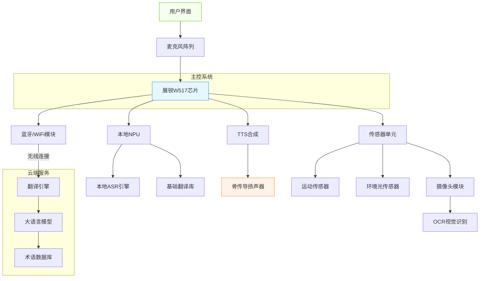
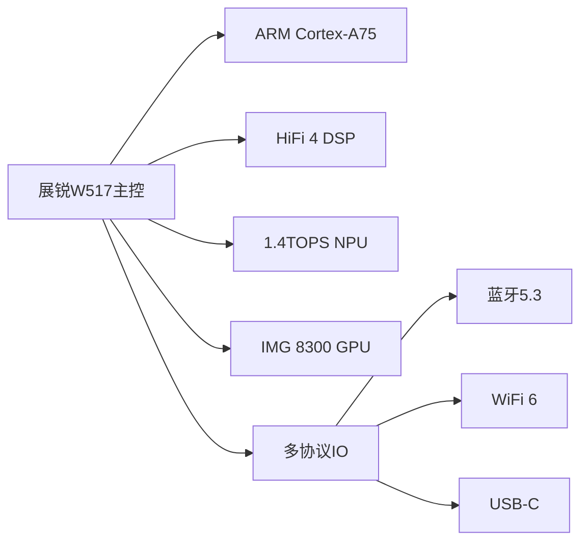
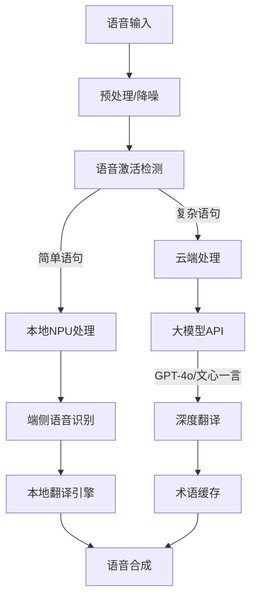
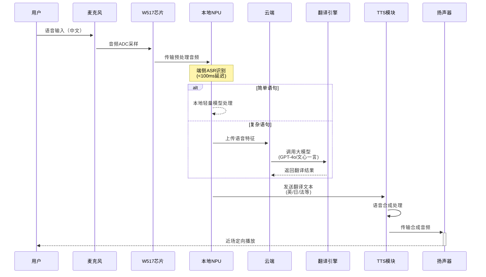
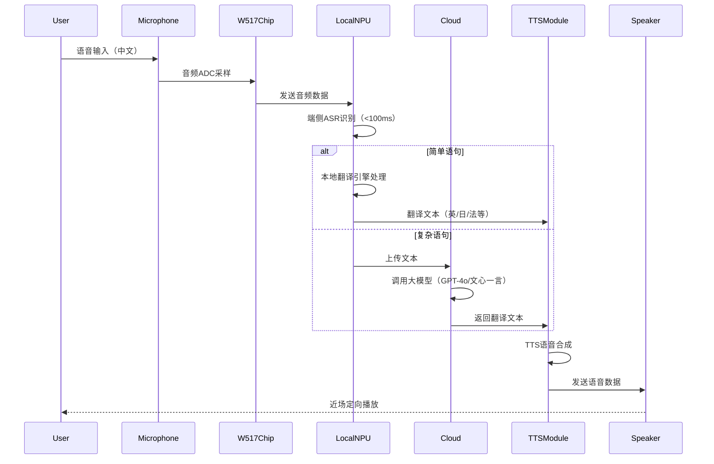

# 系统基本框图

```mermaid
graph TD
    A[用户界面] --> B[麦克风阵列]
    B --> C{主控系统}
    C --> D[蓝牙/WiFi模块]
    C --> E[本地NPU]
    C --> F[传感器单元]
    
    subgraph 主控系统
        C[展锐W517芯片]
        style C fill:#e6f7ff,stroke:#1890ff
    end
    
    subgraph 云端服务
        G[翻译引擎]
        H[大语言模型]
        I[术语数据库]
    end
    
    D -->|无线连接| G
    G --> H
    H --> I
    
    E --> J[本地ASR引擎]
    E --> K[基础翻译库]
    
    C --> L[TTS合成]
    L --> M[骨传导扬声器]
    
    F --> N[运动传感器]
    F --> O[环境光传感器]
    F --> P[摄像头模块]
    
    P --> Q[OCR视觉识别]
    
    style A fill:#f6ffed,stroke:#52c41a
    style M fill:#fff2e8,stroke:#fa8c16
```    
# 模块功能详解
## 核心处理单元

```mermaid
graph LR
    W517[展锐W517主控] --> ARM[ARM Cortex-A75]
    W517 --> DSP[HiFi 4 DSP]
    W517 --> NPU[1.4TOPS NPU]
    W517 --> GPU[IMG 8300 GPU]
    W517 --> IO[多协议IO]
    
    IO --> BT[蓝牙5.3]
    IO --> WIFI[WiFi 6]
    IO --> USB[USB-C]
```

## 翻译处理流程

```mermaid
flowchart TB
    Input[语音输入] --> Pre[预处理/降噪]
    Pre --> VAD[语音激活检测]
    VAD -->|简单语句| Local[本地NPU处理]
    VAD -->|复杂语句| Cloud[云端处理]
    
    Local --> ASR[端侧语音识别]
    ASR --> Translate[本地翻译引擎]
    Translate --> TTS[语音合成]
    
    Cloud --> API[大模型API]
    API -->|GPT-4o/文心一言| Process[深度翻译]
    Process --> Cache[术语缓存]
    Cache --> TTS
```

```mermaid
sequenceDiagram
    participant U as 用户
    participant M as 麦克风
    participant C as W517芯片
    participant NPU as 本地NPU
    participant Cloud as 云端
    participant TE as 翻译引擎
    participant TTS as TTS模块
    participant S as 扬声器
    
    U->>+M: 语音输入（中文）
    M->>+C: 音频ADC采样
    C->>+NPU: 传输预处理音频
    Note over NPU: 端侧ASR识别<br/>(<100ms延迟)
    
    alt 简单语句
        NPU-->>NPU: 本地轻量模型处理
    else 复杂语句
        NPU->>+Cloud: 上传语音特征
        Cloud->>+TE: 调用大模型<br/>(GPT-4o/文心一言)
        TE-->>Cloud: 返回翻译结果
    end
    
    NPU->>+TTS: 发送翻译文本<br/>(英/日/法等)
    TTS->>+TTS: 语音合成处理
    TTS->>+S: 传输合成音频
    S-->>-U: 近场定向播放
```

```mermaid
sequenceDiagram
    participant User
    participant Microphone
    participant W517Chip
    participant LocalNPU
    participant Cloud
    participant TTSModule
    participant Speaker
    User->>Microphone: 语音输入（中文）
    Microphone->>W517Chip: 音频ADC采样
    W517Chip->>LocalNPU: 发送音频数据
    LocalNPU->>LocalNPU: 端侧ASR识别（<100ms）
    alt 简单语句
        LocalNPU->>LocalNPU: 本地翻译引擎处理
        LocalNPU->>TTSModule: 翻译文本（英/日/法等）
    else 复杂语句
        LocalNPU->>Cloud: 上传文本
        Cloud->>Cloud: 调用大模型（GPT-4o/文心一言）
        Cloud->>TTSModule: 返回翻译文本
    end
    TTSModule->>TTSModule: TTS语音合成
    TTSModule->>Speaker: 发送语音数据
    Speaker-->>User: 近场定向播放
```
