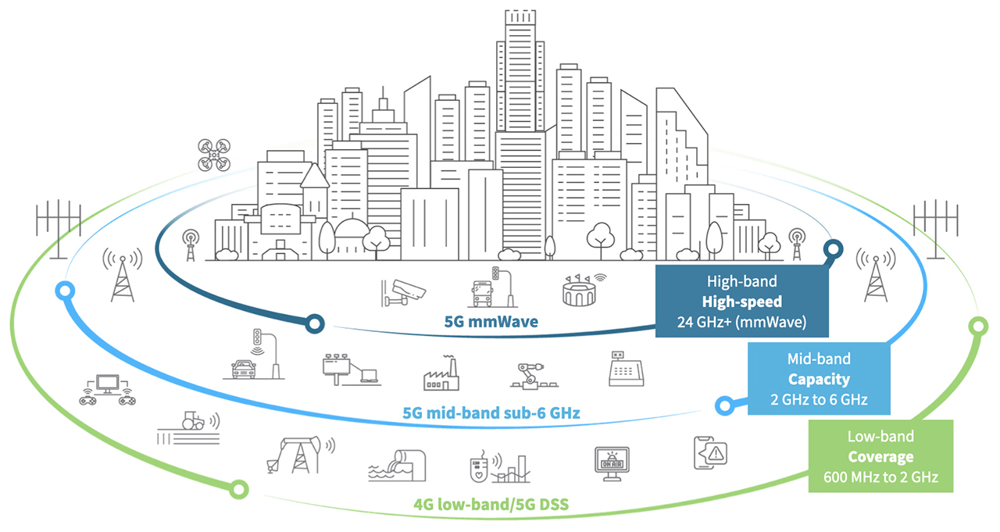
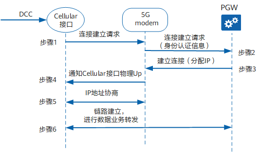
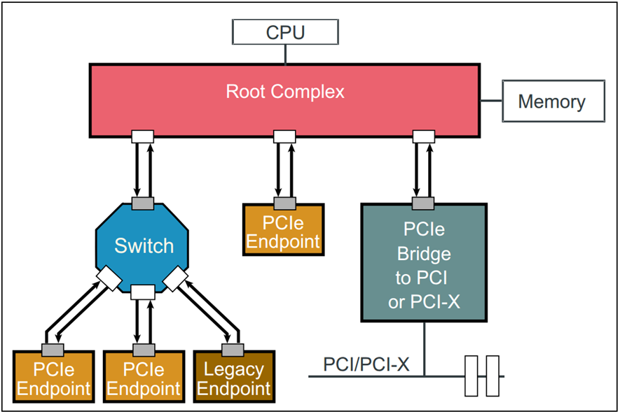
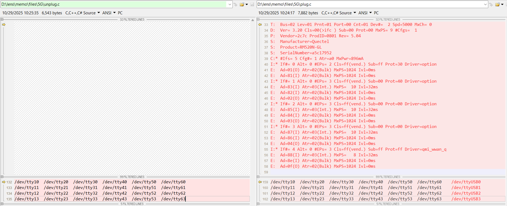
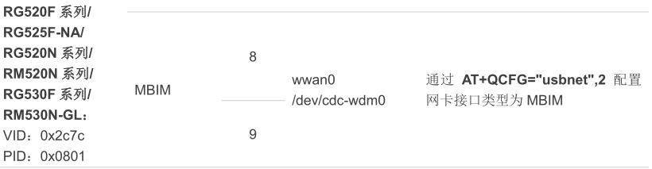

[memo.md](memo.md)  
[5G RM520N series](https://www.quectel.com/product/5g-rm520n-series/)  
[RM520N-GL 5G HAT](https://www.waveshare.com/wiki/RM520N-GL_5G_HAT)  
[RM520N-GL](https://www.waveshare.com/wiki/RM520N-GL)  
[RM520N-GL Linux PCie drivers](https://forums.quectel.com/t/rm520n-gl-linux-pcie-drivers/23736)  
[Linux PCIE Driver for RM520N-GL](https://forums.quectel.com/t/linux-pcie-driver-for-rm520n-gl/38826)  
[5G拨号连接过程](https://support.huawei.com/enterprise/zh/doc/EDOC1100203235/bc1b1b21)  
[K3588-5G](https://doc.embedfire.com/linux/rk3588/quick_start/zh/latest/quick_start/wireless/5g/5g.html)  


<div align="center">
  
</div>

5G 网络的核心有三个频段：  
    -- 5G 高频段（毫米波）提供 5G 的最高频率。频率范围从 24 千兆赫到大约 100 千兆赫。由于高频率不能轻易穿过障碍物，因此高频段 5G 从本质上来说是短距离的。此外，毫米波的覆盖范围有限，需要更多的蜂窝基础设施。  
    -- 5G 中频段在 2-6 千兆赫范围内工作，为城市和郊区提供了一个容量层。该频段的峰值速率可达数百 Mbps。  
    -- 5G 低频段工作频率低于 2 GHz，覆盖范围广。该频段使用的频谱是目前 4G LTE 可用和正在使用的频谱，本质上是为目前已准备就绪的 5G 设备提供 LTE 5G 架构。因此，低频 5G 的性能与 4G LTE 相似，并支持目前市场上的 5G 设备使用。  

除了频谱可用性和应用对距离与带宽的要求外，运营商还必须考虑 5G 的功率要求，因为典型的 5G 基站设计要求的功率是 4G 基站的两倍多。  

<div align="center">
  
</div>

当有流量触发或者到达拨号时间时，路由器将采用轮询DCC的方式触发Cellular接口自动拨号，  
并控制5G modem与外部公用数据网PDN（Public Data Network）网关PGW（PDN Gateway）建立连接。  
PGW是路由器接入PDN网络的入口，负责给路由器的5G modem分配IP地址。5G拨号连接的详细过程如下：  

    - 轮询DCC触发Cellular接口拨号，Cellular接口向5G modem发送连接建立请求。  
    - 5G modem向PGW发送连接建立请求，该请求中包含用户的身份认证信息，包括APN、用户名和密码等信息。  
    - PGW对接入的用户进行认证，认证成功后，PGW与5G modem建立连接，并分配IP地址给5G modem。  
    - 5G modem通知Cellular接口物理Up。  
    - Cellular接口与5G modem进行IP地址协商，并获取IP地址。  
    - Cellular接口成功与PGW建立链路，进行数据业务转发。  


<div align="center">
  
</div>

# Debug
## 5G Unplug
```c
root@rk3588:/# ls /sys/bus/usb/drivers
asix          cdc_ncm     ftdi_sio  oti6858     sierra         usbserial_generic
ax88179_178a  cdc_subset  hub       pl2303      snd-usb-audio  usbtouchscreen
bfusb         cdc_wdm     keyspan   qcserial    usb            uvcvideo
cdc_acm       ch341       net1080   qmi_wwan    usbfs          zaurus
cdc_ether     cp210x      option    qmi_wwan_q  usbhid

root@rk3588:/# cat /sys/kernel/debug/usb/devices

T:  Bus=01 Lev=00 Prnt=00 Port=00 Cnt=00 Dev#=  1 Spd=480  MxCh= 1
B:  Alloc=  0/800 us ( 0%), #Int=  0, #Iso=  0
D:  Ver= 2.00 Cls=09(hub  ) Sub=00 Prot=01 MxPS=64 #Cfgs=  1
P:  Vendor=1d6b ProdID=0002 Rev= 5.10
S:  Manufacturer=Linux 5.10.198 xhci-hcd
S:  Product=xHCI Host Controller
S:  SerialNumber=xhci-hcd.4.auto
C:* #Ifs= 1 Cfg#= 1 Atr=e0 MxPwr=  0mA
I:* If#= 0 Alt= 0 #EPs= 1 Cls=09(hub  ) Sub=00 Prot=00 Driver=hub
E:  Ad=81(I) Atr=03(Int.) MxPS=   4 Ivl=256ms

T:  Bus=02 Lev=00 Prnt=00 Port=00 Cnt=00 Dev#=  1 Spd=5000 MxCh= 1
B:  Alloc=  0/800 us ( 0%), #Int=  0, #Iso=  0
D:  Ver= 3.00 Cls=09(hub  ) Sub=00 Prot=03 MxPS= 9 #Cfgs=  1
P:  Vendor=1d6b ProdID=0003 Rev= 5.10
S:  Manufacturer=Linux 5.10.198 xhci-hcd
S:  Product=xHCI Host Controller
S:  SerialNumber=xhci-hcd.4.auto
C:* #Ifs= 1 Cfg#= 1 Atr=e0 MxPwr=  0mA
I:* If#= 0 Alt= 0 #EPs= 1 Cls=09(hub  ) Sub=00 Prot=00 Driver=hub
E:  Ad=81(I) Atr=03(Int.) MxPS=   4 Ivl=256ms

T:  Bus=03 Lev=00 Prnt=00 Port=00 Cnt=00 Dev#=  1 Spd=480  MxCh= 1
B:  Alloc=  0/800 us ( 0%), #Int=  0, #Iso=  0
D:  Ver= 2.00 Cls=09(hub  ) Sub=00 Prot=01 MxPS=64 #Cfgs=  1
P:  Vendor=1d6b ProdID=0002 Rev= 5.10
S:  Manufacturer=Linux 5.10.198 xhci-hcd
S:  Product=xHCI Host Controller
S:  SerialNumber=xhci-hcd.7.auto
C:* #Ifs= 1 Cfg#= 1 Atr=e0 MxPwr=  0mA
I:* If#= 0 Alt= 0 #EPs= 1 Cls=09(hub  ) Sub=00 Prot=00 Driver=hub
E:  Ad=81(I) Atr=03(Int.) MxPS=   4 Ivl=256ms

T:  Bus=03 Lev=01 Prnt=01 Port=00 Cnt=01 Dev#=  2 Spd=480  MxCh= 4
D:  Ver= 2.10 Cls=09(hub  ) Sub=00 Prot=02 MxPS=64 #Cfgs=  1
P:  Vendor=05e3 ProdID=0610 Rev=93.91
S:  Manufacturer=GenesysLogic
S:  Product=USB2.1 Hub
C:* #Ifs= 1 Cfg#= 1 Atr=e0 MxPwr=  0mA
I:  If#= 0 Alt= 0 #EPs= 1 Cls=09(hub  ) Sub=00 Prot=01 Driver=hub
E:  Ad=81(I) Atr=03(Int.) MxPS=   1 Ivl=256ms
I:* If#= 0 Alt= 1 #EPs= 1 Cls=09(hub  ) Sub=00 Prot=02 Driver=hub
E:  Ad=81(I) Atr=03(Int.) MxPS=   1 Ivl=256ms

T:  Bus=04 Lev=00 Prnt=00 Port=00 Cnt=00 Dev#=  1 Spd=5000 MxCh= 1
B:  Alloc=  0/800 us ( 0%), #Int=  0, #Iso=  0
D:  Ver= 3.00 Cls=09(hub  ) Sub=00 Prot=03 MxPS= 9 #Cfgs=  1
P:  Vendor=1d6b ProdID=0003 Rev= 5.10
S:  Manufacturer=Linux 5.10.198 xhci-hcd
S:  Product=xHCI Host Controller
S:  SerialNumber=xhci-hcd.7.auto
C:* #Ifs= 1 Cfg#= 1 Atr=e0 MxPwr=  0mA
I:* If#= 0 Alt= 0 #EPs= 1 Cls=09(hub  ) Sub=00 Prot=00 Driver=hub
E:  Ad=81(I) Atr=03(Int.) MxPS=   4 Ivl=256ms

T:  Bus=04 Lev=01 Prnt=01 Port=00 Cnt=01 Dev#=  2 Spd=5000 MxCh= 4
D:  Ver= 3.20 Cls=09(hub  ) Sub=00 Prot=03 MxPS= 9 #Cfgs=  1
P:  Vendor=05e3 ProdID=0620 Rev=93.91
S:  Manufacturer=GenesysLogic
S:  Product=USB3.2 Hub
C:* #Ifs= 1 Cfg#= 1 Atr=e0 MxPwr=  0mA
I:* If#= 0 Alt= 0 #EPs= 1 Cls=09(hub  ) Sub=00 Prot=00 Driver=hub
E:  Ad=83(I) Atr=13(Int.) MxPS=   2 Ivl=16ms

T:  Bus=05 Lev=00 Prnt=00 Port=00 Cnt=00 Dev#=  1 Spd=12   MxCh= 1
B:  Alloc=  0/900 us ( 0%), #Int=  0, #Iso=  0
D:  Ver= 1.10 Cls=09(hub  ) Sub=00 Prot=00 MxPS=64 #Cfgs=  1
P:  Vendor=1d6b ProdID=0001 Rev= 5.10
S:  Manufacturer=Linux 5.10.198 ohci_hcd
S:  Product=Generic Platform OHCI controller
S:  SerialNumber=fc8c0000.usb
C:* #Ifs= 1 Cfg#= 1 Atr=e0 MxPwr=  0mA
I:* If#= 0 Alt= 0 #EPs= 1 Cls=09(hub  ) Sub=00 Prot=00 Driver=hub
E:  Ad=81(I) Atr=03(Int.) MxPS=   2 Ivl=255ms

T:  Bus=06 Lev=00 Prnt=00 Port=00 Cnt=00 Dev#=  1 Spd=480  MxCh= 1
B:  Alloc=  0/800 us ( 0%), #Int=  0, #Iso=  0
D:  Ver= 2.00 Cls=09(hub  ) Sub=00 Prot=00 MxPS=64 #Cfgs=  1
P:  Vendor=1d6b ProdID=0002 Rev= 5.10
S:  Manufacturer=Linux 5.10.198 ehci_hcd
S:  Product=EHCI Host Controller
S:  SerialNumber=fc880000.usb
C:* #Ifs= 1 Cfg#= 1 Atr=e0 MxPwr=  0mA
I:* If#= 0 Alt= 0 #EPs= 1 Cls=09(hub  ) Sub=00 Prot=00 Driver=hub
E:  Ad=81(I) Atr=03(Int.) MxPS=   4 Ivl=256ms

T:  Bus=06 Lev=01 Prnt=01 Port=00 Cnt=01 Dev#=  2 Spd=480  MxCh= 4
D:  Ver= 2.00 Cls=09(hub  ) Sub=00 Prot=02 MxPS=64 #Cfgs=  1
P:  Vendor=1a40 ProdID=0101 Rev= 1.00
S:  Product=USB 2.0 Hub [MTT]
C:* #Ifs= 1 Cfg#= 1 Atr=e0 MxPwr=100mA
I:  If#= 0 Alt= 0 #EPs= 1 Cls=09(hub  ) Sub=00 Prot=01 Driver=hub
E:  Ad=81(I) Atr=03(Int.) MxPS=   1 Ivl=256ms
I:* If#= 0 Alt= 1 #EPs= 1 Cls=09(hub  ) Sub=00 Prot=02 Driver=hub
E:  Ad=81(I) Atr=03(Int.) MxPS=   1 Ivl=256ms

T:  Bus=07 Lev=00 Prnt=00 Port=00 Cnt=00 Dev#=  1 Spd=12   MxCh= 1
B:  Alloc=  0/900 us ( 0%), #Int=  0, #Iso=  0
D:  Ver= 1.10 Cls=09(hub  ) Sub=00 Prot=00 MxPS=64 #Cfgs=  1
P:  Vendor=1d6b ProdID=0001 Rev= 5.10
S:  Manufacturer=Linux 5.10.198 ohci_hcd
S:  Product=Generic Platform OHCI controller
S:  SerialNumber=fc840000.usb
C:* #Ifs= 1 Cfg#= 1 Atr=e0 MxPwr=  0mA
I:* If#= 0 Alt= 0 #EPs= 1 Cls=09(hub  ) Sub=00 Prot=00 Driver=hub
E:  Ad=81(I) Atr=03(Int.) MxPS=   2 Ivl=255ms

T:  Bus=08 Lev=00 Prnt=00 Port=00 Cnt=00 Dev#=  1 Spd=480  MxCh= 1
B:  Alloc=  0/800 us ( 0%), #Int=  0, #Iso=  0
D:  Ver= 2.00 Cls=09(hub  ) Sub=00 Prot=00 MxPS=64 #Cfgs=  1
P:  Vendor=1d6b ProdID=0002 Rev= 5.10
S:  Manufacturer=Linux 5.10.198 ehci_hcd
S:  Product=EHCI Host Controller
S:  SerialNumber=fc800000.usb
C:* #Ifs= 1 Cfg#= 1 Atr=e0 MxPwr=  0mA
I:* If#= 0 Alt= 0 #EPs= 1 Cls=09(hub  ) Sub=00 Prot=00 Driver=hub
E:  Ad=81(I) Atr=03(Int.) MxPS=   4 Ivl=256ms
root@rk3588:/# ls /dev/tty*
/dev/tty	  /dev/tty18	/dev/tty28	/dev/tty38	/dev/tty48	/dev/tty58	/dev/ttyS0
/dev/tty0	  /dev/tty19	/dev/tty29	/dev/tty39	/dev/tty49	/dev/tty59	/dev/ttyS1
/dev/tty1	  /dev/tty2	  /dev/tty3	  /dev/tty4	  /dev/tty5	  /dev/tty6	  /dev/ttyS6
/dev/tty10	/dev/tty20	/dev/tty30	/dev/tty40	/dev/tty50	/dev/tty60	
/dev/tty11	/dev/tty21	/dev/tty31	/dev/tty41	/dev/tty51	/dev/tty61	
/dev/tty12	/dev/tty22	/dev/tty32	/dev/tty42	/dev/tty52	/dev/tty62	
/dev/tty13	/dev/tty23	/dev/tty33	/dev/tty43	/dev/tty53	/dev/tty63	
/dev/tty14	/dev/tty24	/dev/tty34	/dev/tty44	/dev/tty54	/dev/tty7	
/dev/tty15	/dev/tty25	/dev/tty35	/dev/tty45	/dev/tty55	/dev/tty8	
/dev/tty16	/dev/tty26	/dev/tty36	/dev/tty46	/dev/tty56	/dev/tty9	
/dev/tty17	/dev/tty27	/dev/tty37	/dev/tty47	/dev/tty57	/dev/ttyFIQ0	
```
## 5G Plug
```c
root@rk3588:/# ls /sys/bus/usb/drivers
asix          cdc_ncm     ftdi_sio  oti6858     sierra         usbserial_generic
ax88179_178a  cdc_subset  hub       pl2303      snd-usb-audio  usbtouchscreen
bfusb         cdc_wdm     keyspan   qcserial    usb            uvcvideo
cdc_acm       ch341       net1080   qmi_wwan    usbfs          zaurus
cdc_ether     cp210x      option    qmi_wwan_q  usbhid

root@rk3588:/# cat /sys/kernel/debug/usb/devices

T:  Bus=01 Lev=00 Prnt=00 Port=00 Cnt=00 Dev#=  1 Spd=480  MxCh= 1
B:  Alloc=  0/800 us ( 0%), #Int=  0, #Iso=  0
D:  Ver= 2.00 Cls=09(hub  ) Sub=00 Prot=01 MxPS=64 #Cfgs=  1
P:  Vendor=1d6b ProdID=0002 Rev= 5.10
S:  Manufacturer=Linux 5.10.198 xhci-hcd
S:  Product=xHCI Host Controller
S:  SerialNumber=xhci-hcd.4.auto
C:* #Ifs= 1 Cfg#= 1 Atr=e0 MxPwr=  0mA
I:* If#= 0 Alt= 0 #EPs= 1 Cls=09(hub  ) Sub=00 Prot=00 Driver=hub
E:  Ad=81(I) Atr=03(Int.) MxPS=   4 Ivl=256ms

T:  Bus=02 Lev=00 Prnt=00 Port=00 Cnt=00 Dev#=  1 Spd=5000 MxCh= 1
B:  Alloc=  0/800 us ( 0%), #Int=  0, #Iso=  0
D:  Ver= 3.00 Cls=09(hub  ) Sub=00 Prot=03 MxPS= 9 #Cfgs=  1
P:  Vendor=1d6b ProdID=0003 Rev= 5.10
S:  Manufacturer=Linux 5.10.198 xhci-hcd
S:  Product=xHCI Host Controller
S:  SerialNumber=xhci-hcd.4.auto
C:* #Ifs= 1 Cfg#= 1 Atr=e0 MxPwr=  0mA
I:* If#= 0 Alt= 0 #EPs= 1 Cls=09(hub  ) Sub=00 Prot=00 Driver=hub
E:  Ad=81(I) Atr=03(Int.) MxPS=   4 Ivl=256ms

T:  Bus=02 Lev=01 Prnt=01 Port=00 Cnt=01 Dev#=  2 Spd=5000 MxCh= 0
D:  Ver= 3.20 Cls=00(>ifc ) Sub=00 Prot=00 MxPS= 9 #Cfgs=  1
P:  Vendor=2c7c ProdID=0801 Rev= 5.04
S:  Manufacturer=Quectel
S:  Product=RM520N-GL
S:  SerialNumber=a5c17952
C:* #Ifs= 5 Cfg#= 1 Atr=a0 MxPwr=896mA
I:* If#= 0 Alt= 0 #EPs= 2 Cls=ff(vend.) Sub=ff Prot=30 Driver=option
E:  Ad=01(O) Atr=02(Bulk) MxPS=1024 Ivl=0ms
E:  Ad=81(I) Atr=02(Bulk) MxPS=1024 Ivl=0ms
I:* If#= 1 Alt= 0 #EPs= 3 Cls=ff(vend.) Sub=00 Prot=40 Driver=option
E:  Ad=83(I) Atr=03(Int.) MxPS=  10 Ivl=32ms
E:  Ad=82(I) Atr=02(Bulk) MxPS=1024 Ivl=0ms
E:  Ad=02(O) Atr=02(Bulk) MxPS=1024 Ivl=0ms
I:* If#= 2 Alt= 0 #EPs= 3 Cls=ff(vend.) Sub=00 Prot=00 Driver=option
E:  Ad=85(I) Atr=03(Int.) MxPS=  10 Ivl=32ms
E:  Ad=84(I) Atr=02(Bulk) MxPS=1024 Ivl=0ms
E:  Ad=03(O) Atr=02(Bulk) MxPS=1024 Ivl=0ms
I:* If#= 3 Alt= 0 #EPs= 3 Cls=ff(vend.) Sub=00 Prot=00 Driver=option
E:  Ad=87(I) Atr=03(Int.) MxPS=  10 Ivl=32ms
E:  Ad=86(I) Atr=02(Bulk) MxPS=1024 Ivl=0ms
E:  Ad=04(O) Atr=02(Bulk) MxPS=1024 Ivl=0ms
I:* If#= 4 Alt= 0 #EPs= 3 Cls=ff(vend.) Sub=ff Prot=ff Driver=qmi_wwan_q
E:  Ad=88(I) Atr=03(Int.) MxPS=   8 Ivl=32ms
E:  Ad=8e(I) Atr=02(Bulk) MxPS=1024 Ivl=0ms
E:  Ad=0f(O) Atr=02(Bulk) MxPS=1024 Ivl=0ms

T:  Bus=03 Lev=00 Prnt=00 Port=00 Cnt=00 Dev#=  1 Spd=480  MxCh= 1
B:  Alloc=  0/800 us ( 0%), #Int=  0, #Iso=  0
D:  Ver= 2.00 Cls=09(hub  ) Sub=00 Prot=01 MxPS=64 #Cfgs=  1
P:  Vendor=1d6b ProdID=0002 Rev= 5.10
S:  Manufacturer=Linux 5.10.198 xhci-hcd
S:  Product=xHCI Host Controller
S:  SerialNumber=xhci-hcd.7.auto
C:* #Ifs= 1 Cfg#= 1 Atr=e0 MxPwr=  0mA
I:* If#= 0 Alt= 0 #EPs= 1 Cls=09(hub  ) Sub=00 Prot=00 Driver=hub
E:  Ad=81(I) Atr=03(Int.) MxPS=   4 Ivl=256ms

T:  Bus=03 Lev=01 Prnt=01 Port=00 Cnt=01 Dev#=  2 Spd=480  MxCh= 4
D:  Ver= 2.10 Cls=09(hub  ) Sub=00 Prot=02 MxPS=64 #Cfgs=  1
P:  Vendor=05e3 ProdID=0610 Rev=93.91
S:  Manufacturer=GenesysLogic
S:  Product=USB2.1 Hub
C:* #Ifs= 1 Cfg#= 1 Atr=e0 MxPwr=  0mA
I:  If#= 0 Alt= 0 #EPs= 1 Cls=09(hub  ) Sub=00 Prot=01 Driver=hub
E:  Ad=81(I) Atr=03(Int.) MxPS=   1 Ivl=256ms
I:* If#= 0 Alt= 1 #EPs= 1 Cls=09(hub  ) Sub=00 Prot=02 Driver=hub
E:  Ad=81(I) Atr=03(Int.) MxPS=   1 Ivl=256ms

T:  Bus=04 Lev=00 Prnt=00 Port=00 Cnt=00 Dev#=  1 Spd=5000 MxCh= 1
B:  Alloc=  0/800 us ( 0%), #Int=  0, #Iso=  0
D:  Ver= 3.00 Cls=09(hub  ) Sub=00 Prot=03 MxPS= 9 #Cfgs=  1
P:  Vendor=1d6b ProdID=0003 Rev= 5.10
S:  Manufacturer=Linux 5.10.198 xhci-hcd
S:  Product=xHCI Host Controller
S:  SerialNumber=xhci-hcd.7.auto
C:* #Ifs= 1 Cfg#= 1 Atr=e0 MxPwr=  0mA
I:* If#= 0 Alt= 0 #EPs= 1 Cls=09(hub  ) Sub=00 Prot=00 Driver=hub
E:  Ad=81(I) Atr=03(Int.) MxPS=   4 Ivl=256ms

T:  Bus=04 Lev=01 Prnt=01 Port=00 Cnt=01 Dev#=  2 Spd=5000 MxCh= 4
D:  Ver= 3.20 Cls=09(hub  ) Sub=00 Prot=03 MxPS= 9 #Cfgs=  1
P:  Vendor=05e3 ProdID=0620 Rev=93.91
S:  Manufacturer=GenesysLogic
S:  Product=USB3.2 Hub
C:* #Ifs= 1 Cfg#= 1 Atr=e0 MxPwr=  0mA
I:* If#= 0 Alt= 0 #EPs= 1 Cls=09(hub  ) Sub=00 Prot=00 Driver=hub
E:  Ad=83(I) Atr=13(Int.) MxPS=   2 Ivl=16ms

T:  Bus=05 Lev=00 Prnt=00 Port=00 Cnt=00 Dev#=  1 Spd=12   MxCh= 1
B:  Alloc=  0/900 us ( 0%), #Int=  0, #Iso=  0
D:  Ver= 1.10 Cls=09(hub  ) Sub=00 Prot=00 MxPS=64 #Cfgs=  1
P:  Vendor=1d6b ProdID=0001 Rev= 5.10
S:  Manufacturer=Linux 5.10.198 ohci_hcd
S:  Product=Generic Platform OHCI controller
S:  SerialNumber=fc8c0000.usb
C:* #Ifs= 1 Cfg#= 1 Atr=e0 MxPwr=  0mA
I:* If#= 0 Alt= 0 #EPs= 1 Cls=09(hub  ) Sub=00 Prot=00 Driver=hub
E:  Ad=81(I) Atr=03(Int.) MxPS=   2 Ivl=255ms

T:  Bus=06 Lev=00 Prnt=00 Port=00 Cnt=00 Dev#=  1 Spd=480  MxCh= 1
B:  Alloc=  0/800 us ( 0%), #Int=  0, #Iso=  0
D:  Ver= 2.00 Cls=09(hub  ) Sub=00 Prot=00 MxPS=64 #Cfgs=  1
P:  Vendor=1d6b ProdID=0002 Rev= 5.10
S:  Manufacturer=Linux 5.10.198 ehci_hcd
S:  Product=EHCI Host Controller
S:  SerialNumber=fc880000.usb
C:* #Ifs= 1 Cfg#= 1 Atr=e0 MxPwr=  0mA
I:* If#= 0 Alt= 0 #EPs= 1 Cls=09(hub  ) Sub=00 Prot=00 Driver=hub
E:  Ad=81(I) Atr=03(Int.) MxPS=   4 Ivl=256ms

T:  Bus=06 Lev=01 Prnt=01 Port=00 Cnt=01 Dev#=  2 Spd=480  MxCh= 4
D:  Ver= 2.00 Cls=09(hub  ) Sub=00 Prot=02 MxPS=64 #Cfgs=  1
P:  Vendor=1a40 ProdID=0101 Rev= 1.00
S:  Product=USB 2.0 Hub [MTT]
C:* #Ifs= 1 Cfg#= 1 Atr=e0 MxPwr=100mA
I:  If#= 0 Alt= 0 #EPs= 1 Cls=09(hub  ) Sub=00 Prot=01 Driver=hub
E:  Ad=81(I) Atr=03(Int.) MxPS=   1 Ivl=256ms
I:* If#= 0 Alt= 1 #EPs= 1 Cls=09(hub  ) Sub=00 Prot=02 Driver=hub
E:  Ad=81(I) Atr=03(Int.) MxPS=   1 Ivl=256ms

T:  Bus=07 Lev=00 Prnt=00 Port=00 Cnt=00 Dev#=  1 Spd=12   MxCh= 1
B:  Alloc=  0/900 us ( 0%), #Int=  0, #Iso=  0
D:  Ver= 1.10 Cls=09(hub  ) Sub=00 Prot=00 MxPS=64 #Cfgs=  1
P:  Vendor=1d6b ProdID=0001 Rev= 5.10
S:  Manufacturer=Linux 5.10.198 ohci_hcd
S:  Product=Generic Platform OHCI controller
S:  SerialNumber=fc840000.usb
C:* #Ifs= 1 Cfg#= 1 Atr=e0 MxPwr=  0mA
I:* If#= 0 Alt= 0 #EPs= 1 Cls=09(hub  ) Sub=00 Prot=00 Driver=hub
E:  Ad=81(I) Atr=03(Int.) MxPS=   2 Ivl=255ms

T:  Bus=08 Lev=00 Prnt=00 Port=00 Cnt=00 Dev#=  1 Spd=480  MxCh= 1
B:  Alloc=  0/800 us ( 0%), #Int=  0, #Iso=  0
D:  Ver= 2.00 Cls=09(hub  ) Sub=00 Prot=00 MxPS=64 #Cfgs=  1
P:  Vendor=1d6b ProdID=0002 Rev= 5.10
S:  Manufacturer=Linux 5.10.198 ehci_hcd
S:  Product=EHCI Host Controller
S:  SerialNumber=fc800000.usb
C:* #Ifs= 1 Cfg#= 1 Atr=e0 MxPwr=  0mA
I:* If#= 0 Alt= 0 #EPs= 1 Cls=09(hub  ) Sub=00 Prot=00 Driver=hub
E:  Ad=81(I) Atr=03(Int.) MxPS=   4 Ivl=256ms

root@rk3588:/# ls /dev/tty*
/dev/tty    /dev/tty18  /dev/tty28  /dev/tty38  /dev/tty48  /dev/tty58    /dev/ttyS0
/dev/tty0   /dev/tty19  /dev/tty29  /dev/tty39  /dev/tty49  /dev/tty59    /dev/ttyS1
/dev/tty1   /dev/tty2   /dev/tty3   /dev/tty4   /dev/tty5   /dev/tty6     /dev/ttyS6
/dev/tty10  /dev/tty20  /dev/tty30  /dev/tty40  /dev/tty50  /dev/tty60    /dev/ttyUSB0
/dev/tty11  /dev/tty21  /dev/tty31  /dev/tty41  /dev/tty51  /dev/tty61    /dev/ttyUSB1
/dev/tty12  /dev/tty22  /dev/tty32  /dev/tty42  /dev/tty52  /dev/tty62    /dev/ttyUSB2
/dev/tty13  /dev/tty23  /dev/tty33  /dev/tty43  /dev/tty53  /dev/tty63    /dev/ttyUSB3
/dev/tty14  /dev/tty24  /dev/tty34  /dev/tty44  /dev/tty54  /dev/tty7
/dev/tty15  /dev/tty25  /dev/tty35  /dev/tty45  /dev/tty55  /dev/tty8
/dev/tty16  /dev/tty26  /dev/tty36  /dev/tty46  /dev/tty56  /dev/tty9
/dev/tty17  /dev/tty27  /dev/tty37  /dev/tty47  /dev/tty57  /dev/ttyFIQ0
```
## Compare
<div align="left">
  
</div>

## PID
```c
root@rk3588:/# lsusb
Bus 005 Device 001: ID 1d6b:0001
Bus 003 Device 001: ID 1d6b:0002
Bus 002 Device 002: ID 2c7c:0801
Bus 001 Device 001: ID 1d6b:0002
Bus 008 Device 001: ID 1d6b:0002
Bus 006 Device 001: ID 1d6b:0002
Bus 004 Device 001: ID 1d6b:0003
Bus 004 Device 002: ID 05e3:0620
Bus 002 Device 001: ID 1d6b:0003
Bus 003 Device 002: ID 05e3:0610
Bus 007 Device 001: ID 1d6b:0001
Bus 006 Device 002: ID 1a40:0101
```
<div align="left">
  
</div>

## AT
```c
root@rk3588:/# busybox microcom /dev/ttyUSB2
RDY
+CFUN: 1
+CPIN: NOT INSERTED
AT+QSIMDET=1,1
OK

root@rk3588:/# busybox microcom /dev/ttyUSB2
RDY
+CFUN: 1
+CPIN: NOT INSERTED
AT+QSIMDET?
+QSIMDET: 1,1 //1st bit,1:enable hot plug,0:disable, 2nd bit,1: inserted, 0: not inserted
OK
+CPIN: NOT READY    //not inserted
+CPIN: NOT INSERTED //inserted
+CPIN: NOT READY    //not inserted
+CPIN: NOT INSERTED //inserted
at+cpin?;+csq;+cops?
```