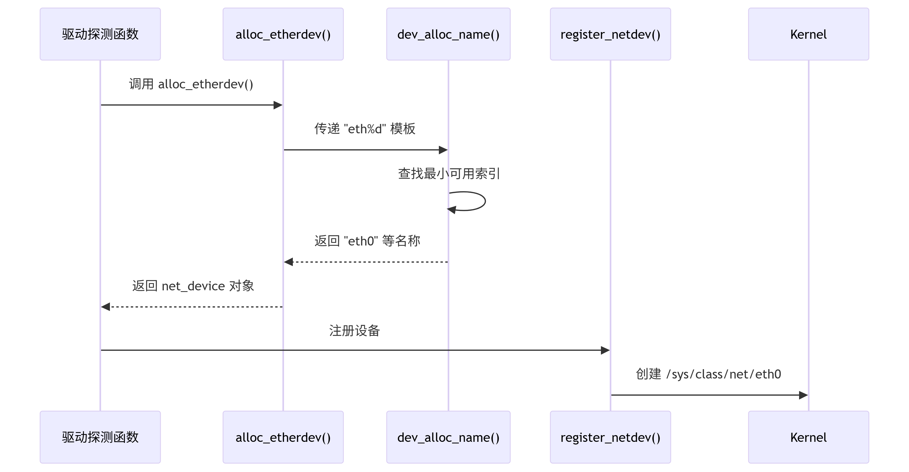
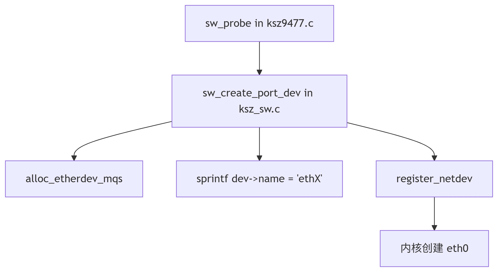
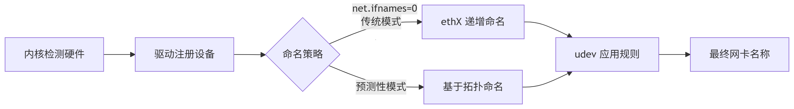
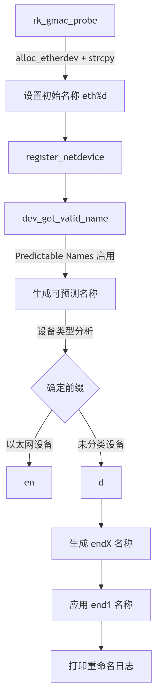
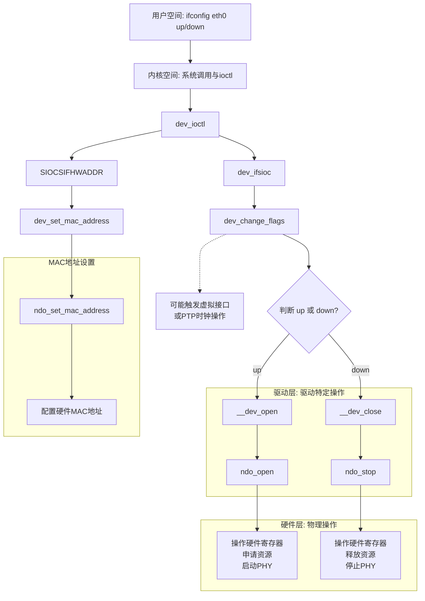

[memo](memo.md)  
[AR01A](AR01A.md)  
[AR01A-ethernet](AR01A-ethernet.md) 
# DEV name
<div align="center">
  
</div>

<div align="center">
  
</div>

## stmmac
### device name
```c

```
```c
/drivers/net/ethernet/stmicro/stmmac/stmmac_main.c
int stmmac_dvr_probe(struct device *device,
		     struct plat_stmmacenet_data *plat_dat,
		     struct stmmac_resources *res)
  devm_alloc_etherdev_mqs()//set default device name, prototype is in kernael/net/devres.c
    alloc_etherdev_mqs()// prototype is in kernel/net/ethernet/eth.c
    alloc_netdev_mqs(eth%d)// prototype is in kernel/net/core/dev.c
      dev_change_name()//rk_gmac-dwmac fe1c0000.ethernet end1: renamed from eth0, core/rtnetlink.c,core/dev_ioctl.c
       netdev_adjacent_rename_links()
  netdev_priv()
  stmmac_phy_setup()
  register_netdev(dev)
    register_netdevice() //kernel/net/core/dev.c,int register_netdevice(struct net_device *dev)
     netdev_register_kobject(dev); //kernel/net/core/net-sysfs.c, sysfs register entry
      netdev_queue_add_kobjects(dev);
  static int stmmac_sw_init(struct stmmac_priv *priv)    
```
<div align="center">
  
</div>

We can close the prediction mode by configure /proc/cmdline,just add net.ifnames=0.
```c
//kernel/arch/arm64/boot/dts/rockchip/rk3588-linux.dtsi
bootargs="net.ifnames=0"
```

```c
netlink_proto_init() //kernel/net/netlink/af_netlink.c
  rtnetlink_init() //core/rtnetlink.c
    rtnl_register(rtnl_setlink)
```

```c
// 文件路径：net/core/dev.c
int register_netdevice(struct net_device *dev)
{
    ...
    // 设备名称处理
    ret = dev_get_valid_name(dev, dev->name); // 这里决定最终名称
    ...
    if (dev->reg_state == NETREG_REGISTERED)
        netdev_adjacent_rename_links(dev, oldname); // 触发重命名日志
}

// 文件路径：lib/kobject_uevent.c 或 drivers/base/core.c
static int uevent_net_id(struct device *dev, struct kobj_uevent_env *env)
{
    ...
    // 调用可预测命名逻辑
    if (dev->type && dev->type->name)
        add_uevent_var(env, "INTERFACE=%s", dev->type->name(dev));
    ...
}

// 文件路径：drivers/net/ethernet/stmicro/stmmac/dwmac-rk.c
static int rk_gmac_probe(struct platform_device *pdev)
{
    ...
    struct net_device *ndev = alloc_etherdev(sizeof(struct stmmac_priv));
    strcpy(ndev->name, "eth%d"); // 驱动设置的初始名称
    ...
    ret = stmmac_dvr_probe(&pdev->dev, plat_dat, &stmmac_res);
    // 注册时内核会覆盖这个名称
}
```
<div align="center">
  
</div>

## ifconifg up/down
