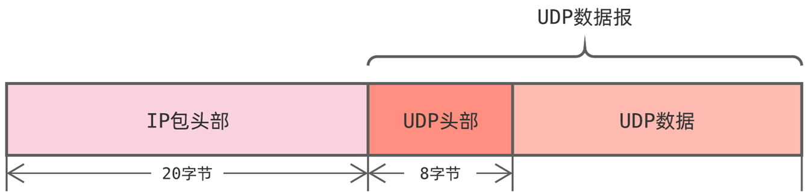
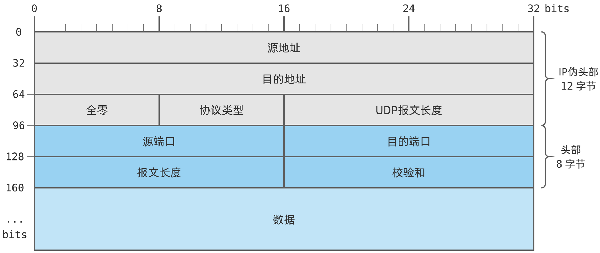
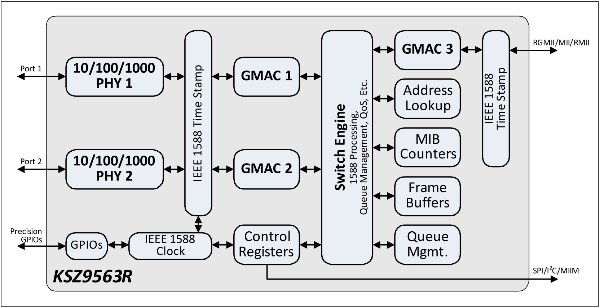
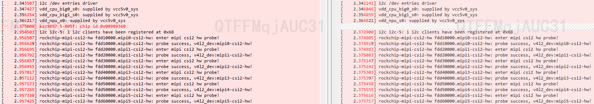

[memo](memo.md)  
[AR01A](AR01A.md)  
# Ethernet
## UDP
<div align="center">
  
</div>

<div align="center">
  
</div>

UDP数据包由 头部（Header） 和 数据部分（Payload） 组成，头部固定为 8字节，包含以下字段：

|字段名	|度（比特）	|说明|
|    ----         |     -----    |     -----    |
|源端口（Source Port）	|16	|发送方的端口号（可选，可置为 0）|
|目的端口（Destination Port）	|16	|接收方的端口号|
|长度（Length）	|16	|UDP头部 + 数据的总长度（最小为 8，即仅头部）|
|校验和（Checksum）	|16	|可选字段，用于错误检测（IPv4中可选，IPv6中强制使用）|

# Ethernet Pins
|   Connect       | Pin | Pin No. | Other |
|    ----         |     -----    |     -----    |     -----    |
| EN_PHY_3V3   |    GPIO4_A6  | 134 |R3569,C3513|
| EN_PHY_1V2      |    GPIO0_C5     | 21 |R3557,C3532|
| PME_N           |    GPIO3_C5  | 117 |   |
| INTR_N          |    GPIO3_C6  | 116 |   |
| ETH1_REFCLKO_25M|    GPIO3_A6     | 102 |   |
| RESET_N_PHY     |    GPIO3_B2     | 106 | C3506  |
| PTP_REF_CLK     |    GPIO3_B7     | 107 |   |
| I2C5_m0         |    GPIO3_C7->SCL,GPIO3_D0->SDA  |  |   |
| RGMII_RX        |         |  |   |

# KSZ9563R
<div align="center">
  
</div>

## Configuration Straps
|   Configuration Strap Pin       | Description |
|    ----         |     -----    |
| LED1_1      |    In-Band Management (IBA) 0: Enable In-Band Management 1: Disable In-Band Management (Default) Note: If using I2C, do not enable IBA.     |
| RXD1, RXD0           |    P[RXD1, RXD0]: Serial Interface Mode   00: MIIM (Default)   01: I2C 1x: SPI  |

# Code
## Reference Code
```c
git clone https://github.com/Microchip-Ethernet/EVB-KSZ9477.git
```
```c
KSZ/linux-drivers/ksz9897/linux-5.10/arch/arm/boot/dts/at91-sama5d3_xplained_ung8071.dts
KSZ/linux-drivers/ksz9897/linux-5.10/drivers/net/ethernet/micrel
KSZ/linux-drivers/ksz9897/linux-5.10/drivers/ptp
```
# Build Error
## 1
```c
'rivers/net/ethernet/micrel/Kconfig:1:warning: ignoring unsupported character '
'rivers/net/ethernet/micrel/Kconfig:2:warning: ignoring unsupported character '
'rivers/net/ethernet/micrel/Kconfig:3:warning: ignoring unsupported character '
'rivers/net/ethernet/micrel/Kconfig:4:warning: ignoring unsupported character '
'rivers/net/ethernet/micrel/Kconfig:5:warning: ignoring unsupported character '
```
### Fix
```c
dos2unix drivers/net/ethernet/micrel/Kconfig
```
## 2

```c
In file included from drivers/net/ethernet/micrel/ksz_sw_9897.c:7419,
                 from drivers/net/ethernet/micrel/i2c-ksz9897.c:446:
drivers/net/ethernet/micrel/ksz_hsr.c: In function 'hsr_add_node_':
drivers/net/ethernet/micrel/ksz_hsr.c:240:65: error: cast from pointer to integer of different size [-Werror=pointer-to-int-cast]
  240 | dbg_msg("%s %x %02x:%02x:%02x:%02x:%02x:%02x %04x\n", __func__, (int)node,
      |                                                                 ^
drivers/net/ethernet/micrel/ksz_hsr.c: In function 'hsr_register_frame_out':
drivers/net/ethernet/micrel/ksz_hsr.c:605:51: error: cast from pointer to integer of different size [-Werror=pointer-to-int-cast]
  605 | dbg_msg("%s %x %d; %d %04x %04x %lu\n", __func__, (int)node, dbg_frame_out,
      |                                                   ^
cc1: all warnings being treated as errors
scripts/Makefile.build:273: recipe for target 'drivers/net/ethernet/micrel/i2c-ksz9897.o' failed
make[5]: *** [drivers/net/ethernet/micrel/i2c-ksz9897.o] Error 1
scripts/Makefile.build:516: recipe for target 'drivers/net/ethernet/micrel' failed
make[4]: *** [drivers/net/ethernet/micrel] Error 2
scripts/Makefile.build:516: recipe for target 'drivers/net/ethernet' failed
make[3]: *** [drivers/net/ethernet] Error 2
scripts/Makefile.build:516: recipe for target 'drivers/net' failed
make[2]: *** [drivers/net] Error 2
Makefile:1929: recipe for target 'drivers' failed
make[1]: *** [drivers] Error 2
arch/arm64/Makefile:214: recipe for target 'rk3588s-evb4-lp4x-v10-linux.img' failed
make: *** [rk3588s-evb4-lp4x-v10-linux.img] Error 2
make: Leaving directory '/data/ar01a/kernel'
```
### Fix
```c
#if 1
dbg_msg("%s %x %02x:%02x:%02x:%02x:%02x:%02x %04x\n", __func__, (int)node,
addr[0], addr[1], addr[2], addr[3], addr[4], addr[5], seq_out);
#endif
```
Change to 
```c
#if 1
dbg_msg("%s %x %02x:%02x:%02x:%02x:%02x:%02x %04x\n", __func__, (uintptr_t)node,
addr[0], addr[1], addr[2], addr[3], addr[4], addr[5], seq_out);
#endif
```
# Debug
## log with ksz and without ksz
<div align="center">
  
</div>

## Crash
```c
[    2.094140] Unable to handle kernel paging request at virtual address fffffff3909fe8f8
[    2.096276] Mem abort info:
[    2.096528]   ESR = 0x96000005
[    2.096803]   EC = 0x25: DABT (current EL), IL = 32 bits
[    2.097277]   SET = 0, FnV = 0
[    2.097551]   EA = 0, S1PTW = 0
[    2.097844] Data abort info:
[    2.098106]   ISV = 0, ISS = 0x00000005
[    2.098447]   CM = 0, WnR = 0
[    2.098711] swapper pgtable: 4k pages, 39-bit VAs, pgdp=0000000001d48000
[    2.099298] [fffffff3909fe8f8] pgd=0000000000000000, p4d=0000000000000000, pud=0000000000000000
[    2.100071] Internal error: Oops: 96000005 [#1] SMP
[    2.100502] Modules linked in:
[    2.100781] CPU: 1 PID: 1 Comm: swapper/0 Not tainted 5.10.209 #6
[    2.101323] Hardware name: Rockchip RK3588S EVB4 LP4X V10 Board (DT)
[    2.101889] pstate: 60c00009 (nZCv daif +PAN +UAO -TCO BTYPE=--)
[    2.102426] pc : kszphy_probe+0xac/0xd0
[    2.102768] lr : kszphy_probe+0x98/0xd0
[    2.103109] sp : ffffffc00a47b250
[    2.103405] x29: ffffffc00a47b250 x28: ffffff81f2720bf8 
[    2.103874] x27: 0000000000000078 x26: ffffff81f2723af8 
[    2.104352] x25: 0000000000000000 x24: ffffffc00a222528 
[    2.104831] x23: ffffffc0093da858 x22: ffffff81f262cbf8 
[    2.105299] x21: ffffff81f2612000 x20: ffffffc0093da858 
[    2.105767] x19: fffffff3909fe7f8 x18: 0000000000000030 
[    2.106245] x17: 0000000000101ab8 x16: 0000000000773df5 
[    2.106724] x15: ffffffffffffffff x14: ffffffc08a47af57 
[    2.107202] x13: 0000000000000006 x12: ffffffc00a47af60 
[    2.107670] x11: fffffffffffc7f50 x10: fffffffffffc7f30 
[    2.108138] x9 : ffffffc0080bed34 x8 : ffffffc00a012640 
[    2.108606] x7 : ffffffc00a0c2640 x6 : 0000000000001824 
[    2.109074] x5 : 0000000000017ff4 x4 : 00000000ffffe203 
[    2.109552] x3 : 0000000000000000 x2 : 0000000000000078 
[    2.110030] x1 : ffffffc0093da858 x0 : ffffffc0097501d8 
[    2.110498] Call trace:
[    2.110719]  kszphy_probe+0xac/0xd0
[    2.111031]  phy_probe+0x68/0x1b0
[    2.111331]  really_probe+0xf4/0x530
[    2.111651]  driver_probe_device+0xe8/0x130
[    2.112028]  device_driver_attach+0xbc/0xcc
[    2.112404]  __driver_attach+0xc0/0x180
[    2.112747]  bus_for_each_dev+0x74/0xd0
[    2.113089]  driver_attach+0x28/0x30
[    2.113409]  bus_add_driver+0x14c/0x250
[    2.113751]  driver_register+0x7c/0x124
[    2.114094]  phy_driver_register+0x8c/0xec
[    2.114460]  phy_drivers_register+0x58/0xc0
[    2.114835]  ksz_mii_init+0xec/0x278
[    2.115157]  ksz_probe_next+0x163c/0x2ad0
[    2.115511]  ksz9897_probe+0x340/0x394
[    2.115844]  i2c_device_probe+0x2d8/0x2f0
[    2.116198]  really_probe+0xf4/0x530
[    2.116518]  driver_probe_device+0xe8/0x130
[    2.116894]  __device_attach_driver+0xb8/0x134
[    2.117291]  bus_for_each_drv+0x7c/0xd0
[    2.117634]  __device_attach+0xac/0x1e0
[    2.117976]  device_initial_probe+0x18/0x20
[    2.118352]  bus_probe_device+0x9c/0xac
[    2.118693]  device_add+0x35c/0x7d0
[    2.119002]  device_register+0x24/0x30
[    2.119334]  i2c_new_client_device+0x144/0x330
[    2.119732]  of_i2c_register_devices+0x194/0x210
[    2.120142]  i2c_register_adapter+0x1cc/0x694
[    2.120529]  __i2c_add_numbered_adapter+0x60/0xac
[    2.120950]  i2c_add_numbered_adapter+0x20/0x34
[    2.121349]  rk3x_i2c_probe+0x33c/0x4f0
[    2.121692]  platform_drv_probe+0x58/0xac
[    2.122046]  really_probe+0xf4/0x530
[    2.122366]  driver_probe_device+0xe8/0x130
[    2.122741]  device_driver_attach+0xbc/0xcc
[    2.123117]  __driver_attach+0xc0/0x180
[    2.123459]  bus_for_each_dev+0x74/0xd0
[    2.123801]  driver_attach+0x28/0x30
[    2.124121]  bus_add_driver+0x14c/0x250
[    2.124463]  driver_register+0x7c/0x124
[    2.124806]  __platform_driver_register+0x4c/0x54
[    2.125229]  rk3x_i2c_driver_init+0x20/0x28
[    2.125607]  do_one_initcall+0x48/0x270
[    2.125951]  kernel_init_freeable+0x2b0/0x324
[    2.126339]  kernel_init+0x18/0x114
[    2.126648]  ret_from_fork+0x10/0x20
[    2.126967] 
[    2.126967] PC: 0xffffffc0092344fc:
```
```c
addr2line -e vmlinux -f -C 0xffffffc0092344fc
```
# MAC 
```c
MAC 层驱动代码路径 ：
通常位于 drivers/net/ethernet/ 下。  
对于 Rockchip RK3588，可能是 drivers/net/ethernet/stmicro/stmmac/。
PHY 层驱动代码路径 ：
通常位于 drivers/net/phy/ 下。
```

## IIC
```c
2.2 查看设备

在 /sys/bus/i2c/devices 目录中，每个 I2C 设备都有自己的文件夹。这些文件夹的名称通常包含 i2c 和设备编号，例如 /sys/bus/i2c/devices/i2c-3 表示 I2C 总线编号为 3 的设备。如果您想查看系统存在的 I2C 总线，可以使用如下命令：

# ls /sys/bus/i2c/devices/
4-0030    4-0030-1  i2c-4     4-0030-2  i2c-3

2.3 I2C测试

查看i2c-3接口上的设备（若连接设备后检测不到请查看5.1的内容，将引脚配置为上拉）

i2cdetect -a -y 3

读取指定设备的全部寄存器的值

i2cdump  -f -y 3 0x68

读取指定IIC设备的某个寄存器的值，如下读取地址为0x68器件中的0x01寄存器值

i2cget -f -y 3 0x68 0x01

写入指定IIC设备的某个寄存器的值，如下设置地址为0x68器件中的0x01寄存器值为0x6f

i2cset -f -y 3 0x68 0x01 0x6f
```
```c

Usage: i2cdetect [-y] [-a] [-q|-r] I2CBUS [FIRST LAST]
       i2cdetect -F I2CBUS
       i2cdetect -l

root@linaro-alip:/# i2cdetect -F 5
Functionalities implemented by /dev/i2c-5:
I2C                              yes
SMBus Quick Command              yes
SMBus Send Byte                  yes
SMBus Receive Byte               yes
SMBus Write Byte                 yes
SMBus Read Byte                  yes
SMBus Write Word                 yes
SMBus Read Word                  yes
SMBus Process Call               yes
SMBus Block Write                yes
SMBus Block Read                 no
SMBus Block Process Call         no
SMBus PEC                        yes
I2C Block Write                  yes
I2C Block Read                   yes
root@linaro-alip:/#
```


# PTP


 

```c

Jan  1 00:01:08 rk3588s-buildroot user.notice ptp4l: [68.991] selected local clock 964536.fffe.8edc66 as best master
Jan  1 00:01:16 rk3588s-buildroot user.notice ptp4l: [76.054] selected local clock 964536.fffe.8edc66 as best master
Jan  1 00:01:23 rk3588s-buildroot user.notice ptp4l: [83.434] selected local clock 964536.fffe.8edc66 as best master
Jan  1 00:01:30 rk3588s-buildroot user.notice ptp4l: [90.218] selected local clock 964536.fffe.8edc66 as best master
Jan  1 00:01:37 rk3588s-buildroot user.notice ptp4l: [97.493] selected local clock 964536.fffe.8edc66 as best master
Jan  1 00:01:44 rk3588s-buildroot user.notice ptp4l: [104.085] selected local clock 964536.fffe.8edc66 as best master
Jan  1 00:01:47 rk3588s-buildroot daemon.info chronyd[583]: Selected source 103.214.22.128 (pool.ntp.org)
Jan  1 00:01:47 rk3588s-buildroot daemon.warn chronyd[583]: Adjustment of -0.0 seconds is invalid

Jan  1 00:01:47 rk3588s-buildroot daemon.warn chronyd[583]: System clock wrong by 1746599044.734500 seconds
May  7 06:25:51 rk3588s-buildroot daemon.warn chronyd[583]: System clock was stepped by 1746599044.734500 seconds
```


## Throughput test
[AR01A-iperf](./AR01A-iperf.md)  

## Other
[AR01A-ethernet-stmmac](AR01A-ethernet-stmmac.md)  
[AR01A-ethernet-socket](AR01A-ethernet-socket.md)  
[AR01A-ethernet-phy-pps](AR01A-ethernet-phy-pps.md)  
[AR01A-ethernet-internet](AR01A-ethernet-internet.md)