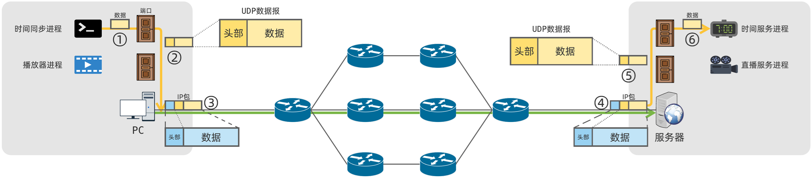
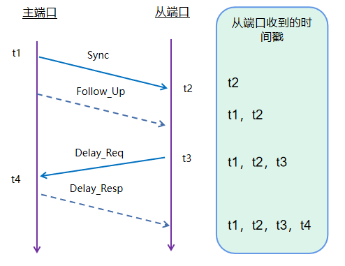
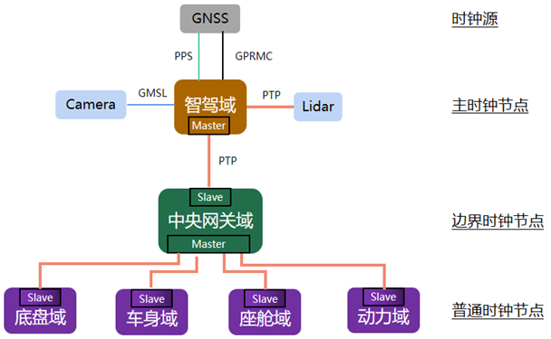
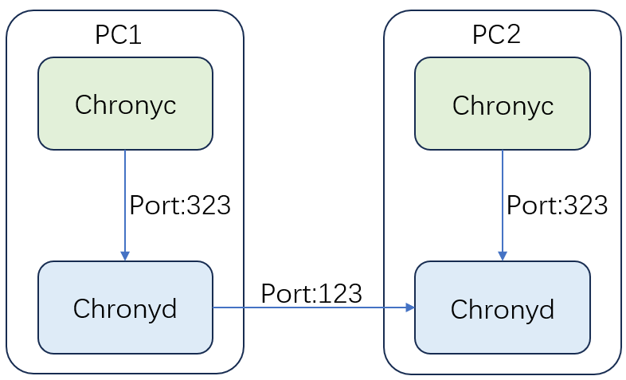

[memo](memo.md)  
[AR01A](AR01A.md)  
[AR01A-ethernet](AR01A-ethernet.md)  
<div align="center">
  
</div>

<div align="center">
  
</div>

<div align="center">
  
</div>

If PPS connect to PTP slave side, may need PPS signal for trigger master and slave exchange(BMC supported)
# ptp4l
## 基础参数
|参数	|作用	|示例|
| ---- | ---- | ---- |
|-i [interface]	|指定网络接口(必需)|	-i eth0|
|-m	|终端输出日志(实时查看状态)	|-m|
|-f [config]	|加载配置文件(替代命令行参数)	|-f /etc/ptp4l.conf|
|-l [level]	|日志级别(0-6，默认6=DEBUG)	|-l 5 (NOTICE级别)|
|-q	|静默模式(不输出日志，配合守护进程使用)	|-q|

## 工作模式控制
|参数	|说明	|场景|
| ---- | ---- | ---- |
|-2	|强制 L2 以太网帧封装(跳过 UDP/IP)<br>- UDP:MAC > IP > UDP > PTP<br>- L2:	MAC > PTP(无 IP/UDP)|工业网络/5G 基站|
|-H	|启用硬件时间戳(需网卡支持)	|纳秒级同步|
|--delay_mechanism=[P2P\|E2E]	|指定延迟测量机制<br>- P2P:逐跳测量(需交换机支持 TC)<br>- E2E:端到端测量	|--delay_mechanism=P2P|
|-A [auto	onestep	twostep]|时间戳模式<br>- auto:自动选择<br>- onestep:单步(硬件必需)<br>- twostep:双步	|-A onestep|
|--boundary_clock	|运行为边界时钟(默认是普通时钟)	|网络中间节点|

## 时间精度优化
|参数	|调优建议	|默认值|
| ---- | ---- | ---- |
|--logMinPdelayReqInterval	|P2P 延迟请求间隔(对数，实际=2^n秒)<br>值越小请求越频繁	|0 (1秒)|
|--logSyncInterval	|Sync 报文间隔(对数)<br>-1=0.5秒，-4=0.0625秒	|0 (1秒)|
|--logAnnounceInterval	|Announce 报文间隔(对数)<br>影响主时钟选举速度	|1 (2秒)|
|--syncReceiptTimeout	|等待 Sync 报文的超时次数(超过触发状态机重置)	|5|
|--neighborPropDelayThresh	|路径延迟突变阈值(纳秒)，超过触发重新测量	|200000000 (0.2秒)|

## 主时钟优先级控制
|参数	|作用	|范围	|调优规则|
| ---- | ---- | ---- | ---- |
|--priority1	|主时钟优先级1(值越小越优先)	|0-255	|主时钟设为128，备份设200|
|--priority2	|优先级2(同优先级1时比较)	|0-255	|根据设备精度设置|
|--domainNumber	|PTP 域编号(隔离不同同步域)	|0-127	|默认0，多域网络需区分|

## 高精度主时钟
```c
sudo ptp4l -m -H -i eth0 --logSyncInterval=-3
sudo ptp4l -i eth0 -2 -H -m --priority1 127 --logSyncInterval=-3 --delay_mechanism=P2P
```
# KSZ Master RasPi Slave
## KSZ
```c
# ptp4l -i eth0 -m -H
ptp4l[521.471]: selected /dev/ptp0 as PTP clock
ptp4l[521.487]: port 1: INITIALIZING to LISTENING on INIT_COMPLETE
ptp4l[521.490]: port 0: INITIALIZING to LISTENING on INIT_COMPLETE
ptp4l[521.497]:   version=2 ports=6
ptp4l[521.497]:   access_delay=158000
ptp4l[521.498]:   UTC offset: 37
ptp4l[521.499]: port 1: link up
ptp4l[529.399]: port 1: LISTENING to MASTER on ANNOUNCE_RECEIPT_TIMEOUT_EXPIRES
ptp4l[529.400]: selected best master clock 0001a1.fffe.947704
ptp4l[529.400]: 1: assuming the grand master role
```
## Raspberry Pi

```c
eric@eric-pi:~$ sudo ptp4l -i eth0 -m -H -s
ptp4l[1359.556]: selected /dev/ptp0 as PTP clock
ptp4l[1359.557]: port 1 (eth0): INITIALIZING to LISTENING on INIT_COMPLETE
ptp4l[1359.557]: port 0 (/var/run/ptp4l): INITIALIZING to LISTENING on INIT_COMPLETE
ptp4l[1359.557]: port 0 (/var/run/ptp4lro): INITIALIZING to LISTENING on INIT_COMPLETE
ptp4l[1360.154]: port 1 (eth0): new foreign master 0001a1.fffe.947704-1
ptp4l[1364.178]: selected best master clock 0001a1.fffe.947704
ptp4l[1364.178]: port 1 (eth0): LISTENING to UNCALIBRATED on RS_SLAVE
ptp4l[1365.389]: master offset 224452946619411544 s0 freq      -0 path delay     17816
ptp4l[1366.400]: master offset 224452946619347052 s1 freq  -63793 path delay     20668
ptp4l[1367.401]: master offset       1025 s2 freq  -62768 path delay     20668
ptp4l[1367.401]: port 1 (eth0): UNCALIBRATED to SLAVE on MASTER_CLOCK_SELECTED
ptp4l[1368.412]: master offset       5707 s2 freq  -57779 path delay     17816
ptp4l[1369.423]: master offset       2483 s2 freq  -59290 path delay     17816
ptp4l[1370.434]: master offset      17973 s2 freq  -43056 path delay       628
ptp4l[1371.363]: master offset       -132 s2 freq  -55769 path delay       636
ptp4l[1372.273]: master offset      -5581 s2 freq  -61257 path delay       823
ptp4l[1373.183]: master offset      -5294 s2 freq  -62645 path delay       823
ptp4l[1374.093]: master offset      -3396 s2 freq  -62335 path delay       628
ptp4l[1375.003]: master offset      -2036 s2 freq  -61994 path delay       628
ptp4l[1375.913]: master offset       -964 s2 freq  -61532 path delay       578
ptp4l[1376.814]: master offset       -135 s2 freq  -60993 path delay       317
ptp4l[1377.724]: master offset        -66 s2 freq  -60964 path delay       263
ptp4l[1378.634]: master offset        -98 s2 freq  -61016 path delay       263
ptp4l[1379.544]: master offset        -55 s2 freq  -61002 path delay       263
ptp4l[1380.454]: master offset        -54 s2 freq  -61018 path delay       263
ptp4l[1381.364]: master offset        -16 s2 freq  -60996 path delay       259
ptp4l[1382.273]: master offset          2 s2 freq  -60983 path delay       259
ptp4l[1383.183]: master offset         -1 s2 freq  -60985 path delay       263
```
# KSZ Slave RasPi Master
## Raspberry Pi
```c
eric@eric-pi:~$ sudo ptp4l -i eth0 -m -H
ptp4l[1407.113]: selected /dev/ptp0 as PTP clock
ptp4l[1407.113]: port 1 (eth0): INITIALIZING to LISTENING on INIT_COMPLETE
ptp4l[1407.113]: port 0 (/var/run/ptp4l): INITIALIZING to LISTENING on INIT_COMPLETE
ptp4l[1407.113]: port 0 (/var/run/ptp4lro): INITIALIZING to LISTENING on INIT_COMPLETE
ptp4l[1413.473]: port 1 (eth0): LISTENING to MASTER on ANNOUNCE_RECEIPT_TIMEOUT_EXPIRES
ptp4l[1413.473]: selected local clock 2ccf67.fffe.660cc0 as best master
ptp4l[1413.473]: port 1 (eth0): assuming the grand master role
```
## KSZ
```c
# ptp4l -i eth0 -m -H -s
ptp4l[625.445]: selected /dev/ptp0 as PTP clock
ptp4l[625.451]: port 1: INITIALIZING to LISTENING on INIT_COMPLETE
ptp4l[625.452]: port 0: INITIALIZING to LISTENING on INIT_COMPLETE
ptp4l[625.456]:   version=2 ports=6
ptp4l[625.457]:   access_delay=158000
ptp4l[625.458]:   UTC offset: 37
ptp4l[625.459]: port 1: link up
ptp4l[629.511]: port 1: new foreign master 2ccf67.fffe.660cc0-1
ptp4l[633.955]: selected best master clock 2ccf67.fffe.660cc0
ptp4l[633.956]: port 1: LISTENING to UNCALIBRATED on RS_SLAVE
ptp4l[636.177]: master offset        312 s0 freq  -29500 path delay         0
ptp4l[637.289]: master offset        333 s3 freq  -29481 path delay         0
ptp4l[638.399]: master offset         34 s1 freq  -29481 path delay       269
ptp4l[639.510]: master offset          1 s2 freq  -29481 path delay       269
ptp4l[639.511]: port 1: UNCALIBRATED to SLAVE on MASTER_CLOCK_SELECTED
ptp4l[640.621]: master offset        -15 s2 freq  -29489 path delay       269
ptp4l[641.732]: master offset        -29 s2 freq  -29498 path delay       269
ptp4l[642.844]: master offset        -14 s2 freq  -29492 path delay       269
ptp4l[643.955]: master offset        -12 s2 freq  -29492 path delay       269
ptp4l[645.066]: master offset        -15 s2 freq  -29495 path delay       268
ptp4l[646.177]: master offset         -5 s2 freq  -29491 path delay       268
ptp4l[647.288]: master offset          7 s2 freq  -29485 path delay       267
ptp4l[648.399]: master offset         -3 s2 freq  -29490 path delay       267
ptp4l[649.510]: master offset          7 s2 freq  -29485 path delay       266
ptp4l[650.622]: master offset         13 s2 freq  -29481 path delay       265
ptp4l[651.733]: master offset         -6 s2 freq  -29490 path delay       265
ptp4l[652.844]: master offset          5 s2 freq  -29485 path delay       264
```

# Sync to system
## phc2sys 
```c
phc2sys -s /dev/ptp0 -c CLOCK_REALTIME -w -m
phc2sys -s <PHC设备> -c CLOCK_REALTIME -w
```
- -s <PHC设备>:指定源时钟(例如/dev/ptp0)

- -c CLOCK_REALTIME:目标时钟为系统时钟

- -w:等待ptp4l服务启动后再运行

- -O <offset>:校准偏移量(可选)
## Check system clock
```c
date  # 查看系统时间
timedatectl  # 查看系统时间同步状态
```
## Time offset
### phc_ctl
在现有的架构中，ar01a是ptp时间同步的从端，要同步来自网络中的时间。  
通过date xxx的方式去改主端时间，再同步的问题。  
date改的是系统时间，并没有设定/同步到ptp 的硬件时钟上，需通过phc_ctl去调整。   
### phc2sys
同步的时间有30秒差，
主端
```c
[Unit]
Description=Synchronize system clock or PTP hardware clock (PHC)
Documentation=man:phc2sys
After=ntpdate.service
Requires=ptp4l.service
After=ptp4l.service
 
[Service]
Type=simple
#ExecStart=/usr/sbin/phc2sys -w -s eth0
ExecStart=/usr/sbin/phc2sys -c /dev/ptp0 -s CLOCK_REALTIME -O 0 -S 10 -w

[Install]
WantedBy=multi-user.target

```
从端
```c
ExecStart=/usr/sbin/phc2sys -s /dev/ptp0 -c CLOCK_REALTIME -O 0 -S 10 -w
```
检验时间
```c
timedatectl set-timezone Etc/UTC
timedatectl set-timezone Asia/Shanghai
timedatectl set-timezone America/Chicago
timedatectl set-time "2025-05-22 14:30:40"
date 052214302025.30

phc_ctl eth0 set
```
```c

sudo date && phc_ctl eth0 get
```

## Chrony
[Chrony](https://chrony-project.org/releases/chrony-4.6.1.tar.gz)是Linux时间同步工具，采用323/UDP端口通信。它通过网络时间协议(NTP)实现系统时钟与时间服务器的同步，确保时间保持精确。Chrony 由两个主要程序组成:chronyd 和 chronyc。
chronyd:这是一个后台运行的守护进程，负责与时间服务器通信，根据网络条件和系统时钟特性动态调整内核中的系统时钟，以最小化时间和频率误差。
chronyc:这是一个命令行工具，用于监控 Chrony 的性能、查看同步状态、调整配置参数以及手动执行某些操作，如立即同步或查看时间源的状态。
<div align="center">
  
</div>


## PMC
### Raspi
```c
eric@eric-pi:~$ sudo pmc -u -b 0 "GET CLOCK_DESCRIPTION"
sending: GET CLOCK_DESCRIPTION
        2ccf67.fffe.660cc0-1 seq 0 RESPONSE MANAGEMENT CLOCK_DESCRIPTION
                clockType             0x8000
                physicalLayerProtocol IEEE 802.3
                physicalAddress       2c:cf:67:66:0c:c0
                protocolAddress       1 10.5.17.228
                manufacturerId        00:00:00
                productDescription    ;;
                revisionData          ;;
                userDescription
                profileId             00:1b:19:00:02:00


eric@eric-pi:~$ sudo pmc -u -b 0 "GET PORT_DATA_SET"
sending: GET PORT_DATA_SET
        2ccf67.fffe.660cc0-1 seq 0 RESPONSE MANAGEMENT PORT_DATA_SET
                portIdentity            2ccf67.fffe.660cc0-1
                portState               MASTER
                logMinDelayReqInterval  0
                peerMeanPathDelay       4094
                logAnnounceInterval     1
                announceReceiptTimeout  3
                logSyncInterval         0
                delayMechanism          2
                logMinPdelayReqInterval 0
                versionNumber           2
```
### AR01A
```c
root@linaro-alip:/# pmc -u -b 0 "GET CLOCK_DESCRIPTION"
sending: GET CLOCK_DESCRIPTION
        86f717.fffe.f194b3-1 seq 0 RESPONSE MANAGEMENT CLOCK_DESCRIPTION
                clockType             0x8000
                physicalLayerProtocol IEEE 802.3
                physicalAddress       86:f7:17:f1:94:b3
                protocolAddress       1 192.168.1.5
                manufacturerId        00:00:00
                productDescription    ;;
                revisionData          ;;
                userDescription
                profileId             00:1b:19:00:02:00
```
```c
root@linaro-alip:/# pmc -u -b 0 "GET CURRENT_DATA_SET"
sending: GET CURRENT_DATA_SET
        86f717.fffe.f194b3-0 seq 0 RESPONSE MANAGEMENT CURRENT_DATA_SET
                stepsRemoved     1
                offsetFromMaster -61.0
                meanPathDelay    0.0
``` 
观察 stepsRemoved 值：  
- stepsRemoved 0：本地可能是主时钟或边界时钟（可能使用 L2）
- stepsRemoved 1：直接连接到主时钟（可能使用 L2）
- stepsRemoved >1：跨网络设备（可能使用 UDPv4）  

|传输类型	|特点	|典型 stepsRemoved|
| ---- | ---- | ---- |
|L2	|局域网直连，高精度	|0-1|
|UDPv4	|可跨路由，精度较低	|≥1|

```c
root@linaro-alip:/# pmc -u -b 0 "GET PORT_DATA_SET"
sending: GET PORT_DATA_SET
        86f717.fffe.f194b3-1 seq 0 RESPONSE MANAGEMENT PORT_DATA_SET
                portIdentity            86f717.fffe.f194b3-1
                portState               SLAVE
                logMinDelayReqInterval  0
                peerMeanPathDelay       4112
                logAnnounceInterval     1
                announceReceiptTimeout  3
                logSyncInterval         0
                delayMechanism          2
                logMinPdelayReqInterval 0
                versionNumber           2

```
## ptp4l service
```c
[Unit]
Description=Precision Time Protocol daemon
After=syslog.target network.target
Before=time-sync.target
Wants=time-sync.target
Wants=phc2sys.service

[Service]
ExecStart=/usr/sbin/ptp4l -f /etc/linuxptp.cfg
Restart=always

[Install]
WantedBy=multi-user.target

```
### linuxptp.cfg
```c
[global]
slaveOnly		1
delay_mechanism		Auto
network_transport	UDPv4
time_stamping		hardware
step_threshold		1.0

[eth0]
```
## log
### 抓UPD指定端口的PTP包
```c
tcpdump -i eth0 udp port 319 or udp port 320 -w all_ptp.pcap
```
```c
tcpdump -i eth0 udp port 319 or udp port 320 -w all_ptp.pcap
```
### 抓L2的PTP包
#### 捕获所有 L2 封装的 PTP 流量
```c
tcpdump -i eth0 ether proto 0x88f7 -w l2_ptp.pcap
```
#### 或更精确的版本(推荐)
```c
tcpdump -i eth0 "ether[12:2] == 0x88f7" -vv -w ptp_l2.pcap
```
```c
参数解析:
- ether proto 0x88f7:过滤 以太网类型 0x88f7(IEEE 1588 PTP 专用标识)
- ether[12:2] == 0x88f7:检查以太网帧第 12-13 字节(更精确)
- -vv:显示详细报文信息
- -w ptp_l2.pcap:保存到文件
```
### 混合模式抓包(L2&UDP)
```c
tcpdump -i eth0 "ether proto 0x88f7 or (udp and (port 319 or port 320))" -w all_ptp.pcap
```

# linuxptp
```c
//ptp4l[633.955]: selected best master clock 2ccf67.fffe.660cc0
//ptp4l: [59979.569] selected local clock 36c07f.fffe.be53f7 as best master
//clock.c:1853:		pr_notice("selected local clock %s as best master",
static void handle_state_decision_event(struct clock *c)
{
	struct foreign_clock *best = NULL, *fc;
	struct ClockIdentity best_id;
	struct port *piter;
	int fresh_best = 0;

	LIST_FOREACH(piter, &c->ports, list) {
		fc = port_compute_best(piter);
		if (!fc)
			continue;
		if (!best || c->dscmp(&fc->dataset, &best->dataset) > 0)
			best = fc;
	}

	if (best) {
		best_id = best->dataset.identity;
	} else {
		best_id = c->dds.clockIdentity;
	}

	if (cid_eq(&best_id, &c->dds.clockIdentity)) {
		pr_notice("selected local clock %s as best master",
			  cid2str(&best_id));
	} else {
		pr_notice("selected best master clock %s",
			  cid2str(&best_id));
	}
        //...
```        
```c
//phc2sys: [59981.227] Waiting for ptp4l...
//phc2sys.c:1179:		pr_notice("Waiting for ptp4l...");
//phc2sys.c:1640:				pr_notice("Waiting for ptp4l...");
```
```c
//ptp4l[633.956]: port 1: LISTENING to UNCALIBRATED on RS_SLAVE
//port.c:352:		pr_notice("port %hu: new foreign master %s", portnum(p),
void port_show_transition(struct port *p, enum port_state next,
			  enum fsm_event event)
{
	if (event == EV_FAULT_DETECTED) {
		pr_notice("port %hu: %s to %s on %s (%s)", portnum(p),
			  ps_str[p->state], ps_str[next], ev_str[event],
			  ft_str(last_fault_type(p)));
	} else {
		pr_notice("port %hu: %s to %s on %s", portnum(p),
			  ps_str[p->state], ps_str[next], ev_str[event]);
	}
}
```