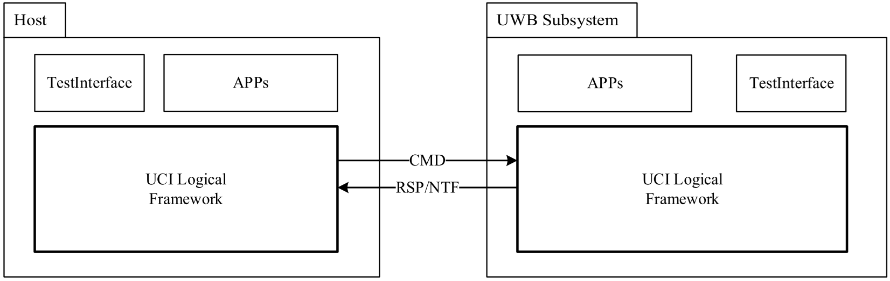
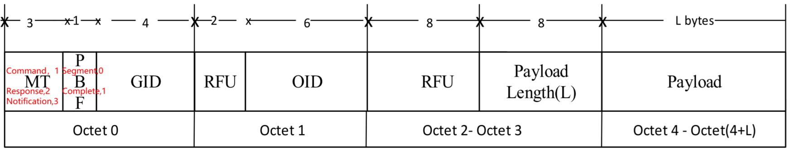
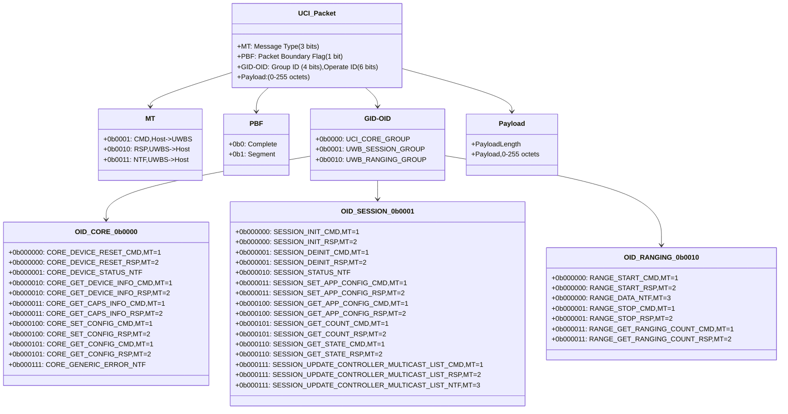

[memo.md](memo.md)   
[AW04A](AW04A.md)    

# UCI Architecture 
<div align="left">
  
</div>

# Format of Control Packets

<div align="left">
  
</div>



# CORE_DEVICE_STATUS_NTF
```c
Raw packet: 60 01 00 01 01 
GID: UCI_CORE_GROUP (0x0)
OID: CORE_DEVICE_STATUS_NTF (0x1)
STATUS: DEVICE_STATE_READY
```
# CORE_GET_DEVICE_INFO_CMD
```c
Tx:Raw packet: 20 02 00 01 00 
GID: UCI_CORE_GROUP (0x0)
OID: CORE_GET_DEVICE_INFO_CMD (0x2)
RESERVED: 0x00
```
# CORE_GET_DEVICE_INFO_RSP
```c
aw packet: 40 02 00 14 00 01 10 01 30 01 30 01 10 0A 44 E2 F1 1B 01 20 08 08 05 16 
GID: UCI_CORE_GROUP (0x0)
OID: CORE_GET_DEVICE_INFO_RSP (0x2)
STATUS: STATUS_OK
UCI_VERSION: 1.16
MAC_VERSION: 1.48
PHY_VERSION: 1.48
UCI_TEST_VERSION: 1.16
NRT_SDK_VERSION: 68.226
UCI_CCC_VERSION: 241.27
```
# CORE_SET_CONFIG_CMD
```c
Tx:Raw packet: 20 04 00 0A 03 E9 01 03 E6 01 31 01 01 00 
GID: UCI_CORE_GROUP (0x0)
OID: CORE_SET_CONFIG_CMD (0x4)
NUM_PARAMS: 3
[Param 1]
Unknown/Vendor parameter (0xE9), Value: 03 
[Param 2]
Unknown/Vendor parameter (0xE6), Value: 31 
[Param 3]
Low power mode Enable!!!
```
# CORE_SET_CONFIG_RSP
```c
Raw packet: 40 04 00 01 00 
GID: UCI_CORE_GROUP (0x0)
OID: CORE_SET_CONFIG_RSP (0x4)
STATUS: STATUS_OK
```
# SESSION_INIT_CMD
```c
Tx:Raw packet: 21 00 00 05 10 32 54 76 00 
GID: UWB_SESSION_GROUP (0x1)
OID: SESSION_INIT_CMD (0x0)
SESSION_ID: 76543210
SESSION_TYPE: FIRA RANGING SESSION (0x00)
```
# SESSION_INIT_RSP
```c
Raw packet: 41 00 00 01 00 
GID: UWB_SESSION_GROUP (0x1)
OID: SESSION_INIT_RSP (0x0)
STATUS: STATUS_OK
```
# SESSION_STATUS_NTF
```c
Raw packet: 61 02 00 06 10 32 54 76 00 00 
GID: UWB_SESSION_GROUP (0x1)
OID: SESSION_STATUS_NTF (0x2)
SESSION_ID: 76543210
SESSION_STATE: SESSION_STATE_INIT
REASON_CODE: SESSION_MANAGEMENT_COMMANDS
```
# SESSION_SET_APP_CONFIG_CMD
```c
Tx:Raw packet: 21 03 00 2F 10 32 54 76 0C 00 01 01 11 01 01 1B 01 06 0D 01 01 09 04 C8 00 00 00 
01 01 02 03 01 00 08 02 60 09 06 02 A0 BB 05 01 01 07 02 A1 BB 0D 01 01 
GID: UWB_SESSION_GROUP (0x1)
OID: SESSION_SET_APP_CONFIG_CMD (0x3)
SESSION_ID: 76543210
NUM_PARAMS: 12
[Param 1]
Controller
[Param 2]
Initiator
[Param 3]
Unknown parameter (0x1B), Value: 06 
[Param 4]
AoA Enabled (default)
[Param 5]
Ranging Interval: 200 ms
[Param 6]
DS-TWR with Deferred Mode (default)
[Param 7]
Unicast
[Param 8]
Slot Duration: 2400 RSTU
[Param 9]
Device MAC: A0BB (Short)
[Param 10]
Number of Controlees: 1
[Param 11]
Destination MAC: A1BB
[Param 12]
AoA Enabled (default)
```
# SESSION_SET_APP_CONFIG_RSP
```c
Raw packet: 41 03 00 02 00 00 
GID: UWB_SESSION_GROUP (0x1)
OID: SESSION_SET_APP_CONFIG_RSP (0x3)
STATUS: STATUS_OK
NUM_FAILED_PARAMS: 0
```
# SESSION_STATUS_NTF
```c
Raw packet: 61 02 00 06 10 32 54 76 03 00 
GID: UWB_SESSION_GROUP (0x1)
OID: SESSION_STATUS_NTF (0x2)
SESSION_ID: 76543210
SESSION_STATE: SESSION_STATE_IDLE
REASON_CODE: SESSION_MANAGEMENT_COMMANDS
```
# RANGE_START_CMD
```c
Tx:Raw packet: 22 00 00 04 10 32 54 76 
GID: UWB_RANGING_GROUP (0x2)
OID: RANGE_START_CMD (0x0)
SESSION_ID: 76543210
```
# RANGE_START_RSP
```c
Raw packet: 42 00 00 01 00 
GID: UWB_RANGING_GROUP (0x2)
OID: RANGE_START_RSP (0x0)
STATUS: STATUS_OK
```
# CORE_DEVICE_STATUS_NTF
```c
Raw packet: 60 01 00 01 02 
GID: UCI_CORE_GROUP (0x0)
OID: CORE_DEVICE_STATUS_NTF (0x1)
STATUS: DEVICE_STATE_ACTIVE
```
# RANGE_DATA_NTF
```c
Raw packet: 62 00 00 47 00 00 00 00 10 32 54 76 00 C8 00 00 00 01 00 00 00 00 00 00 00 00 00 00 
01 A1 BB 21 00 FF FF 00 00 00 00 00 00 00 00 00 00 00 00 02 00 00 00 00 00 00 00 00 00 00 00 00 00 00 00 00 00 00 00 00 00 00 00 00 00 00 00 
GID: UWB_RANGING_GROUP (0x2)
OID: RANGE_DATA_NTF  (0x0)
SEQUENCE_NUMBER: 0
SESSION_ID: 76543210
RANGE_INTERVAL: 200 ms
RANGE_TYPE: TWR
MAC_ADDRESS_MODE: 0
NUM_PACKAGES_NTF: 1
RANGE_RESULTS:
    [Result 1]
      MAC_ADDRESS: 0xBBA1
      STATUS: 33
      NLOS: 0
      DISTANCE: 65535 cm
      AOA_AZIMUTH: 0
      AOA_AZIMUTH_FOM: 0
      AOA_ELEVATION: 0
      AOA_ELEVATION_FOM: 0
      AOA_DESTINATION_AZIMUTH: 0
      AOA_DESTINATION_AZIMUTH_FOM: 0
      AOA_DESTINATION_ELEVATION: 0
      AOA_DESTINATION_ELEVATION_FOM: 0
      SLOT_INDEX: 2

```