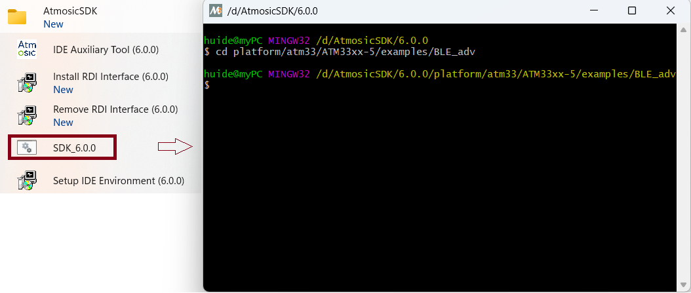
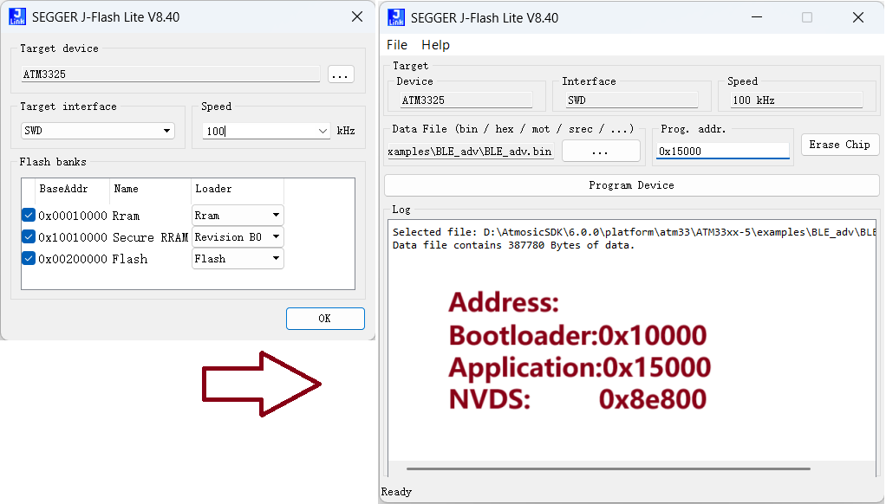
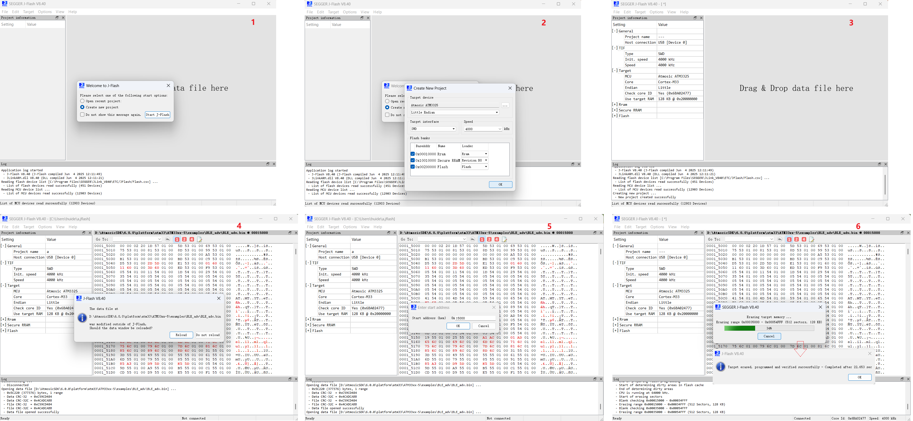
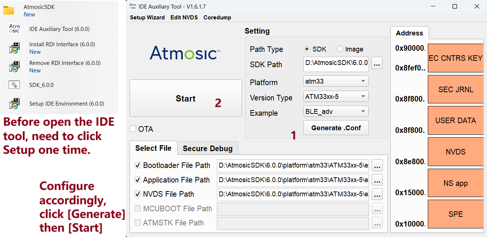
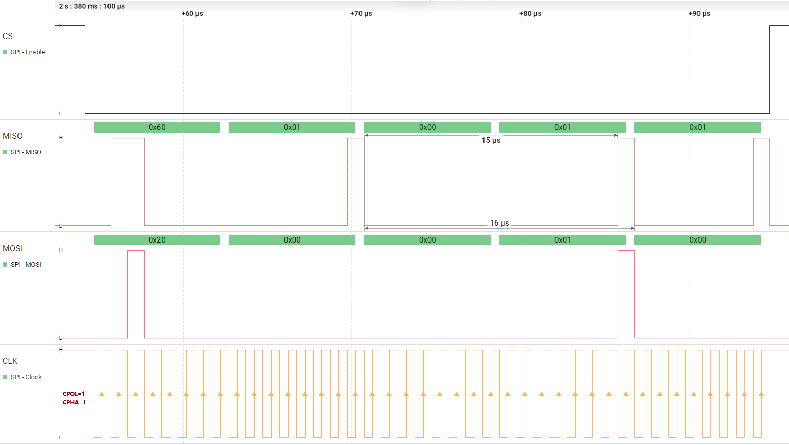
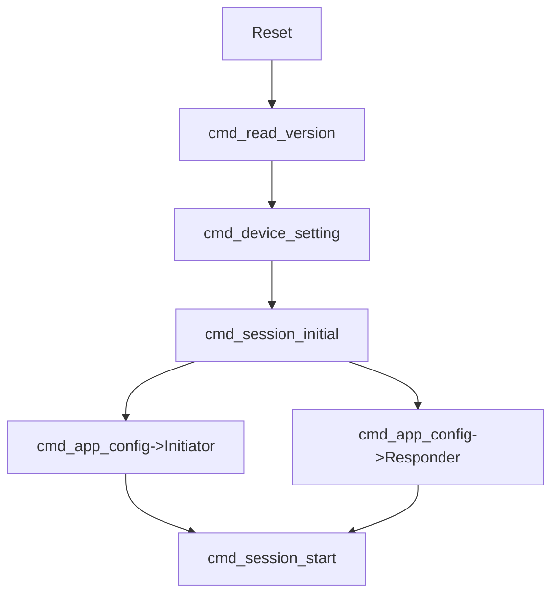
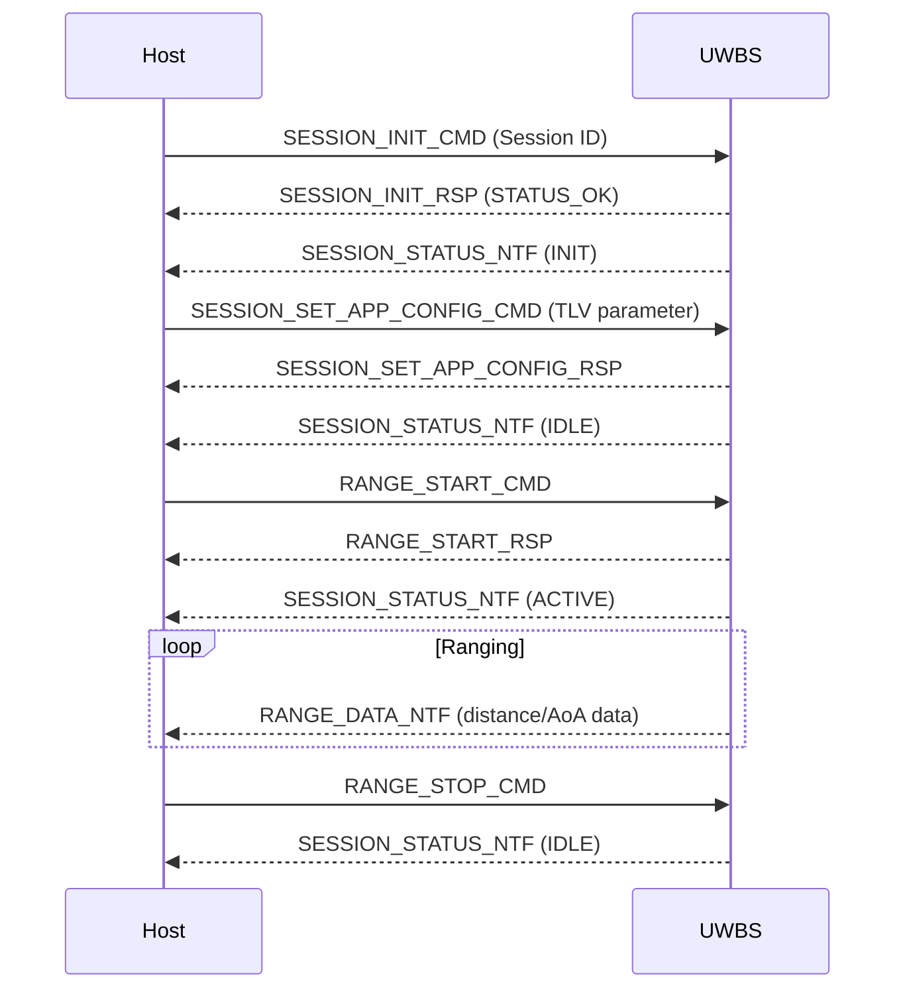
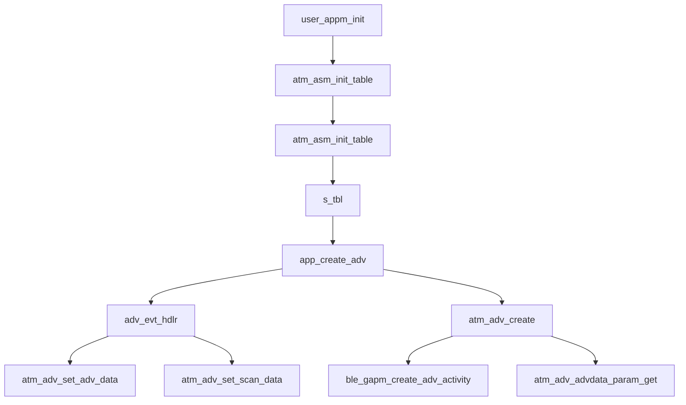

[memo.md](memo.md) 

# Code
By install the SDK,then we get the example code.
```c
//AtmosicSDK/6.0.0/platform/atm33/ATM33xx-5/examples
cd AtmosicSDK/6.0.0/platform/atm33/
git clone -b atm3325 ssh://SZ000xxx@10.5.103.101:29418/IOT/aw04a/atm

git push origin HEAD:refs/for/atm3325
```
# Build
Click SDK_6.0.0 for open the MINGW terminal then navigate to the expected project, such as BLE_adv.
<div align="left">
  
</div>

```c
//for bootloader and application 1
make clean;make BOARD=ATMEVK_3325_QK all

//for bootloader and application 2
make clean BOARD=ATMEVK_3325_QK CFG_SOC_DEMO=1 run all

//for nvds
make build_flash_nvds
```
# FW download
## Approach 1
J-Flash lite
| Jlink  | AW04A |
| ----  |  ---- |
|Pin1(VTref)|B_Boot	|
|Pin2(1.8-5v)|VBAT	|
|Pin7(SWDIO)|DATA	|
|Pin9(SWCLK)|CLK	|
|Pin20(GND)|GND  |
<div align="left">
  
</div>
J-Flash, a faster way for program, press [F7] for program.
<div align="left">
  
</div>

## Approach 2
IDE Auxiliary Tool
| Jlink  | AW04A |
| ----  |  ---- |
|Pin5(TD/TX)|B_Boot	|
|Pin2(1.8-5v)|VBAT	|
|Pin7(TMS)|DATA	|
|Pin9(TCK)|CLK	|
|Pin20(GND)|GND  |

<div align="left">
  
</div>

# UART Debug log
## pinmap
[Pinmux](https://atmosic.com/public/Pinmux/index.html)  
<div align="center">
  
</div>


```c
//AtmosicSDK/6.0.0/platform/atm33/ATM33xx-5/driver/pinmux/pinmap_ATMEVK_3325_QK.h
#ifndef PIN_UART0_TX
#define PIN_UART0_TX 3
#endif

#ifndef PIN_UART0_RX
#define PIN_UART0_RX 4
#endif
```
```c
//AtmosicSDK/6.0.0/platform/atm33/ATM33xx-5/user/retarget_uart.c
    #if 0
    // Configure pinmux
    #define PIN_SELECT_SECURE(pin, sig) \
    PIN_SEL(pin, MODIFY)(CMSDK_WRPR0_SECURE->PIN2REG(pin), PIN_SIG(pin, sig))

    PIN_SELECT_SECURE(PIN_UART0_TX, UART0_TX);
    #else
    uint32_t psg = CMSDK_WRPR0_SECURE->PSEL_A;
    WRPRPINS_PSEL_A__P3_SEL__MODIFY(psg, PINMUX_UART0_TX);
    WRPRPINS_PSEL_B__P4_SEL__MODIFY(psg, PINMUX_UART0_RX);
    CMSDK_WRPR0_SECURE->PSEL_A = psg;
    #endif
```
```c
//AtmosicSDK/6.0.0/platform/atm33/ATM33xx-5/include/arch.h
#define CFG_DBG 1
#define PLF_UART 0 //1
#define PLF_UART2 1 //0
```
```c
//AtmosicSDK/6.0.0/platform/atm33/ATM33xx-5/include/arm/retarget_uart.h
#define UART0_DBG
```
# UWB

### UWB Pins
|  Name  |  Pin  | 
|  ----  | ----- |  
| VSYS_EN|  P5   |
| V1V2_EN|  P6   |
| INT    |  P15  | 
| WAKEUP |  P21  |
| RESET  |  P22  |
## UWB FW programming
Boot0 on then VSYS_EN, V1V2_EN on,then the FW can download,Refer to below picture.
<div align="left">
  
</div>

## SPI

### SPI0 Pins
|  Name  |  Pin  | 
|  ----  | ----- |  
| CS     |  P20  |
| MISO   |  P19  |
| MOSI   |  P18  | 
| CLK    |  P17  |

```c
//AtmosicSDK/6.0.0/platform/atm33/ATM33xx-5/driver/pinmux/pinmap_ATMEVK_3325_QK.h
#ifndef PIN_SPI0_CLK
#define PIN_SPI0_CLK 17
#endif

#ifndef PIN_SPI0_CS
#define PIN_SPI0_CS 20
#endif

#ifndef PIN_SPI0_MISO
#define PIN_SPI0_MISO 19
#endif

#ifndef PIN_SPI0_MOSI
#define PIN_SPI0_MOSI 18
#endif

```
For SPI communication, it transits with 1 byte opcode. The opcode byte can not be removed. It would be the first byte data in MOSI, and the first byte data in MISO would be updated to the OPCODE_STATUS register.
```c
static uint8_t get_spi_opcode(const spi_dev_t *spi) {
    //0x4014700C,for spi0; 0x4014d00C,for spi1, only confirmed on spi0.
    //SPI_TRANSACTION_STATUS__OPCODE_STATUS__READ(spi->base->TRANSACTION_STATUS),This line also work.
    volatile uint32_t* spi_status_reg = (volatile uint32_t*)((uint8_t*)spi->base + SPI_OPCODE_STATUS_OFFSET);
    DEBUG_TRACE("spi_status_reg:%p\n", spi_status_reg);    
    while (!SPI_TRANSACTION_STATUS__DONE__READ(*spi_status_reg)) {
        __asm__ volatile ("nop");
    }
    return SPI_TRANSACTION_STATUS__OPCODE_STATUS__READ(*spi_status_reg);
}
```

## Power and reset
After set VSYS_EN on,it MUST add some delay before set V1V2_EN high.
```c
    atm_gpio_setup(PIN_UWB_VSYS);
    atm_gpio_setup(PIN_UWB_V1V2);
    atm_gpio_setup(PIN_UWB_RESET);

    atm_gpio_set_output(PIN_UWB_VSYS);
    atm_gpio_set_output(PIN_UWB_V1V2);
    atm_gpio_set_output(PIN_UWB_RESET);

    atm_gpio_write(PIN_UWB_RESET, 0);
    atm_gpio_write(PIN_UWB_VSYS, 1);
    atm_timer_lpc_delay(50);          //50=1.5ms,100=3ms,500=15ms,1000=30ms
    atm_gpio_write(PIN_UWB_V1V2, 1);  //MUST add delya between VSYS and V1V2
    atm_gpio_write(PIN_UWB_RESET, 1);
```

<div align="left">
  
</div>

## Init Sequence


## Range


## UCI
[AW04A-UCI](AW04A-UCI.md)  

# BLE
## device name
```c
//AtmosicSDK/6.0.0/platform/atm33/ATM33xx-5/examples/BLE_adv
user_appm_init()
  atm_asm_init_table()
    ble_adv_start_adv()
      adv_state_change()
        ble_adv_create_cfm()
          atm_adv_set_adv_data()
          atm_adv_set_scan_data()
      atm_adv_create()
        ble_gapm_create_adv_activity()
        atm_adv_advdata_param_get()
```
```c
//AtmosicSDK/6.0.0/platform/atm33/ATM33xx-5/examples/BLE_adv/tag_data/0c-APP_BLE_SCAN_RESP_DATA/simple_beacon.tds
//Need to build and flash nvds,make build_flash_nvds.
0F			# Length of Complete Local Name
09			# Complete Local Name
41 74 6D 6F 73 69 63 20 42 65 61 63 6F 6E # 'Atmosic Beacon'
   |
   V 
0A			# Length of Complete Local Name
09			# Complete Local Name
41 57 30 34 41 20 54 61 67 # 'AW04A Tag'
```
```c
//AtmosicSDK/6.0.0/platform/atm33/ATM33xx-5/examples/BLE_att_server
user_appm_init()
  atm_asm_init_table()
    s_tbl()
      app_create_adv()
        adv_evt_hdlr()
          adv_create_cfm()
            atm_adv_set_adv_data()
            atm_adv_set_scan_data()
        atm_adv_create()
          ble_gapm_create_adv_activity()
          atm_adv_advdata_param_get()
```


## adv interval
```c
//AtmosicSDK/6.0.0/platform/atm33/ATM33xx-5/examples/BLE_adv
user_appm_init()
  atm_asm_init_table()
    s_tbl()
      ble_adv_init()
        atm_ble_set_advint()
        atm_gap_start()
```
```c
//AtmosicSDK/6.0.0/platform/atm33/ATM33xx-5/lib/atm_adv_param_internal.h
BLE_GAP_ADV_MIN_INTERVAL

//AtmosicSDK/6.0.0/platform/atm33/ATM33xx-5/examples/BLE_adv/tag_data/06-APP_BLE_ACT_CRT_CMD/legacy_nc_s_100ms.tds
# adv_param.prim_cfg.
a0 00 00 00	#   adv_intv_min = 100ms
a0 00 00 00	#   adv_intv_max = 100ms
   |
   V 
# adv_param.prim_cfg.
40 01 00 00	#   adv_intv_min = 200ms
40 01 00 00	#   adv_intv_max = 200ms
```
## tx power
```c
//AtmosicSDK/6.0.0/platform/atm33/ATM33xx-5/lib/atm_adv_param_internal.h

#ifndef CFG_ADV0_CREATE_MAX_TX_POWER
#define CFG_ADV0_CREATE_MAX_TX_POWER DEFAULT_CREATE_MAX_TX_POWER
#endif

#define DEFAULT_CREATE_MAX_TX_POWER 0
   |
   V 
#define DEFAULT_CREATE_MAX_TX_POWER 10
```

```c
//AtmosicSDK/6.0.0/platform/atm33/ATM33xx-5/examples/BLE_adv
user_appm_init()
  atm_asm_init_table()
    s_tbl()
      ble_adv_init()
        gap_callbacks()
          adv_init_cfm()
            atm_ble_set_txpwr_max()
              CFG_ADV0_CREATE_MAX_TX_POWER
```

## Connection
```c
//AtmosicSDK/6.0.0/platform/atm33/ATM33xx-5/examples/BLE_adv/makefile
include reference_beacons.mk
```
```c
//AtmosicSDK/6.0.0/platform/atm33/ATM33xx-5/examples/BLE_adv/reference_beacons.mk
//Need to build and flash nvds,make build_flash_nvds.
reference_beacon_simple_beacon := \
	$(supply_bd_addr) \
	06-APP_BLE_ACT_CRT_CMD/legacy_nc_ns_100ms \
	0b-APP_BLE_ADV_DATA/simple_beacon \
	0c-APP_BLE_SCAN_RESP_DATA/simple_beacon \
	11-SLEEP_ENABLE/ret_drop \
	12-EXT_WAKEUP_ENABLE/enable \
   |
   V 
  reference_beacon_simple_beacon := \
	$(supply_bd_addr) \
	06-APP_BLE_ACT_CRT_CMD/legacy_c_s_100ms \
	0b-APP_BLE_ADV_DATA/simple_beacon \
	0c-APP_BLE_SCAN_RESP_DATA/simple_beacon \
	11-SLEEP_ENABLE/ret_drop \
	12-EXT_WAKEUP_ENABLE/enable \
```