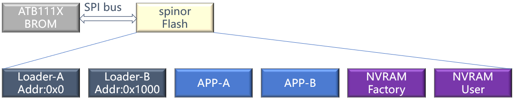
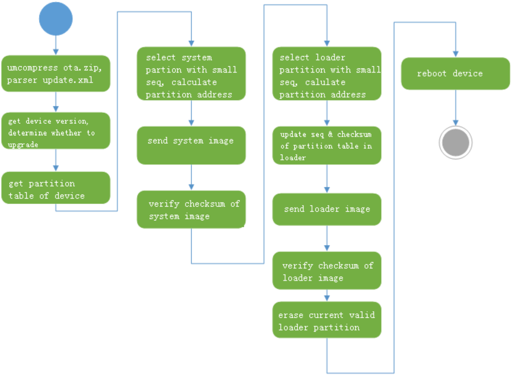
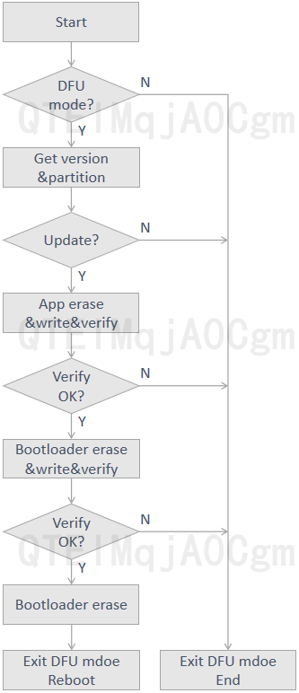

# 背景知识
## 分区
ATB1113 本身有16KB的BROM. 
<div align="center">
  
</div>

Loader-A/Loader-B:   
- 引导分区，用于引导 App。   
- <font color="#dd00dd">固件量产时只会烧写 Loader-A 分区。</font> OTA 升级时会切换 A/B 分区。      

App-A/App-B:  
-  存储应用的分区。  
-  <font color="#dd00dd">固件量产时只会烧写 App-A 分区。</font> OTA 升级时会切换 A/B 分区。

NVRAM-Factory： 
-  该分区存储出厂设置。 
-  建议：不直接修改出厂配置，而是在 User 分区创建同名配置项覆盖。 

NVRAM-User： 
-  该分区存储运行时动态修改的配置项。 
-  建议：优先通过宏定义的方式实现配置项，尽量减少 NVRAM-User 的使用。  

BROM 支持从 <font color="#dd00dd">0x0 和 0x1000</font>两个地址引导 spinor 上的 App。  
如果应用程序本身比较复杂（例如：需要支持 ota 功能），App 实现时可以成 Loader 和 App 两个程序，Loader 负责引导 App。
此时整个启动流程可以分为 2 个阶段：
-  BROM 引导 Loader
-  Loader 引导 App

## 分区表信息
默认 Loader(mbrec) 分区为 4KBytes。  
ota 包中的 mbrec.bin 是由 mbrec 工程生成的 mbrec.bin（<3KBytes）和分区表组合而成。分区表位于 3KBytes 偏移处。 

分区表的数据结构如下：
```c
#define PARTITION_TABLE_MAGIC		0x54504341	// 'ACPT'

struct partition_table {
	u32_t magic;
	u16_t version;
	u16_t table_size;
	u16_t part_cnt;
	u16_t part_entry_size;
	u8_t reserved1[4];

	struct partition_entry parts[MAX_PARTITION_COUNT];
	u8_t Reserved2[4];
	u32_t table_crc;
};
```
分区表数据结构说明：
1. magic: 0x54504341 // ‘ACPT’
2. version: 默认为 0x0000
3. table_size: 分区表的总大小 =16+360+4+4=384 Bytes
4. part_cnt: 实际的分区数
5. part_entry_size: 一个分区的数据结构大小
6. parts[MAX_PARTITION_COUNT]: 预留了 15 个分区的数据结构
7. table_crc：整个分区表的 crc 校验和。  

单个分区的结构
```c
#define MAX_PARTITION_COUNT	15

struct partition_entry {
	u8_t name[8];
	u16_t type;
	u16_t flag;
	u32_t offset;
	s16_t seq;
	u16_t reserve;
	u32_t entry_offs;
}__attribute__((packed));
```
分区数据结构说明：
1. name: 分区名。
2. type: 分区类型。
```c
enum {
  RESERVE_TYPE = 0,
  BOOT_TYPE = 1,
  SYSTEM_TYPE = 2,
  RECOVREY_TYPE = 3,
  DATA_TYPE = 4,
  DTM_TYPE = 5,
};
```   
3. off set: 分区在 Flash 上的偏移地址。
4. seq: 用于区分同类型分区。OTA 升级时会选择 seq 值较小的分区进行升级。

从mbrec.bin 地址偏移0xCC0可以读取到分区表信息。系统使能CRC功能，每32bytes数据后会添加一个CRC16校验值。
原本分区表size是 384bytes, 加上crc,变成 384*34/32=408bytes。

Raw data:
```c
41 43 50 54 00 00 80 01 06 00 18 00 00 00 00 00 66 77 30 5F 62 6F 6F 74 01 00 01 00 00 00 00 00 
F3 D9 00 00 00 00 00 00 00 00 66 77 31 5F 62 6F 6F 74 01 00 01 00 00 10 00 00 01 00 00 00 00 10 
00 00 A3 0E 66 77 30 5F 61 70 70 00 02 00 01 00 00 20 00 00 00 00 00 00 00 20 00 00 66 77 31 5F 
61 70 70 00 88 AB 02 00 01 00 00 80 03 00 01 00 00 00 00 80 03 00 6E 76 5F 66 61 63 74 6F 04 00 
00 00 00 40 07 00 14 6D 00 00 00 00 00 40 07 00 6E 76 5F 75 73 65 72 00 04 00 00 00 00 50 07 00 
00 00 00 00 00 50 07 00 E4 B3 00 00 00 00 00 00 00 00 00 00 00 00 00 00 00 00 00 00 00 00 00 00 
00 00 00 00 00 00 00 00 00 00 F1 4C 00 00 00 00 00 00 00 00 00 00 00 00 00 00 00 00 00 00 00 00 
00 00 00 00 00 00 00 00 00 00 00 00 F1 4C 00 00 00 00 00 00 00 00 00 00 00 00 00 00 00 00 00 00 
00 00 00 00 00 00 00 00 00 00 00 00 00 00 F1 4C 00 00 00 00 00 00 00 00 00 00 00 00 00 00 00 00 
00 00 00 00 00 00 00 00 00 00 00 00 00 00 00 00 F1 4C 00 00 00 00 00 00 00 00 00 00 00 00 00 00 
00 00 00 00 00 00 00 00 00 00 00 00 00 00 00 00 00 00 F1 4C 00 00 00 00 00 00 00 00 00 00 00 00 
00 00 00 00 00 00 00 00 00 00 00 00 00 00 00 00 00 00 00 00 F1 4C 00 00 00 00 00 00 00 00 00 00 
00 00 00 00 00 00 00 00 00 00 00 00 00 00 00 00 00 00 4A 66 5C B8 69 16
```
Raw data 解析：
```c
41 43 50 54 // magic: 0x54504341 // 'ACPT'
00 00 // version: default is 0x0000
80 01 // table_size, 0x0180, 16+360+4+4=384 Bytes
06 00 // part_cnt
18 00 // part_entry_size
00 00 00 00 // reserved1[4]
// struct partition_entry parts[MAX_PARTITION_COUNT]
66 77 30 5F 62 6F 6F 74 // name[8] fw0_boot
01 00 // type
01 00 // flag
00 00 00 00 // offset
F3 D9 // crc
00 00 // seq
00 00 // reserve
00 00 00 00 // entry_offs
66 77 31 5F 62 6F 6F 74 
01 00 // type
01 00 // flag
00 10 00 00 // offset
01 00 // seq
00 00 // reserve
00 10 00 00 // entry_offs
A3 0E // crc
66 77 30 5F 61 70 70 00 // fw0_app
02 00 // type
01 00 // flag
00 20 00 00 // offset
00 00 // seq
00 00 // reserve
00 20 00 00 // entry_offs
66 77 31 5F 61 70 70 00 
88 AB // crc
02 00 // type
01 00 // flag
00 80 03 00 // offset
01 00 // seq
00 00 // reserve
00 80 03 00 // entry_offs
6E 76 5F 66 61 63 74 6F //nv_facto
04 00 // type
00 00 // flag
00 40 07 00 // offset
14 6D //crc
00 00 // seq
00 00 // reserve
00 40 07 00 // entry_offs
6E 76 5F 75 73 65 72 00 
04 00 // type
00 00 // flag
00 50 07 00 // offset
00 00 // seq
00 00 // reserve
00 50 07 00 // entry_offs
E4 B3 //crc
00 00 00 00 00 00 00 00 00 00 00 00 00 00 00 00 00 00 00 00 00 00 00 00 00 00 00 00 00 00 00 00 
F1 4C //crc
00 00 00 00 00 00 00 00 00 00 00 00 00 00 00 00 00 00 00 00 00 00 00 00 00 00 00 00 00 00 00 00 
F1 4C //crc
00 00 00 00 00 00 00 00 00 00 00 00 00 00 00 00 00 00 00 00 00 00 00 00 00 00 00 00 00 00 00 00 
F1 4C //crc
00 00 00 00 00 00 00 00 00 00 00 00 00 00 00 00 00 00 00 00 00 00 00 00 00 00 00 00 00 00 00 00 
F1 4C //crc
00 00 00 00 00 00 00 00 00 00 00 00 00 00 00 00 00 00 00 00 00 00 00 00 00 00 00 00 00 00 00 00 
F1 4C //crc
00 00 00 00 00 00 00 00 00 00 00 00 00 00 00 00 00 00 00 00 00 00 00 00 00 00 00 00 00 00 00 00 
F1 4C //crc
00 00 00 00 00 00 00 00 00 00 00 00 00 00 00 00 00 00 00 00 00 00 00 00 
00 00 00 00 // Reserved2[4]
4A 66 5C B8 // table_crc
69 16 //crc
```
MCU运行时打印出来的分区信息:
```c
** Showing partition infomation **
id  name      offset    type  seq   entry_offs  flag
0   fw0_boot  0x0       1     0        0x0        1
1   fw1_boot  0x1000    1     0        0x1000     1
2   fw0_app   0x2000    2     0        0x2000     1
3   fw1_app   0x38000   2     0        0x38000    1
4   nv_facto  0x74000   4     0        0x74000    0
5   nv_user   0x75000   4     0        0x75000    0
```

## A/B 备份机制
A/B 备份机制指存在 2 个相同类型的分区。  
定义有2个 BOOT_TYPE分区和2个 SYSTEM_TYPE分区。  
初始版本的分区表中：A 份分区的 seq=0，B 份分区的 seq=-1。  
第一次进行 OTA 时，移动端读取到分区表后，会选择 seq 值较小的 B 分区进行升级，升级完成会修改 seq_B。seq_B=seq_A+1。  
## OTA 完成后启动流程
- BROM 引导 mbrec：
OTA 过程中会檫除当前运行的 BOOT_TYPE 分区，所以正常情况下BROM 也只能引导升级后新的 mbrec。如果 A/B 同时存在，BROM 会优先引导 A 份。
- mbrec 引导 app：
OTA 过程不会擦除当前运行的 SYSTEM_TYPE 分区，所以可能会有两份正确的 app 镜像同时存在的情况。mbrec 会尝试读取 2 份 app 镜像。如果 2 份镜像都通过检验，选择其中 <font color="#dd00dd">seq 值较大</font>的镜像加载运行。

# OTA 升级流程
为了简化小机端代码逻辑，将更多的如何选择分区，如何调整分区大小等复杂的逻辑留在在移动端。  
小机端：
- 提供小机的分区表信息及版本号。
- 实现分区读写和校验的功能。
- 实现重启的功能。  
  
移动端：
- 解析 ota 包获取版本号，获取小机端版本号，对比后判断是否需要升级。
- 解析 ota 包内的分区镜像文件，获取小机端的分区信息，选择正确的分区来进行升级。
- 选择备用的 app 分区升级 app 镜像。
- 选择备用 mbrec 分区升级 mbrec 镜像（包含更新分区信息），并擦除当前的 mbrec 分区。  

具体流程如下图所示
<div align="center">
  
</div>

# UART DFU
完全参照OTA升级流程。 
小机端定义一个flag来标记UART DFU模式/状态。移动端必须先发指令进行UART DFU 模式。  
相关的指令有：
```c
#define T_PRTL_A2D_DFU_REQ						                            PRTCL_CMD(0xFA,0xA0)     //												
#define T_PRTL_D2A_DFU_RSP						  	                        PRTCL_CMD(0xFB,0xA0)     //	  

#define T_PRTL_A2D_DFU_PARTITION_REQ						                PRTCL_CMD(0xFA,0xA1)     //												
#define T_PRTL_D2A_DFU_PARTITION_RSP						  	            PRTCL_CMD(0xFB,0xA1)     //	 

#define T_PRTL_A2D_DFU_DATA_WR_REQ						                    PRTCL_CMD(0xFA,0xA2)     //												
#define T_PRTL_D2A_DFU_DATA_WR_RSP						  	                PRTCL_CMD(0xFB,0xA2)     //	 

#define T_PRTL_A2D_DFU_VERIFY_REQ						                    PRTCL_CMD(0xFA,0xA3)     //												
#define T_PRTL_D2A_DFU_VERIFY_RSP						  	                PRTCL_CMD(0xFB,0xA3)     //	

#define T_PRTL_A2D_DFU_ERASE_REQ						                    PRTCL_CMD(0xFA,0xA4)     //												
#define T_PRTL_D2A_DFU_ERASE_RSP						  	                PRTCL_CMD(0xFB,0xA4)     //	 

#define T_PRTL_A2D_DFU_VERSION_REQ						                    PRTCL_CMD(0xFA,0xA5)     //												
#define T_PRTL_D2A_DFU_VERSION_RSP						  	                PRTCL_CMD(0xFB,0xA5)     //	

#define T_PRTL_A2D_DFU_RESET_REQ						                    PRTCL_CMD(0xFA,0xA6)     //												
#define T_PRTL_D2A_DFU_RESET_RSP						  	                PRTCL_CMD(0xFB,0xA6)     //	

#define T_PRTL_A2D_DFU_LOCK_REQ						                        PRTCL_CMD(0xFA,0xA7)     //												
#define T_PRTL_D2A_DFU_LOCK_RSP						  	                    PRTCL_CMD(0xFB,0xA7)     //	
```
```c
	{T_PRTL_A2D_DFU_REQ,                      			DfuRequest},
	{T_PRTL_A2D_DFU_PARTITION_REQ,                      DfuPartitionRequest},
	{T_PRTL_A2D_DFU_DATA_WR_REQ,                        DfuDataWriteRequest},
	{T_PRTL_A2D_DFU_VERIFY_REQ,                      	DfuVerifyRequest},
	{T_PRTL_A2D_DFU_ERASE_REQ,                      	DfuEraseRequest},
	{T_PRTL_A2D_DFU_VERSION_REQ,                      	DfuVersionRequest},
	{T_PRTL_A2D_DFU_RESET_REQ,                      	DfuResetRequest},
	{T_PRTL_A2D_DFU_LOCK_REQ,                      		DfuLockRequest},
```
## Sequence
具体流程如下图所示
<div align="center">
  
</div>
需要先发指令进入DFU 模式， 擦除&写&校验都会有状态返回，不成功可做三次重试，还是不成功要退出DFU 模式。
app与bootloader都校验成功后才可以擦除当前运行分区的bootloader。
### 0, Enter DFU mode 
移动端发送 Enter DFU mode 指令，小机端收到执行并回应ACK。本文移动端发送数据的CRC未经核验。  
任一步出现报错DFU需要终止重来，传bin data收到写成功状态后才可以传下一帧数据。
可根据需要看要不要发一个UART wake lock 指令。
```c
//A,TX
9E01FAA00D0001B7018F2DF7F4
```
### 1, Get version
移动端发送 Get version 指令，小机端收到返回版本信息,如<font color="#dd00dd">2.0.00.25021209</font>。

```c
//A,TX
9E01FAA50C0001E7FFFFFFFF
```
```c
//D,RX
9e01fba51c000009322e302e30302e323530323132303900a4ac9e6a
```
### 2, Get partition table

```c
//A,TX
9E01FAA10C0001E7FFFFFFFF
```
```c
//D,RX
9e01fba18d000093
414350540000800106001800000000006677305f626f6f740100010000000000
f3d900000000000000006677315f626f6f740100010000100000000000000010
00005e8f6677305f61707000020001000020000000000000002000006677315f
6170700088ab020001000080030000000000008003006e765f666163746f0400
00000040070036b700000000004007006e765f75736572000400000000500700
0000000000500700e4b300000000000000000000000000000000000000000000
00000000000000000000f14c0000000000000000000000000000000000000000
000000000000000000000000f14c000000000000000000000000000000000000
0000000000000000000000000000f14c00000000000000000000000000000000
00000000000000000000000000000000f14c0000000000000000000000000000
000000000000000000000000000000000000f14c000000000000000000000000
0000000000000000000000000000000000000000f14c00000000000000000000
0000000000000000000000000000000000004a665cb86916
3263b2f7
```
### 3, app update,
#### Erase
```c
//A,TX
9E01FAA4140001E700B80300263E0200FFFFFFFF
```
Erase succesful
```c
//D,RX
9e01fba40d0000d6 00 6f16f2e3
```
#### Write
```c
//A,TX
9E01FAA2900001E7
008B0300
00112233445566778899aabbccddeeff00112233445566778899aabbccddeeff
00112233445566778899aabbccddeeff00112233445566778899aabbccddeeff
00112233445566778899aabbccddeeff00112233445566778899aabbccddeeff
00112233445566778899aabbccddeeff00112233445566778899aabbccddeeff
2D5DAC49
```
收到状态0说明端接收成功，可以继续传下一帧数据。
```c
//D,RX
9e01fba20d0000a2 00 8049f87e
```
#### Verify
```c
//A,TX
9E01FAA3180001E7 00B80300 263E0200 7A4B84A3 2D5DAC49
```
收到状态0说明端接收成功，说明校验成功。
```c
9e01fba30d0000b4 00 f22f3ca9
```
### 4, bootloader(mbrec) update
#### Erase
```c
//A,TX
9E01FAA4140001E700B80300263E0200FFFFFFFF
```
Erase succesful
```c
//D,RX
9e01fba40d0000d6 00 6f16f2e3
```
#### Write
```c
//A,TX
9E01FAA2900001E7
008B0300
00112233445566778899aabbccddeeff00112233445566778899aabbccddeeff
00112233445566778899aabbccddeeff00112233445566778899aabbccddeeff
00112233445566778899aabbccddeeff00112233445566778899aabbccddeeff
00112233445566778899aabbccddeeff00112233445566778899aabbccddeeff
2D5DAC49
```
收到状态0说明端接收成功，可以继续传下一帧数据。
```c
//D,RX
9e01fba20d0000a2 00 8049f87e
```
#### Verify
```c
//A,TX
9E01FAA3180001E7 00B80300 263E0200 7A4B84A3 2D5DAC49
```
收到状态0说明端接收成功，说明校验成功。
```c
9e01fba30d0000b4 00 f22f3ca9
```
### 5, Erase currently bootloader
抹除运行分区的bootloader
```c
//A,TX
9E01FAA4140001E700B80300263E0200FFFFFFFF
```
Erase succesful
```c
//D,RX
9e01fba40d0000d6 00 6f16f2e3
```
### 6, Reboot
```c
//A,TX
9E01FAA60D0001B7018F2DF7F4
```