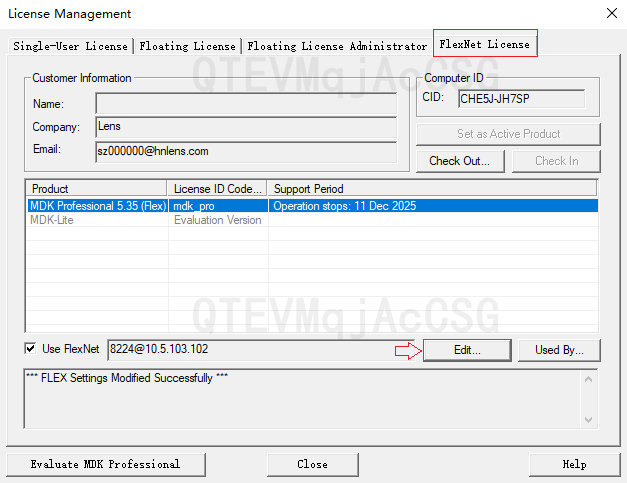
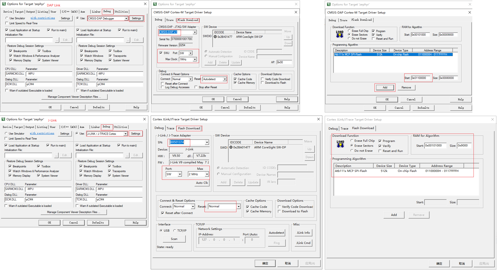

[memo.md](memo.md) 

# Keil
```c
企业空间/湘潭园区/软件部/IOT/S02G/遥控器资料/炬芯/MDK535.rar

FlexNet license:
8224@10.5.103.105
```
<div align="center">
  
</div>

```c
// Move
.\atd\tools\utils\keil_flash\ATB111x_MCP.FLM
// to
\Keil_v5\ARM\Flash\ATB111x_MCP.FLM
```

<div align="center">
  
</div>

## output file
```c
.\atd\samples\peripheral\outdir\tai_evb\_firmware\tai_evb_250107_atf.fw
```

# Pull&Push
```c
git clone "ssh://SZ000062@10.5.103.101:29418/s09e/actions/atd"
```
```c
git push origin HEAD:refs/for/master%r=SZ000008
```

# Code

```c
.\atd\samples\peripheral\src\main\main.c
.\atd\samples\peripheral\src\main\factory_test_uart.c
.\atd\samples\peripheral\src\include\autoconf_app.h
```
# Debug

```c
#define CONFIG_UART_2_SPEED     115200//1000000
```
```c
1000000bps,8,1,None,None
```

|  Band rate | Data bits | stop bits | Pairty | Flow control |
|    ----    |    ----   |    ----   |  ----  |     ----     |
|1000000bps|8|1|None|None|

[Actions-DFU](Actions-DFU.md)