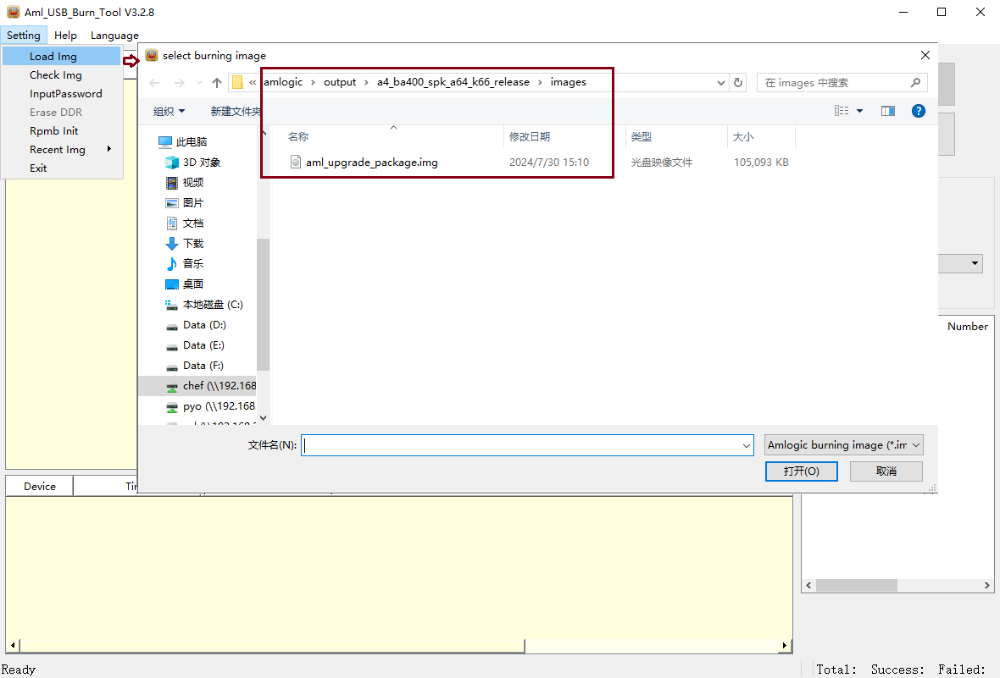
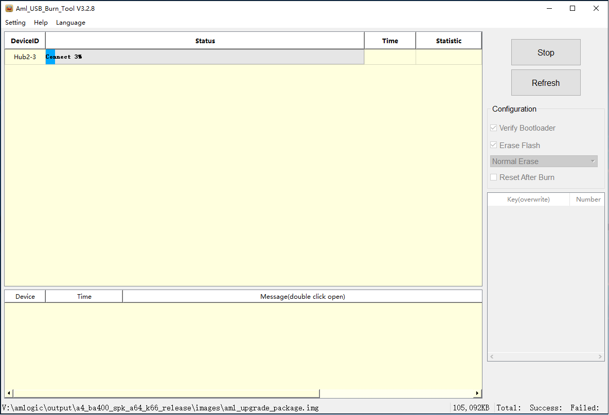
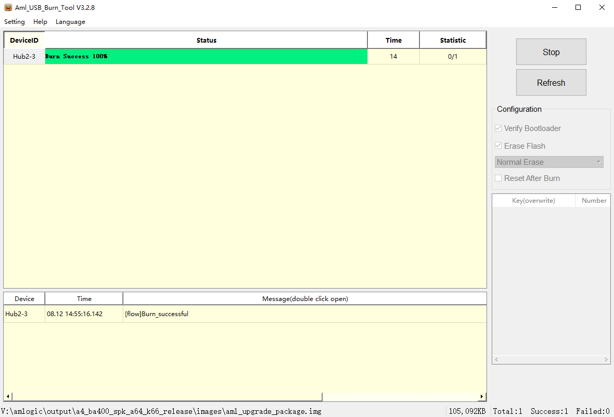
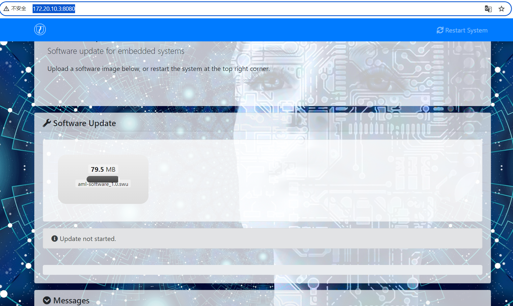
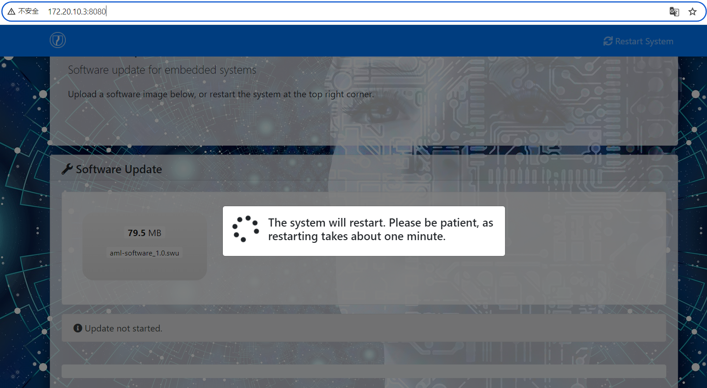

- [Start](#start)
  - [Documnets](#documnets)
- [Pull code from remote repo](#pull-code-from-remote-repo)
- [Configure compile environment](#configure-compile-environment)
- [Build](#build)
- [Flash into device](#flash-into-device)
- [OTA](#ota)
  - [WiFi](#wifi)
    - [SWupdate log](#swupdate-log)
  - [Local SW update](#local-sw-update)
- [Verify after Flash](#verify-after-flash)
- [DTS](#dts)
- [DDR](#ddr)
- [UART](#uart)
- [BT](#bt)
  - [BT app](#bt-app)
- [Matter](#matter)
  - [RCP](#rcp)
  - [Host app(chip-tool\&otbr)](#host-appchip-toolotbr)
- [Other](#other)


# Start

##  [Documnets](https://doc.amlogic.com)
Firstly, go throught these files.
```c
...\Software Documents\A Series\Linux\A113L2 BA400 Speaker DVK Quick Start (0.1)_CN.pdf
...\Software Documents\A Series\Linux\Buildroot User Guide (0.3)_CN.pdf
...\Software Documents\A Series\Linux\WiFi And BT Debug User Guide (0.2)_CN.pdf
...\A Series\A113L2\01-Design-in\Reference Design\A113L2_BA401_DEV_DDR4_V2_0_R0_5_20240511\SCH\A113L2_BA401_DEV_DDR4_V2_0_R0_5_20240509.pdf
```
# Pull code from remote repo
Pull from amlogic repo.
```c
cd ~
mkdir amlogic
cd amlogic
$ repo init -u ssh://git@openlinux.amlogic.com/buildroot/platform/manifest.git --repo-url=ssh://git@openlinux.amlogic.com/repo.git
$ repo init -m  buildroot-openlinux-2024r1-a113x2-a113l2.xml
$ repo sync
```
Maybe it needs absolute path. It should able to sovle by reconfig environment path. 
```c
python3 /usr/bin/repo init -u ssh://git@openlinux.amlogic.com/buildroot/platform/manifest.git --repo-url=ssh://git@openlinux.amlogic.com/repo.git
python3 /usr/binrepo init -m  buildroot-openlinux-2024r1-a113x2-a113l2.xml
python3 /usr/bin/repo sync

```
Pull from Lens repo.
```c
cd ${workspace}
mkdir -p dock && cd dock

repo init -u ssh://gerrit/lens/manifest -b S08G-A -m dock_s08g-a.xml --repo-url=ssh://gerrit/lens/git_repo --no-repo-verify -c

repo sync -j8 -c
```
Tips for commit local code to remote repo.
```c
//Find out the remote repo.
ls@ls-VirtualBox:/chef/dock/buildroot$ git branch -r
  m/S08G-A -> origin/a113l2/s08g-a/dock
  origin/a113l2/s08g-a/dock
//Then get the address to push, %r is for reviewer, this can edit on GUI after commit.  
git push origin HEAD:refs/for/a113l2/s08g-a/dock%r=SZ000008
git push lens HEAD:refs/for/a113l2/s08g-a/dock%r=SZ000008
```
Tips for zip and unzip.
```c
	create tar.gz file
		tar -czvf dock.tar.gz ./dock
	unzip tar.gz file
		tar -xzvf dock.tar.gz
```
# Configure compile environment
Copy compiler(gcc-linaro-7.3.1-2018.05-i686_aarch64-elf.tar.gz) to <font color="#dd00dd">Linux host /opt</font><br />
```c
sudo mv gcc-linaro-7.3.1-2018.05-i686_aarch64-elf.tar.gz /opt

cd /opt
sudo tar -xzvf gcc-linaro-7.3.1-2018.05-i686_aarch64-elf.tar.gz
```
```c
gedit ~/.bashrc
Add below line in the end of file.

export PATH=$PATH:/opt/gcc-linaro-7.3.1-2018.05-i686_aarch64-elf/bin
```
```c
echo 'export PATH=$PATH:/opt/gcc-linaro-7.3.1-2018.05-i686_aarch64-elf/bin' >> ~/.bashrc
```

Run,
```c
source ~/.bashrc
```
Check,
```c
aarch64-elf-gcc -v
```
There will be some more dependency packages or libs need to install(such as rst2man,json-c,ell,mdns...),  
if we change/add something(change kernel version,add matter,otbr,mesh support). 

# Build
Building the BA400 smart speaker for 64-bit App on (BA400+D613)
Below, dock is root directory of the SDK.
```c
cd dock 
```
Kernel 5.4
```c
source setenv.sh a4_ba400_spk_a64_release
```
Kernel 6.6
```c
source setenv.sh a4_ba400_spk_a64_k66_release
```
```c
make
source setenv.sh a4_ba400_spk_a64_release;make clean;make json-c-rebuild;make
source setenv.sh a4_ba400_spk_a64_release;make clean;make json-c-rebuild;make ell-rebuild;make mdnsresponder-rebuild;make
```
"make" command looks like only package the image.   
If want to compile some module, should use "make xxx-rebuild" command.  
To find out the specify module, can run "make show-targets", this command will list up all modules it support.

# Flash into device
Image location.
```c
output/a4_ba400_spk_a64_release/images/aml_upgrade_package.img
```

1st, install Aml_USB_Burn_Tool V3.  
2nd, enter DFU mode, power on the EVB, press and hold [USB boot], press [RST] then release [USB boot].
a4_ba400_spk_a64_k66_release, means it use kernel 6.6, a4_ba400_spk_a64_release means it use kernel 5.4.  
<div align="center">
  
</div>

<div align="center">
  
</div>

<div align="center">
  
</div>

```c
[MSG]Verify finish and successful!
[MSG]response[0][OKAY]
OEM cmd[save_setting]
Saving Environment to STORAGE... OK
[MSG]response[0][OKAY]
```
Check the information then reset the set, it will run the new imgae.

# OTA
##  WiFi
Configure the network,supported 2.4G WiFi only.
```c
wpa_cli -iwlan0 remove_network 0
wpa_cli -iwlan0 add_network 0
wpa_cli -iwlan0 set_network 0 ssid '"Eip8"' 
wpa_cli -iwlan0 set_network 0 key_mgmt WPA-PSK
wpa_cli -iwlan0 set_network 0 psk '"12345678"'
wpa_cli -iwlan0 set_network 0 pairwise CCMP
wpa_cli -iwlan0 set_network 0 group CCMP
wpa_cli -iwlan0 set_network 0 proto RSN
wpa_cli -iwlan0 enable_network 0
wpa_cli -iwlan0 status
wpa_cli -iwlan0 save
dhcpcd wlan0
```
Get the ip.
```c
/ # ifconfig
wlan0     Link encap:Ethernet  HWaddr 40:80:E1:31:1A:98
          inet addr:172.20.10.3  Bcast:172.20.10.15  Mask:255.255.255.240
          inet6 addr: fe80::3e3d:d791:f136:3c5b/64 Scope:Link
          inet6 addr: 2409:895a:3547:cc4c:b46f:8dd8:f4d1:d50d/64 Scope:Global
          UP BROADCAST RUNNING MULTICAST  MTU:1500  Metric:1
          RX packets:471 errors:0 dropped:0 overruns:0 frame:0
          TX packets:562 errors:16 dropped:0 overruns:0 carrier:0
          collisions:0 txqueuelen:1000
          RX bytes:47572 (46.4 KiB)  TX bytes:65998 (64.4 KiB)
```
Verify.
```c
ping www.baidu.com
```
OTA interface.
```c
http://172.20.10.3:8080
```
<div align="center">
  
</div>
Select and upgrade <font color="#dd00dd">aml-software_1.0.swu</font>.
<div align="center">
  
</div>


###  SWupdate log
```c
[10:53:03.362]收←◆network_initializer 522...
[TRACE] : SWUPDATE running :  [network_initializer] : Main loop Daemon
[TRACE] : SWUPDATE running :  [listener_create] : creating socket at /tmp/sockinstctrl
...
swupdate postinst
[TRACE] : SWUPDATE running :  [execute_shell_script] : Calling shell script /tmp/scripts/update.sh postinst : return with 0
[ubootenv] update_bootenv_variable name [recovery_status]: value [] 
[ubootenv] Save ubootenv to /dev/env succeed!
Software updated successfully
Please reboot the device to start the new software
[INFO ] : SWUPDATE successful ! 
emmc device!
single system!
swupdate software.swu from data success!
```
Check "swupdate software.swu from data success!" for confirm.

## Local SW update
You can put <font color="#dd00dd">software.swu</font> into U disk root dir or emmc /data/, then reboot run recovery.
Enter uboot mode then run recovery.
```c
# run recovery_from flash

```
# Verify after Flash
Check system information. Such as kernlel version,bluez veriosn, bluetooth device name.
```c
# uname -srm
Linux 6.6.18-ge1debbc7eee1 aarch64
# uname -srm
Linux 5.4.259-gf965c494a17e-dirty aarch64
```
```c
# hciconfig -a
hci0:   Type: Primary  Bus: UART
        BD Address: 40:80:E1:2B:5C:9E  ACL MTU: 1021:8  SCO MTU: 120:10
        UP RUNNING
        RX bytes:2943 acl:11 sco:0 events:175 errors:0
        TX bytes:3812 acl:11 sco:0 commands:160 errors:0
        Features: 0xff 0xff 0x85 0xfa 0xdb 0xfd 0x7b 0x87
        Packet type: DM1 DM3 DM5 DH1 DH3 DH5 HV1 HV2 HV3
        Link policy: RSWITCH HOLD SNIFF PARK
        Link mode: SLAVE ACCEPT
        Name: 'AmlSpeaker-b6f0'
        Class: 0x000000
        Service Classes: Unspecified
        Device Class: Miscellaneous,
        HCI Version: 5.0 (0x9)  Revision: 0x6106
        LMP Version: 5.0 (0x9)  Subversion: 0x6106
        Manufacturer: internal use (65535)
```

bluetoothctl can find in ./output/a4_ba400_spk_a64_release/target/usr/bin$ 
```c
/ # bluetoothctl -v
bluetoothctl: 5.49
```
```c
/ # cat /etc/bluetooth/main.conf
[General]
Name=AmlSpeaker-b6f0
DiscoverableTimeout = 0
PairableTimeout = 0
debug=0
Device=aml

[Policy]
ReconnectUUIDs=0000110a-0000-1000-8000-00805f9b34fb, 00001112-0000-1000-8000-00805f9b34fb
ReconnectAttempts=7
ReconnectIntervals=1,2,4,8,16,32,64
AutoEnable=true
```
```c
# cat /etc/bluetooth/main.conf | grep Name
Name=AmlSpeaker-b6f0
```
[Amlogic-log](Amlogic-log.md)

# DTS
After a source operation,relevant dts file and uboot configuration can be find in .config file.  
Locate at
```c
output/a4_ba400_spk_a64_release/.config
```
```c
./kernel/aml-5.4/arch/arm64/boot/dts/amlogic/a4_a113l2_ba400.dts

	model = "Amlogic";
	amlogic-dt-id = "a4_a113l2_ba400";
	compatible = "amlogic, a4";
	interrupt-parent = <&gic>;
	#address-cells = <2>;
	#size-cells = <2>;

	aliases {
		serial0 = &uart_B;
		serial1 = &uart_A;
		serial2 = &uart_D;
		serial3 = &uart_E;
		serial4 = &uart_AO;
		i2c0 = &i2c0;
		i2c1 = &i2c1;
		i2c2 = &i2c2;
		i2c3 = &i2c3;
		//spi0 = &spifc;
		spi1 = &spicc0;
		spi2 = &spicc1;
		tsensor0 = &p_tsensor;
	};


&uart_A {
	status = "okay";
	uart-has-rtscts;
};

&uart_B {
	status = "okay";
};

&uart_D {
	status = "okay";
};

```
# DDR
```c
./bootloader/uboot-repo/bl33/v2019/board/amlogic/a4_ba400/firmware/ddr_timing.c
		.cfg_board_common_setting.dram_ch0_size_MB =
			(DRAM_SIZE_ID_256MBX4 << CONFIG_CS0_BYTE_01_SIZE_256_ID_OFFSET) +
```
# UART
|  Port   |   Connect    | Pin |
|  ----   |    ----  |    ----  |
uart_A  | BT |    GPIOX_11->TX,GPIOX_12->RX, GPIOX_13->CTS,GPIOX_14->RTS |
uart_B  | Debug |    GPIOD_0->TX,GPIOD_1->RX  |
uart_D  | Zigbee/Matter |    GPIOT_18->TX,GPIOT_19->RX,GPIOT_9->CTS,GPIOT_10->RTS  |

Testing.
```c
dmesg | grep ttyS*
```
```c
ls /dev/ttyS*
```
TX,
```c
/ # stty -F /dev/ttyS2 115200
/ # echo "abcdefg" > /dev/ttyS2
```
RX,
```c
/ # stty -F /dev/ttyS2 115200
/ # cat /dev/ttyS2
```
# BT
[Amlogic-BT.md](Amlogic-BT.md)  
Amlogic technology support.
```c
https://support.amlogic.com/issues/41161
https://support.amlogic.com/issues/41162

```
## BT app
```
./buildroot/board/amlogic/mesona213y_au401/rootfs/etc/init.d/S44bluetooth
```
# Matter
## RCP
Matter RCP or Zigbee NCP uart pin.
|   Connect       | Pin |
|    ----         |    ----  |
| uart_D          |    GPIOT_18->TX,GPIOT_19->RX,GPIOT_9->CTS,GPIOT_10->RTS  |

|   Module       | PartNumber |
|    ----         |    ----  |
|JMX5R0-B01N|EFR32MG24A420F1536IM48-B|

## Host app(chip-tool&otbr)
[Amlogic-matter.md](Amlogic-matter.md)   

# Other
[Amlogic-gpio.md](Amlogic-gpio.md)  

```bash
ls@ls-VirtualBox:/aml/dock$ make show-targets
alsa-lib alsa-plugins alsa-utils alsaplayer aml-audio-player aml-bootloader-message aml-bt 
aml-bt-ct aml-commonlib aml-ubootenv aml-usb-config aml-util aml-wifi android-tools5 avs-sdk 
bind bluez-alsa bluez-app bluez5-utils boa brcm-patchram-plus busybox bzip2 cast-lite dbus 
dhcp dhcpcd dhd_priv dnsmasq dropbear e2fsprogs ell expat faad2 fdk-aac ffmpeg flac 
glib-networking gmp gnutls gst1-libav gst1-plugins-bad gst1-plugins-base gst1-plugins-good 
gst1-plugins-ugly gst1-rtsp-server gstreamer1 host-acl host-aml_img_packer_new host-attr 
host-cmake host-fakeroot host-libzlib host-lz4 host-lzo host-makedevs host-mkpasswd 
host-patchelf host-pkgconf host-skeleton host-squashfs host-uboot-tools host-xz host-zlib 
host-zstd hostapd htop ifupdown-scripts initscripts iozone iw json-c led-matrix-app led_matrix 
ledring libarchive libcap libconfig libcurl libdvdcss libdvdread libevent libffi libgcrypt 
libglib2 libgmime libgpg-error libical libid3tag libidn2 libmad libmnl libmpeg2 
libnetfilter_conntrack libnfnetlink libnl libnspr libnss libogg libopenssl libsamplerate 
libsndfile libsoup libtasn1 libtool libtotem libusb libvorbis libxml2 libzlib linux lsof 
matter mbedtls mdnsresponder memstat ncurses netcat netcheck nettle nghttp2 ntp oled_app 
openssl otbr pcre pkgconf popt portaudio procrank_linux readline sbc scenario-manage-app 
sdl2 skeleton skeleton-init-common skeleton-init-sysv sqlite strace swupdate taglib tdk 
toolchain toolchain-external toolchain-external-custom tzdata uac_test uboot upnp-app 
usb-mode-app util-linux wavpack web-ui-wifi wifi-fw wpa_supplicant zlib rootfs-cpio 
rootfs-squashfs rootfs-tar
```
