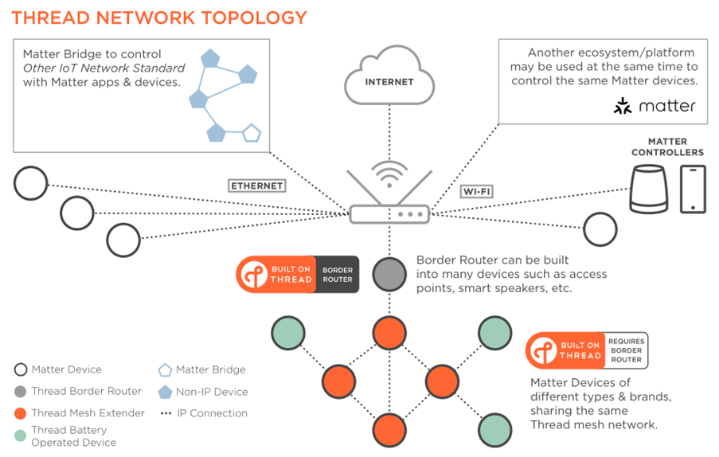
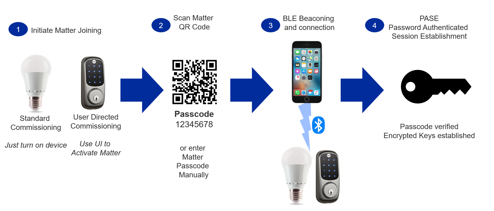
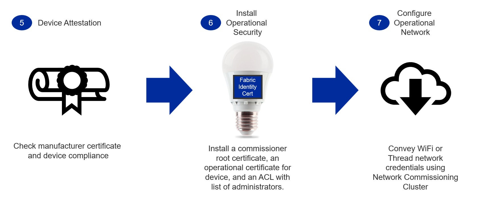
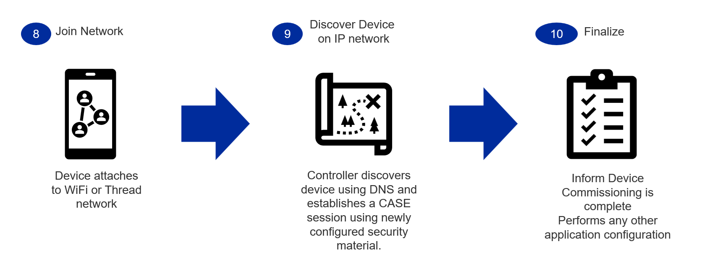
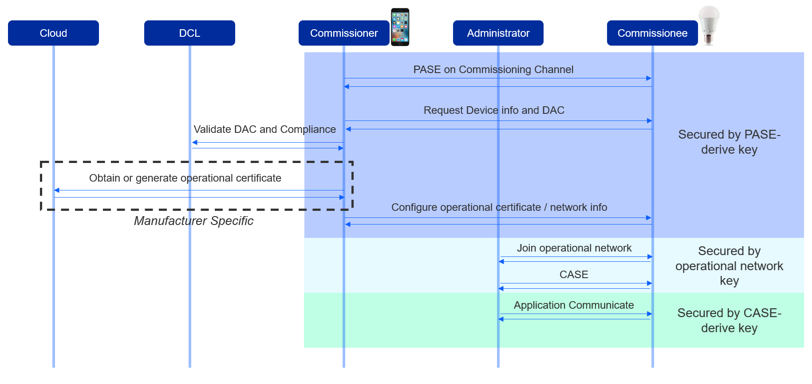

[Amlogic.md](Amlogic.md)  
# Background
<div align="center">
  
</div>

Matter use <font color="#dd00dd">chip-tool</font> for network create and management.  
There are 2 types potocol device can enter the matter network directly, WiFi and Thread.  
WiFi devices enter the network by <font color="#dd00dd">chip-tool</font> but Thread devices need another tool which is <font color="#dd00dd">otbr-agent</font>.  
<font color="#dd00dd">otbr-agent</font> will invoke <font color="#dd00dd">ot-ctl</font>. So for thread base matter, we need <font color="#dd00dd">chip-tool, otbr-agent and ot-ctl</font>.

# Commissioning Flow 

<div align="center">
  
</div>
<div align="center">
  
</div>
<div align="center">
  
</div>
<div align="center">
  
</div>


Open resource:
```c
connectedhomeip (git repo: https://github.com/project-chip/connectedhomeip.git)  
ot-br-posix (git repo: https://github.com/openthread/ot-br-posix.git)  
```
[Demonstration with EFR32 as ProjectCHIP node, Raspberry Pi as OTBR, and Ubuntu VM as chip-tool](https://sunmaysky.blogspot.com/2021/02/project-connected-home-over-ip-chip.html?m=1)  

[Running OpenThread Border Router and device with Raspberry Pi and Silicon Labs EFR32 Kits](https://sunmaysky.blogspot.com/2020/08/running-openthread-border-router-and.html)  

[Working with the CHIP Tool](https://github.com/project-chip/connectedhomeip/blob/master/docs/guides/chip_tool_guide.md)  

[OpenThread build and config](https://openthread.io/guides/border-router/build?hl=zh-cn)  

Information from Amlogic.
```c
1. Unzip matter.tar.gz to /vendor/amlogic/matter
2. Unzip matter_buildroot.tar.gz to /buildroot/package/amlogic/matter
3. apply matter.diff under buildroot
4. rebuild, source setenv.sh a4_ba401_a64_k66_release;make matter-rebuild;make
5. Act as a controller, porting chip-tool, use for pair and test Matter device. 
Controller is with a cluster client and Commissioner(From and manage the network)

Example
$ ./chip-tool pairing ble-wifi <node_id> <ssid> <password> <pin_code> <discriminator>
Refer to 
https://github.com/project-chip/connectedhomeip/blob/master/docs/guides/chip_tool_guide.md
```

# Detail
[Amlogic-chiptool-build.md](Amlogic-chiptool-build.md)  
[Amlogic-otbr-build.md](Amlogic-otbr-build.md)  
[Amlogic-chiptool-test.md](Amlogic-chiptool-test.md)  
[Amlogic-otbr-test.md](Amlogic-otbr-test.md)  

[Amlogic.md](Amlogic.md)  
