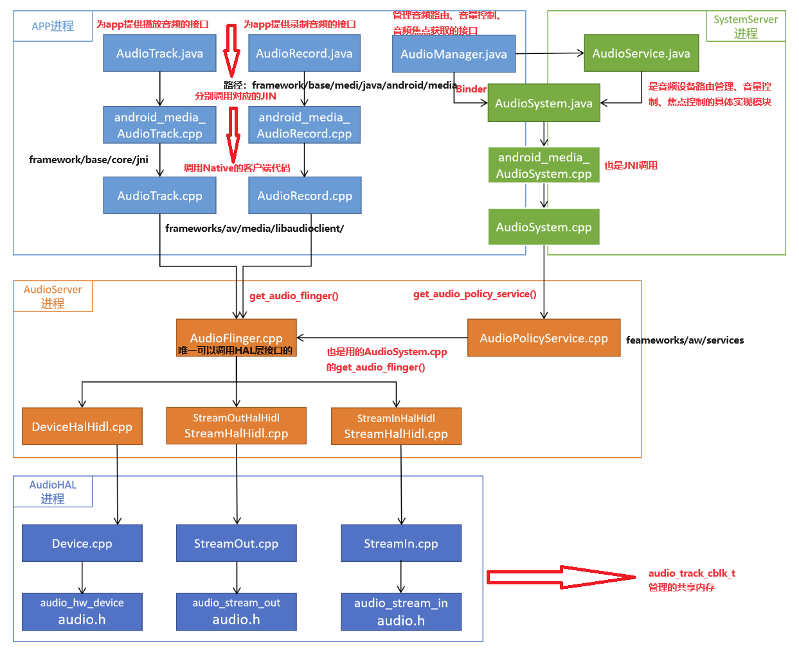
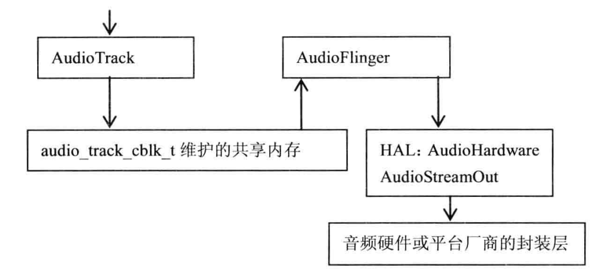
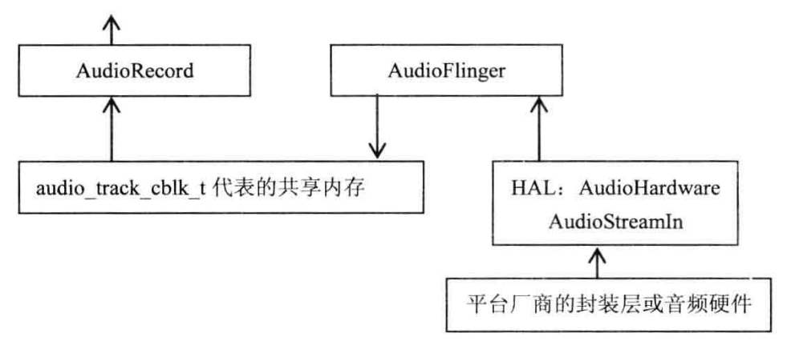

# 框图

  

（1）播放

通过C++类AudioTrack将音频数据写入AudioTrack和AudioFlinger都能访问的共享内存中，该共享内存由audio_track_cblk_t管理。AudioFlinger在接收到数据后，调过自己的播放线程输出

  

  • audiotrackcblk_t实现了一个环形FIFO  
  • AudioTrack是FIFO的数据生产者  
  • AudioFlinger是FIFO的数据消费者  

（2）录音：

硬件设备采集PCM数据，AudioFlinger使用AudioStreamIn将数据读取到共享内存，AudioRecord则从共享内存中在读取这些数据。

HAL----->AudioFlinger------->共享内存------>AudioRecord

  

## [AudioOnAndroid](AudioOnAndroid.md)
