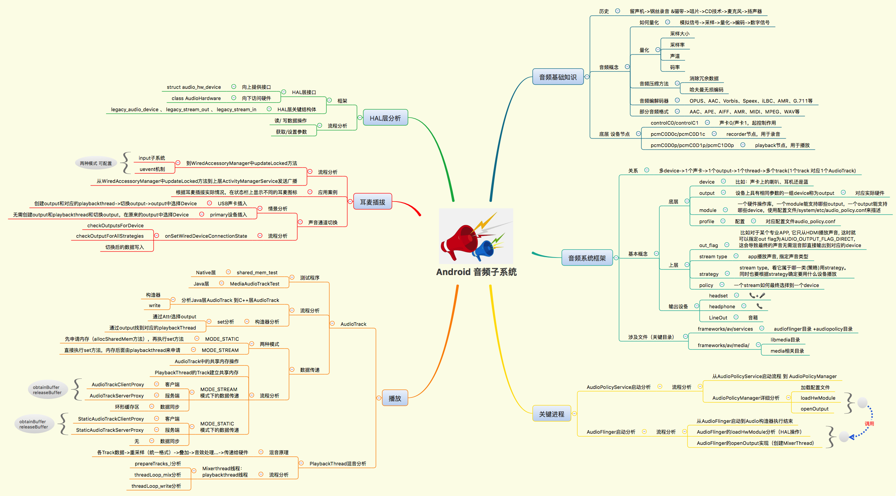

<details>
<summary><font size=5>目录</font> </summary>

- [1. Android音频子系统](#1-android音频子系统)
- [2. Qcom音频架构](#3-qcom音频架构)
	- [2.1 HW](#31-hw)
	- [2.2 SW](#32-sw)
- [3. 模块说明](#3-模块说明)
	- [3.1 Application层](#31-application层)
	- [3.2 Frameworks Java层](#32-frameworks-java层)
	- [3.3 JNI层](#33-jni层)
	- [3.4 Frameworks native C++层](#34-frameworks-native-c层)
	- [3.5 Hal层](#35-hal层)
	- [3.6 Driver层](#36-driver层)
- [4. 跟代码](#4-跟代码)
	- [4.1 AudioTrack](#41-audiotrack)
	- [4.2 AudioRecord](#42-audiorecord)
	- [4.3 AudioFlinger](#43-audioflinger)
	- [4.4 AudioPolicy](#44-audiopolicy)
- [5. 蓝牙音频](#5-蓝牙音频)
	- [5.1 BTAudioRoute](#51-btaudioroute)

</details>

# 1. Android音频子系统
<div align="center">
  
</div>

AAC:Advanced Audio Coding  
HAL:Hardware abstraction layer  
MP3:Moving Picture Experts Group Audio Layer-3  
WAV:WaveForm  
PCM:Pulse Code Modulation  

```
frameworks/av/media/libaudioclient/AudioTrack.cpp:1696:        mProxy = new AudioTrackClientProxy(cblk, buffers, mFrameCount, mFrameSize);
frameworks/av/media/libaudioclient/AudioTrack.cpp:1698:        mStaticProxy = new StaticAudioTrackClientProxy(cblk, buffers, mFrameCount, mFrameSize);
```

AudioTrack中有MODE_STATIC和MODE_STREAM两种分类。  
STREAM的意思是由用户在应用程序通过write方式把数据一次一次得写到audiotrack中。这个和我们在socket中发送数据一样，应用层从某个地方获取数据，例如通过编解码得到PCM数据，然后write到audiotrack。

这种方式的坏处就是总是在JAVA层和Native层交互，效率损失较大。适用于大多数的场景，将audio buffers从java层传递到native层即返回。如果audio buffers占用内存多，应该使用MODE_STREAM。比如播放时间很长的声音文件，比如音频文件使用高采样率，比如动态的处理audio buffer等。

STATIC的意思是一开始创建的时候，就把音频数据放到一个固定的buffer，然后直接传给audiotrack，后续就不用一次次得write了。一次性将全部的音频资源从java传递到native层，AudioTrack会自己播放这个buffer中的数据。，音频文件短且占用内存小。适用于短促的游戏音效，并且对播放延迟真的有很高要求。

# 2. Qcom音频架构
<div align="center">
  
</div>

[Android13 Audio](AudioFrameOnAndroid13.md)  

# 3. 模块说明
## 3.1 Application层

音频相关的应用:音乐播放器,电话,声音设置, 播放器,录音器等.

## 3.2 Frameworks Java层
	文件位于: frameworks/base/media/java/android/media/

	AudioRecord:	提供给应用,用于录音的接口.负责录音数据的采集.  
	AudioTrack:	提供给应用,用于播放audio的接口.负责回放数据的输出.  
	MediaPlayer:	提供给应用,用于播放音视频的接口.  
					和 AudioTrack 的区别在于:AudioTrack 只能播放 PCM 流音频.
					MediaPlayer 关于音频方面的具体实现还是 AudioTrack.  
	AudioSystem:	音频控制的入口，是native层对上服务的接口. 				
	AudioService:	系统服务,提供应用所需的除了播放的相关的audio业务, 
					音量调节、音量UI、音频设备插拔等控制流的具体实现.
					与之对应的Client端是 AudioManager, AudioManager 运行在应用进程.
					两者之间通过binder进行通信.  
	AudioManager:	音频管理器，音量调节、音量UI、设置和获取参数等控制流的对外API.
					AudioManager, AudioService 及 AudioSystem 等类提供声音控制、通道选择、音效设置等功能. 

## 3.3 JNI层
	与 android.media 关联的 JNI 代码可调用较低级别的原生代码,以访问音频硬件.  
	JNI 位于 frameworks/base/core/jni/ 和 frameworks/base/media/jni 中.  
	frameworks/base/core/jni/ 目录通常包含与 Android 系统核心功能相关的 JNI 代码,  
	用于实现一些底层的系统功能,例如系统服务、进程管理等.  
	frameworks/base/media/jni 目录则通常包含与多媒体功能相关的 JNI 代码,  
	用于访问和操作音频、视频等多媒体硬件或功能.  

## 3.4 Frameworks native C++层
	frameworks/av/services/audioflinger   
	frameworks/av/services/audiopolicy
	frameworks/av/media/audioserver
	frameworks/av/media/libstagefright
	frameworks/av/media/libmedia/   # AudioTrack AudioRecord

	native框架可提供相当于 android.media 软件包的原生软件包,  
	从而调用 Binder IPC 代理以访问媒体服务器的特定于音频的服务.  
	原生框架代码位于 frameworks/av/media/libmedia 中.

	Client:
		MediaCodec/AudioRecord/AudioTrack/MediaPlayer/AudioSystem,  
		与Frameworks Java层的相关类一一对应.
	Service:
		AudioFlinger 和 AudioPolicyService 是核心系统服务,运行在 AudioServer 系统进程.
		AudioPolicyService :Audio 策略的制定者.含Audio HAL的加载,规划各类音频流的输出路径,指定硬件设备（听筒喇叭,耳机,蓝牙等）.  
			同时它是 AudioFlinger 的 client端,会调用到 AudioFlinger.
		AudioFlinger:Audio 策略的执行者. 
			向上为上层提供访问和管理音频的接口,向下通过 Hal 来管理Audio硬件设备,承担音频数据流AudioTrack和AudioRecord的混音、重采、输送等责任.

## 3.5 Hal层
	hardware/libhardware/modules/audio/audio_hw.c
	HAL 定义了由音频服务调用且您必须实现以确保音频硬件功能正常运行的标准接口.  
	音频 HAL 接口位于 hardware/libhardware/include/hardware 中.   
	HAL(Hardware abstract layer)是将与硬件相关的接口抽象出来代上层应用,是AudioFlinger向下访问的对象.  
	这一部分一般由厂商自己实现,作用是桥接硬件驱动层和上层框架.

## 3.6 Driver层
	HAL与ALSA对接使用了TinyALSA库,TinyALSA是一个轻量级的封装库,对ALSA接口进行了二次封装,简化了对ALSA的操作.
	具体源码目录在/external/tinyalsa. 这个库衔接了Hal与Linux,这个是连接驱动的关键.

	编译tinyalsa配套工具
	代码路径:external/tinyalsa/
	编译完后会产生tinyplay/tinymix/tinycap等等工具.
		tinymix: 查看配置混音器
		tinyplay: 播放音频
		tinycap: 录音

	tinyalsa命令
		Tinymix:查看和更改ctl
			tinymix不加任何参数-显示当前配置情况
			tinymix [ctl][value] 设置ctl值
		Tinyplay:播放音乐
			tinyplay /sdcard/0_16.wav
		Tinycap:录音
			tinycap /sdcard/test.wav
		
	主要API:
		Pcm:
			struct pcm *pcm_open(unsigned int card, unsigned int device, unsigned int flags, struct pcm_config *config); 
			int pcm_write(struct pcm *pcm, const void *data, unsigned int count); //返回0表示成功 
			int pcm_read(struct pcm *pcm, void *data, unsigned int count);//返回0表示成功 
			int pcm_close(struct pcm *pcm);
		Mixer:
			int mixer_ctl_set_value(struct mixer_ctl *ctl, int count, char ** argv)
			void mixer_ctl_get(struct mixer_ctl *ctl, unsigned *value)
			void mixer_close(struct mixer *mixer)
			int mixer_ctl_set(struct mixer_ctl *ctl, unsigned percent)
			struct mixer *mixer_open(const char *device)

# 4. 跟代码
## 4.1 [AudioTrack](AudioTrack.md)
## 4.2 [AudioRecord](AudioRecord.md)
## 4.3 [AudioFlinger](AudioFlinger.md)
## 4.4 [AudioPolicy](AudioPolicy.md)

# 5. 蓝牙音频
## 5.1 [BTAudioRoute](BTAudioRoute.md)
