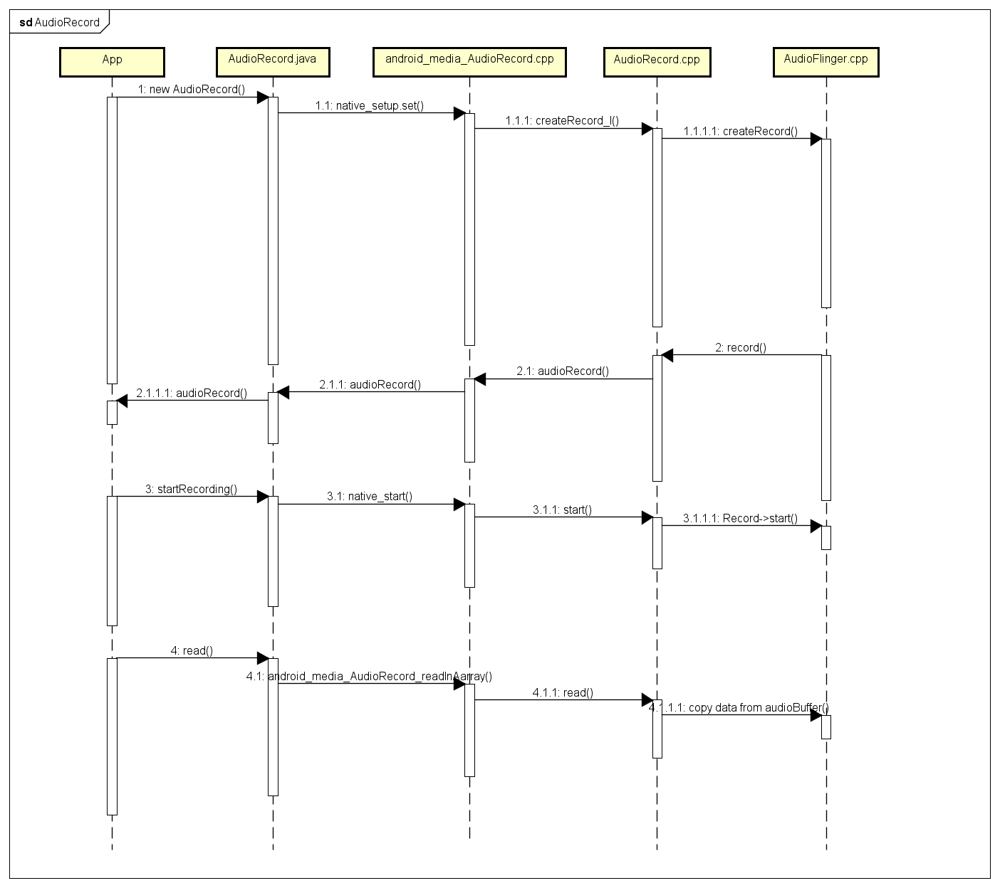

# AudioRecord

<div align="center">
  
</div>

## 1. 新建一个Auiotrack对象
### 1.1 AudioRecord()

参数解析:  
- audioSource: MediaRecorder.AudioSource.MIC,详细定义需 check MediaRecorder.AudioSource;  
- sampleRateInHz:默认采样率,单位Hz, 44100Hz 是唯一能保证在所有设备上工作的采样率；  
- channelConfig: 描述音频通道设置, AudioFormat.CHANNEL_CONFIGURATION_MONO 保证能在所有设备上工作；  
- audioFormat:音频数据保证支持此格式,这里设置为 AudioFormat.ENCODING_16BIT；  
- bufferSizeInBytes:在录制过程中,音频数据写入缓冲区的字节数, getMinVufferSize() 获取到的值.

主要的解析过程在 native_setup 函数中处理,需要注意的是区别于不同 audio 调用的 session Id.
 
```c
frameworks/base/media/java/android/media/AudioRecord.java
@SystemApi
    public AudioRecord(AudioAttributes attributes, AudioFormat format, int bufferSizeInBytes,
            int sessionId) throws IllegalArgumentException {
 
        mRecordingState = RECORDSTATE_STOPPED;
 
        ...
 
        // is this AudioRecord using REMOTE_SUBMIX at full volume?
        if (attributes.getCapturePreset() == MediaRecorder.AudioSource.REMOTE_SUBMIX) {
            final AudioAttributes.Builder filteredAttr = new AudioAttributes.Builder();
            final Iterator<String> tagsIter = attributes.getTags().iterator();
            while (tagsIter.hasNext()) {
                final String tag = tagsIter.next();
                if (tag.equalsIgnoreCase(SUBMIX_FIXED_VOLUME)) {
                    mIsSubmixFullVolume = true;
                    Log.v(TAG, "Will record from REMOTE_SUBMIX at full fixed volume");
                } else { // SUBMIX_FIXED_VOLUME: is not to be propagated to the native layers
                    filteredAttr.addTag(tag);
                }
            }
            filteredAttr.setInternalCapturePreset(attributes.getCapturePreset());
            mAudioAttributes = filteredAttr.build();
        } else {
            mAudioAttributes = attributes;
        }
 
        ...
 
        //对参数进行合法性检查,赋值mRecordSource、mSampleRate、mAudioFormat
        audioParamCheck(attributes.getCapturePreset(), rate, encoding);
 
        //获取声道数以及声道掩码,单声道掩码为0x10,双声道掩码为0x0c；
        if ((format.getPropertySetMask()
                & AudioFormat.AUDIO_FORMAT_HAS_PROPERTY_CHANNEL_INDEX_MASK) != 0) {
            mChannelIndexMask = format.getChannelIndexMask();
            mChannelCount = format.getChannelCount();
        }
        if ((format.getPropertySetMask()
                & AudioFormat.AUDIO_FORMAT_HAS_PROPERTY_CHANNEL_MASK) != 0) {
            mChannelMask = getChannelMaskFromLegacyConfig(format.getChannelMask(), false);
            mChannelCount = format.getChannelCount();
        } else if (mChannelIndexMask == 0) {
            mChannelMask = getChannelMaskFromLegacyConfig(AudioFormat.CHANNEL_IN_DEFAULT, false);
            mChannelCount =  AudioFormat.channelCountFromInChannelMask(mChannelMask);
        }
 
        audioBuffSizeCheck(bufferSizeInBytes);
 
        int[] sampleRate = new int[] {mSampleRate};
 
        //一个Session就是一个会话,每个会话都有一个维一的Id来标识.该Id的最终管理在AudioFlinger中.
        //一个会话可以被多个AudioTrack对象和MediaPlayer共用.
        //共用一个Session的AudioTrack和MediaPlayer共享相同的AudioEffect（音效）.
        int[] session = new int[1];
        session[0] = sessionId;
        //TODO: update native initialization when information about hardware init failure
        //      due to capture device already open is available.
        int initResult = native_setup( new WeakReference<AudioRecord>(this),
                mAudioAttributes, sampleRate, mChannelMask, mChannelIndexMask,
                mAudioFormat, mNativeBufferSizeInBytes,
                session, getCurrentOpPackageName(), 0 /*nativeRecordInJavaObj*/);
        if (initResult != SUCCESS) {
            loge("Error code "+initResult+" when initializing native AudioRecord object.");
            return; // with mState == STATE_UNINITIALIZED
        }
 
        mSampleRate = sampleRate[0];
        mSessionId = session[0];
 
        mState = STATE_INITIALIZED;
    }
```
## 1.2. android_media_AudioRecord_setup()
调用 AudioRecord.cpp 的 set 函数接口,并设置 audiorecord_callback_cookie *lpCallbackData 回调用于传输音频数据 buffer.
```c
frameworks/base/core/jni/android_media_AudioRecord.cpp 
static jint
android_media_AudioRecord_setup(JNIEnv *env, jobject thiz, jobject weak_this,
        jobject jaa, jintArray jSampleRate, jint channelMask, jint channelIndexMask,
        jint audioFormat, jint buffSizeInBytes, jintArray jSession, jstring opPackageName,
        jlong nativeRecordInJavaObj)
{
    //ALOGV(">> Entering android_media_AudioRecord_setup");
    //ALOGV("sampleRate=%d, audioFormat=%d, channel mask=%x, buffSizeInBytes=%d "
    //     "nativeRecordInJavaObj=0x%llX",
    //     sampleRateInHertz, audioFormat, channelMask, buffSizeInBytes, nativeRecordInJavaObj);
   
    ...
    sp<AudioRecord> lpRecorder = 0;
    audiorecord_callback_cookie *lpCallbackData = NULL;
 
    // if we pass in an existing *Native* AudioRecord, we don't need to create/initialize one.
    if (nativeRecordInJavaObj == 0) {
        if (jaa == 0) {
            ALOGE("Error creating AudioRecord: invalid audio attributes");
            return (jint) AUDIO_JAVA_ERROR;
        }
 
        if (jSampleRate == 0) {
            ALOGE("Error creating AudioRecord: invalid sample rates");
            return (jint) AUDIO_JAVA_ERROR;
        }

        //1.got sample Rate from new AlsaRecord(44100hz/16khz)
        jint elements[1];
        env->GetIntArrayRegion(jSampleRate, 0, 1, elements);
        int sampleRateInHertz = elements[0];
        
 
        // channel index mask takes priority over channel position masks.
        if (channelIndexMask) {
            // Java channel index masks need the representation bits set.
            localChanMask = audio_channel_mask_from_representation_and_bits(
                    AUDIO_CHANNEL_REPRESENTATION_INDEX,
                    channelIndexMask);
        }
        // Java channel position masks map directly to the native definition
 
        if (!audio_is_input_channel(localChanMask)) {
            ALOGE("Error creating AudioRecord: channel mask %#x is not valid.", localChanMask);
            return (jint) AUDIORECORD_ERROR_SETUP_INVALIDCHANNELMASK;
        }
 
        //2.got channel count from new AlsaRecord(1/2/4 ch)
        uint32_t channelCount = audio_channel_count_from_in_mask(localChanMask);
        
 
        // compare the format against the Java constants
        //3.got audio format from new AlsaRecord(16bit/32bit)
        audio_format_t format = audioFormatToNative(audioFormat);
        if (format == AUDIO_FORMAT_INVALID) {
            ALOGE("Error creating AudioRecord: unsupported audio format %d.", audioFormat);
            return (jint) AUDIORECORD_ERROR_SETUP_INVALIDFORMAT;
        }
        
 
        size_t bytesPerSample = audio_bytes_per_sample(format);
 
        if (buffSizeInBytes == 0) {
             ALOGE("Error creating AudioRecord: frameCount is 0.");
            return (jint) AUDIORECORD_ERROR_SETUP_ZEROFRAMECOUNT;
        }
        //4.1 每个采样帧大小:所有通道数 * 每一帧所占字节数
        size_t frameSize = channelCount * bytesPerSample;
        //4.2 采样帧数量:最小缓冲区大小 / 每个采样帧大小
        size_t frameCount = buffSizeInBytes / frameSize;
        
 
        ScopedUtfChars opPackageNameStr(env, opPackageName);
 
        // create an uninitialized AudioRecord object
        lpRecorder = new AudioRecord(String16(opPackageNameStr.c_str()));
 
        // read the AudioAttributes values
        auto paa = JNIAudioAttributeHelper::makeUnique();
        jint jStatus = JNIAudioAttributeHelper::nativeFromJava(env, jaa, paa.get());
        if (jStatus != (jint)AUDIO_JAVA_SUCCESS) {
            return jStatus;
        }
        ALOGV("AudioRecord_setup for source=%d tags=%s flags=%08x", paa->source, paa->tags, paa->flags);
 
        audio_input_flags_t flags = AUDIO_INPUT_FLAG_NONE;
        if (paa->flags & AUDIO_FLAG_HW_HOTWORD) {
            flags = AUDIO_INPUT_FLAG_HW_HOTWORD;
        }
        // create the callback information:
        // this data will be passed with every AudioRecord callback
        lpCallbackData = new audiorecord_callback_cookie;
        lpCallbackData->audioRecord_class = (jclass)env->NewGlobalRef(clazz);
        
 
        // we use a weak reference so the AudioRecord object can be garbage collected.
        //5.AudioRecord.java的指针绑定到lpCallbackData回调数据中,这样就能把数据通过回调的方式通知到上层
        lpCallbackData->audioRecord_ref = env->NewGlobalRef(weak_this);
        lpCallbackData->busy = false;


        //6.调用AudioRecord.cpp的set函数,flags,他的类型为audio_input_flags_t,定义在audio-base.h中,作为音频输入的标志,此处为AUDIO_INPUT_FLAG_NONE,没有做特殊设定
        const status_t status = lpRecorder->set(paa->source,
            sampleRateInHertz,
            format,        // word length, PCM
            localChanMask,
            frameCount,
            recorderCallback,// callback_t
            lpCallbackData,// void* user
            0,             // notificationFrames,
            true,          // threadCanCallJava
            sessionId,
            AudioRecord::TRANSFER_DEFAULT,
            flags,
            -1, -1,        // default uid, pid
            paa.get());
        
 
        ...
 
        // Set caller name so it can be logged in destructor.
        // MediaMetricsConstants.h: AMEDIAMETRICS_PROP_CALLERNAME_VALUE_JAVA
        lpRecorder->setCallerName("java");
    } else { // end if nativeRecordInJavaObj == 0)
        lpRecorder = (AudioRecord*)nativeRecordInJavaObj;
        // TODO: We need to find out which members of the Java AudioRecord might need to be
        ...
 
        // create the callback information:
        // this data will be passed with every AudioRecord callback
        lpCallbackData = new audiorecord_callback_cookie;
        lpCallbackData->audioRecord_class = (jclass)env->NewGlobalRef(clazz);
        // we use a weak reference so the AudioRecord object can be garbage collected.
        lpCallbackData->audioRecord_ref = env->NewGlobalRef(weak_this);
        lpCallbackData->busy = false;
    }
 
    nSession = (jint *) env->GetPrimitiveArrayCritical(jSession, NULL);
    if (nSession == NULL) {
        ALOGE("Error creating AudioRecord: Error retrieving session id pointer");
        goto native_init_failure;
    }
    // read the audio session ID back from AudioRecord in case a new session was created during set()
    nSession[0] = lpRecorder->getSessionId();
    env->ReleasePrimitiveArrayCritical(jSession, nSession, 0);
    nSession = NULL;
 
    ...
 
    //7.把lpRecorder对象以及lpCallbackData回调保存到javaAudioRecordFields的相应字段中
    // save our newly created C++ AudioRecord in the "nativeRecorderInJavaObj" field
    // of the Java object
    setAudioRecord(env, thiz, lpRecorder);
 
    // save our newly created callback information in the "nativeCallbackCookie" field
    // of the Java object (in mNativeCallbackCookie) so we can free the memory in finalize()
    env->SetLongField(thiz, javaAudioRecordFields.nativeCallbackCookie, (jlong)lpCallbackData);
    
 
    return (jint) AUDIO_JAVA_SUCCESS;
 
    ...///*Error Handler Process*///...
    
}
```
```c
system/media/audio/include/system/audio-base.h 

typedef enum {
    AUDIO_INPUT_FLAG_NONE       = 0x0,
    AUDIO_INPUT_FLAG_FAST       = 0x1,
    AUDIO_INPUT_FLAG_HW_HOTWORD = 0x2,
    AUDIO_INPUT_FLAG_RAW        = 0x4,
    AUDIO_INPUT_FLAG_SYNC       = 0x8,
    AUDIO_INPUT_FLAG_MMAP_NOIRQ = 0x10,
    AUDIO_INPUT_FLAG_VOIP_TX    = 0x20,
    AUDIO_INPUT_FLAG_HW_AV_SYNC = 0x40,
    AUDIO_INPUT_FLAG_DIRECT     = 0x80,
} audio_input_flags_t;
```
## 1.3. set()
解析相关的音频参数,主要是创建 AudioRecordThread 和 createRecord_l
```c
frameworks/av/media/libaudioclient/AudioRecord.cpp
status_t AudioRecord::set(
        audio_source_t inputSource,
        uint32_t sampleRate,
        audio_format_t format,
        audio_channel_mask_t channelMask,
        size_t frameCount,
        callback_t cbf,
        void* user,
        uint32_t notificationFrames,
        bool threadCanCallJava,
        audio_session_t sessionId,
        transfer_type transferType,
        audio_input_flags_t flags,
        uid_t uid,
        pid_t pid,
        const audio_attributes_t* pAttributes,
        audio_port_handle_t selectedDeviceId,
        audio_microphone_direction_t selectedMicDirection,
        float microphoneFieldDimension)
{
    status_t status = NO_ERROR;
    uint32_t channelCount;
    pid_t callingPid;
    pid_t myPid;
 
    // Note mPortId is not valid until the track is created, so omit mPortId in ALOG for set.
    ALOGV("%s(): inputSource %d, sampleRate %u, format %#x, channelMask %#x, frameCount %zu, "
          "notificationFrames %u, sessionId %d, transferType %d, flags %#x, opPackageName %s "
          "uid %d, pid %d",
          __func__,
          inputSource, sampleRate, format, channelMask, frameCount, notificationFrames,
          sessionId, transferType, flags, String8(mOpPackageName).string(), uid, pid);
 
    mTracker.reset(new RecordingActivityTracker());
 
    mSelectedDeviceId = selectedDeviceId;
    mSelectedMicDirection = selectedMicDirection;
    mSelectedMicFieldDimension = microphoneFieldDimension;
 
    ...
 
    //1.get trabsferType TRANSFER_SYNC/TRANSFER_CALLBACK
    mTransfer = transferType;
    
 
    ...
 
    if (pAttributes == NULL) {
        mAttributes = AUDIO_ATTRIBUTES_INITIALIZER;
        mAttributes.source = inputSource;
        if (inputSource == AUDIO_SOURCE_VOICE_COMMUNICATION
                || inputSource == AUDIO_SOURCE_CAMCORDER) {
            mAttributes.flags |= AUDIO_FLAG_CAPTURE_PRIVATE;
        }
    } else {
        // stream type shouldn't be looked at, this track has audio attributes
        memcpy(&mAttributes, pAttributes, sizeof(audio_attributes_t));
        ALOGV("%s(): Building AudioRecord with attributes: source=%d flags=0x%x tags=[%s]",
                __func__, mAttributes.source, mAttributes.flags, mAttributes.tags);
    }
 
    mSampleRate = sampleRate;
 
    // these below should probably come from the audioFlinger too...
    if (format == AUDIO_FORMAT_DEFAULT) {
        format = AUDIO_FORMAT_PCM_16_BIT;
    }
 
    // validate parameters
    // AudioFlinger capture only supports linear PCM
    if (!audio_is_valid_format(format) || !audio_is_linear_pcm(format)) {
        ALOGE("%s(): Format %#x is not linear pcm", __func__, format);
        status = BAD_VALUE;
        goto exit;
    }
    mFormat = format;
 
    if (!audio_is_input_channel(channelMask)) {
        ALOGE("%s(): Invalid channel mask %#x", __func__, channelMask);
        status = BAD_VALUE;
        goto exit;
    }
    mChannelMask = channelMask;
    channelCount = audio_channel_count_from_in_mask(channelMask);
    mChannelCount = channelCount;
 
    if (audio_is_linear_pcm(format)) {
        mFrameSize = channelCount * audio_bytes_per_sample(format);
    } else {
        mFrameSize = sizeof(uint8_t);
    }
 
    // mFrameCount is initialized in createRecord_l
    mReqFrameCount = frameCount;
 
    mNotificationFramesReq = notificationFrames;
    // mNotificationFramesAct is initialized in createRecord_l
 
    mSessionId = sessionId;
    ALOGV("%s(): mSessionId %d", __func__, mSessionId);
 
    callingPid = IPCThreadState::self()->getCallingPid();
    myPid = getpid();
    if (uid == AUDIO_UID_INVALID || (callingPid != myPid)) {
        mClientUid = IPCThreadState::self()->getCallingUid();
    } else {
        mClientUid = uid;
    }
    if (pid == -1 || (callingPid != myPid)) {
        mClientPid = callingPid;
    } else {
        mClientPid = pid;
    }
 
    mOrigFlags = mFlags = flags;
    mCbf = cbf;
 
    //2.new AudioRecordThread to handle releated process
    if (cbf != NULL) {
        mAudioRecordThread = new AudioRecordThread(*this);
        mAudioRecordThread->run("AudioRecord", ANDROID_PRIORITY_AUDIO);
        // thread begins in paused state, and will not reference us until start()
    }
    
 
    // create the IAudioRecord
    //3.use createRecord_l to invork audio related devices/input parameters
    {
        AutoMutex lock(mLock);
        status = createRecord_l(0 /*epoch*/, mOpPackageName);
    }
    
 
    ALOGV("%s(%d): status %d", __func__, mPortId, status);
 
    if (status != NO_ERROR) {
        if (mAudioRecordThread != 0) {
            mAudioRecordThread->requestExit();   // see comment in AudioRecord.h
            mAudioRecordThread->requestExitAndWait();
            mAudioRecordThread.clear();
        }
        goto exit;
    }
 
    mUserData = user;
    // TODO: add audio hardware input latency here
    mLatency = (1000LL * mFrameCount) / mSampleRate;
    mMarkerPosition = 0;
    mMarkerReached = false;
    mNewPosition = 0;
    mUpdatePeriod = 0;
    AudioSystem::acquireAudioSessionId(mSessionId, mClientPid, mClientUid);
    mSequence = 1;
    mObservedSequence = mSequence;
    mInOverrun = false;
    mFramesRead = 0;
    mFramesReadServerOffset = 0;
 
    ///*error handler process*///
}
```
 createRecord_l 方法具体实现如下:

重要接口: AudioFliger.cpp createRecord_l 后续会进行一系列参数的解析与分发；
```c
// must be called with mLock held
status_t AudioRecord::createRecord_l(const Modulo<uint32_t> &epoch, const String16& opPackageName)
{
    const sp<IAudioFlinger>& audioFlinger = AudioSystem::get_audio_flinger();
    IAudioFlinger::CreateRecordInput input;
    IAudioFlinger::CreateRecordOutput output;
    sp<media::IAudioRecord> record;
 
    ...
 
    ///*loding input related parameters*/
 
    //1.IAudioFliger.cpp通过Binder进程间通信调用AudioFliger.cpp的createRecord,承担包括音频input device构建getInputForAttr、createRecordTrack_l、getOrphanEffectChain_l等所有功能.
    ALOGI("wsj-audioFlinger->createRecord_l %s(): mSessionId : %d, input flags = %08x", __func__, mSessionId, mFlags);
    record = audioFlinger->createRecord(input,
                                                              output,
                                                              &status);
    
 
    ...
 
    ALOGI("wsj-audioFlinger->createRecord_l ater, output mSessionId : %d, output flags = %08x", mSessionId, mFlags);
    // Starting address of buffers in shared memory.
    // The buffers are either immediately after the control block,
    // or in a separate area at discretion of server.
    void *buffers;
    if (output.buffers == 0) {
        buffers = cblk + 1;
    } else {
        // TODO: Using unsecurePointer() has some associated security pitfalls
        //       (see declaration for details).
        //       Either document why it is safe in this case or address the
        //       issue (e.g. by copying).
        buffers = output.buffers->unsecurePointer();
        if (buffers == NULL) {
            ALOGE("%s(%d): Could not get buffer pointer", __func__, mPortId);
            status = NO_INIT;
            goto exit;
        }
    }
 
    // invariant that mAudioRecord != 0 is true only after set() returns successfully
    if (mAudioRecord != 0) {
        IInterface::asBinder(mAudioRecord)->unlinkToDeath(mDeathNotifier, this);
        mDeathNotifier.clear();
    }
    mAudioRecord = record;
    mCblkMemory = output.cblk;
    mBufferMemory = output.buffers;
    IPCThreadState::self()->flushCommands();
 
    mCblk = cblk;
    
    ...
    
    //mInput != input includes the case where mInput == AUDIO_IO_HANDLE_NONE for first creation
    if (mDeviceCallback != 0) {
        if (mInput != AUDIO_IO_HANDLE_NONE) {
            AudioSystem::removeAudioDeviceCallback(this, mInput, mPortId);
        }
        ALOGI("wsj-audioFlinger->createRecord_l ater, oAudioSystem::addAudioDeviceCallback output.inputId: %d, output.portId: %d", output.inputId, output.portId);
        AudioSystem::addAudioDeviceCallback(this, output.inputId, output.portId);
    }
 
    ...
    
    // update proxy
    ALOGI("wsj-audioFlinger->createRecord_l after, new AudioRecordClientProxy, mFrameCount: %zu, mFrameSize: %zu", mFrameCount, mFrameSize);
    mProxy = new AudioRecordClientProxy(cblk, buffers, mFrameCount, mFrameSize);
    mProxy->setEpoch(epoch);
    mProxy->setMinimum(mNotificationFramesAct);
 
    DeathNotifier = new DeathNotifier(this);
    IInterface::asBinder(mAudioRecord)->linkToDeath(mDeathNotifier, this);
 
    ...
}
```
## 1.4. createRecord()
```c
frameworks/av/media/libaudioclient/IAudioFlinger.cpp
virtual sp<media::IAudioRecord> createRecord(const CreateRecordInput& input,
                                                 CreateRecordOutput& output,
                                                 status_t *status)
    {
        Parcel data, reply;
        sp<media::IAudioRecord> record;
        data.writeInterfaceToken(IAudioFlinger::getInterfaceDescriptor());
 
        if (status == nullptr) {
            return record;
        }
 
        ALOGI("wsj-IaudioFlinger->createRecord input.writeToParcel(&data)");
        input.writeToParcel(&data);

        //通过Binder进程间通信拿到share buffer
        status_t lStatus = remote()->transact(CREATE_RECORD, data, &reply);
        if (lStatus != NO_ERROR) {
            ALOGE("createRecord transaction error %d", lStatus);
            *status = DEAD_OBJECT;
            return record;
        }
        
 
        *status = reply.readInt32();
        if (*status != NO_ERROR) {
            ALOGE("createRecord returned error %d", *status);
            return record;
        }
 
        record = interface_cast<media::IAudioRecord>(reply.readStrongBinder());
        if (record == 0) {
            ALOGE("createRecord returned a NULL IAudioRecord with status OK");
            *status = DEAD_OBJECT;
            return record;
        }
 
        ALOGI("wsj-IaudioFlinger->createRecord output.readFromParcel(&reply)");
        output.readFromParcel(&reply);
        return record;
    }
```
## 2. 开始录音
略

## 3. 调用read数据
略

## 4. AudioRecord API使用示例
### 4.1 创建AudioRecord
```c
// 定义音频录制所需的参数
AudioAttributes attributes = new AudioAttributes.Builder()
        .setUsage(AudioAttributes.USAGE_MEDIA)
        .setContentType(AudioAttributes.CONTENT_TYPE_MUSIC)
        .build();
AudioFormat format = new AudioFormat.Builder()
        .setEncoding(AudioFormat.ENCODING_PCM_16BIT)
        .setSampleRate(44100)
        .setChannelMask(AudioFormat.CHANNEL_IN_STEREO)
        .build();
int bufferSizeInBytes = AudioRecord.getMinBufferSize(44100, 
                                                    AudioFormat.CHANNEL_IN_STEREO, 
                                                    AudioFormat.ENCODING_PCM_16BIT);
int sessionId = AudioManager.AUDIO_SESSION_ID_GENERATE;
// 创建 AudioRecord 对象
AudioRecord audioRecord = new AudioRecord(  attributes, 
                                            format, 
                                            bufferSizeInBytes, 
                                            sessionId);
```
### 4.2 开始录音
```c
audioRecord.startRecording();
```
### 4.3 调用read数据
```c
fileOutputStream = new FileOutputStream(pcmFile); 
if (fileOutputStream != null) {
    while (isRecording) {
        int readStatus = audioRecord.read(buffer, 0,bufferSizeInBytes);	
        Log.d(TAG, "run: readStatus=" + readStatus); 
        fileOutputStream.write(buffer);
    } 
}
```
### 4.4 停止播放和释放资源
```c
audioRecord.stop();//停止录音
audioRecord.release();//释放底层资源
```

## 5. MediaRecorder API
具体实现还是 AudioRecord
```c
frameworks/base/media/java/android/media/MediaRecorder.java
prepare()
start()
stop()
reset()
```
[AudioOnAndroid](AudioOnAndroid.md)