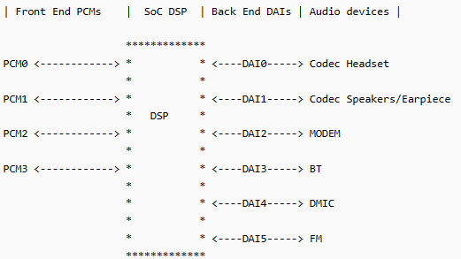
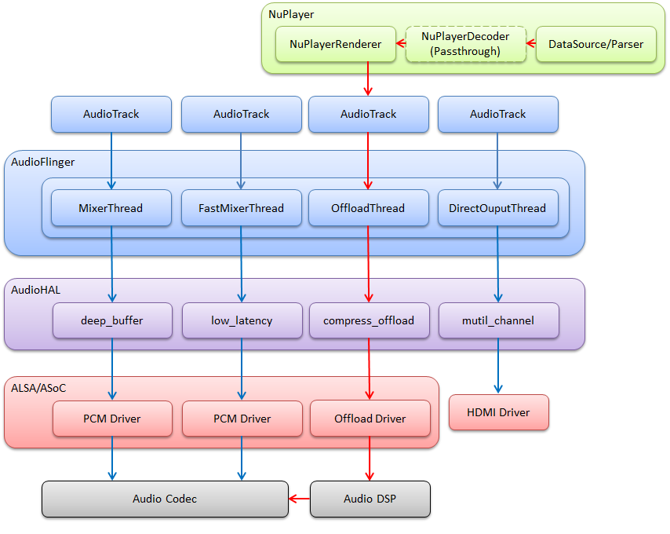
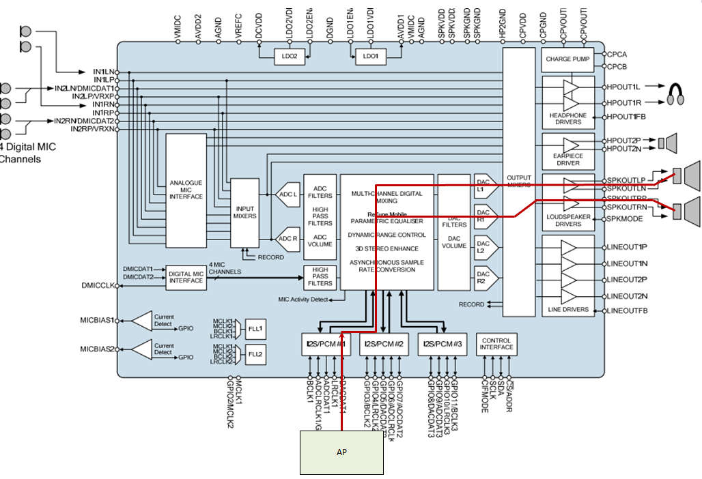

# AuidoRouter
https://blog.csdn.net/azloong/article/details/79383323

## 1. 音频框图概述  
<div align="center">
  
</div>

- Front End PCMs：音频前端，一个前端对应着一个 PCM 设备
- Back End DAIs：音频后端，一个后端对应着一个 DAI 接口，一个 FE PCM 能够连接到一个或多个 BE DAI
- Audio Device：有 headset、speaker、earpiece、mic、bt、modem 等；不同的设备可能与不同的 DAI 接口连接，也可能与同一个 DAI 接口连接（如上图，Speaker 和 Earpiece 都连接到 DAI1）
- Soc DSP：本文范围内实现路由功能：连接 FE PCMs 和 BE DAIs，例如连接 PCM0 与 DAI1：

<div align="center">
  
</div>

高通 MSM8996 音频框图:
<div align="center">
  
</div>

- FE PCMs：
    - deep_buffer
    - low_latency
    - mutil_channel
    - compress_offload
    - audio_record
    - usb_audio
    - a2dp_audio
    - voice_call
- BE DAIs：
    - SLIM_BUS
    - Aux_PCM
    - Primary_MI2S
    - Secondary_MI2S
    - Tertiary_MI2S
    - Quatermary_MI2S

## 2. HAL 中的 usecase 和 device
usecase 通俗表示音频场景，对应着音频前端，比如：

- low_latency：按键音、触摸音、游戏背景音等低延时的放音场景
- deep_buffer：音乐、视频等对时延要求不高的放音场景
- compress_offload：mp3、flac、aac等格式的音源播放场景，这种音源不需要软件解码，直接把数据送到硬件解码器（aDSP），由硬件解码器（aDSP）进行解码
- record：普通录音场景
- record_low_latency：低延时的录音场景
- voice_call：语音通话场景
- voip_call：网络通话场景

```c
vendor/qcom/opensource/audio-hal/hal/AudioStream.h

/* These are the supported use cases by the hardware.
 * Each usecase is mapped to a specific PCM device.
 * Refer to pcm_device_table[].
 */
enum {
    USECASE_INVALID = -1,
    /* Playback usecases */
    USECASE_AUDIO_PLAYBACK_DEEP_BUFFER = 0,
    USECASE_AUDIO_PLAYBACK_LOW_LATENCY,
    USECASE_AUDIO_PLAYBACK_MULTI_CH,
    USECASE_AUDIO_PLAYBACK_OFFLOAD,
    USECASE_AUDIO_PLAYBACK_ULL,

    /* FM usecase */
    USECASE_AUDIO_PLAYBACK_FM,

    /* HFP Use case*/
    USECASE_AUDIO_HFP_SCO,
    USECASE_AUDIO_HFP_SCO_WB,

    /* Capture usecases */
    USECASE_AUDIO_RECORD,
    USECASE_AUDIO_RECORD_COMPRESS,
    USECASE_AUDIO_RECORD_LOW_LATENCY,
    USECASE_AUDIO_RECORD_FM_VIRTUAL,

    /* Voice usecase */
    USECASE_VOICE_CALL,

    /* Voice extension usecases */
    USECASE_VOICE2_CALL,
    USECASE_VOLTE_CALL,
    USECASE_QCHAT_CALL,
    USECASE_VOWLAN_CALL,
    USECASE_VOICEMMODE1_CALL,
    USECASE_VOICEMMODE2_CALL,
    USECASE_COMPRESS_VOIP_CALL,

    USECASE_INCALL_REC_UPLINK,
    USECASE_INCALL_REC_DOWNLINK,
    USECASE_INCALL_REC_UPLINK_AND_DOWNLINK,

    USECASE_AUDIO_PLAYBACK_AFE_PROXY,
    USECASE_AUDIO_RECORD_AFE_PROXY,

    USECASE_AUDIO_PLAYBACK_EXT_DISP_SILENCE,

    AUDIO_USECASE_MAX
};
```
device 表示音频端点设备，包括输出端点（如 speaker、headphone、earpiece）和输入端点（如 headset-mic、builtin-mic）。高通 HAL 对音频设备做了扩展，比如 speaker 分为：

- SND_DEVICE_OUT_SPEAKER：普通的外放设备
- SND_DEVICE_OUT_SPEAKER_PROTECTED：带保护的外放设备
- SND_DEVICE_OUT_VOICE_SPEAKER：普通的通话免提设备
- SND_DEVICE_OUT_VOICE_SPEAKER_PROTECTED：带保护的通话免提设备
类似还有很多，详见 platform.h 音频设备定义，下面仅列举一部分：
```c
/* Sound devices specific to the platform
 * The DEVICE_OUT_* and DEVICE_IN_* should be mapped to these sound
 * devices to enable corresponding mixer paths
 */
enum {
    SND_DEVICE_NONE = 0,

    /* Playback devices */
    SND_DEVICE_MIN,
    SND_DEVICE_OUT_BEGIN = SND_DEVICE_MIN,
    SND_DEVICE_OUT_HANDSET = SND_DEVICE_OUT_BEGIN,
    SND_DEVICE_OUT_SPEAKER,
    SND_DEVICE_OUT_HEADPHONES,
    SND_DEVICE_OUT_HEADPHONES_DSD,
    SND_DEVICE_OUT_SPEAKER_AND_HEADPHONES,
    SND_DEVICE_OUT_SPEAKER_AND_LINE,
    SND_DEVICE_OUT_VOICE_HANDSET,
    SND_DEVICE_OUT_VOICE_SPEAKER,
    SND_DEVICE_OUT_VOICE_HEADPHONES,
    SND_DEVICE_OUT_VOICE_LINE,
    SND_DEVICE_OUT_HDMI,
    SND_DEVICE_OUT_DISPLAY_PORT,
    SND_DEVICE_OUT_BT_SCO,
    SND_DEVICE_OUT_BT_A2DP,
    SND_DEVICE_OUT_SPEAKER_AND_BT_A2DP,
    SND_DEVICE_OUT_AFE_PROXY,
    SND_DEVICE_OUT_USB_HEADSET,
    SND_DEVICE_OUT_USB_HEADPHONES,
    SND_DEVICE_OUT_SPEAKER_AND_USB_HEADSET,
    SND_DEVICE_OUT_SPEAKER_PROTECTED,
    SND_DEVICE_OUT_VOICE_SPEAKER_PROTECTED,
    SND_DEVICE_OUT_END,

    /* Capture devices */
    SND_DEVICE_IN_BEGIN = SND_DEVICE_OUT_END,
    SND_DEVICE_IN_HANDSET_MIC  = SND_DEVICE_IN_BEGIN, // 58
    SND_DEVICE_IN_SPEAKER_MIC,
    SND_DEVICE_IN_HEADSET_MIC,
    SND_DEVICE_IN_VOICE_SPEAKER_MIC,
    SND_DEVICE_IN_VOICE_HEADSET_MIC,
    SND_DEVICE_IN_BT_SCO_MIC,
    SND_DEVICE_IN_CAMCORDER_MIC,
    SND_DEVICE_IN_END,

    SND_DEVICE_MAX = SND_DEVICE_IN_END,
};
```
扩展这么多是为了方便设置 ACDB(Audio Calibration Database) id，比如外放和通话免提虽然都用了同样的喇叭设备，但是这两种情景会使用不同的算法，因此需要设置不同的 acdb id 到 aDSP，区分 SND_DEVICE_OUT_SPEAKER 和 SND_DEVICE_OUT_VOICE_SPEAKER 是为了匹配到各自的 acdb id。

由于高通 HAL 定义的音频设备与 Android Framework 定义的不一致，所以在高通 HAL 中会根据音频场景对框架层传入的音频设备进行转换，详见：

- platform_get_output_snd_device()
- platform_get_input_snd_device()

在高通 HAL 中，我们只看到 usecase（即 FE PCM）和 device，那么上一个节中提到的 BE DAI 为什么没有被提及？很简单，device 和 BE DAI 是“多对一”的关系，device 连接着唯一的 BE DAI（反过来就不成立了，BE DAI 可能连接着多个 device），所以确定了 device 也就能确定所连接的 BE DAI。

## 3. 音频通路连接
简单描述下高通 HAL 层音频通路的连接流程。如 音频框图概述 所示，音频通路分为三大块：FE PCMs、BE DAIs、Devices，这三块均需要打开并串联起来才能完成一个音频通路的设置。

```c
FE_PCMs <=> BE_DAIs <=> Devices
```

### 3.1. 打开 FE PCM
FE PCMs 是在音频流打开时设置的，我们首先要了解一个音频流对应着一个 usecase，具体细节请参考：Android 音频系统：从 AudioTrack 到 AudioFlinger

AudioTrack、AudioFlinger Threads、AudioHAL Usecases、AudioDriver PCMs 的关系如下图所示：

<div align="center">
  
</div>

start_output_stream() 代码分析：
```c
// 根据 usecase 找到对应 FE PCM id
int platform_get_pcm_device_id(audio_usecase_t usecase, int device_type)
{
    int device_id = -1;
    if (device_type == PCM_PLAYBACK)
        device_id = pcm_device_table[usecase][0];
    else
        device_id = pcm_device_table[usecase][1];
    return device_id;
}

int start_output_stream(struct stream_out *out)
{
    int ret = 0;
    struct audio_usecase *uc_info;
    struct audio_device *adev = out->dev;

    // 根据 usecase 找到对应 FE PCM id
    out->pcm_device_id = platform_get_pcm_device_id(out->usecase, PCM_PLAYBACK);
    if (out->pcm_device_id < 0) {
        ALOGE("%s: Invalid PCM device id(%d) for the usecase(%d)",
              __func__, out->pcm_device_id, out->usecase);
        ret = -EINVAL;
        goto error_open;
    }

    // 为这个音频流新建一个 usecase 实例
    uc_info = (struct audio_usecase *)calloc(1, sizeof(struct audio_usecase));

    if (!uc_info) {
        ret = -ENOMEM;
        goto error_config;
    }

    uc_info->id = out->usecase; // 音频流对应的 usecase
    uc_info->type = PCM_PLAYBACK; // 音频流的流向
    uc_info->stream.out = out;
    uc_info->devices = out->devices; // 音频流的初始设备
    uc_info->in_snd_device = SND_DEVICE_NONE;
    uc_info->out_snd_device = SND_DEVICE_NONE;
    list_add_tail(&adev->usecase_list, &uc_info->list); // 把新建的 usecase 实例添加到链表中

    // 根据 usecase、out->devices，为音频流选择相应的音频设备
    select_devices(adev, out->usecase);

    ALOGV("%s: Opening PCM device card_id(%d) device_id(%d) format(%#x)",
          __func__, adev->snd_card, out->pcm_device_id, out->config.format);
    if (!is_offload_usecase(out->usecase)) {
        unsigned int flags = PCM_OUT;
        unsigned int pcm_open_retry_count = 0;
        if (out->usecase == USECASE_AUDIO_PLAYBACK_AFE_PROXY) {
            flags |= PCM_MMAP | PCM_NOIRQ;
            pcm_open_retry_count = PROXY_OPEN_RETRY_COUNT;
        } else if (out->realtime) {
            flags |= PCM_MMAP | PCM_NOIRQ;
        } else
            flags |= PCM_MONOTONIC;

        while (1) {
            // 打开 FE PCM
            out->pcm = pcm_open(adev->snd_card, out->pcm_device_id,
                               flags, &out->config);
            if (out->pcm == NULL || !pcm_is_ready(out->pcm)) {
                ALOGE("%s: %s", __func__, pcm_get_error(out->pcm));
                if (out->pcm != NULL) {
                    pcm_close(out->pcm);
                    out->pcm = NULL;
                }
                if (pcm_open_retry_count-- == 0) {
                    ret = -EIO;
                    goto error_open;
                }
                usleep(PROXY_OPEN_WAIT_TIME * 1000);
                continue;
            }
            break;
        }
```
语音通话的情景有所不同，它不是传统意义的音频流，流程大概是这样的：

- 1,进入通话时，上层会先设置音频模式为 AUDIO_MODE_IN_CALL（HAL 接口是 adev_set_mode()），再传入音频设备 routing=$device（HAL 接口是 out_set_parameters()）
- 2,out_set_parameters() 中检查音频模式是否为 AUDIO_MODE_IN_CALL，是则调用 voice_start_call() 打开语音通话的 FE_PCM
### 3.2. 路由选择
我们在 mixer_pahts.xml 中看到 usecase 相关的通路：

```c
   <path name="deep-buffer-playback speaker">
        <ctl name="QUAT_MI2S_RX Audio Mixer MultiMedia1" value="1" />
    </path>

    <path name="deep-buffer-playback headphones">
        <ctl name="TERT_MI2S_RX Audio Mixer MultiMedia1" value="1" />
    </path>

    <path name="deep-buffer-playback earphones">
        <ctl name="QUAT_MI2S_RX Audio Mixer MultiMedia1" value="1" />
    </path>

    <path name="low-latency-playback speaker">
        <ctl name="QUAT_MI2S_RX Audio Mixer MultiMedia5" value="1" />
    </path>

    <path name="low-latency-playback headphones">
        <ctl name="TERT_MI2S_RX Audio Mixer MultiMedia5" value="1" />
    </path>

    <path name="low-latency-playback earphones">
        <ctl name="QUAT_MI2S_RX Audio Mixer MultiMedia5" value="1" />
    </path>
```

这些通路其实就是连接 usecase、device 之间的路由。比如 “deep-buffer-playback speaker” 是连接 deep-buffer-playback FE PCM、speaker Device 之间的路由，打开 “deep-buffer-playback speaker”，则把 deep-buffer-playback FE PCM 和 speaker Device 连接起来；关闭 “deep-buffer-playback speaker”，则断开 deep-buffer-playback FE PCM 和 speaker Device 的连接。

之前提到“device 连接着唯一的 BE DAI，确定了 device 也就能确定所连接的 BE DAI”，因此这些路由通路其实都隐含着 BE DAI 的连接：FE PCM 并非直接到 device 的，而是 FE PCM 先连接到 BE DAI，BE DAI 再连接到 device。这点有助于理解路由控件，路由控件面向的是 FE PCM 和 BE DAI 之间的连接，回放类型的路由控件名称一般是： $BE_DAI Audio Mixer $FE_PCM，录制类型的路由控件名称一般是：$FE_PCM Audio Mixer $BE_DAI，这很容易分辨。

例如 “deep-buffer-playback speaker” 通路中的路由控件：
```c
<ctl name="QUAT_MI2S_RX Audio Mixer MultiMedia1" value="1" />
```
- MultiMedia1：deep_buffer usacase 对应的 FE PCM
- QUAT_MI2S_RX：speaker device 所连接的 BE DAI
- Audio Mixer：表示 DSP 路由功能
- value：1 表示连接，0 表示断开连接

这个控件的意思是：把 MultiMedia1 PCM 与 QUAT_MI2S_RX DAI 连接起来。这个控件并没有指明 QUAT_MI2S_RX DAI 与 speaker device 之间的连接，因为 BE DAIs 与 Devices 之间并不需要路由控件，如之前所强调”device 连接着唯一的 BE DAI，确定了 device 也就能确定所连接的 BE DAI“。

路由控件的开关不仅仅影响 FE PCMs、BE DAIs 的连接或断开，同时会使能或禁用 BE DAIs，要深入理解这点的话需要去研究 ALSA DPCM（Dynamic PCM） 机制，这里稍作了解即可。

路由操作函数是 enable_audio_route()/disable_audio_route()，这两个函数名称很贴合，控制 FE PCMs 与 BE DAIs 的连接或断开。

代码流程很简单，把 usecase 和 device 拼接起来就是路由的 path name 了，然后再调用 audio_route_apply_and_update_path() 来设置路由通路：
```c
const char * const use_case_table[AUDIO_USECASE_MAX] = {
    [USECASE_AUDIO_PLAYBACK_DEEP_BUFFER] = "deep-buffer-playback",
    [USECASE_AUDIO_PLAYBACK_LOW_LATENCY] = "low-latency-playback",
    //...
};

const char * const backend_tag_table[SND_DEVICE_MAX] = {
    [SND_DEVICE_OUT_HANDSET] = "earphones";
    [SND_DEVICE_OUT_SPEAKER] = "speaker";
    [SND_DEVICE_OUT_SPEAKER] = "headphones";
    //...
};

void platform_add_backend_name(char *mixer_path, snd_device_t snd_device,
                               struct audio_usecase *usecase)
{
    if ((snd_device < SND_DEVICE_MIN) || (snd_device >= SND_DEVICE_MAX)) {
        ALOGE("%s: Invalid snd_device = %d", __func__, snd_device);
        return;
    }

    const char * suffix = backend_tag_table[snd_device];

    if (suffix != NULL) {
        strlcat(mixer_path, " ", MIXER_PATH_MAX_LENGTH);
        strlcat(mixer_path, suffix, MIXER_PATH_MAX_LENGTH);
    }
}

int enable_audio_route(struct audio_device *adev,
                       struct audio_usecase *usecase)
{
    snd_device_t snd_device;
    char mixer_path[MIXER_PATH_MAX_LENGTH];

    if (usecase == NULL)
        return -EINVAL;

    ALOGV("%s: enter: usecase(%d)", __func__, usecase->id);

    if (usecase->type == PCM_CAPTURE)
        snd_device = usecase->in_snd_device;
    else
        snd_device = usecase->out_snd_device;

    strlcpy(mixer_path, use_case_table[usecase->id], MIXER_PATH_MAX_LENGTH);
    platform_add_backend_name(mixer_path, snd_device, usecase);
    ALOGD("%s: apply mixer and update path: %s", __func__, mixer_path);
    audio_route_apply_and_update_path(adev->audio_route, mixer_path);
    ALOGV("%s: exit", __func__);
    return 0;
}
```
### 3.3. 打开 Device
Android 音频框架层中，音频设备仅表示输入输出端点，它不关心 BE DAIs 与 端点之间都经过了哪些部件（widget）。但我们做底层的必须清楚知道：从BE DAIs 到端点，整条通路经历了哪些部件。如下图的外放通路 ：
<div align="center">
  
</div>

为了使得声音从 speaker 端点输出，我们需要打开 AIF1、DAC1、SPKOUT 这些部件，并把它们串联起来，这样音频数据才能顺着这条路径（AIF1>DAC1>SPKOUT>SPEAKER）一路输出到 speaker。

在音频硬件驱动中，定义各种控件用于部件的开关或连接，比如控件 “SPKL DAC1 Switch” 用于控制 SPKL、DAC1 的连接或断开。具体细节请参考：Linux ALSA 音频系统：物理链路篇

我们在 mixer_pahts.xml 中看到 speaker 通路：

```c
   <path name="speaker">
        <ctl name="SPKL DAC1 Switch" value="1" />
        <ctl name="DAC1L AIF1RX1 Switch" value="1" />
        <ctl name="DAC1R AIF1RX2 Switch" value="1" />
    </path>
```
这些设备通路由 enable_snd_device()/disable_snd_device() 设置：
```c
int enable_snd_device(struct audio_device *adev,
                      snd_device_t snd_device)
{
    int i, num_devices = 0;
    snd_device_t new_snd_devices[SND_DEVICE_OUT_END];
    char device_name[DEVICE_NAME_MAX_SIZE] = {0};

    if (snd_device < SND_DEVICE_MIN ||
        snd_device >= SND_DEVICE_MAX) {
        ALOGE("%s: Invalid sound device %d", __func__, snd_device);
        return -EINVAL;
    }

    // 设备引用计数累加
    adev->snd_dev_ref_cnt[snd_device]++;

    // 根据 snd_device 找到对应的 device_name
    if(platform_get_snd_device_name_extn(adev->platform, snd_device, device_name) < 0 ) {
        ALOGE("%s: Invalid sound device returned", __func__);
        return -EINVAL;
    }
    // 设备已经被打开了，直接返回，不会重复打开设备
    if (adev->snd_dev_ref_cnt[snd_device] > 1) {
        ALOGV("%s: snd_device(%d: %s) is already active",
              __func__, snd_device, device_name);
        return 0;
    }


    // 如果是带保护的设备，那么先停止校准操作
    if (audio_extn_spkr_prot_is_enabled())
         audio_extn_spkr_prot_calib_cancel(adev);

    if (platform_can_enable_spkr_prot_on_device(snd_device) &&
         audio_extn_spkr_prot_is_enabled()) {
       // 检查带保护的设备有无合法的 acdb id，如果没有合法的 acdb id，那么保护算法无法被调用的
       if (platform_get_spkr_prot_acdb_id(snd_device) < 0) {
           adev->snd_dev_ref_cnt[snd_device]--;
           return -EINVAL;
       }
       audio_extn_dev_arbi_acquire(snd_device);
       // 打开带保护的设备，保护算法也开始运作
       if (audio_extn_spkr_prot_start_processing(snd_device)) {
            ALOGE("%s: spkr_start_processing failed", __func__);
            audio_extn_dev_arbi_release(snd_device);
            return -EINVAL;
        }
    } else if (platform_split_snd_device(adev->platform,
                                         snd_device,
                                         &num_devices,
                                         new_snd_devices) == 0) {
        // 铃声模式下，多设备分割：比如 SND_DEVICE_OUT_SPEAKER_AND_HEADPHONES 先分割为
        // SND_DEVICE_OUT_SPEAKER + SND_DEVICE_OUT_HEADPHONES，然后再一一打开 speaker
        // 和 headphones 设备
        for (i = 0; i < num_devices; i++) {
            enable_snd_device(adev, new_snd_devices[i]);
        }
    } else {
        ALOGD("%s: snd_device(%d: %s)", __func__, snd_device, device_name);

       // A2DP：打开蓝牙设备端
       if ((SND_DEVICE_OUT_BT_A2DP == snd_device) &&
           (audio_extn_a2dp_start_playback() < 0)) {
           ALOGE(" fail to configure A2dp control path ");
           return -EINVAL;
       }

        audio_extn_dev_arbi_acquire(snd_device);
        // 设置设备通路
        audio_route_apply_and_update_path(adev->audio_route, device_name);
    }
    return 0;
}
```

值得注意的点有：

- 设备引用计数：每个设备都有各自的引用计数 snd_dev_ref_cnt，引用计数在 enable_snd_device() 中累加，如果大于 1，则表示该设备已经被打开了，那么就不会重复打开该设备；引用计数在 disable_snd_device() 中累减，如果为 0，则表示没有 usecase 需要该设备了，那么就关闭该设备。
- 带保护的外放设备：带 “audio_extn_spkr_prot” 前缀的函数是带保护的外放设备的相关函数，这些带保护的外放设备和其他设备不一样，它虽然属于输出设备，但往往还需要打开一个 PCM_IN 作为 I/V Feedback，有了 I/V Feedback 保护算法才能正常运作。
- 多输出设备的分割：多输出设备，一般指铃声模式下，外放设备与其他设备同时输出的情形；platform_split_snd_device() 把多输出设备分割，比如 SND_DEVICE_OUT_SPEAKER_AND_HEADPHONES 分割为 SND_DEVICE_OUT_SPEAKER + SND_DEVICE_OUT_HEADPHONES，然后再一一打开 speaker、headphones。为什么要把多输出设备分割为 外放设备+其他设备 的形式？现在智能手机的外放设备一般都是带保护的，需要跑喇叭保护算法，而其他设备如蓝牙耳机也可能需要跑 aptX 算法，如果没有分割的话，只能下发一个 acdb id，无法把喇叭保护算法和 aptX 算法都调度起来。多输出设备分割时，还需要遵循一个规则：如果这些设备均连接到同一个 BE DAI，则无须分割。
```c
int platform_split_snd_device(void *platform,
                              snd_device_t snd_device,
                              int *num_devices,
                              snd_device_t *new_snd_devices)
{
    int ret = -EINVAL;
    struct platform_data *my_data = (struct platform_data *)platform;
    if (NULL == num_devices || NULL == new_snd_devices) {
        ALOGE("%s: NULL pointer ..", __func__);
        return -EINVAL;
    }

    /*
     * If wired headset/headphones/line devices share the same backend
     * with speaker/earpiece this routine returns -EINVAL.
     */
    if (snd_device == SND_DEVICE_OUT_SPEAKER_AND_HEADPHONES &&
        !platform_check_backends_match(SND_DEVICE_OUT_SPEAKER, SND_DEVICE_OUT_HEADPHONES)) {
        *num_devices = 2;

        new_snd_devices[0] = SND_DEVICE_OUT_SPEAKER;
        new_snd_devices[1] = SND_DEVICE_OUT_HEADPHONES;
        ret = 0;
```
## 4. 音频设备切换
- 回放场景，框架层回调 HAL 层接口 out_set_parameters(“routing=$device”) 来切换输出设备
- 录制场景，框架层回调 HAL 层接口 in_set_parameters(“routing=$device”) 来切换输入设备
这两个函数最终都是调用 select_device() 来实现设备切换的，select_device() 函数非常复杂，这里仅阐述下主干流程。
```c
select_devices
  disable_audio_route
  disable_snd_device
  check_usecases_codec_backend 检查其他usecase是否也跟随切换设备
      platform_check_backends_match
      disable_audio_route
      disable_snd_device
      enable_snd_device
      enable_audio_route
  enable_snd_device
  enable_audio_route
```