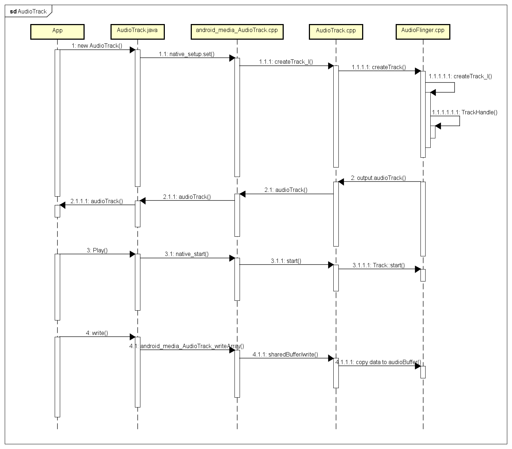

# AuidoTrack
上层应用使用 audiotrack 进行声音播放要执行以下3个动作.  
- 新建一个Auiotrack对象,设置音频参数  
- 调用.play进行播放  
- 调用.write写数据  

AudioTrack 有两种数据加载模式 MODE_STREAM 和 MODE_STATIC,分别表示数据流加载和音频流类型,  
MODE_STREAM 是通过不断的往 AudioTrack 内部 buffer 拷贝数据,这种方式会有一定的延迟,通常用来播放比较大的音频文件,  
MODE_STATIC 则是把所有数据一次写入 AudioTrack 的内部缓冲区中,后续不再传入数据,这种模式通常用于占用内存小的文件播放.   

<div align="center">
  
</div>

## 1. 新建一个Auiotrack对象,设置音频参数
第一步,新建 AudioTrack 对象时,AudioTrack.java 本身有三个重载的构造方法,分别有不同的参数, 最终多会用到参数最多的那个.  
```c
frameworks/base/media/java/android/media/AudioTrack.java
@line756 
    private AudioTrack(AudioAttributes attributes, AudioFormat format, int bufferSizeInBytes,
            int mode, int sessionId, boolean offload, int encapsulationMode,
            @Nullable TunerConfiguration tunerConfiguration)
                    throws IllegalArgumentException {
        super(attributes, AudioPlaybackConfiguration.PLAYER_TYPE_JAM_AUDIOTRACK);
        // mState already == STATE_UNINITIALIZED
        ...
        // native initialization
        int initResult = native_setup(new WeakReference<AudioTrack>(this), mAttributes,
                sampleRate, mChannelMask, mChannelIndexMask, mAudioFormat,
                mNativeBufferSizeInBytes, mDataLoadMode, session, 0 /*nativeTrackInJavaObj*/,
                offload, encapsulationMode, tunerConfiguration,
                getCurrentOpPackageName());
        if (initResult != SUCCESS) {
            loge("Error code "+initResult+" when initializing AudioTrack.");
            return; // with mState == STATE_UNINITIALIZED
        }
        ...
        baseRegisterPlayer(mSessionId);
        native_setPlayerIId(mPlayerIId); // mPlayerIId now ready to send to native AudioTrack.
    }    
```
主要看点是:
native_setup 调用了 native 层的函数,即 android_media_AudioTrack.cpp 中的 native_setup 做初始化,  
新建 AudioTrack 对象,并且根据不同的加载模式调用了 AudioTrack set 函数配不同的参数.
native_setPlayerIId 设置 PLAYER ID.

AudioTrack 的构建函数中,并没有做太多事情,反而 set 函数中做了比较多的事情,  
看看set做了什么,set 函数有两个重载参数差异,直接看最后调用的 set.
```c
frameworks/av/media/libaudioclient/AudioTrack.cpp
@line593
status_t AudioTrack::set(
        audio_stream_type_t streamType,
        uint32_t sampleRate,
        audio_format_t format,
        audio_channel_mask_t channelMask,
        size_t frameCount,
        audio_output_flags_t flags,
        const wp<IAudioTrackCallback>& callback,
        int32_t notificationFrames,
        const sp<IMemory>& sharedBuffer,
        bool threadCanCallJava,
        audio_session_t sessionId,
        transfer_type transferType,
        const audio_offload_info_t *offloadInfo,
        const AttributionSourceState& attributionSource,
        const audio_attributes_t* pAttributes,
        bool doNotReconnect,
        float maxRequiredSpeed,
        audio_port_handle_t selectedDeviceId)
{
    ...
    // validate parameters, format and channel
    if (!audio_is_valid_format(format)) {
        errorMessage = StringPrintf("%s: Invalid format %#x", __func__, format);
        status = BAD_VALUE;
        goto error;
    }
    if (!audio_is_output_channel(channelMask)) {
        errorMessage = StringPrintf("%s: Invalid channel mask %#x",  __func__, channelMask);
        status = BAD_VALUE;
        goto error;
    }
    ...
    if (callback != nullptr) {
        mAudioTrackThread = sp<AudioTrackThread>::make(*this);
        mAudioTrackThread->run("AudioTrack", ANDROID_PRIORITY_AUDIO, 0 /*stack*/);
        // thread begins in paused state, and will not reference us until start()
    }
    // create the IAudioTrack
    {
        AutoMutex lock(mLock);
        status = createTrack_l();
    }
    ...
}
```
从上述截取的部分代码看出对一些重要的属性进行了设置,并且启动了一个重要线程 AudioTrackThread.   
接着调用了 createTrack_l(),这个函数主要是调用 AudioFlinger.createTrack() 创建了一个 Track,并且保存相关的属性.  
```
@line1973
status_t AudioTrack::createTrack_l()
{
    status_t status;
    bool callbackAdded = false;
 
    const sp<IAudioFlinger>& audioFlinger = AudioSystem::get_audio_flinger();       //获取AudioFlinger
    if (audioFlinger == 0) {
        errorMessage = StringPrintf("%s(%d): Could not get audioflinger",
                __func__, mPortId);
        status = DEAD_OBJECT;
        goto exit;
    }
    ...
    IAudioFlinger::CreateTrackInput input;                      //组成input参数,这是要传递到AuioFlinger侧
    if (mOriginalStreamType != AUDIO_STREAM_DEFAULT) {
        // Legacy: This is based on original parameters even if the track is recreated.
        input.attr = AudioSystem::streamTypeToAttributes(mOriginalStreamType);
    } else {
        input.attr = mAttributes;
    }
    input.config = AUDIO_CONFIG_INITIALIZER;
    ...
    input.sharedBuffer = mSharedBuffer;                         //共享内存,这里是int值,表示的是共享内存的地址
    input.notificationsPerBuffer = mNotificationsPerBufferReq;
    ...
    media::CreateTrackResponse response;
    status = audioFlinger->createTrack(VALUE_OR_FATAL(input.toAidl()), response);   //创建Track

    IAudioFlinger::CreateTrackOutput output{};
    if (status == NO_ERROR) {
        output = VALUE_OR_FATAL(IAudioFlinger::CreateTrackOutput::fromAidl(response)); //通过AIDL跨进程通信方式将参数传递到AudioFlinger并且返回值
    }
    ...
    // AudioFlinger now owns the reference to the I/O handle,
    // so we are no longer responsible for releasing it.

    // FIXME compare to AudioRecord
    std::optional<media::SharedFileRegion> sfr;
    output.audioTrack->getCblk(&sfr);                                             //这里获得的audioTrack其实是个代理,获取共享内存
    sp<IMemory> iMem = VALUE_OR_FATAL(aidl2legacy_NullableSharedFileRegion_IMemory(sfr));
    if (iMem == 0) {
        errorMessage = StringPrintf("%s(%d): Could not get control block", __func__, mPortId);
        status = FAILED_TRANSACTION;
        goto exit;
    }
    // TODO: Using unsecurePointer() has some associated security pitfalls
    //       (see declaration for details).
    //       Either document why it is safe in this case or address the
    //       issue (e.g. by copying).
    void *iMemPointer = iMem->unsecurePointer();
    if (iMemPointer == NULL) {
        errorMessage = StringPrintf(
                "%s(%d): Could not get control block pointer", __func__, mPortId);
        status = FAILED_TRANSACTION;
        goto exit;
    }
    // invariant that mAudioTrack != 0 is true only after set() returns successfully
    if (mAudioTrack != 0) {
        IInterface::asBinder(mAudioTrack)->unlinkToDeath(mDeathNotifier, this);
        mDeathNotifier.clear();
    }
    mAudioTrack = output.audioTrack;                                                    //保存audiotrack和共享内存
    mCblkMemory = iMem;
    IPCThreadState::self()->flushCommands();
 
    audio_track_cblk_t* cblk = static_cast<audio_track_cblk_t*>(iMemPointer);
    mCblk = cblk;
    ...   
    // Starting address of buffers in shared memory.  If there is a shared buffer, buffers
    // is the value of pointer() for the shared buffer, otherwise buffers points
    // immediately after the control block.  This address is for the mapping within client
    // address space.  AudioFlinger::TrackBase::mBuffer is for the server address space.
    void* buffers;
    if (mSharedBuffer == 0) {
        buffers = cblk + 1;
    } else {
        // TODO: Using unsecurePointer() has some associated security pitfalls
        //       (see declaration for details).
        //       Either document why it is safe in this case or address the
        //       issue (e.g. by copying).
        buffers = mSharedBuffer->unsecurePointer();
        if (buffers == NULL) {
            ALOGE("%s(%d): Could not get buffer pointer", __func__, mPortId);
            status = NO_INIT;
            goto exit;
        }
    }
 
    mAudioTrack->attachAuxEffect(mAuxEffectId, &status);                                  //绑定音效
    ...
 
    // update proxy
    if (mSharedBuffer == 0) {  //根据是否使用共享内存创建了两个不同的client代理,这两个代理会与AudioFlinger中的server相配对
        mStaticProxy.clear();
        mProxy = new AudioTrackClientProxy(cblk, buffers, mFrameCount, mFrameSize);
    } else {
        mStaticProxy = new StaticAudioTrackClientProxy(cblk, buffers, mFrameCount, mFrameSize);
        mProxy = mStaticProxy;
    }
 
    mProxy->setVolumeLR(gain_minifloat_pack(
            gain_from_float(mVolume[AUDIO_INTERLEAVE_LEFT]),
            gain_from_float(mVolume[AUDIO_INTERLEAVE_RIGHT])));
 
    mProxy->setSendLevel(mSendLevel);
    const uint32_t effectiveSampleRate = adjustSampleRate(mSampleRate, mPlaybackRate.mPitch);
    const float effectiveSpeed = adjustSpeed(mPlaybackRate.mSpeed, mPlaybackRate.mPitch);
    const float effectivePitch = adjustPitch(mPlaybackRate.mPitch);
    mProxy->setSampleRate(effectiveSampleRate);
 
    AudioPlaybackRate playbackRateTemp = mPlaybackRate;
    playbackRateTemp.mSpeed = effectiveSpeed;
    playbackRateTemp.mPitch = effectivePitch;
    mProxy->setPlaybackRate(playbackRateTemp);
    mProxy->setMinimum(mNotificationFramesAct);
    ...
    mDeathNotifier = new DeathNotifier(this);
    IInterface::asBinder(mAudioTrack)->linkToDeath(mDeathNotifier, this);
    ...
}
```
## 2. 调用.play进行播放
```c
frameworks/base/media/java/android/media/AudioTrack.java
 
    public void play()
    throws IllegalStateException {
        if (mState != STATE_INITIALIZED) {
            throw new IllegalStateException("play() called on uninitialized AudioTrack.");
        }
        //FIXME use lambda to pass startImpl to superclass
        final int delay = getStartDelayMs();
        if (delay == 0) {
            startImpl();
        } else {
            new Thread() {
                public void run() {
                    try {
                        Thread.sleep(delay);
                    } catch (InterruptedException e) {
                        e.printStackTrace();
                    }
                    baseSetStartDelayMs(0);
                    try {
                        startImpl();
                    } catch (IllegalStateException e) {
                        // fail silently for a state exception when it is happening after
                        // a delayed start, as the player state could have changed between the
                        // call to start() and the execution of startImpl()
                    }
                }
            }.start();
        }
    }

    private void startImpl() {
        synchronized (mRoutingChangeListeners) {
            if (!mEnableSelfRoutingMonitor) {
                mEnableSelfRoutingMonitor = testEnableNativeRoutingCallbacksLocked();
            }
        }
        synchronized(mPlayStateLock) {
            baseStart(0); // unknown device at this point
            native_start();
            // FIXME see b/179218630
            //baseStart(native_getRoutedDeviceId());
            if (mPlayState == PLAYSTATE_PAUSED_STOPPING) {
                mPlayState = PLAYSTATE_STOPPING;
            } else {
                mPlayState = PLAYSTATE_PLAYING;
                mOffloadEosPending = false;
            }
        }
    }
```
在上层AudioTrack.java 调用 play(),实际上用到了native层 native_start(),  
对应 android_media_AudioTrack.cpp 中的 android_media_AudioTrack_start() 函数,  
直接看android_media_AudioTrack_start().
```c
static void
android_media_AudioTrack_start(JNIEnv *env, jobject thiz)
{
    sp<AudioTrack> lpTrack = getAudioTrack(env, thiz);
    if (lpTrack == NULL) {
        jniThrowException(env, "java/lang/IllegalStateException",
            "Unable to retrieve AudioTrack pointer for start()");
        return;
    }
 
    lpTrack->start();
}
```
直接跨度到了 AudioTrack.cpp 的 start()函数,这个 start() 主要是将 动作传递到了 AudioFlinger 那一侧的 Track 中.  

## 3. 调用.write写数据
在 AudioTrack.java 中有好几个 write 的重载方法(native_write_byte,native_write_short,native_write_float,native_write_native_bytes),  
分别用于写不同的数据类型:byte,short,float,nativebytes 等,
到 android_media_AudioTrack.cpp 中发现除了 nativebytes 其他都是指向同一个函数 android_media_AudioTrack_writeArray  
nativbytes 指向了函数 android_media_AudioTrack_write_native_bytes
```
frameworks/base/core/jni/android_media_AudioTrack.cpp
 
template <typename T>
static jint android_media_AudioTrack_writeArray(JNIEnv *env, jobject thiz,
                                                T javaAudioData,
                                                jint offsetInSamples, jint sizeInSamples,
                                                jint javaAudioFormat,
                                                jboolean isWriteBlocking) {
 
    ...
    jint samplesWritten = writeToTrack(lpTrack, javaAudioFormat, cAudioData,
            offsetInSamples, sizeInSamples, isWriteBlocking == JNI_TRUE /* blocking */);

    envReleaseArrayElements(env, javaAudioData, cAudioData, 0);

    //ALOGV("write wrote %d (tried %d) samples in the native AudioTrack with offset %d",
    //        (int)samplesWritten, (int)(sizeInSamples), (int)offsetInSamples);
    return samplesWritten;
}
 
static jint android_media_AudioTrack_write_native_bytes(JNIEnv *env,  jobject thiz,
        jobject javaByteBuffer, jint byteOffset, jint sizeInBytes,
        jint javaAudioFormat, jboolean isWriteBlocking) {
    ...
    const jbyte* bytes =
            reinterpret_cast<const jbyte*>(env->GetDirectBufferAddress(javaByteBuffer));
    if (bytes == NULL) {
        ALOGE("Error retrieving source of audio data to play, can't play");
        return (jint)AUDIO_JAVA_BAD_VALUE;
    }

    jint written = writeToTrack(lpTrack, javaAudioFormat, bytes, byteOffset,
            sizeInBytes, isWriteBlocking == JNI_TRUE /* blocking */);

    return written;
}
```
可以看出两个函数虽然名字参数不一样但是最终都调用了 writeToTrack 函数,  
这个函数会根据AuioTrack.cpp 的 shardBuffer,采用不同的方式写数据,  
shareBuffer 是否为零根据上层使用的是 MODE_STREAM 还是 MODE_STATIC,  
MODE_STATIC 是会有 sharedBuffer,然后写数据是直接写入 sharedBuffer 中,  
而 MODE_STEREAM 则是调用 AudiaoTrack 的 write 方式.  
```
android_media_AudioTrack.cpp
 
// ----------------------------------------------------------------------------
class AudioTrackJniStorage {
public:
    sp<MemoryHeapBase> mMemHeap;
    sp<MemoryBase> mMemBase;
    audiotrack_callback_cookie mCallbackData{};
    sp<JNIDeviceCallback> mDeviceCallback;
    sp<JNIAudioTrackCallback> mAudioTrackCallback;
 
    bool allocSharedMem(int sizeInBytes) {
        mMemHeap = new MemoryHeapBase(sizeInBytes, 0, "AudioTrack Heap Base");
        if (mMemHeap->getHeapID() < 0) {
            return false;
        }
        mMemBase = new MemoryBase(mMemHeap, 0, sizeInBytes);
        return true;
    }
};
```
AudioTrackJniStorage 则是持有和管理 AudioTrack 共享内存的类,  
是在 android_media_AudioTrack 中进行初始化申请内存然后通过 AudioTrack set() 函数传递,双方进行使用.
```c
frameworks/av/media/libaudioclient/AudioTrack.cpp
@line2504
ssize_t AudioTrack::write(const void* buffer, size_t userSize, bool blocking)
{
    ...
    size_t written = 0;
    Buffer audioBuffer;

    while (userSize >= mFrameSize) {
        audioBuffer.frameCount = userSize / mFrameSize;

        status_t err = obtainBuffer(&audioBuffer,
                blocking ? &ClientProxy::kForever : &ClientProxy::kNonBlocking);
        if (err < 0) {
            if (written > 0) {
                break;
            }
            if (err == TIMED_OUT || err == -EINTR) {
                err = WOULD_BLOCK;
            }
            return ssize_t(err);
        }

        size_t toWrite = audioBuffer.size();
        memcpy(audioBuffer.raw, buffer, toWrite);
        buffer = ((const char *) buffer) + toWrite;
        userSize -= toWrite;
        written += toWrite;

        releaseBuffer(&audioBuffer);
    }

    if (written > 0) {
        mFramesWritten += written / mFrameSize;

        if (mTransfer == TRANSFER_SYNC_NOTIF_CALLBACK) {
            const sp<AudioTrackThread> t = mAudioTrackThread;
            if (t != 0) {
                // causes wake up of the playback thread, that will callback the client for
                // more data (with EVENT_CAN_WRITE_MORE_DATA) in processAudioBuffer()
                t->wake();
            }
        }
    }

    return written;
}
```
从 AudioTrack::write 函数来看,这里是向 ClientProxy 申请了一个共享的 buffer,  
然后把数据拷贝给这个 buffer,可见stream 模式最终也是通过共享内存来交换数据,  
最后在数据拷贝成功后,会唤醒 AudioTrackThread 线程,  
这个线程他会循环的去获取当前的播放状态和事件,并且返回给上层.
App client在播放时会不断的调用AudioTrack::write不断的向AudioFlinger写数据.  
AudioFlinger做为Service端会不断的接收并处理Client端写入的数据.  

## 4. AudioTrack API使用示例

### 4.1 创建AudioTrack
```c
// 创建一个音频属性对象
AudioAttributes attributes = new AudioAttributes.Builder()
        .setContentType(AudioAttributes.CONTENT_TYPE_MUSIC)
        .setUsage(AudioAttributes.USAGE_MEDIA)
        .build();
// 创建一个音频格式对象
AudioFormat format = new AudioFormat.Builder()
        .setChannelMask(AudioFormat.CHANNEL_OUT_STEREO)
        .setEncoding(AudioFormat.ENCODING_PCM_16BIT)
        .setSampleRate(44100)
        .build();
// 设置缓冲区大小
int bufferSizeInBytes = AudioTrack.getMinBufferSize(44100, 
                                                    AudioFormat.CHANNEL_OUT_STEREO, 
                                                    AudioFormat.ENCODING_PCM_16BIT);
// 设置音频模式
int mode = AudioTrack.MODE_STREAM;
// 设置会话ID
int sessionId = AudioManager.AUDIO_SESSION_ID_GENERATE;
// 设置是否使用音频卸载
boolean offload = false;
// 设置封装模式
int encapsulationMode = AudioTrack.ENCAPSULATION_MODE_ELEMENTARY;
// 创建一个 TunerConfiguration 对象
TunerConfiguration tunerConfiguration = new TunerConfiguration.Builder()
        .setChannelSpacing(TunerConfiguration.CHANNEL_SPACING_8_MHZ)
        .setBandCenterFrequencyKHz(600000)
        .build();
// 调用方法创建音频轨道
AudioTrack audioTrack = new AudioTrack( attributes, 
                                        format, 
                                        bufferSizeInBytes, 
                                        mode, 
                                        sessionId, 
                                        offload, 
                                        encapsulationMode, 
                                        tunerConfiguration);
```

### 4.2 开始播放
```c
audioTrack.play() ;
```

### 4.3 调用write写数据
```c
audioTrack.write(bytes_pkg, 0,bytes_pkg.length) ;//往track中写数据
```
### 4.4 停止播放和释放资源
```c
audioTrack.stop();//停止播放
audioTrack.release();//释放底层资源
```

## 5. MediaPlayer API
具体实现还是AudioTrack
```c
frameworks/base/media/java/android/media/MediaPlayer.java
setVolume(float,float)
pause()
start()
stop()
seekTo(long, int)
prepare()
```
[AudioOnAndroid](AudioOnAndroid.md)  
[Android AudioTrack flow](https://blog.csdn.net/sinat_18179367/article/details/107461820)