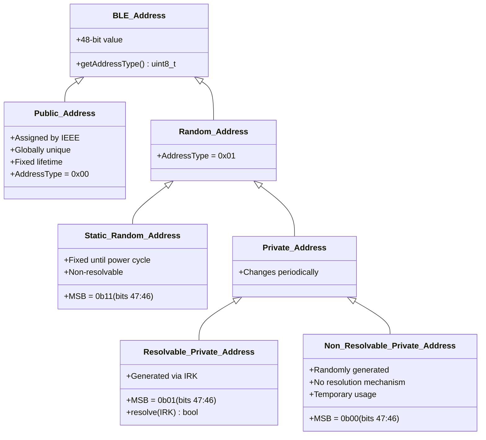
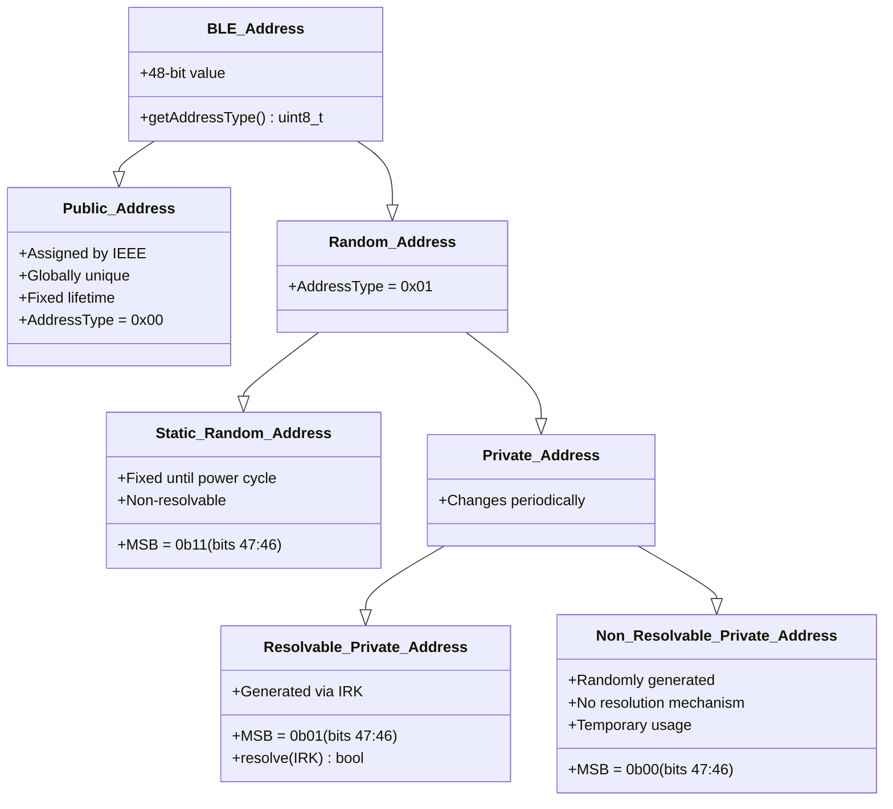
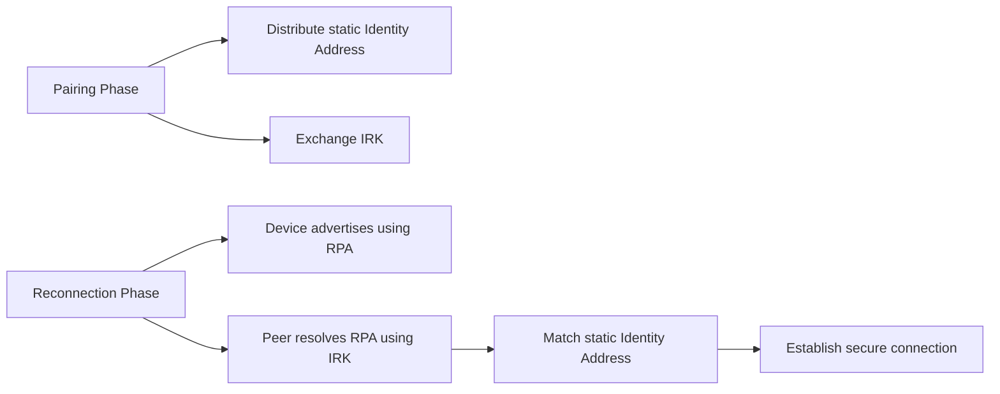
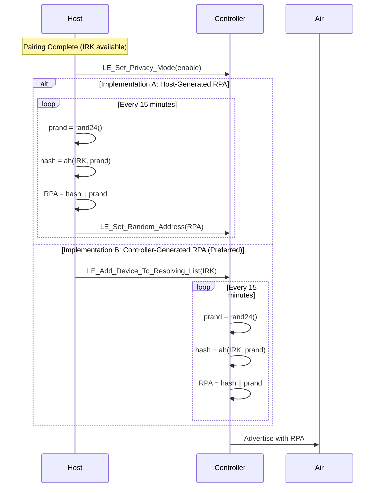

[memo.md](memo.md)  

# BD_ADDR

                                                                
|MSB|    |     |    |    |LSB| 
|  ----  | ----- |  ----- | ----- | ----- | ----- | 
|NAP|NAP|UAP|LAP|LAP|LAP|
|  bdaddr[5] |  bdaddr[4] |  bdaddr[3] |  bdaddr[2] |  bdaddr[1] |  bdaddr[0] | 
|98 10011000	|59 01011001	|49 01001001	|2D 00101101	|99 10011001	|72 01110010|
|AC 10101100	|DE 11011110	|48 01001000	|00 00000000	|00 00000000	|80 10000000|
|77 01110111	|87 	10000111|9B 10011011	|9D 10011101	|54 01010100	|DC 11011100|  

Little-endian format 

# Resolution

# Sequence

Host->>Controller: LE_Set_Random_Address(RPA)
LE_Set_Random_Address (Opcode 0x2005)

Host->>Controller: LE_Add_Device_To_Resolving_List(IRK)
LE_Add_Device_To_Resolving_List (Opcode 0x2027)

# Sequence Detail

```mermaid
sequenceDiagram
    participant ST_Host as ST Host (STM32)
    participant ST_Ctrl as ST Controller (e.g. BlueNRG)
    participant Air as BLE Air Interface
    participant NXP_Ctrl as NXP Controller (KW38)
    participant NXP_Host as NXP Host (MCU)

    Note over ST_Host, ST_Ctrl: ST Device (GATT Client)
    Note over NXP_Host, NXP_Ctrl: NXP Device (GATT Server)
    
    rect rgb(240, 255, 240)
        Note over ST_Host: ST Device Initialization
        ST_Host->>ST_Ctrl: hci_reset()
        ST_Ctrl-->>ST_Host: Command Complete
        ST_Host->>ST_Ctrl: hci_read_local_version_info()
        ST_Ctrl-->>ST_Host: Controller Features
        alt Use Public Address
            ST_Host->>ST_Ctrl: Use IEEE-assigned public address
        else Use Static Random
            ST_Host->>ST_Ctrl: hci_le_set_random_address(static_addr)
        end
    end
    
    rect rgb(240, 240, 255)
        Note over NXP_Host: NXP Device Initialization
        NXP_Host->>NXP_Ctrl: hci_reset()
        NXP_Ctrl-->>NXP_Host: Command Complete
        
        alt Use Public Address
            NXP_Host->>NXP_Ctrl: Set public address
        else Use Static Random
            NXP_Host->>NXP_Ctrl: aci_hal_set_random_address(static_rand_addr)
        end
        
        NXP_Host->>NXP_Ctrl: aci_gap_init(SERVER_ROLE)
        NXP_Host->>NXP_Ctrl: aci_gap_set_discoverable()
        NXP_Ctrl->>Air: Start Advertising (Public or Static Address)
    end
    
    rect rgb(255, 240, 240)
        Note over ST_Host: Discovery & Connection
        ST_Host->>ST_Ctrl: hci_le_set_scan_parameters()
        ST_Host->>ST_Ctrl: hci_le_set_scan_enable(1)
        ST_Ctrl->>Air: Scanning
        
        Air->>ST_Ctrl: Adv Report (NXP Addr)
        ST_Ctrl-->>ST_Host: HCI_LE_Advertising_Report
        
        ST_Host->>ST_Ctrl: hci_le_create_connection(NXP_Addr)
        ST_Ctrl->>Air: Connection Request
        Air->>NXP_Ctrl: Connection Request
        NXP_Ctrl-->>NXP_Host: HCI_LE_Connection_Complete
        NXP_Host-->>NXP_Ctrl: Connection Response
        NXP_Ctrl->>Air: Connection Response
        Air->>ST_Ctrl: Connection Response
        ST_Ctrl-->>ST_Host: HCI_LE_Connection_Complete
    end
    
    rect rgb(255, 255, 240)
        Note over NXP_Host, ST_Host: Pairing & Bonding
        ST_Host->>ST_Ctrl: smp_pairing_request()
        ST_Ctrl->>Air: SMP Pairing Request
        Air->>NXP_Ctrl: SMP Pairing Request
        NXP_Ctrl-->>NXP_Host: SMP Event
        
        NXP_Host->>NXP_Ctrl: smp_pairing_response()
        NXP_Ctrl->>Air: SMP Pairing Response
        Air->>ST_Ctrl: SMP Pairing Response
        ST_Ctrl-->>ST_Host: SMP Event
        
        NXP_Host->>NXP_Host: Generate IRK/LTK
        NXP_Host->>NXP_Ctrl: smp_identity_info(IRK)
        NXP_Ctrl->>Air: Identity Information
        Air->>ST_Ctrl: Identity Information
        ST_Ctrl-->>ST_Host: SMP Event (Store NXP_IRK)
        
        NXP_Host->>NXP_Ctrl: smp_identity_addr_info(Identity_Addr:Public or Static)
        NXP_Ctrl->>Air: Identity Address Info
        Air->>ST_Ctrl: Identity Address Info
        ST_Ctrl-->>ST_Host: SMP Event (Store Identity Addr)
    end
    
    rect rgb(240, 240, 255)
        Note over NXP_Host: Enable Privacy Mode
        NXP_Host->>NXP_Ctrl: aci_gap_set_privacy_config(1)
        NXP_Host->>NXP_Ctrl: aci_gap_add_devices_to_resolving_list(ST_IRK)
        
        loop Every 15 minutes
            NXP_Ctrl->>NXP_Ctrl: Generate RPA
            NXP_Ctrl->>NXP_Ctrl: prand = RNG_Gen()
            NXP_Ctrl->>NXP_Ctrl: hash = ah(NXP_IRK, prand)
            NXP_Ctrl->>NXP_Ctrl: RPA = prand + hash[13:15]
        end
    end
    
    rect rgb(255, 240, 240)
        Note over ST_Host: Reconnection Process
        NXP_Ctrl->>Air: Advertise with RPA
        Air->>ST_Ctrl: Adv Packet (RPA)
        ST_Ctrl-->>ST_Host: HCI_LE_Advertising_Report
        
        ST_Host->>ST_Host: Resolve RPA with NXP_IRK
        alt Resolve Success
            ST_Host->>ST_Ctrl: hci_le_create_connection(Resolved_RPA)
            ST_Ctrl->>Air: Connection Request (RPA)
            Air->>NXP_Ctrl: Connection Request
            
            NXP_Ctrl->>NXP_Ctrl: Resolve Client Address
            NXP_Ctrl-->>NXP_Host: Connection Request Event
            NXP_Host-->>NXP_Ctrl: Accept Connection
            NXP_Ctrl->>Air: Connection Response
            Air->>ST_Ctrl: Connection Response
            ST_Ctrl-->>ST_Host: Connection Complete
        else Resolve Fail
            ST_Host->>ST_Host: Ignore Device
        end
    end
```
