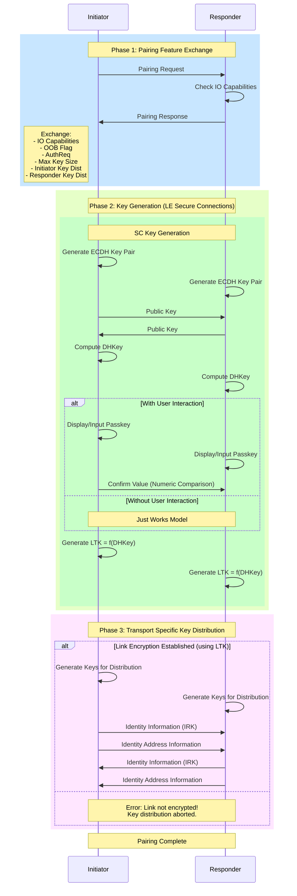
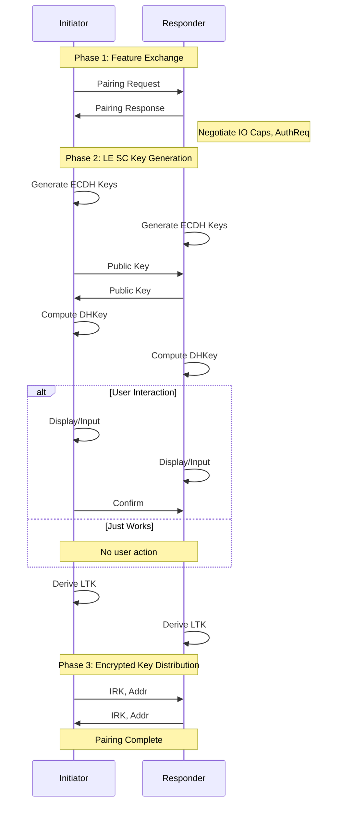
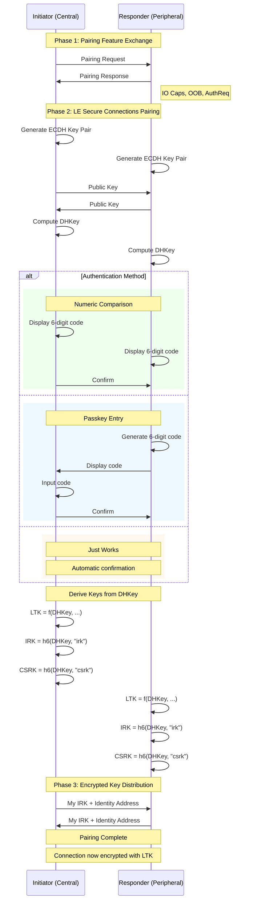

[memo.md](memo.md) 

```mermaid
sequenceDiagram
    participant Initiator
    participant Responder

    rect rgb(200, 230, 255)
        Note over Initiator, Responder: Phase 1: Pairing Feature Exchange
        Initiator->>Responder: Pairing Request
        
        Responder->>Responder: Check IO Capabilities
        Responder->>Initiator: Pairing Response
        
        Note left of Initiator: Exchange:<br>- IO Capabilities<br>- OOB Flag<br>- AuthReq<br>- Max Key Size<br>- Initiator Key Dist<br>- Responder Key Dist
    end
    
    rect rgb(230, 255, 200)
        Note over Initiator, Responder: Phase 2: Key Generation (LE Secure Connections)
        
        rect rgb(200, 255, 200)
            Note over Initiator, Responder: SC Key Generation
            Initiator->>Initiator: Generate ECDH Key Pair
            Responder->>Responder: Generate ECDH Key Pair
            
            Initiator->>Responder: Public Key
            Responder->>Initiator: Public Key
            
            Initiator->>Initiator: Compute DHKey
            Responder->>Responder: Compute DHKey
            
            alt With User Interaction
                Initiator->>Initiator: Display/Input Passkey
                Responder->>Responder: Display/Input Passkey
                Initiator->>Responder: Confirm Value (Numeric Comparison)
            else Without User Interaction
                Note over Initiator, Responder: Just Works Model
            end
            
            Initiator->>Initiator: Generate LTK = f(DHKey)
            Responder->>Responder: Generate LTK = f(DHKey)
        end
    end
    
    rect rgb(255, 230, 255)
        Note over Initiator, Responder: Phase 3: Transport Specific Key Distribution
        
        alt Link Encryption Established (using LTK)
            Initiator->>Initiator: Generate Keys for Distribution
            Responder->>Responder: Generate Keys for Distribution
            
            Initiator->>Responder: Identity Information (IRK)
            Initiator->>Responder: Identity Address Information
            
            Responder->>Initiator: Identity Information (IRK)
            Responder->>Initiator: Identity Address Information
        else
            Note over Initiator, Responder: Error: Link not encrypted!<br>Key distribution aborted.
        end
    end
    
    Note over Initiator, Responder: Pairing Complete
```

```mermaid
sequenceDiagram
    participant I as Initiator
    participant R as Responder

    Note over I, R: Phase 1: Feature Exchange
    I->>R: Pairing Request
    R->>I: Pairing Response
    Note right of R: Negotiate IO Caps, AuthReq

    Note over I, R: Phase 2: LE SC Key Generation
    I->>I: Generate ECDH Keys
    R->>R: Generate ECDH Keys
    I->>R: Public Key
    R->>I: Public Key
    I->>I: Compute DHKey
    R->>R: Compute DHKey

    alt User Interaction
        I->>I: Display/Input
        R->>R: Display/Input
        I->>R: Confirm
    else Just Works
        Note over I, R: No user action
    end

    I->>I: Derive LTK
    R->>R: Derive LTK

    Note over I, R: Phase 3: Encrypted Key Distribution
    I->>R: IRK, Addr
    R->>I: IRK, Addr
    Note over I, R: Pairing Complete
```
## IRK(Identity Resolving Key) usage

```mermaid
sequenceDiagram
    participant I as Initiator (Central)
    participant R as Responder (Peripheral)

    Note over I, R: Phase 1: Pairing Feature Exchange
    I->>R: Pairing Request
    R->>I: Pairing Response
    Note right of R: IO Caps, OOB, AuthReq

    Note over I, R: Phase 2: LE Secure Connections Pairing
    
    I->>I: Generate ECDH Key Pair
    R->>R: Generate ECDH Key Pair
    
    I->>R: Public Key
    R->>I: Public Key
    
    I->>I: Compute DHKey
    R->>R: Compute DHKey

    alt Authentication Method
        rect rgba(200, 255, 200, 0.3)
            Note over I, R: Numeric Comparison
            I->>I: Display 6-digit code
            R->>R: Display 6-digit code
            I->>R: Confirm
        end
    else
        rect rgba(200, 230, 255, 0.3)
            Note over I, R: Passkey Entry
            R->>R: Generate 6-digit code
            R->>I: Display code
            I->>I: Input code
            I->>R: Confirm
        end
    else
        rect rgba(255, 230, 200, 0.3)
            Note over I, R: Just Works
            Note over I, R: Automatic confirmation
        end
    end

    Note over I, R: Derive Keys from DHKey
    I->>I: LTK = f(DHKey, ...)
    I->>I: IRK = h6(DHKey, "irk")
    I->>I: CSRK = h6(DHKey, "csrk")
    
    R->>R: LTK = f(DHKey, ...)
    R->>R: IRK = h6(DHKey, "irk")
    R->>R: CSRK = h6(DHKey, "csrk")

    Note over I, R: Phase 3: Encrypted Key Distribution
    I->>R: My IRK + Identity Address
    R->>I: My IRK + Identity Address

    Note over I, R: Pairing Complete
    Note over I, R: Connection now encrypted with LTK
```