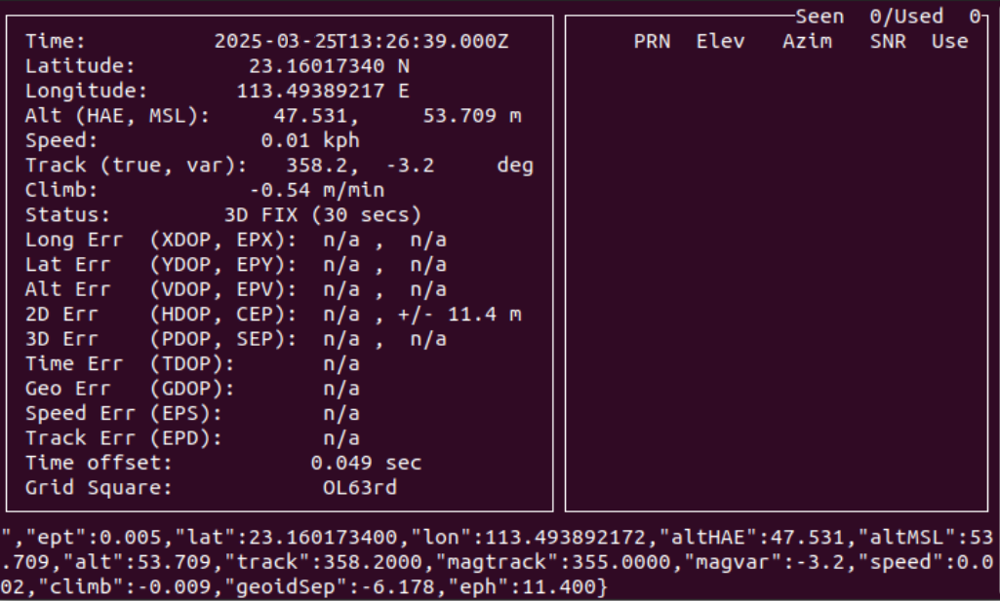
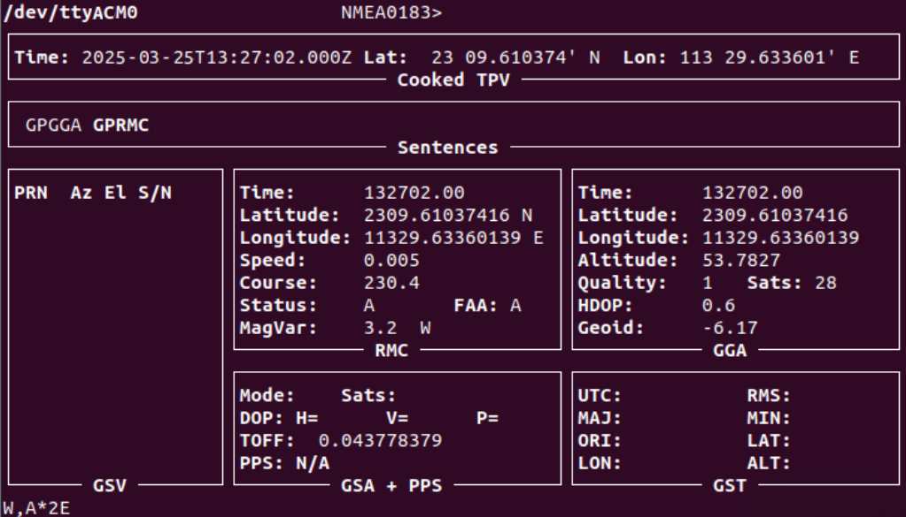

[memo](memo.md)

# GPSD
|命令	|说明|
|    ----         |     -----    |
|gpsd	|最重要的 GPSD 服务守护进程|
|gpsprof	|一个为错误统计和设备超时产生报告的分析器|
|gpsctl	|一个调整设备设置的公共程序|
|gpsdecode	|一个把传感器日志批量转换成可读的 JSON 的程序|
|gpsfake	|一个能够连接任意数目的活动传感器日志的测试套件，可以重复运行有错误报告的传感器日志来重新产生特定的问题|
|cgps	|将 GPS 结果以图形化显示|
|gpsmon	|将 GPS 结果以图形化显示|

## Install GPSD
```c
sudo apt install gpsd gpsd-clients
```
## Start GPSD​
```c
sudo systemctl start gpsd
```
## Stop GPSD
```c
sudo systemctl stop gpsd
sudo systemctl stop gpsd.socket
```
## Chekc gpsd service status 
```c
$ sudo systemctl status gpsd 
[sudo] password for eric: 
Warning: The unit file, source configuration file or drop-ins of gpsd.service changed on disk. Run 'systemctl daemon-reload' to reload units. 
● gpsd.service - GPS (Global Positioning System) Daemon 
     Loaded: loaded (/usr/lib/systemd/system/gpsd.service; disabled; preset: enabled) 
     Active: active (running) since Tue 2025-03-25 15:23:14 CST; 2min 11s ago 
TriggeredBy: ● gpsd.socket 
       Docs: man:gpsd 
    Process: 7173 ExecStart=/usr/sbin/gpsd $GPSD_OPTIONS $OPTIONS $DEVICES (code=exited, status=0/SUCCESS) 
   Main PID: 7174 (gpsd) Tasks: 1 (limit: 9063) 
     Memory: 952.0K (peak: 1.4M) 
        CPU: 175ms 
     CGroup: /system.slice/gpsd.service 
             └─7174 /usr/sbin/gpsd -F /var/run/gpsd.sock dev/ttyACM0

Mar 25 15:23:14 eric-pi systemd[1]: Starting gpsd.service - GPS (Global Positioning System) Daemon... 
Mar 25 15:23:14 eric-pi (gpsd)[7173]: gpsd.service: Referenced but unset environment variable evaluates to an empty string: OPTIONS 
Mar 25 15:23:14 eric-pi systemd[1]: Started gpsd.service - GPS (Global Positioning System) Daemon.
```
## Configure GPSD​
```c
sudo gedit /etc/default/gpsd
```
/dev/ttyACM0 means serial port for the GPS module. Please check and change it according to your devcie.  

```c
# Devices gpsd should collect to at boot time.
# They need to be read/writeable, either by user gpsd or the group dialout.
DEVICES="/dev/ttyACM0"
 
# Other options you want to pass to gpsd
GPSD_OPTIONS="-F /var/run/gpsd.sock"
 
# Automatically hot add/remove USB GPS devices via gpsdctl
USBAUTO="true"
```

```c
sudo gedit /lib/systemd/system/gpsd.service
```
```c
[Unit]
Description=GPS (Global Positioning System) Daemon
Requires=gpsd.socket
# Needed with chrony SOCK refclock
After=chronyd.service
 
[Service]
Type=forking
EnvironmentFile=-/etc/default/gpsd
ExecStartPre=/bin/stty speed 115200 -F $DEVICES
ExecStart=/usr/sbin/gpsd $GPSD_OPTIONS $DEVICES
 
[Install]
WantedBy=multi-user.target
Also=gpsd.socket
```
Note: Please restart gpsd service for the new configuration.

## Verify GPSD
```c
cgps
```
<div align="center">
  
</div>

```c
gpsmon
```
<div align="center">
  