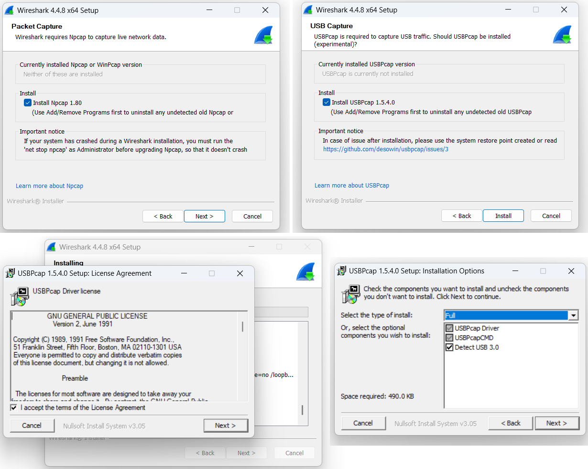
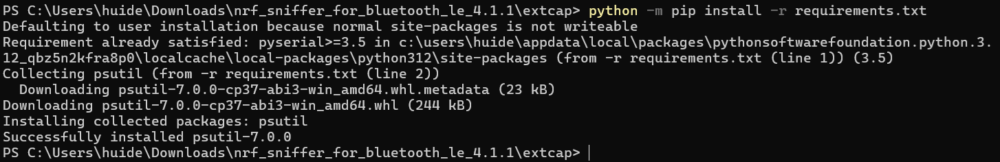
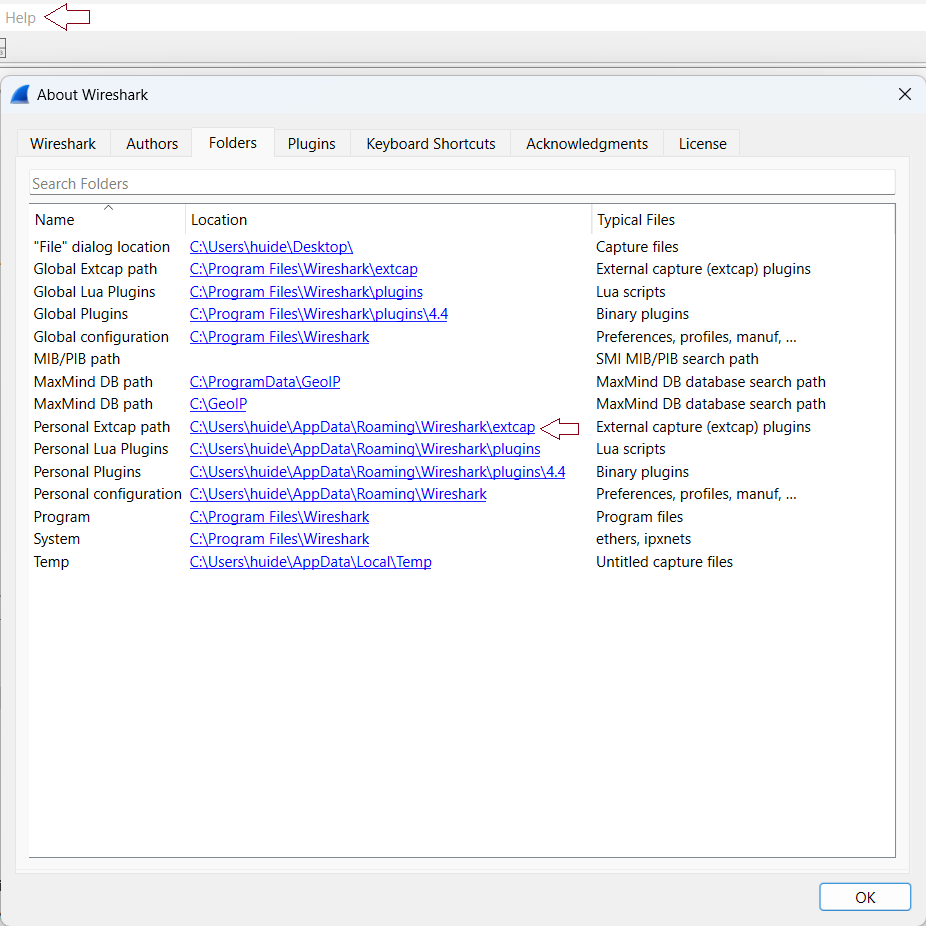
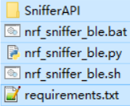
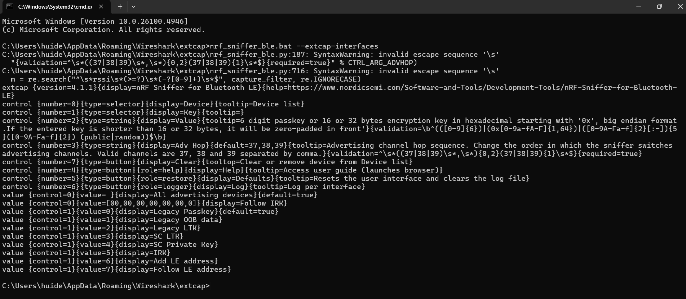
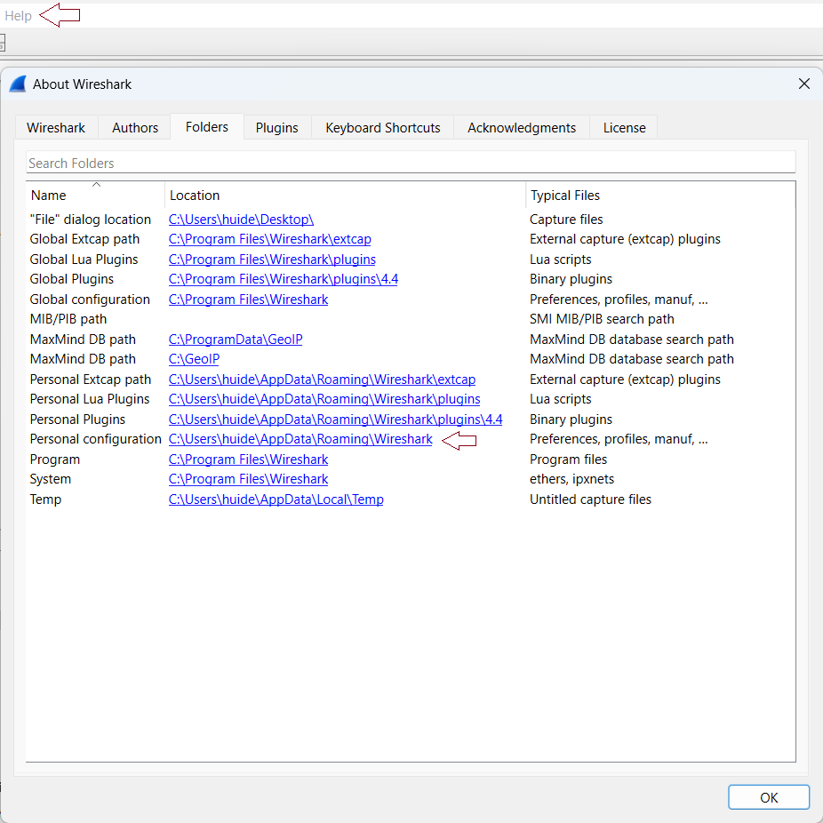
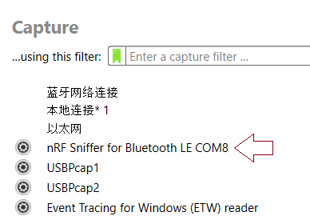

[memo.md](memo.md) 

# nRF Sniffer在wireshark下的环境搭建
## 1 准备
nRF Sinffer 官网下载：[nRF Sniffer for Bluetooth LE](https://nsscprodmedia.blob.core.windows.net/prod/software-and-other-downloads/desktop-software/nrf-sniffer/sw/nrf_sniffer_for_bluetooth_le_4.1.1.zip)  
wireshark 官网下载：[Wireshark](https://www.wireshark.org/#download)


## 2 wireshark安装
点击下载的安装包，按说明点选。  
*安装路径不要有中文，直接用默认的即可。  
*要选择USBPcap，否则无法识别外部的USB设备。 
<div align="center">
  
</div> 

这时打开刚才安装好的wireshark并没有看到nRF Sniffer，需要额外配置。

## 3 nRF Sinffer配置
### 3.1. Python安装
使用3.6及以上。网上有很多安装教程，这里不介绍。
### 3.2. 安装pyserial v3.5
以管理员身份运行cmd,运行如下命令
```c
pip install pyserial
```
已安装,自行略过。
### 3.3. 安装依赖
将下载的nrf_sniffer包解压。
进入nrf_sniifer_for_bluetooth--》extcap文件，按住shirft，右键，选择打开cmd，先打开cmd，再切换到这个路径也行。

```c
cd nrf_sniffer_for_bluetooth\extcap
```
在cmd下运行如下命令
```c
python -3 -m pip install -r requirements.txt
```

<div align="center">
  
</div> 


## 4. 配置wireshark 环境
### 4.1 打开wireshark--> 帮助 --> 关于wireshark --> 文件夹 --> 双击Personal Extcap path
打开wireshark的extcap文件夹
<div align="center">
  
</div> 

### 4.2 将nrf_sniffer_for_bluetooth文件夹下的extcap的一些信息拷贝到刚才打开的文件夹下 
<div align="center">
  
</div> 


### 4.3 在wireshark的extcap目录路径下运行如下命令：
```c
nrf_sniffer_ble.bat --extcap-interfaces
```
<div align="center">
  
</div> 

### 4.4 将nrf_sniffer_for_bluetooth文件夹下的 Profile_nRF_Sniffer_Bluetooth_LE文件夹拷贝到“个人配置”文件夹下。
<div align="center">
  
</div> 

### 4.5 重新打开wireshark软件。
<div align="center">
  
</div> 

已经能看到nRF Sniffer了，双击后即可开始抓包。 


# nRF Sniffer 在Wireshark中的使用

## 1 说明
使用nRF Sniffer在wireshark中抓包是经常使用的。但是每次抓包会获取到空气中所有的数据包，数据量非常大。而对于开发人员而言，只需要其中特定的信息。此时就需要掌握数据的过滤语句。

## 2 过滤
### 2.1.根据MAC地址进行过滤
```c
btle.advertising_address == ab:89:67:45:23:01
```


### 2.2 过滤长度为0的包，即过滤掉空包

```c
!(btle.length == 0)
```


### 2.3.只显示ATT数据包
```c
btatt
```


### 2.4.只显示配对过程数据包

```c
btsmp
```

### 2.5.只显示L2CAP层数据包，包括ATT、SMP、L2CAP 层数据包
```c
btl2cap
```

### 2.6.显示连接请求包
```c
_ws.col.info == "CONNECT_IND"
```

### 2.7.显示非37、38、39通道的数据包
```c
((!(nordic_ble.channel == 37)) && !(nordic_ble.channel == 38)) && !(nordic_ble.channel == 39)
```

### 2.8.显示特定数据帧长度的数据包
```c
frame.len == 38
```

### 2.9.以信号强度过滤
```c
nordic_ble.rssi > -50
```
