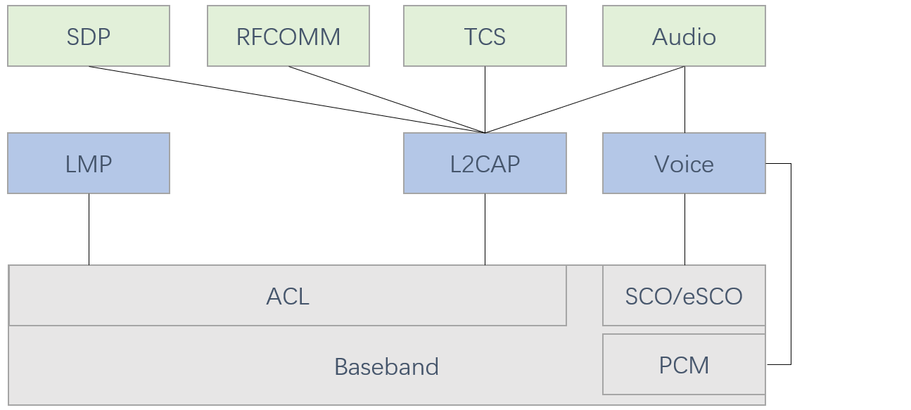
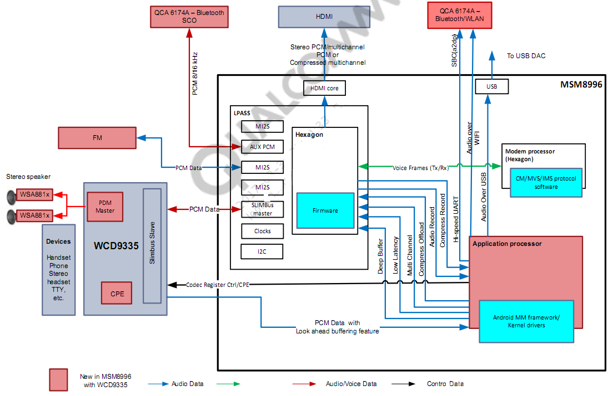

# 蓝牙的音频通路
<div align="center">
  
</div>

A2DP, Advanced Audio Distribution Profile  
ACL, Asynchronous Connectionless 异步无连接  
SCO, Synchronous Connection Oriented 主要用来传输对时间要求很高的数据通信  
HSP, Headset Profile,耳机模式  
HFP, Hands-free Profile,免提模式  
AVRCP, Audio/Video Remote Control Profile,音频/视频遥控规格

LMP, Link Management Protocol,用于链路建立和控制   
L2CAP, Logical Link Control and Adaptation Protocol,即逻辑链路控制和适配协议  
PCM, Pulse Code Modulation,即脉冲编码调制  
TCS, Telephony Control protocol Specification

音频通路有三种，分别是
|  音频通路   | 音频数据传输路径  |  应用场景    |
|  ----      | ----             |   ----      |
| 1  | Audio->L2CAP->ACL->HCI->Baseband       | A2DP     |
| 2  | Audio->Voice->SCO/eSCO->HCI->Baseband  | HFP,HSP  |
| 3  | Audio->Voice->PCM->Baseband            | HFP,HSP  |

蓝牙通话的方式有音频通路2、音频通路3,两者差别在于
|  音频通路   | 音频数据传输方式  |
|  ----      | ----             |
| 2  | 通过HCI接口发送给蓝牙基带  |
| 3  | 通过PCM接口传送给蓝牙基带  |

# [Qualcomm Audio HAL 音频通路](https://blog.csdn.net/azloong/article/details/79383323)
```
| Front End PCMs    |  SoC DSP  | Back End DAIs | Audio devices |

                    *************
PCM0 <------------> *           * <----DAI0-----> Codec Headset
                    *           *
PCM1 <------------> *           * <----DAI1-----> Codec Speakers/Earpiece
                    *   DSP     *
PCM2 <------------> *           * <----DAI2-----> MODEM
                    *           *
PCM3 <------------> *           * <----DAI3-----> BT
                    *           *
                    *           * <----DAI4-----> DMIC
                    *           *
                    *           * <----DAI5-----> FM
                    *************
```
|Front End PCMs| Soc DSP| Back End DAIs  | Audio Device |
|  ----      | ----             | ----             | ----             |
| 音频前端,一个前端对应着一个 PCM 设备 |实现路由功能,连接 FE PCMs 和 BE DAIs，例如连接 PCM0 与 DAI1  | 音频后端,一个后端对应着一个 DAI 接口，一个 FE PCM 能够连接到一个或多个 BE DAI | headset、speaker、earpiece、mic、bt、modem 等,不同的设备可能与不同的 DAI 接口连接，也可能与同一个 DAI 接口连接（如上图，Speaker 和 Earpiece 都连接到 DAI1）|

```
                    *************
PCM0 <============> *<====++    * <----DAI0-----> Codec Headset
                    *     ||    *
PCM1 <------------> *     ++===>* <====DAI1=====> Codec Speakers/Earpiece
                    *           *
PCM2 <------------> *           * <----DAI2-----> MODEM
                    *    DSP    *
PCM3 <------------> *           * <----DAI3-----> BT
                    *           *
                    *           * <----DAI4-----> DMIC
                    *           *
                    *           * <----DAI5-----> FM
                    *************
```

高通 MSM8996 音频框图
<div align="center">
  
</div>

```
FE PCMs：
  deep_buffer
  low_latency
  mutil_channel
  compress_offload
  audio_record
  usb_audio
  a2dp_audio
  voice_call
```
|      |    |
|  ----      | ----             |
| low_latency | 按键音、触摸音、游戏背景音等低延时的放音场景  |
| deep_buffer | 音乐、视频等对时延要求不高的放音场景  |
|  compress_offload  | mp3/flac/aac等格式的音源播放场景，无需软件解码，直接把数据送到硬件解码器(aDSP)，由硬件解码器(aDSP)解码  |
| record  | 普通录音场景 |
| record_low_latency | 低延时的录音场景   |
| voice_call | 语音通话场景  |
|  voip_call  | 网络通话场景  |


```
BE DAIs：
  SLIM_BUS
  Aux_PCM
  Primary_MI2S
  Secondary_MI2S
  Tertiary_MI2S
  Quatermary_MI2S
```

# 路由选择
```
   <path name="deep-buffer-playback speaker">
        <ctl name="QUAT_MI2S_RX Audio Mixer MultiMedia1" value="1" />
    </path>

    <path name="deep-buffer-playback headphones">
        <ctl name="TERT_MI2S_RX Audio Mixer MultiMedia1" value="1" />
    </path>

    <path name="deep-buffer-playback earphones">
        <ctl name="QUAT_MI2S_RX Audio Mixer MultiMedia1" value="1" />
    </path>

    <path name="low-latency-playback speaker">
        <ctl name="QUAT_MI2S_RX Audio Mixer MultiMedia5" value="1" />
    </path>

    <path name="low-latency-playback headphones">
        <ctl name="TERT_MI2S_RX Audio Mixer MultiMedia5" value="1" />
    </path>

    <path name="low-latency-playback earphones">
        <ctl name="QUAT_MI2S_RX Audio Mixer MultiMedia5" value="1" />
    </path>
```

[AudioOnAndroid](AudioOnAndroid.md)