一、简介
R&SCMW500宽带无线通信测试仪是适用于射频集成和协议开发的通用测试平台，其内部集成RF功率计和带List模式的CW发生器，可以完成无线设备的快速校准；同时还集成了矢量信号分析仪(VSA)和矢量信号发生器(VSG)，用来进行发射机和接收机的指标测试。

R&SCMW500前面板及按键功能说明如下：

  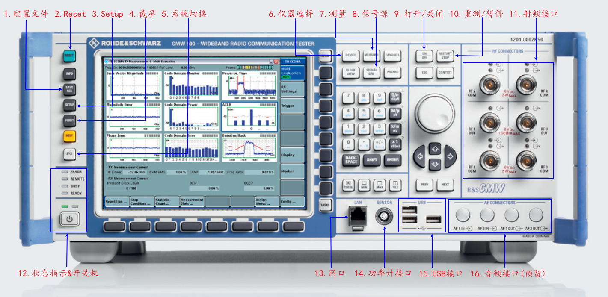

| 序号 | 按键 | 功能 | 说明 |
| ---- | ---- | ---- | ---- |
| 1 | 配置文件(SAVE/RLC) | 保存或调用用户针对某一项测量任务设置的参数信息 | 默认保存路径为D:/Rohde-Schwarz/CMW/SAVE  |
| 2 | Reset | 将CMW500恢复为默认设置 | CMW500有Reset和Preset两种恢复默认的方式，Reset常在自动化控制时使用，Preset常在手动时使用 | 
| 3 | Setup | 查看仪器的基本信息或对CMW500进行基本参数设置(IP地址、参考频率、触发方式等) |  | 
| 4 | 截屏(Print) | 截屏，保存图片 |  | 
| 5 | 系统切换(sys) | 在CMW应用软件和Windows操作系统之间进行切换 |  | 
| 6 | 仪器选择(Device) | 将仪表设置为双仪表模式，在这种模式下，两台虚拟仪表可以独立运行 | 该按键只对双通道配置的CMW500才起作用 | 
| 7 | 测量(measure) | 加载测量的应用 | 一般有两种，一种是针对特定标准的解调测量或者接收机测量，另一种是通用的UE发射机测量 | 
| 8 | 信号源(Signal Gen) | 加载信号源设置的应用 | CMW500的信号源有信令信号源、通用信号源(GPRF Generator)和实时信号源三种，其中在非信令或者校准应用时一般采用GPRF Generator；在信令综测应用时，一般采用| 信令信号源；实时信号源一般用于手动非信令测试调试 | 
| 9 | 打开/关闭(ON/OFF) | 打开或关闭测量，打开或关闭信号源 |  | 
| 10 | 重测/暂停(Restart/STOP) | Restart可以在测量状态为RDY的情况下，重新启动一次测量；STOP可以将正在运行的测量停止 |  | 
| 11 | 射频接口(RF Connectors) | 信号源输入输出端口 | CMW500共有6个射频接口，其中RF1C~RF4C为Communication接口，既可以作为信号源输出端口，也可以作为分析仪测量输入端口；而RF1O、RF2O为输出端口，只能输出信号； | 
| 12 | 状态指示&开关机 | 状态指示灯：显示仪器运行状态;开关机：仪器上电或断电 | Error灯闪烁表示仪器的参考时钟没有设置正确;Remote灯亮表示仪器正在被自动化控制状态下;Busy灯亮表示CMW应用正在加载模块 | 
| 13 | 网口(LAN) | 用于自动化控制，远程桌面 | 最高速率为100Mbit/s | 
| 14 | 功率计接口(SENSOR) | 连接NRP系列的功率计用于测量外部信号或者对信号源进行校准 |  | 
| 15 | USB接口 | 用来连接鼠标、键盘、外部光驱等设备 | USB 2.0标准接口 | 
| 16 | 音频接口(AF) | 预留给CMW支持音频测试用 |  | 

二、环境搭建与测试步骤
2.1 经典蓝牙
Bluetooth核心规范中定义了经典蓝牙(BR/EDR)的测试应由用户通过内部主机控制接口(HCI)激活或使能EUT的测试模式，在测试仪器与EUT建立Bluetooth连接后，测试仪器直接通过LMP指令控制EUT进行相关指标的测试。测试连接示意图如下：

  

经典蓝牙信令测试步骤(测试仪器CMW500)：

- 1 按照连接示意图连接EUT和CMW500，并通过指令激活或使能EUT的测试模式。
- 2 通过Signal Gen按键选择Bluetooth应用程序。
- 3 在Bluetooth Signaling中设置经典蓝牙测试基本参数(Burst Type、Loopback、Signal Characteristics等)。

  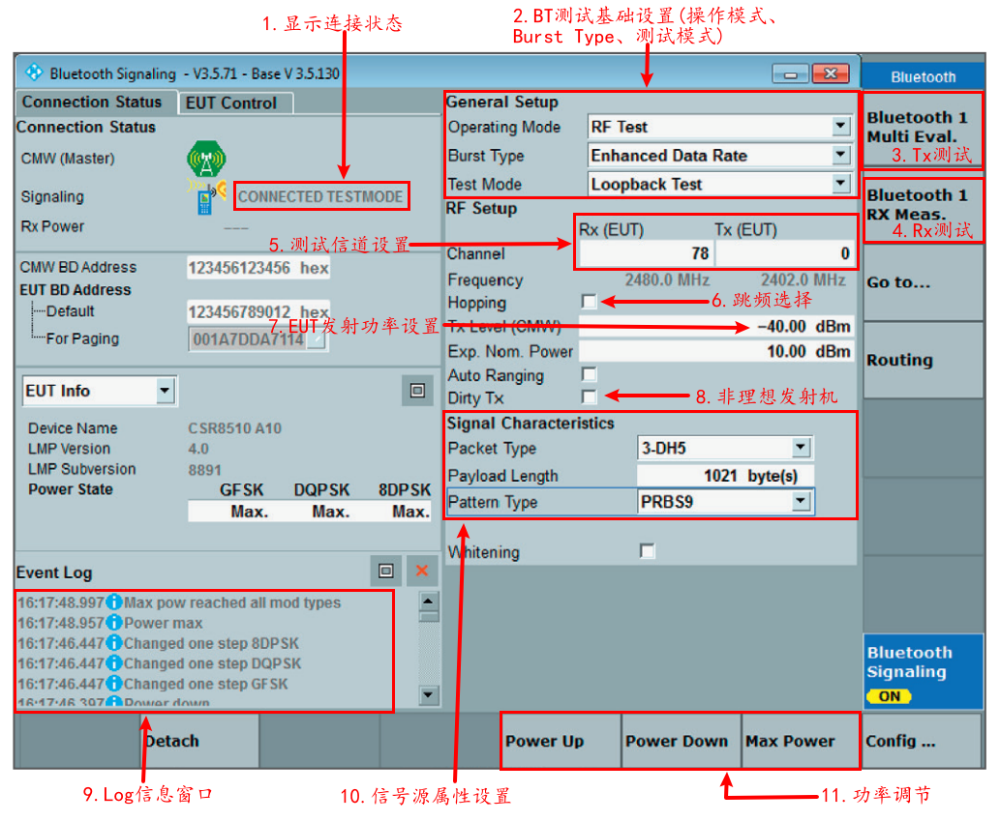

打开信号源,点击COnnect连接CMW500与EUT。
单击Bluetooth Multi-Eval(或Bluetooth Rx Measurement)切换到TX(或Rx)测量界面，并在Multi-Evaluation(或Bluetooth Rx Measurement)被选择的情况下按下ON/OFF激活测量。

  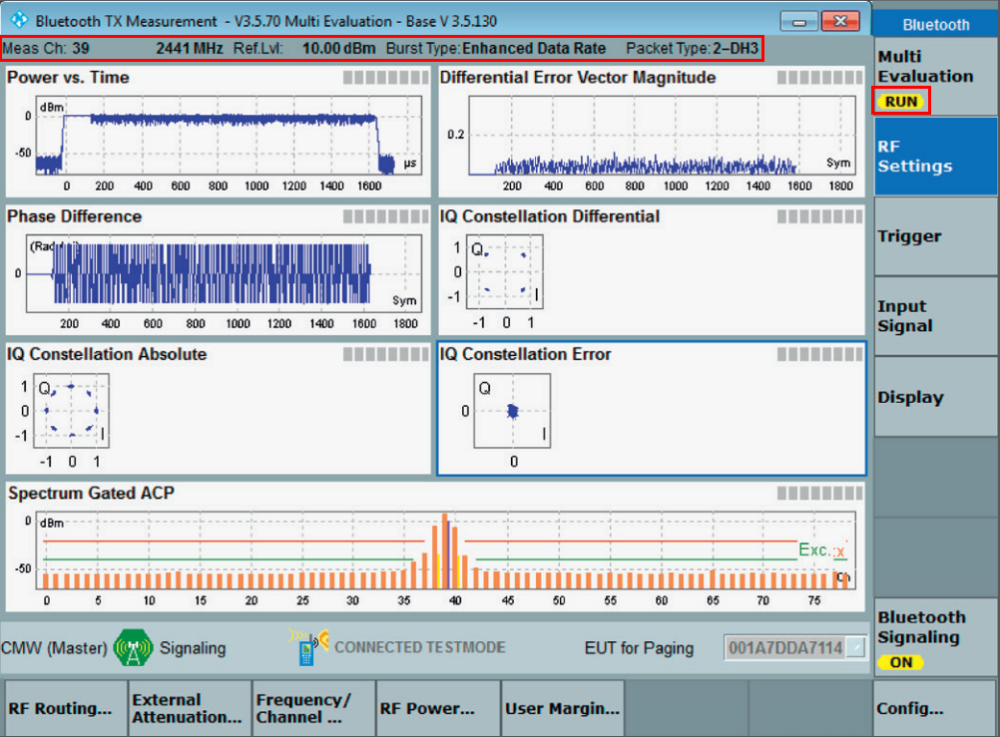

2.2 BLE
Bluetooth核心规范中定义BLE是采用直接测试模式(DTM)进行RF测试，这种模式需要使用HCI或双线协议的UART接口连接EUT和测试仪器。测试连接示意图如下：

  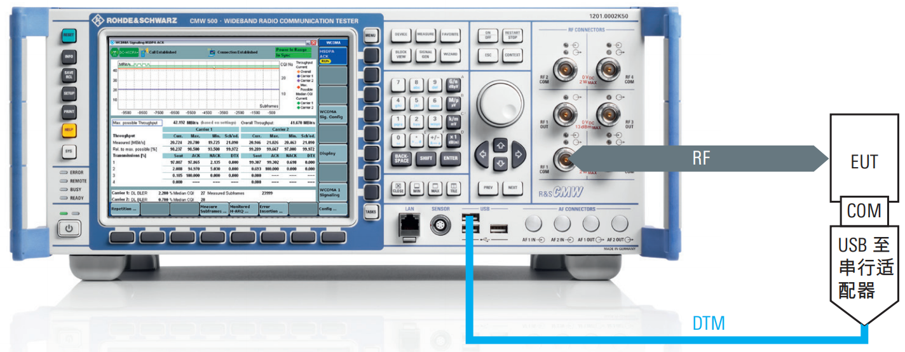

BLE信令测试步骤(测试仪器CMW500)：

按照连接示意图连接EUT和CMW500。
通过Signal Gen按键选择Bluetooth应用程序。
在Bluetooth Signaling中设置BLE测试基本参数(Burst Type、PHY等)，在EUT Control界面选择与EUT的连接类型(UART、USB、RS232)，再设置接口参数(如串口号、波特率等)。

  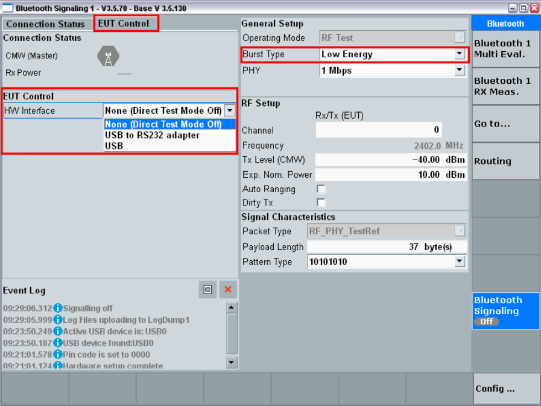

打开信号源，点击COnnection Check验证CMW500与EUT是否通讯正常。

  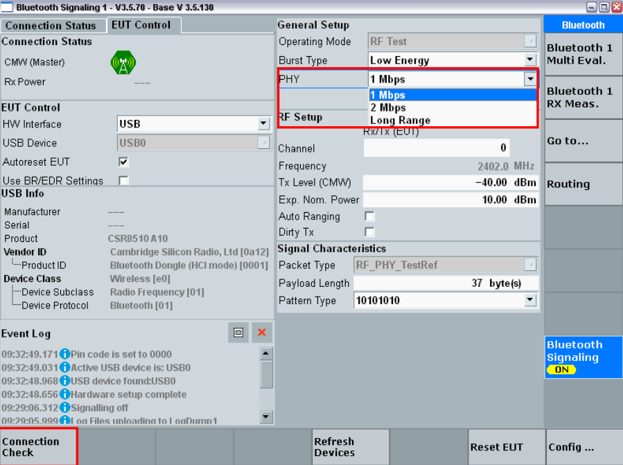

单击Bluetooth Multi-Eval(或Bluetooth Rx Measurement)切换到TX(或Rx)测量界面，并在Multi-Evaluation(或Bluetooth Rx Measurement)被选择的情况下按下ON/OFF激活测量。

  

关于使用CMW系列综测仪进行BLE测量的环境搭建与测试步骤，ROHDE & SCHWARZ官网这个视频做了更详细的讲解：

三、测试指标
3.1 BR
3.1.1 输出功率
仪器配置

使EUT工作在环回(Loop back)测试模式，链路选择非跳频(不勾选Hopping)。
设置Burst Type为BR，Pattern Type为PRBS9，Payload Length设置为最大byte。
按照测试选择对应的DH分组和Channel，通常DH分组需要遍历测试DH1、DH3、DH5，Channel需要遍历测试Low、Middle、High信道。
测试方法

按Power Up将发射功率调到最大。
在测试界面读取Power的Peak值和Average值。

  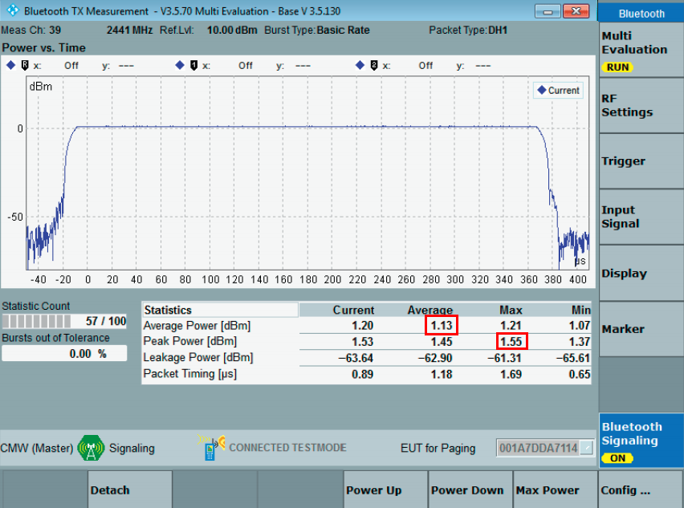

标准

 & 
如果EUT的功率等级为1，
如果EUT的功率等级为2，
如果EUT的功率等级为3，
3.1.2 功率控制
仪器配置

同3.1.1

测试方法

按Power Up把发射功率调到最大，再按Power down逐渐降低EUT的输出功率，并且每按一次就记录一次Power的Average值，然后再根据记录的平均功率计算出下降Step值。
按Power up逐渐升高EUT的输出功率，并且每按一次就记录一次Power的Average值，然后再根据记录的平均功率计算出上升Step值。
标准

对于功率等级为1的EUT，在最小功率台阶时应满足
3.1.3 频谱范围
仪器配置

同3.1.1

测试方法

设置测试频点为2402MHz，在Spectrum Frequency Range界面进行测试，记录
和
值。
设置测试频点为2480MHz，在Spectrum Frequency Range界面进行测试，记录
和
值。
标准：
、
应在2.4GHz~2.4835GHz范围内。

3.1.4 20dB带宽
仪器配置

同3.1.1

测试方法

在Spectrum 20dB Bandwidth界面进行测量，记录
。

  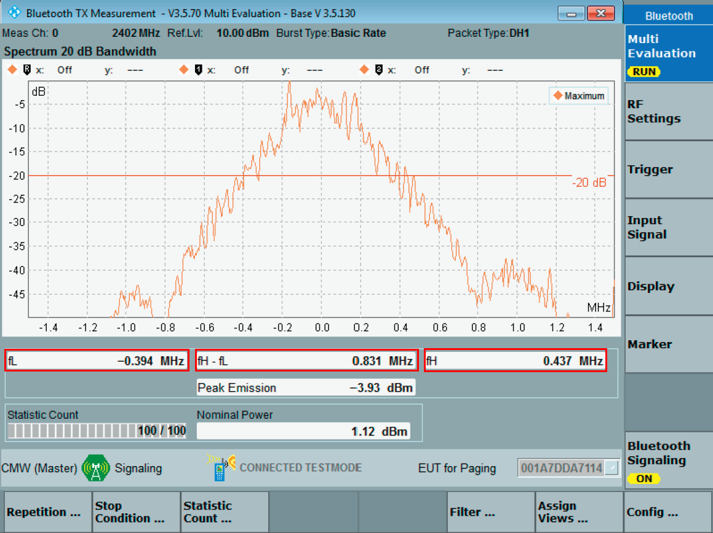

标准

如果
，
如果
，
3.1.5 邻道功率
仪器配置

同3.1.1

测试方法

按Power Up把发射功率调到最大。
在Spectrum ACP界面进行测试，记录
的值。

  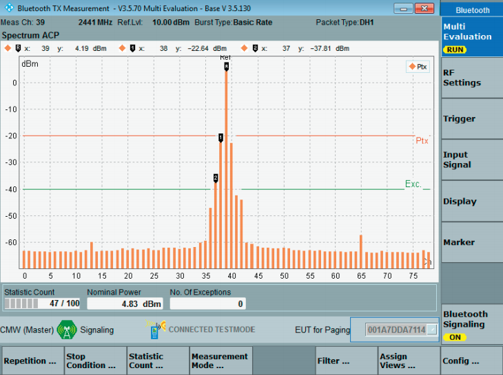

标准

设定EUT的测试信道(最大功率)为M，相邻信道为N，则：

对于|M-N|=2，
对于|M-N|≥3，
3.1.6 调制特性
仪器配置

使EUT工作在环回(Loop back)测试模式，链路选择非跳频(不勾选Hopping)。
设置Burst Type为BR，Pattern Type为11110000，Payload Length设置为最大byte。
按照测试选择对应的DH分组和Channel，通常DH分组需要遍历测试DH1、DH3、DH5，Channel需要遍历测试Low、Middle、High信道。
测试方法

按Power Up把发射功率调到最大。
在TX Measurement Modulation界面进行测试，记录
。
把Pattern Type设置为10101010模式，记录
和
。
标准

 
 
3.1.7 载波频率准确度
仪器配置

使EUT工作在环回(Loop back)测试模式，链路选择跳频(勾选hopping)。
设置Burst Type为BR，Pattern Type为PRBS9，Payload Length设置为最大byte。
按照测试选择对应的DH分组和Channel，通常DH分组需要遍历测试DH1、DH3、DH5，Channel需要遍历测试Low、Middle、High信道。
测试方法

按Power Up把发射功率调到最大。
在TX Measurement Modulation界面测试，记录Freq Accuracy的平均值。

  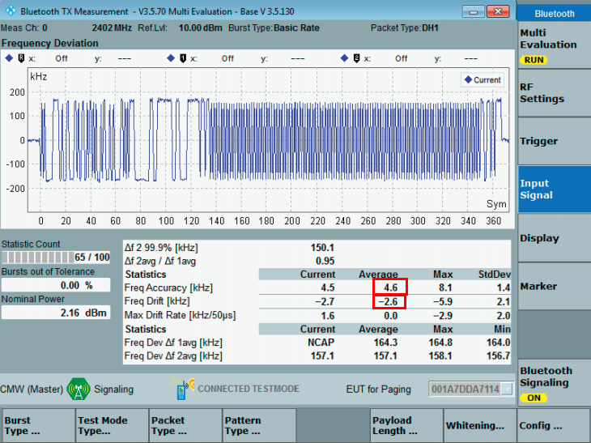

标准：
(其中
为载波频率；
为测量信道标称频率)

3.1.8 载波频率漂移
仪器配置

使EUT工作在环回(Loop back)测试模式，链路选择非跳频(不勾选Hopping)。
设置Pattern Type为10101010，Payload Length设置为最大byte。
按照测试选择对应的DH分组和Channel，通常DH分组需要遍历测试DH1、DH3、DH5，Channel需要遍历测试Low、Middle、High信道。
测试方法

按Power Up把发射功率调到最大。
在TX Measurement Modulation界面测试，记录Freq Dift和Freq Dift Rate的平均值。

  

标准

对于Freq Dift参数：
DH1：

DH3&DH5：
对于Freq Dift Rate参数，需满足
＜
3.1.9 接受灵敏度
仪器配置

同3.1.1

测试方法

按Power Up把发射功率调到最大，打开不理想发射机，勾选Dirty Tx，设置接收包数量为1000。
在RX Quality界面设置CMW500的发射功率，开始测试，观察丢包率是否≤0.1%，如果满足要求，则以1dB为步进，逐渐降低发射功率，记录丢包率≤0.1%的最小发射功率为接受灵敏度。
标准：

3.1.10 最大输入电平
仪器配置

同3.1.1

测试方法

按Power Up把发射功率调到最大，打开不理想发射机，勾选Dirty Tx，设置接收包数量为1000。
在RX Quality界面设置CMW500的发射功率，开始测试，观察丢包率是否≤0.1%，如果满足要求，则以1dB为步进，逐渐增大发射功率，记录丢包率≤0.1%的最大发射功率为最大输入电平。
标准： 最大接收电平

3.2 EDR
3.2.1 输出功率
仪器配置

使EUT工作在环回(Loop back)测试模式，链路选择非跳频(不勾选Hopping)。
设置Burst Type为EDR，Pattern Type为PRBS9，Payload Length设置为最大byte。
按照测试选择对应的DH分组和Channel，通常DH分组需要遍历测试2-DH1、2-DH3、2-DH5、3-DH1、3-DH3、3-DH5，Channel需要遍历测试Low、Middle、High信道。
测试方法

逐次按Power Up将发射功率调到最大。
在Power vs. time界面进行测试，记录
的平均值。

  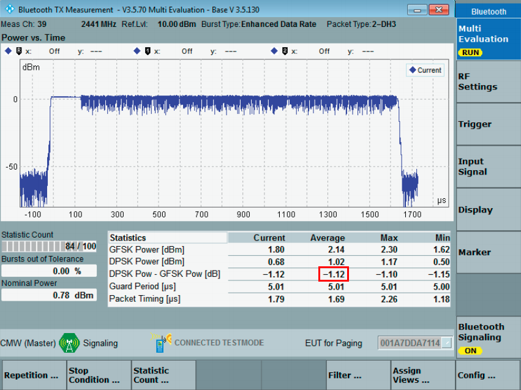

标准： 

3.2.2 载波频率准确度和调制精准度
仪器配置

同3.2.1

测试方法

逐次按Power Up将发射功率调到最大。
在TX Measurement Modulation界面进行测试，记录ω0、ωi、ωi+ω0、RMS DEVM、Peak DEVM、99% DEVM测量值。

  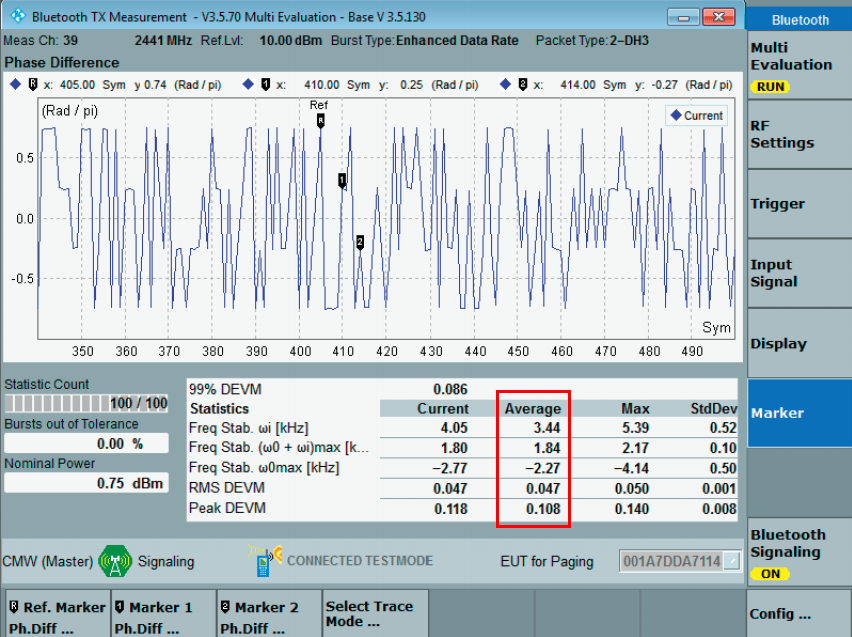

标准

-75KHz≤ωi≤75KHz，for all packets
-75KHz≤ωi+ω0≤75KHz，for all blocks
-10KHz≤ω0≤10KHz，for all blocks
对于EDR 2M，RMS DEVM≤0.2
对于EDR 3M，RMS DEVM≤0.13
对于EDR 2M，Peak DEVM≤0.35
对于EDR 3M，Peak DEVM≤0.25
对于EDR 2M，99% DEVM≤0.3
对于EDR 3M，99% DEVM≤0.2
3.2.3 差分相位编码准确度
仪器配置

同3.2.1

测试方法

逐次按Power Up将发射功率调到最大。
在Differencial Phase Encoding界面进行测试，记录测量值。

  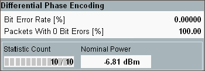

标准： Packets with 0 Bit Errors≥99%

3.2.4 带内杂散发射
仪器配置

同3.2.1

测试方法

逐次按Power Up将发射功率调到最大。
在Spectrum ACP界面进行测试，记录测量值。

  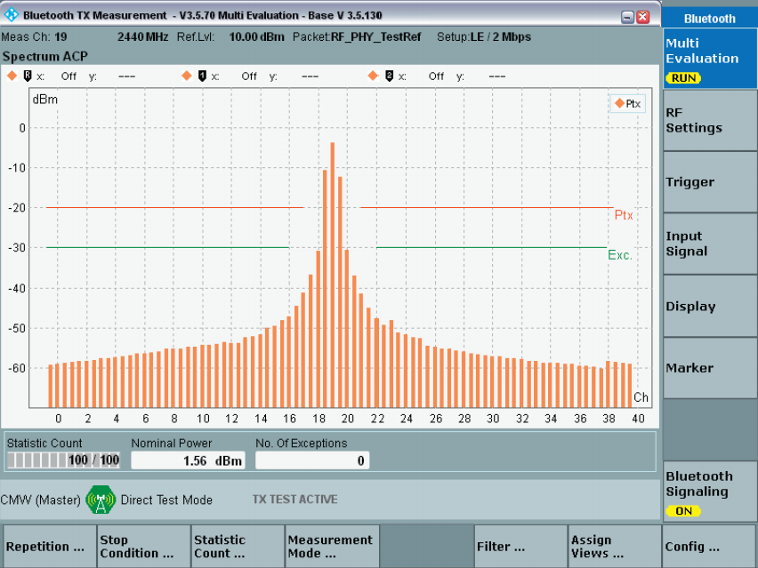

标准

设定EUT的测试信道(最大功率)为M，相邻信道为N，则：

EDR带内杂散功率必须比最大功率测量结果(离开载频最大500kHz)低26dB
对于|M-N|=2，
对于|M-N|≥3，
3.2.5 接收灵敏度
仪器配置

同3.2.1

测试方法

按Power Up把发射功率调到最大，打开不理想发射机，勾选Dirty Tx，设置接收包数量为1000。
在RX Quality界面设置CMW500的发射功率，开始测试，观察丢包率是否≤0.01%，如果满足要求，则以1dB为步进，逐渐降低发射功率，记录丢包率≤0.01%的最小发射功率为接收灵敏度。
标准：

3.2.6 最大输入电平
仪器配置

同3.2.1

测试方法

按Power Up把发射功率调到最大，设置接收包数量为1000。
在RX Quality界面设置CMW500的发射功率，开始测试，观察丢包率是否≤0.1%，如果满足要求，则以1dB为步进，逐渐增大发射功率，记录丢包率≤0.1%的最大发射功率为最大输入电平。
标准： 最大接收电平

参考资料

CMW500操作面板及常用接口按键说明
Bluetooth Low Energy (V5.0) RF-Test for Internet of Things Applications
ROHED & SCHWARZ官网
蓝牙BR/EDR测试的测试指标及其测试方法