# MAVIC4 Pro


|无线协议|功能|特点|
|--|--|--|
|OcuSync|图传<br>控制|控制延迟5ms<br>1080p/4K视频流,延迟130ms|
|4G|图传<br>控制|抗遮挡备份,OcuSync信号弱/断开启用<br>延迟100-200ms<br>流量消耗|
|Wi-Fi|图传|720p视频流,延迟200ms+|
|Bluetooth|控制<br>状态同步|延迟20-50ms<br>仅适用于起降、慢速平移等简单操作|


```mermaid
barChart
title 延迟对比
xAxis 协议类型
yAxis 延迟(ms)
series
    OcuSync控制：5
    OcuSync视频：130
    4G图传：180
    手机直连控制：220
    BLE状态：40
    4G状态：100
```


# MIC2


通讯路径    
- 手机蓝牙直连模式(无接收器)  
    ○ TX 发射器 -> 手机:蓝牙 BR/EDR HFP 协议  
    ○ 接单个TX, 传输单声道音频  
    ○ 未来可能支持LE Audio  
    ○ 延迟20-50ms  
- 接收器  
    ○ TX -> RX, 2.4GHz 专有协议  
    ○ TX -> RX, GFSK 调制, 抗干扰强  
    ○ TX -> RX, 可接两个TX, 传输立体声音频  
    ○ RX -> 手机/相机:有线连接(数字或模拟输出)  
    ○ 安全音轨，TX端保存  
    ○ 延迟仅10ms  

```mermaid
graph TB
  subgraph 发射端 TX
    A[麦克风拾音] --> B[TX增益调节]
    B --> C[32位浮点ADC]
    C --> D[8GB 内录音频存储]
    C --> E[2.4GHz专有协议编码]
    C --> F[蓝牙直连手机]
  end

  subgraph 接收端 RX
    E --> G[2.4GHz专有协议解码]
    G --> H[RX增益调节]
    H --> I[AI降噪+DSP处理]
    I --> J[USB-C/Lightning输出]
    I --> K[3.5mm TRS输出]
  end

  subgraph     
    J --> L[手机/电脑]
    K --> M[相机]
    F -->|无降噪| N[手机]
  end

```    

