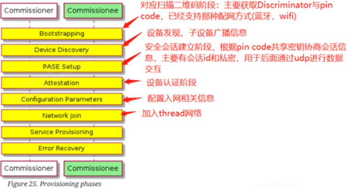

[memo.md](memo.md)  
[Matter.md](Matter.md)  

# matter 配网流程
- commissioner准备好fabric信息（），时间和时区
- commissioner通过ble，softAp或ip网络发现commissionee
- commissioner和commissionee建立PASE
- commissioner设定Fail-safe timer（配网超时timer）
- commissioner配置信息到commissionee：UTC，timezone，DST offset（冬令时夏令时），网络监管配置（wifi国家码）
- commissionee认证（Device Attestation Procedure）
    - AttestationRequest & AttestationResponse Command
    -CertificateChainRequest & CertificateChainResponse Command
    - Attestation Information Validation 设备需要在产测阶段写入DAC，通过PAI签发
commissoner请求csr，commissionee发送csr响应
- commissionee获取noc
  - commissioner生成或获取NOC，添加到commissionee commissioner配置ACL
- commissioner执行CASE

  

# 阶段
整个Matter设备配网(Commissioning)过程可以分为以下几个主要阶段

```mermaid
flowchart TD
    A["设备发现与连接阶段
                    1 Commissioner准备好fabric信息,时间和时区
                    2 扫描发现BLE设备
                    3 通过BLE连接到目标设备
                    4 启动PASE"]--> B["安全配对阶段(PASE)
                    1 PASE_SecurePairing-ReadCommissioningInfo-ReadCommissioningInfo2
                    2 SPAKE2+安全协议握手
                    3 获取设备基本信息(vendorId,productId)
                    4 网络特性识别(支持WiFi)"]
    B --> C["安全认证阶段
                    1 ArmFailSafe-ConfigRegulatory-证书交换-认证验证  
                    2 故障安全设置(60秒超时保护)
                    3 配置设备区域
                    4 证书链交换
                        请求并接收PAI&DAC证书
                    5 认证请求(设备身份验证)"]
    C --> D["操作证书配置阶段
                    1 SendOpCertSigningRequest-ValidateCSR-GenerateNOCChain
                    2 CSR请求(获取设备证书签名)
                    3 CSR验证(验证证书请求有效性)
                    4 NOC生成:生成操作证书链"]
    D --> E["证书部署阶段
                    1 SendTrustedRootCert-SendNOC
                    2 根证书下发:发送信任根证书到设备
                    3 操作证书下发:部署新生成的操作证书
                    4 安全配对完成:确认操作证书配置成功"]
    E --> F["网络配置阶段
                    1 WiFiNetworkSetup-FailsafeBeforeWiFiEnable-WiFiNetworkEnable
                    2 WiFi设置SSID和密码
                    3 故障安全(延长超时)
                    4 网络启用WiFi连接"]
    F --> G["会话迁移阶段
                    1 kEvictPreviousCaseSessions-kFindOperationalForStayActive
                    2 旧会话清理:清除之前的CASES会话
                    3 新会话建立:通过IP网络建立新的CASES安全会话"]
    
    G --> H["完成与清理阶段
                    1 SendComplete → Cleanup
                    2 配网完成命令:发送配网完成指令
                    3 资源清理:关闭BLE连接，清理会话资源
                    4 配网成功:设备配网完成"]
```
