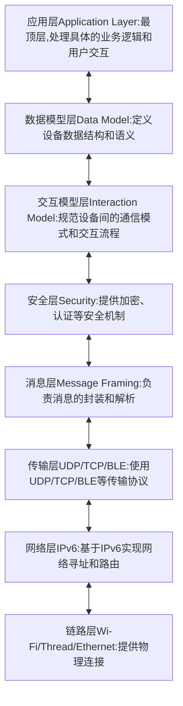

[memo.md](memo.md) 
- [1 Matter 概述](#1-matter-概述)
  - [1.1 什么是 Matter？](#11-什么是-matter)
  - [1.2 设计原则](#12-设计原则)
- [2 核心架构](#2-核心架构)
  - [2.1 协议栈结构](#21-协议栈结构)
  - [2.2 网络拓扑](#22-网络拓扑)
- [3 关键概念](#3-关键概念)
  - [3.1 设备身份与标识](#31-设备身份与标识)
  - [3.2 设备类型(Device Types)](#32-设备类型device-types)
  - [3.3 集群(Clusters)](#33-集群clusters)
- [4 安全机制](#4-安全机制)
  - [4.1 安全通信](#41-安全通信)
  - [4.2 加密原语](#42-加密原语)
- [5 设备配网流程](#5-设备配网流程)
  - [5.1 配网步骤](#51-配网步骤)
  - [5.2 发现机制](#52-发现机制)
- [6 数据模型与交互](#6-数据模型与交互)
  - [6.1 数据模型元素](#61-数据模型元素)
  - [6.2 交互模型](#62-交互模型)
- [7 Matter 1.3 主要更新](#7-matter-13-主要更新)
  - [7.1 新增设备类型](#71-新增设备类型)
  - [7.2 新增集群](#72-新增集群)
  - [7.3 功能增强](#73-功能增强)
- [8 开发资源](#8-开发资源)
  - [8.1 规范文档](#81-规范文档)
  - [8.2 开源 SDK](#82-开源-sdk)
- [9 总结](#9-总结)
- [10 学习建议](#10-学习建议)
  - [1. 项目总览](#1-项目总览)
  - [2. 代码结构详细分析](#2-代码结构详细分析)
    - [2.1 /src/lib/core - 协议的心脏](#21-srclibcore---协议的心脏)
    - [2.2 /src/app 与 /src/app-server - 数据模型的舞台](#22-srcapp-与-srcapp-server---数据模型的舞台)
    - [2.3 /src/controller - 控制器的智慧](#23-srccontroller---控制器的智慧)
    - [2.4 /src/platform - 可移植性的关键](#24-srcplatform---可移植性的关键)
    - [2.5 /examples - 学习的起点与终点](#25-examples---学习的起点与终点)
  - [3. 给入门者的学习建议与路径](#3-给入门者的学习建议与路径)
    - [3.1 第一阶段：搭建环境与“Hello Matter”](#31-第一阶段搭建环境与hello-matter)
      - [3.1.1 搭建 Linux 开发环境：](#311-搭建-linux-开发环境)
      - [3.1.2 编译并运行第一个示例：](#312-编译并运行第一个示例)
    - [3.2 第二阶段：理解数据流与核心概念](#32-第二阶段理解数据流与核心概念)
      - [3.2.1 追踪一次“开灯”命令的完整路径：](#321-追踪一次开灯命令的完整路径)
      - [3.2.2 学习核心概念：](#322-学习核心概念)
    - [3.3 第三阶段：深入代码与动手实践](#33-第三阶段深入代码与动手实践)
      - [3.3.1 阅读 /examples 的代码：](#331-阅读-examples-的代码)
      - [3.3.2 选择性阅读 /src 核心代码：](#332-选择性阅读-src-核心代码)
      - [3.3.3 尝试在真实硬件上运行：](#333-尝试在真实硬件上运行)
    - [3.4 第四阶段：成为贡献者](#34-第四阶段成为贡献者)
  - [总结](#总结)
- [11 Matter 1.5](#11-matter-15)


# 1 Matter 概述
## 1.1 什么是 Matter？
Matter 是由连接标准联盟(CSA)推出的统一智能家居通信协议，旨在解决物联网设备间的互操作性、安全性和兼容性问题。
## 1.2 设计原则
- 简单：易用易开发，支持开箱即用
- 可靠：基于 IP 和成熟技术(Wi-Fi、Thread、以太网)
- 互操作：跨生态通用应用层
- 安全：端到端加密、身份验证、安全配网

# 2 核心架构
## 2.1 协议栈结构


## 2.2 网络拓扑
- 单一网络：所有设备在同一网络(如纯 Wi-Fi 或 Thread)
- 星形网络：通过边界路由器连接多个子网(如 Thread + Wi-Fi)

# 3 关键概念
## 3.1 设备身份与标识
|标识类型|说明|示例|
|--|--|--|
|Fabric ID|	逻辑网络标识|	64位数字|
|Node ID	|设备在 Fabric 中的唯一标识	|64位数字|
|Vendor ID (VID)	|厂商标识	|16位数字|
|Product ID (PID)	|产品型号标识	|16位数字|
## 3.2 设备类型(Device Types)
Matter 1.3 支持的设备类型包括：
- 家用电器：洗衣机、冰箱、烤箱、微波炉等
- 照明设备：灯泡、调光器、颜色灯
- 智能插座/执行器：智能插座、水泵、水阀
- 安防设备：门锁、门磁传感器
- 环境传感器：温度、湿度、空气质量传感器
- 媒体设备：视频播放器、音箱
- 能源设备：电动汽车充电设备(EVSE)

## 3.3 集群(Clusters)
集群是功能模块，定义设备的属性和命令：
通用集群：Identify、Groups、Scenes、On/Off 等
专用集群：Door Lock、Media Playback、Thermostat 等

# 4 安全机制
## 4.1 安全通信
PASE：基于密码的会话建立(用于配网)
CASE：基于证书的会话建立(用于操作通信)
组密钥：用于组播通信

## 4.2 加密原语
AES-CCM：数据加密和完整性保护
ECDSA：数字签名
HKDF：密钥派生
SPAKE2+：密码认证密钥交换

# 5 设备配网流程
## 5.1 [配网步骤](Matter-Commissioning.md)
设备发现：通过 BLE、DNS-SD 发现待配网设备
PASE 建立：使用配对码建立安全通道
设备认证：验证设备证书和认证声明
网络配置：配置 Wi-Fi 或 Thread 网络凭证
CASE 建立：建立操作安全会话
配网完成：设备加入 Fabric，可正常通信

## 5.2 发现机制
可配网节点发现：发现待配网设备
操作发现：发现已配网设备
配网节点发现：设备发现可用的配网器

# 6 数据模型与交互
## 6.1 数据模型元素
节点(Node)：一个物理或逻辑设备
端点(Endpoint)：节点中的功能组件
集群(Cluster)：功能接口(属性 + 命令)
属性(Attribute)：设备状态数据
命令(Command)：对设备的操作指令
事件(Event)：状态变化通知

## 6.2 交互模型
读(Read)：读取属性值
写(Write)：修改属性值
订阅(Subscribe)：监听属性/事件变化
调用(Invoke)：执行命令

# 7 Matter 1.3 主要更新
## 7.1 新增设备类型
电传感器、设备电源管理
水阀、烘干机、电磁炉、炉灶、烤箱、抽油烟机、微波炉
电动汽车供电设备(EVSE)

## 7.2 新增集群
电能计量、电力计量
洗衣烘干控制、烤箱运行状态
设备能源管理、能源 EVSE

## 7.3 功能增强
媒体设备功能增强
门锁功能更新
支持基于 TCP 的大数据传输
ICD(间歇性连接设备)完善

# 8 开发资源
## 8.1 规范文档
核心规范：协议架构、安全、配网
设备类型库：支持的设备类型定义
应用集群库：功能集群详细定义

## 8.2 开源 SDK
Matter SDK 提供完整开发框架
支持多种芯片平台和操作系统

# 9 总结
Matter 通过统一的应用层协议，解决了智能家居设备间的互操作性问题。  
其基于 IP 的设计、端到端的安全机制和灵活的配网方式，使其成为未来智能家居的重要基础协议。


软件开发重点章节指南
第一阶段：基础入门(必读)
1. 第1-3章：架构概述
1.1-1.3：了解三个核心规范的关系

第3章：总体架构
3.2 分层架构 → 理解协议栈层次
3.5 唯一标识 → Fabric ID、Node ID等
3.8 设备配网 → 整体流程概念

2. 第5章：配网(Commissioning) 
5.1 配网信息：二维码、配对码格式
5.3 用户导向配网(UDC)：现代配网方式
5.5 配网流程：完整配网步骤

这是实现设备入网的核心，必须掌握

第二阶段：核心开发(重点精读)
3. 第7章：数据模型规范 
7.8-7.10：节点、端点、Cluster概念
7.11-7.14：命令、属性、事件定义
7.18 数据类型：TLV编码基础

这是定义设备功能的基石

4. 第8章：交互模型规范 
8.4 读交互
8.7 写交互
8.8 调用交互
8.5 订阅交互

这些是实现设备控制的核心API

5. 第14章：应用功能集 
根据你的设备类型选择对应Cluster
14.1 通用Cluster(Identify、Groups等)
其他专用Cluster(如14.5 Door Lock、14.6 Media等)
参考你设备需要实现的Cluster定义

第三阶段：进阶主题(按需学习)
6. 第4章：安全通信策略
4.14 PASE/CASE会话建立
4.8 消息安全处理
安全功能开发时重点阅读

7. 第11章：服务与设备管理
11.1 基本信息Cluster
11.9 网络配网Cluster
11.20 OTA软件更新

设备管理功能开发时需要

8. 第6章：设备认证
设备证书和认证流程

产品认证和安全性要求

对于APP/控制器开发：
优先级1: 第5章(配网) + 第8章(交互模型)
优先级2: 第7章(数据模型) + 第14章(Cluster用法)
优先级3: 第4章(安全通信)

立即行动建议
先从第5章配网开始 - 这是设备可用的前提
理解第7章的数据模型概念 - 这是Matter的设备抽象核心
掌握第8章的交互模式 - 这是控制设备的方式
查阅第14章中你设备类型的Cluster - 确定具体实现内容

注意事项
不必深究加密算法细节(第2.6章)，除非专门做安全开发
暂时跳过网络层细节(Thread/Wi-Fi)，SDK会封装
语义标签(第17章)等高级特性可后续学习

重点关注"必须的(M)"和"可选的(O)"一致性要求

实践结合
建议边阅读边结合：
Matter SDK示例代码
你所用芯片平台的Matter demo
Matter Simulator模拟器
这样的学习路径能让你快速上手实际开发，避免陷入规范细节的泥潭。需要某个具体功能的详细说明时，再回头查阅相应章节即可。


# 10 学习建议
## 1. 项目总览
connectedhomeip(简称 CHIP)是 CSA(连接标准联盟)官方维护的 Matter 协议的开源实现。它提供了一个完整的、可移植的 SDK，用于开发 Matter 设备(如灯、开关、传感器)和 Matter 控制器(如手机 App、智能音箱、网关)。
- 核心目标：实现 Matter 规范，确保不同厂商设备间的互操作性。
- 代码管理：使用 Git 子模块管理部分第三方依赖。
- 构建系统：基于 GN(Generate Ninja)，一个快速、可扩展的元构建系统。这不同于传统的 Make 或 CMake。
- 语言：主要为 C++(核心协议栈)，辅以 Python(用于编译、测试、工具链)、Java(Android Controller)和 Swift/Obj-C(iOS/darwin Controller)。

## 2. 代码结构详细分析
让我们深入到代码库的根目录，理解每个关键文件夹的作用。
```c
connectedhomeip/
├── build/                           # 【构建时生成】编译输出目录，非源码
├── config/                          # 项目级别的配置，如编译选项、特性开关
├── examples/                        # 【学习核心】最重要的示例程序
│   ├── all-clusters-app/           # 包含所有标准 Clusters 的设备示例
│   ├── lighting-app/               # 精简的灯具设备示例(最推荐入门)
│   ├── lock-app/                   # 智能锁设备示例
│   ├── bridge-app/                 # 网桥设备示例(连接非Matter设备)
│   └── ... (其他平台特定的示例，如 linux, esp32, nrfconnect 等)
├── src/                            # 【核心源码】Matter 协议栈和平台抽象层的实现
│   ├── app/                        # 应用层逻辑，包括 Interaction Model, CASESession 管理等
│   ├── app-server/                 # 设备端的数据模型和 Cluster 实现
│   ├── controller/                 # 控制器端的逻辑(用于 commissioning, 控制设备)
│   ├── crypto/                     # 密码学相关(P256, AES-CCM, HKDF等)
│   ├── inet/                       # 网络抽象层(TCP/UDP)
│   ├── lib/                        # 核心协议实现
│   │   ├── core/                   # 最核心的编码、解码、TLV、协议帧定义
│   │   ├── protocols/              # 具体协议实现(BDX, IMD, Secure Channel等)
│   │   └── address_resolve/        # 地址解析
│   ├── platform/                   # 【平台移植关键】硬件平台抽象层
│   │   ├── Linux/                  # Linux 平台实现
│   │   ├── ESP32/                  # ESP32 平台实现
│   │   ├── nRFConnect/             # Nordic nRF52 平台实现
│   │   └── ...                     # 其他平台
│   └── setup_payload/              # 二维码和手动配对码的解析与生成
├── scripts/                        # Python 脚本，用于编译、测试、证书生成等
├── third_party/                    # 第三方库(通过子模块引入，如 nlunit-test, nlfaultinjection)
└── integrations/                   # 与其他框架的集成(如 Android, Java, Darwin/iOS)
```

核心模块深度解读：
### 2.1 /src/lib/core - 协议的心脏
- 这里定义了 Matter 数据交换的“语言”。
- TLV(Tag-Length-Value)：Matter 自定义的轻量级编码格式，位于 TLVReader.h/.cpp 和 TLVWriter.h/.cpp。所有结构化数据(属性、命令)都通过 TLV 编码传输。理解 TLV 是理解 Matter 数据流的基础。
- CHIP Error：统一的错误码定义。
- 协议消息头：定义了各种协议层(安全会话、交互模型)的报文头结构。

### 2.2 /src/app 与 /src/app-server - 数据模型的舞台
- Interaction Model (IM)：位于 /src/app。这是 Matter 的核心交互范式，定义了设备如何发布其数据(属性)，以及控制器如何请求数据(读属性)或触发动作(命令)。ReadHandler, WriteHandler, CommandHandler 是关键类。
- Cluster 实现：位于 /src/app-server。这里包含了所有标准 Cluster(如 OnOffCluster, LevelControlCluster, DoorLockCluster)的服务端实现。每个 Cluster 都是一组相关的属性、命令和事件的集合。当你开发一个设备时，你主要是在和这些 Cluster 打交道。

### 2.3 /src/controller - 控制器的智慧
- 这是控制器(如手机 App)的 SDK。它封装了：
  - 设备发现(mDNS)。
  - 配对流程(PASE, CASE)。
  - 与设备交互(发送读/写属性命令，调用命令)。
  - 集群信息解析(从设备读取 Cluster 列表)。
- CHIPDeviceController 是这个模块的入口点。

### 2.4 /src/platform - 可移植性的关键
- Matter 的核心协议栈不依赖于任何特定的硬件或操作系统。所有平台相关的功能(如网络、蓝牙、存储、加密、日志)都通过这个平台抽象层 来访问。
- 平台抽象层的设计目标是：隐藏平台差异，提供一致的接口。例如，当协议栈需要发送一个 UDP 数据包时，它会调用 InetLayer 的接口，而 InetLayer 在 Linux 上会调用 Linux 的 Socket API，在 ESP32 上会调用 ESP-IDF 的 LwIP API。
- 如果你想将 Matter 移植到一个新的平台上，主要工作就是实现这个目录下的接口。

### 2.5 /examples - 学习的起点与终点
- 这是最直观、最应该花时间研究的地方。每个示例都展示了一个完整 Matter 设备的实现。
- lighting-app 是最佳入门点，因为它功能单一(开/关，调光)，代码结构清晰，可以让你快速理解一个 Matter 设备从启动、广播、配网到响应控制的全过程。

## 3. 给入门者的学习建议与路径
直接阅读 /src 的核心代码可能会感到不知所措。遵循一个循序渐进、理论与实践结合的路径至关重要。
### 3.1 第一阶段：搭建环境与“Hello Matter”
#### 3.1.1 搭建 Linux 开发环境：
- 建议使用 Ubuntu 20.04/22.04。按照官方文档 scripts/setup/bootstrap.sh 脚本安装所有依赖(编译器、Python、GN等)。这是最不容易出错的平台。
- 理解 GN 的基本概念：gn gen out/debug 生成构建文件，ninja -C out/debug 进行编译。

#### 3.1.2 编译并运行第一个示例：
- 目标：在 Linux PC 上编译并运行 lighting-app 和 chip-tool(一个命令行控制器)。
- 命令示例：
```c
# 编译 lighting-app (设备)
gn gen out/debug --args='chip_config_memory_debug_checks=true'
ninja -C out/debug lighting-app

# 编译 chip-tool (控制器)
ninja -C out/debug chip-tool

# 在一个终端运行设备
./out/debug/standalone/chip-lighting-app

# 在另一个终端使用控制器进行配网和控制
```c
./out/debug/chip-tool pairing onnetwork 110 20202021
./out/debug/chip-tool onoff on 110
```
- 成就感：当你用 chip-tool 成功点亮虚拟的 lighting-app 时，你已经完成了 Matter 设备交互的完整闭环。这是你学习的第一个重要里程碑。

### 3.2 第二阶段：理解数据流与核心概念
在成功运行示例后，带着问题去阅读代码：

#### 3.2.1 追踪一次“开灯”命令的完整路径：
- 从 chip-tool 发出 onoff on 命令开始。
- 在 lighting-app 的代码中(examples/lighting-app/lighting-common.cpp)找到 OnOffCluster 的 On 命令处理函数 emberAfOnOffClusterOnCommandCallback。
- 尝试在这个函数里加一行日志，重新编译运行，观察命令是否到达这里。
- 思考：这个命令是如何从网络到达这个回调函数的？中间经过了哪些层(网络传输、安全解密、IM 解析、Cluster 分发)？

#### 3.2.2 学习核心概念：
- Node(节点)：一个 Matter 设备。
- Endpoint(端点)：一个虚拟的逻辑设备。一个节点可以有多个端点(例如，一个多功能灯具，端点1是灯，端点2是传感器)。
- Cluster(集群)：功能的集合。OnOff Cluster 定义了 On, Off, Toggle 命令和 OnOff 属性。
- Attribute(属性) 和 Command(命令)：设备的状态和可执行的动作。
- 对照 lighting-app 的 ZAP 配置文件(examples/lighting-app/lighting-common.zap)来理解这些概念是如何在代码中配置和生成的。

### 3.3 第三阶段：深入代码与动手实践
#### 3.3.1 阅读 /examples 的代码：
- 从 main.cpp 开始，看设备如何初始化(Server::Init())，如何启动事件循环。
- 然后阅读 lighting-common.cpp，看 Cluster 命令是如何被处理的。
- 最后，尝试模仿 OnOffCluster，添加一个自定义的属性(比如一个 Count 属性)，并实现读/写它的功能。这需要你修改 ZAP 文件并重新生成代码。

#### 3.3.2 选择性阅读 /src 核心代码：
- 带着问题去读，比如“TLV 是如何编码一个整数的？”，然后去 TLVWriter::Put 函数里找答案。
- 重点关注 /src/app 中的 Interaction Model 逻辑，理解它如何路由消息。

#### 3.3.3 尝试在真实硬件上运行：
- ESP32 是极佳的入门硬件。按照官方指南，为 ESP32 编译和烧写 lighting-app。
- 使用手机上的 Matter 控制器 App(如 iOS 的“家庭”App)去配网和控制真实的 LED 灯。这个体验会极大地加深你的理解。

### 3.4 第四阶段：成为贡献者
- 阅读并分析 Issue：在 GitHub 上找一些标记为 good first issue 的问题。
- 运行和编写测试：理解项目的测试框架，尝试运行单元测试和集成测试。
- 提交 Pull Request：尝试修复一个简单的 bug 或补充文档。

## 总结
connectedhomeip 是一个结构清晰但规模庞大的项目。入门的关键在于：
- 不要一开始就陷入核心协议的细节。
- 从 examples/lighting-app 和 chip-tool 的交互入手，先让代码跑起来，获得直观感受。
- 采用“问题驱动”的学习方法，追踪一个具体功能的代码流。
- 理论与实践结合，尽快在真实硬件上看到效果。

# 11 Matter 1.5 
作为一次重要的功能扩展，引入了多个全新的设备类型，并在能源管理、网络传输等方面进行了显著增强。

下面这个表格清晰地梳理了 Matter 1.5 相对于 1.4 版本的主要更新点。

|特性分类	|Matter 1.4	|Matter 1.5|
|----|----|----|
|新设备类型	|• 太阳能电池板、电池、热泵、热水器<br/>• 固定式开关和可调节负载控制器	|• 摄像头(支持实时视频/音频)<br/>• 闭合设备(如窗帘、车库门)<br/>• 土壤传感器|
| 能源管理	|• 引入能源报告，支持太阳能、电池等设备<br/>• 增强电动汽车充电设备(EVSE) 功能	|• 新增电能费率设备类型，支持电价、碳强度信息共享<br/>• 增强智能计量，支持复杂电价<br/>• EV充电支持双向充电和电量状态报告认证|
| 网络与性能	|• 引入长空闲时间(LIT) 协议，优化电池设备续航<br/>• 认证家庭路由器和接入点(HRAP)，提升网络可靠性	|• 支持 TCP传输，提升大数据传输效率(如视频、固件更新)|

新版本意味着什么  
- 对普通用户而言，选择更丰富了。你可以直接通过支持Matter的生态App(如苹果家庭、Google Home)查看兼容的摄像头实时画面，或统一控制不同品牌的智能窗帘、车库门，无需为每个设备安装单独的App。土壤传感器则能帮你更科学地照料植物。
- 对开发者和厂商而言，开发更高效了。新设备类型有了统一的规范，减少了自定义集成的工作量。TCP支持也让摄像头等高带宽设备的实现更为顺畅。
- 对未来智能家居的影响，Matter 1.5 让智能家居的互联互通迈上了一个新台阶。摄像头的加入补上了关键一环，而能源管理能力的深化，使得智能家居不再只是控制单个设备，而是能作为一个整体系统，更智能、高效地与家庭能源系统协同工作。

[Matter 工具chip-tool 编译之编译方法](https://blog.csdn.net/akuanglin/article/details/138954496)  
```c
			git clone --recurse-submodules https://github.com/project-chip/connectedhomeip.git
			git submodule update --init --recursive

		source ./scripts/bootstrap.sh 
		./scripts/examples/gn_build_example.sh examples/chip-tool BUILD_PATH
```
[matter CHIPTool Android demo编译](https://bbs.aithinker.com/forum.php?mod=viewthread&tid=47077&_dsign=d9e258ac)  
[Matter协议解析记录](https://blog.csdn.net/qq_45689245/article/details/135272551)  
[Matter学习笔记1](https://blog.csdn.net/qq_56914146/article/details/131209867)  