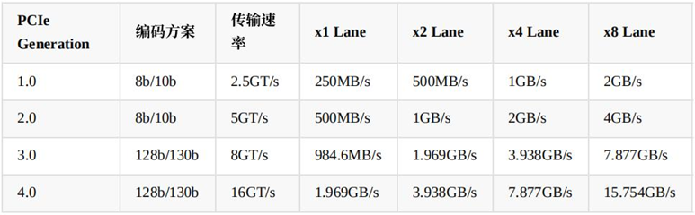
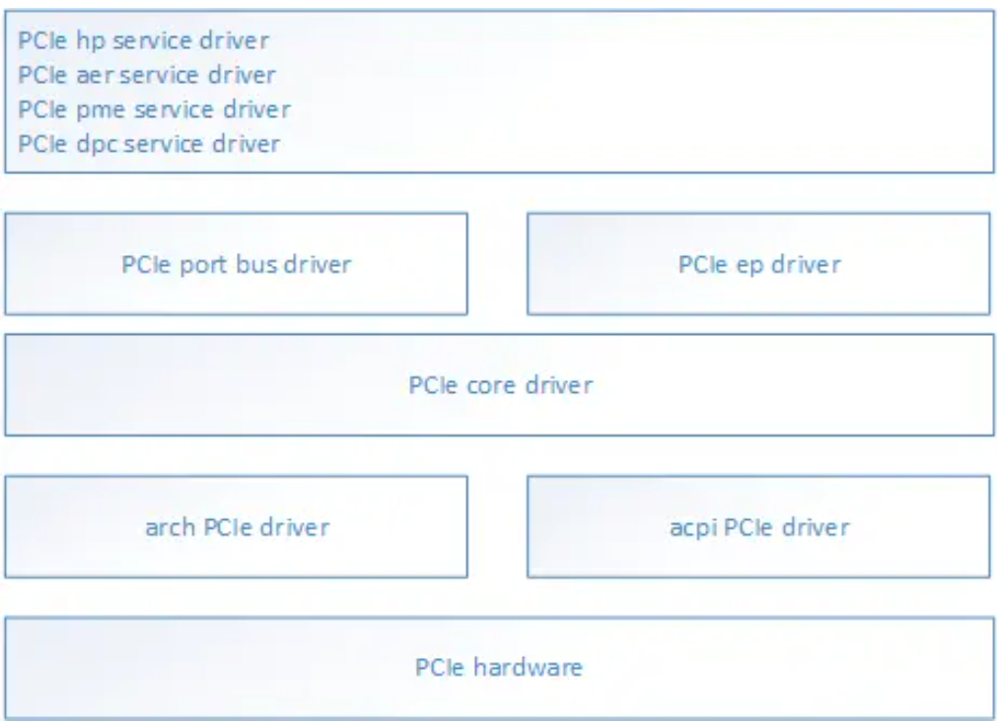
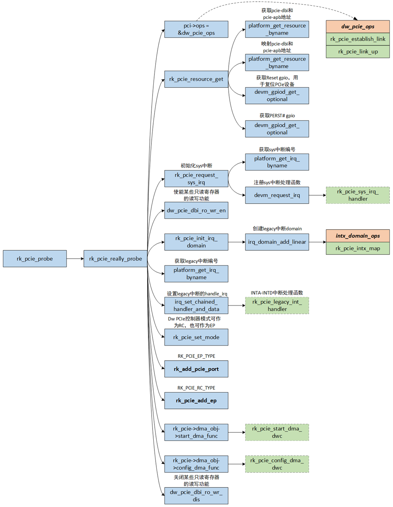

[memo.md](memo.md)   
# PCIe总线简介
<div align="left">
  
</div>

```c
(1) Root Complex是树的根，它一般实现了一个主桥设备（host bridge），
    一条内部PCIe总线bus0，以及通过若干PCI bridge扩展出一些root port。
    host bridge可以完成CPU地址总线到PCI域地址的转换，
    pci bridge用于系统扩展，没有地址转换功能；
(2) Switch是转换设备，目的是扩展PCIe总线。
    switch中有一个upstream port和若干个downstream port，
    每个端口相当于一个pci bridge；
(3) PCIe EP device是叶子节点设备，比如PCIe网卡，显卡。NVMe卡等；
```
# 传输速率简介
PCIe 分类、速度，按lane的个数分有 x1 x2 x4 x8 x16 （最大可支持32个通道），按代来分 有 gen1 gen2 gen3 gen4
<div align="left">
  
</div>

# PCIe的软件框架
PCIe模块涉及到的代码文件很多，在分析PCIe的代码前，先对PCIe涉及的代码梳理如下：
这里以arm架构为例，PCIe代码主要分散在3个目录：
bash 体验AI代码助手 代码解读复制代码drivers/pci/*
drivers/acpi/pci/*
arch/arm/match-xxx/pci.c

将PCIe代码按照如下层次划分：

<div align="left">
  
</div>

```
arch PCIe driver：放一些和架构强相关的PCIe的函数实现，对应arch/arm/xxx/pci.c

acpi PCIe driver: acpi扫描时所涉及的PCIe代码，包括host bridge的解析初始化，PCIe bus的创建，ecam的映射等，对应drivers/acpi/pci*.c

PCIe core driver：PCIe的子系统代码，包括PCIe的枚举流程，资源分配流程，中断流程等，主要对应drivers/pci/*.c

PCIe port bus driver：PCIe port的四个service代码的整合，四个service主要是指PCIe dpc/pme/aer/hp，对应drivers/pci/pcie/*

PCIe ep driver：叶子节点的设备驱动，比如显卡、网卡、NVMe；
```

# PCIe总线-RK3588 PCIe驱动设备树介绍 

##　1.简介
在Linux内核中设备树中，定义了一系列属性，用来描述PCIe总线。比如"bus-range"属性，描述PCIe某个domain的总线编号范围，比如"ranges"属性，描述PCIe地址转换。下面将分别介绍这些属性。

##　2.设备类型
由于PCIe总线有一些特有的属性，需要在驱动初始化的时候内核自动解析。因此需要在设备树定义设备类型，如下所示。当设备类型为"pci"时，内核就知道这是一个PCI Host Brage。
```c
[arch/arm64/boot/dts/rockchip/rk3588.dtsi]
pcie3x4: pcie@fe150000 {
    ......
    device_type = "pci";
    ......
}
```
Linux内核调用__of_node_is_type函数解析设备类型。
```ｃ
[drivers/of/base.c]
static bool __of_node_is_type(const struct device_node *np, const char *type)
{
	const char *match = __of_get_property(np, "device_type", NULL);

	return np && match && type && !strcmp(match, type);
}
```
#　3.PCI域
在Linux内核中，一个PCI设备，通常使用domain number:bus number:device number.function number(比如0000:00:00.0)描述。domain number表示PCI域的编号，bus number表示总线编号，device number表示设备编号，function number表示功能编号，bus number、device number和function number也称之为BDF。PCI域用来给PCI Host Brage编号，有几个PCI Host Brage，就有几个PCI域。通常情况下，各个PCI域之间不能直接通信。在设备树中，PCI域使用"linux,pci-domain"属#性描述。
```ｃ
[arch/arm64/boot/dts/rockchip/rk3588.dtsi]
pcie3x4: pcie@fe150000 {
    ......
    linux,pci-domain = <0>;
    ......
}
```
Linux内核调用of_get_pci_domain_nr函数解析PCI域编号。
```ｃ
[drivers/pci/of.c]
int of_get_pci_domain_nr(struct device_node *node)
{
	u32 domain;
	int error;

	error = of_property_read_u32(node, "linux,pci-domain", &domain);
	if (error)
		return error;

	return (u16)domain;
}
```
## 4.速度和Link Width
PCIe总线的最大速度由"max-link-speed"属性描述，Link Width由"num-lanes"描述。真实的速度和Link Width由RC、PCIe桥和EP协商决定。
```ｃ
[arch/arm64/boot/dts/rockchip/rk3588.dtsi]
pcie3x4: pcie@fe150000 {
    ......
    max-link-speed = <3>;
    num-lanes = <4>;
    ......
}
```
Linux内核中可使用下面的接口解析"max-link-speed"和"num-lanes"属性。
```ｃ
[drivers/pci/of.c]
int of_pci_get_max_link_speed(struct device_node *node)
{
	u32 max_link_speed;

	if (of_property_read_u32(node, "max-link-speed", &max_link_speed) ||
	    max_link_speed == 0 || max_link_speed > 4)
		return -EINVAL;

	return max_link_speed;
}

[drivers/pci/controller/pcie-rockchip.c]
err = of_property_read_u32(node, "num-lanes", &rockchip->lanes);
```
## 5.ranges
"ranges"属性定义了CPU地址到PCI地址的转换关系（outbound memory）。在PCI设备枚举的时候，PCI主机会根据ranges属性，设置对应的memory region，同时将PCI地址设置到PCI设备的寄存器中，当枚举完成后，CPU可以直接通过地址访问PCI设备。"dma-ranges"属性则与"ranges"属性相反，定义PCI地址到CPU地址的转换关系（inbound memory）。

"#address-cells"定于使用几个cell描述PCI地址，"#size-cells"定义使用几个cell描述地址长度。因此"ranges"属性和"dma-ranges"属性描述的地址意义如下所示。
```
[arch/arm64/boot/dts/rockchip/rk3588.dtsi]
pcie3x4: pcie@fe150000 {
    ......
    #address-cells = <3>
    #size-cells = <2>;
    /*           PCI地址标志  PCI地址高32位  PCI地址低32位 CPU地址高32位  CPU地址低32位 地址长度高32位 地址长度低32位 */
	// 表示配置空间
	ranges = <    0x00000800     0x0       0xf0000000     0x0        0xf0000000     0x0       0x100000
			      0x81000000     0x0       0xf0100000     0x0        0xf0100000     0x0       0x100000
			      0x82000000     0x0       0xf0200000     0x0        0xf0200000     0x0       0xe00000
			      0xc3000000     0x9       0x00000000     0x9        0x00000000     0x0       0x40000000>;
    ......
};

[arch/arm64/boot/dts/renesas/r8a774b1.dtsi]
pciec0: pcie@fe000000 {
    ......
    #address-cells = <3>;
    #size-cells = <2>;
    /* Map all possible DDR as inbound ranges */
    /*          PCI地址标志  PCI地址高32位  PCI地址低32位 CPU地址高32位  CPU地址低32位 地址长度高32位 地址长度低32位 */
    dma-ranges = <0x42000000      0        0x40000000        0        0x40000000       0       0x80000000>;
    ......
};
```
PCI地址标志由8部分组成，其二进制位域的意义如下所示，PCIe总线中，只有pss有意义。
```
npt000ss bbbbbbbb dddddfff rrrrrrrr

n: relocatable region flag (doesn't play a role here)
p: prefetchable (cacheable) region flag
t: aliased address flag (doesn't play a role here)
ss: space code
    00: configuration space
    01: I/O space
    10: 32 bit memory space
    11: 64 bit memory space
bbbbbbbb: The PCI bus number. PCI may be structured hierarchically. 
          So we may have PCI/PCI bridges which will define sub busses.
ddddd: The device number, typically associated with IDSEL signal connections.
fff: The function number. Used for multifunction PCI devices.
rrrrrrrr: Register number; used for configuration cycles.
```
因此pcie3x4节点中"ranges"属性定义的4个地址段意义如下：

一个配置空间，从PCI地址0xf0000000开始，大小为1MB，将映射到Host CPU的0xf0000000地址处，具体的地址根据访问设备的BDF动态映射。
一个IO空间，从PCI地址0xf0100000开始，大小为1MB，将映射到Host CPU的0xf0100000地址处。
一个32位非预取内存空间，从PCI地址0xf0200000开始，大小为14MB，将映射到Host CPU的0xf0200000地址处。
一个64位预取内存空间，从PCI地址0x900000000开始，大小为14GB，将映射到Host CPU的0x900000000地址处。
因此pciec0节点中"dma-ranges"属性定义的地址段意义如下：

从Host CPU的角度看，一个32位非预取内存空间，从PCI地址0x40000000开始，大小为2GB，将映射到Host CPU内存0x40000000地址处。这样设置后，EP的DMA可以直接访问Host CPU的内存。
Linux内核中使用下面定义的函数解析"ranges"属性和"dma-ranges"属性。其中of_bus_pci_match匹配PCI总线，of_bus_pci_get_flags解析PCI地址标志。
```
[drivers/of/address.c]
static struct of_bus of_busses[] = {
#ifdef CONFIG_PCI
	/* PCI */
	{
		.name = "pci",
		.addresses = "assigned-addresses",
		.match = of_bus_pci_match,
		.count_cells = of_bus_pci_count_cells,
		.map = of_bus_pci_map,
		.translate = of_bus_pci_translate,
		.has_flags = true,
		.get_flags = of_bus_pci_get_flags,
	},
#endif /* CONFIG_PCI */
    ......
};
```
## 6.中断
PCIe总线中，涉及INTx、MSI、MSI-X中断。INTx中断需要在设备树中配置映射关系。MSI和MSI-X中断需要配置和ITS的映射关系。

### 6.1.INTx中断
由于很多PCI设备只使用INTA中断，若中断很频繁时，这些中断都将集中到INTA上，导致中断效率降低。因此需要将PCI插槽上的INTx中断以旋转（swizzling）方式连接到中断控制器上的不同中断引脚上。设备树需要一种将每个PCI中断信号映射到中断控制器输入的方法。"#interrupt-cells"、"interrupt-map"和"interrupt-map-mask"属性用于描述中断映射。"#interrupt-cells"属性表示描述中断需要几个cell，"interrupt-map-mask"表示PCI插槽（包含了device id信息）和INTx中断编号的掩码，"interrupt-map"表示INTx和中断控制器的映射关系。

如下图所示，phys.hi phys.mid phys.low分别表示PCI插槽位置信息，由于在PCIe总线中，INTx中断使用消息机制实现，不需要中断引脚，因此PCI插槽位置信息可以设置为0。INTx对应的一列分别表示INTA、INTB、INTC、INTD中断。"interrupt-map-mask"和"interrupt-map"的前4列相与得到最终的PCI插槽位置信息和INTx类型。因此下面分别将INTA、INTB、INTC、INTD映射到pcie3x4_intc中断控制器的0、1、2、3号中断上，实质上pcie3x4_intc是一个虚拟的中断控制器，父中断控制器为GIC，其使用260号中断向GIC提交中断。
```
[arch/arm64/boot/dts/rockchip/rk3588.dtsi]
pcie3x4: pcie@fe150000 {
    ......
    interrupts = <GIC_SPI 263 IRQ_TYPE_LEVEL_HIGH>,
                <GIC_SPI 262 IRQ_TYPE_LEVEL_HIGH>,
                <GIC_SPI 261 IRQ_TYPE_LEVEL_HIGH>,
                <GIC_SPI 260 IRQ_TYPE_LEVEL_HIGH>,
                <GIC_SPI 259 IRQ_TYPE_LEVEL_HIGH>;
    interrupt-names = "sys", "pmc", "msg", "legacy", "err";
    #interrupt-cells = <1>;
    /*                   phys.hi phys.mid phys.low  INTx */
    interrupt-map-mask = <  0        0        0      7>;
    /*            phys.hi phys.mid phys.low  INTx 映射的中断控制器  中断编号 */
    interrupt-map = <0        0        0      1    &pcie3x4_intc   0>,  /* INTA */
                    <0        0        0      2    &pcie3x4_intc   1>,  /* INTB */
                    <0        0        0      3    &pcie3x4_intc   2>,  /* INTC */
                    <0        0        0      4    &pcie3x4_intc   3>;  /* INTD */
    ......
    pcie3x4_intc: legacy-interrupt-controller {
        interrupt-controller;
        #address-cells = <0>;
        #interrupt-cells = <1>;
        interrupt-parent = <&gic>;
        interrupts = <GIC_SPI 260 IRQ_TYPE_EDGE_RISING>;
    };
    ......
}
```
### 6.2.MSI和MSI-X中断
GICv3及以上版本实现了ITS(Interrupt Translation Service)。因此在ARM架构上，可基于ITS实现MSI或MSI-X中断。设备树使用"msi-map"属性描述MSI或MSI-X中断和msi-controller的映射关系。"msi-map"属性的第一个数据表示MSI Data，即MSI中断向量起始编号，需要配置到PCIe设备的配置空间中，第二个数据引用msi-controller节点，msi-controller位于gic节点内，第三个数据表示PCIe设备起始16位的Requester ID（BDF），第四个数据表示中断数量，下面申请了4096个中断。
```c
[arch/arm64/boot/dts/rockchip/rk3588.dtsi]
pcie3x4: pcie@fe150000 {
    ......
    /*        MSI Data  msi-controller  Requester ID  length  */
    msi-map = <0x0000      &its1          0x0000      0x1000>;
    ......
};

[arch/arm64/boot/dts/rockchip/rk3588s.dtsi]
gic: interrupt-controller@fe600000 {
    compatible = "arm,gic-v3";
    #interrupt-cells = <3>;
    #address-cells = <2>;
    #size-cells = <2>;
    ranges;
    interrupt-controller;

    reg = <0x0 0xfe600000 0 0x10000>, /* GICD */
            <0x0 0xfe680000 0 0x100000>; /* GICR */
    interrupts = <GIC_PPI 9 IRQ_TYPE_LEVEL_HIGH>;
    its0: msi-controller@fe640000 {
        compatible = "arm,gic-v3-its";
        msi-controller;
        #msi-cells = <1>;
        reg = <0x0 0xfe640000 0x0 0x20000>;
    };
    its1: msi-controller@fe660000 {
        compatible = "arm,gic-v3-its";
        msi-controller;
        #msi-cells = <1>;
        reg = <0x0 0xfe660000 0x0 0x20000>;
    };
}; 
```

# PCIe总线-RK3588 PCIe平台驱动分析 
## 1.简介
RK3588 PCIe RC和EP使用同一个平台驱动，其主要的作用是解析设备树中的资源、初始化中断、使能电源、初始化PHY、使能时钟和释放复位，然后根据compatible属性初始化RC或者EP驱动。

## 2.入口
平台驱动的定义如下，当compatible属性为"rockchip,rk3588-pcie"，则初始化RC驱动，当compatible属性为"rockchip,rk3588-pcie-ep"，则初始化EP驱动。入口函数为rk_pcie_probe。
```c
[drivers/pci/controller/dwc/pcie-dw-rockchip.c]
static const struct rk_pcie_of_data rk_pcie_rc_of_data = {
	.mode = RK_PCIE_RC_TYPE,
};

static const struct rk_pcie_of_data rk_pcie_ep_of_data = {
	.mode = RK_PCIE_EP_TYPE,
};

static const struct of_device_id rk_pcie_of_match[] = {
	{
		.compatible = "rockchip,rk1808-pcie",
		.data = &rk_pcie_rc_of_data,
	},
	{
		.compatible = "rockchip,rk1808-pcie-ep",
		.data = &rk_pcie_ep_of_data,
	},
	{
		.compatible = "rockchip,rk3568-pcie",
		.data = &rk_pcie_rc_of_data,
	},
	{
		.compatible = "rockchip,rk3568-pcie-ep",
		.data = &rk_pcie_ep_of_data,
	},
	{
		.compatible = "rockchip,rk3588-pcie",
		.data = &rk_pcie_rc_of_data,
	},
	{
		.compatible = "rockchip,rk3588-pcie-ep",
		.data = &rk_pcie_ep_of_data,
	},
	{},
};

MODULE_DEVICE_TABLE(of, rk_pcie_of_match);
static struct platform_driver rk_plat_pcie_driver = {
	.driver = {
		.name	= "rk-pcie",
		.of_match_table = rk_pcie_of_match,
		.suppress_bind_attrs = true,
		.pm = &rockchip_dw_pcie_pm_ops,
	},
	.probe = rk_pcie_probe,
};

module_platform_driver(rk_plat_pcie_driver);
```

## 3.初始化流程
驱动的初始化函数rk_pcie_probe可以直接调用，也可以放在内核线程执行（配置CONFIG_PCIE_RK_THREADED_INIT选项）。rk_pcie_probe函数的执行流程如下图所示，主要的工作有：

- 1 设置dw_pcie_ops回调函数，主要用于开始链路循环和查询链路训练是否成功
- 2 从设备树中解析并处理资源，如解析并映射"pcie-dbi"、"pcie-apb"地址，获取PERST#的GPIO和延时时间，延时时间默认为200毫秒。
- 3 获取sys中断编号，注册sys中断处理函数。sys中断的处理函数为rk_pcie_sys_irq_handler。
- 4 创建处理INTx中断的irq_domain，将INTx中断映射为虚拟中断。
- 5 获取legacy中断（INTx）编号，注册legacy中断处理函数。同时屏蔽所有INTx中断。legacy中断的处理函数为rk_pcie_legacy_int_handler。
- 6 根据设备树配置的模式，设置PCIe模式（通过PCIE_CLIENT_GENERAL_CON寄存器设置）。RC模式，还需要配置CLKREQ#，disable L1 PM Substates。
- 7 根据设备树配置的模式，初始化PCIe端口。RC模式，调用rk_add_pcie_port函数初始化。
- 8 EP模式，调用rk_pcie_add_ep函数初始化。
- 9 配置DMA功能。

<div align="left">
  
</div>


# [Debug](PCIe-debug.md)  
# Reference
[Linux PCI驱动框架](https://www.eet-china.com/mp/a179278.html)  
[Linux PCI驱动框架分析（一）](https://www.cnblogs.com/LoyenWang/p/14165852.html)  
[Linux PCI驱动框架分析（二）](https://www.cnblogs.com/LoyenWang/p/14209318.html)  
[Linux PCI驱动框架分析（三）](https://www.cnblogs.com/LoyenWang/p/14255906.html)  
[Linux PCIe设备枚举流程分析（十三）](https://blog.csdn.net/u011037593/article/details/142031554)  
[Linux下PCI设备驱动开发详解](https://juejin.cn/post/7311728260134535187)  