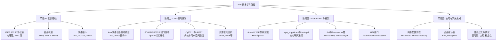
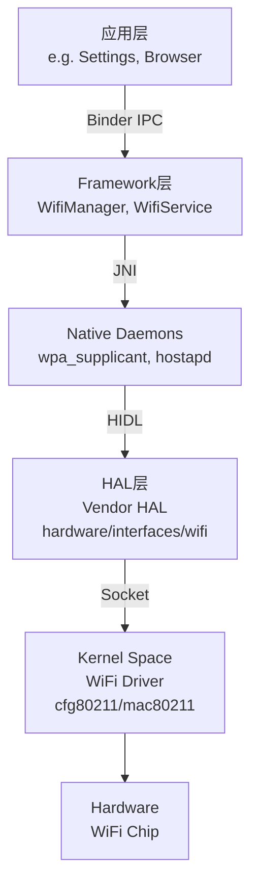

[memo.md](memo.md) 

# WiFi技术全方位掌握指南
## 学习路径与核心重点
鉴于你已有蓝牙和芯片级开发的深厚背景，我为你规划的学习路径将充分利用你现有的知识储备，并重点突出WiFi的特有技术和学习重点。以下是为你规划的学习路径图：  

## 一、协议基础：从蓝牙到WiFi的思维转变
虽然同为无线技术，但WiFi在协议复杂度、吞吐量和网络拓扑上与蓝牙有显著差异。

核心协议深入：你需要精读IEEE 802.11协议族（a/b/g/n/ac/ax/be）。重点关注OFDM/MIMO/波束成形等物理层技术，以及CSMA/CA、帧聚合、Block Ack等MAC层机制。理解这些是分析吞吐量、延迟和丢包等问题的基础。

安全机制：深入研究WiFi的安全演进历程，从有漏洞的WEP，到目前主流的WPA2-Personal/Enterprise，再到更安全的WPA3。理解四次握手过程、PMF（管理帧保护）等机制，这对于解决连接和认证问题至关重要。

网络拓扑：除了最常见的基础架构模式（Station-AP），了解Ad-hoc、Mesh网络（如802.11s）等拓扑结构。

## 二、Linux驱动开发：从芯片寄存器到内核接口
这是你AE经验最能发挥价值的地方。WiFi驱动是连接硬件和操作系统内核的桥梁。

Linux网络设备驱动模型：核心是net_device结构体及其操作函数集net_device_ops。驱动的主要任务是将芯片收发的MAC帧正确地送入内核协议栈。

关键基础设施：

cfg80211与nl80211：这是现代WiFi驱动的基石。cfg80211内核模块提供了驱动需要注册的API，而nl80211是用户空间工具（如iw、wpa_supplicant）通过netlink套接字与内核驱动通信的标准接口9。你的驱动需要实现cfg80211_ops中定义的大量回调函数（扫描、连接、设置密钥等）。

mac80211：这是一个软件MAC实现，处理了速率控制、TX/R帧处理等复杂逻辑。大部分软MAC驱动（绝大多数USB/SDIO WiFi）依赖于mac80211。

驱动核心工作：

总线接口：WiFi芯片主要通过SDIO、USB或PCIE连接到主机。你需要编写相应的总线驱动来探测设备、分配资源和处理中断。例如，在SDIO驱动中，需要填充sdio_driver结构体并注册9。

固件加载：几乎所有现代WiFi芯片都需要在初始化时由主机驱动加载固件（firmware）到芯片的微控制器上运行。

数据路径：优化数据包的发送和接收路径是驱动性能的关键。这包括处理DMA、中断合并、NAPI（New API）等。

从开源驱动入手：选择一两个成熟的开源驱动（如ath9k - Atheros, mt76 - Mediatek）进行源码分析。这是最好的学习方式。重点关注：

驱动模块的初始化（module_init）和探测（probe）过程。

如何向cfg80211注册一个无线设备。

如何实现扫描（scan）、连接（connect）、断开（disconnect）等操作。

数据包是如何从网络层到驱动，再通过总线发送出去的（ndo_start_xmit）？

## 三、Android HAL与框架：连接驱动与App
Android的WiFi架构经历了从wpa_supplicant直接通信到HIDL的演变。

Android WiFi架构：现代Android（~8.0+）的WiFi栈如下图所示，清晰地展示了从应用层到内核的完整调用链和数据流：

wpa_supplicant与hostapd：这是WiFi连接和AP功能的核心用户空间守护进程15。你的驱动通过nl80211与它们交互。wpa_supplicant负责作为客户端扫描、认证和连接网络；hostapd负责将设备软AP化。你需要理解它们的配置文件和控制接口（如通过wpa_cli控制）。

HAL：Android定义了WiFi的HIDL/VNDK接口（如android.hardware.wifi@1.0::IWifi、IWifiChip、IWifiStaIface等）5。芯片厂商需要实现这些接口（Vendor HAL），通常位于hardware/[vendor]/[platform]/wifi/或hardware/interfaces/wifi/。这些实现负责启动/停止wpa_supplicant、与驱动交互等。

Framework与JNI：

JNI：frameworks/base/core/jni/android_net_wifi_Wifi.cpp等文件是Java世界通往本地wpa_supplicant控制接口的桥梁3。

Framework Services：WifiService是系统的核心，管理WiFi状态机、网络连接策略、扫描结果等5。WifiManager是给App使用的公开API。

Settings App：packages/apps/Settings/src/com/android/settings/wifi/是用户交互的界面，实现了WifiPicker、高级设置等3。

四、实践与调试：AE的核心能力
你的AE经验告诉你，理论必须结合实践。

编译与刷机：为你的开发板（如Qualcomm/Mediatek/Realtek方案）下载Android AOSP代码和内核源码，并学习编译WiFi驱动（ko内核模块）、HAL实现，并将其集成到系统镜像中35。

调试工具链：

内核层：dmesg、ftrace、cat /proc/net/wireless、iw dev wlan0 survey dump（查看信道干扰）。

用户空间：logcat（查看Android WiFi相关日志）、iw（替代旧的iwconfig）、wpa_cli、tcpdump/wireshark（抓取空口报文，需网卡支持监听模式）。

Android特有：adb shell dumpsys wifi，这个命令会打印出WifiService内部极其详细的状态机信息、网络列表、配置等，是分析连接问题的神器。

典型问题调试：

驱动加载失败：检查dmesg，确认固件路径是否正确、加载是否成功，SDIO/USB枚举是否正常，供电和时钟是否正确。

无法扫描到AP：用iw event监听扫描事件，用wireshark在空口抓包看驱动是否真的发出了Probe Request。

连接失败：在wpa_supplicant配置中打开调试日志，查看四次握手过程在哪一步失败，是密钥配置错误还是认证超时。

吞吐量低下：用iw dev wlan0 station dump查看连接的速率、重传率、信号强度（RSSI）。检查是否受到信道干扰。

推荐的学习资源与社区
官方资源与代码库：

Android官方源码：AOSP（hardware/interfaces/wifi， frameworks/opt/net/wifi等）是你的最佳教材5。

Linux Wireless项目：包含cfg80211、mac80211和众多驱动的文档和邮件列表。

芯片厂商提供的开发者门户（如Qualcomm Developer Network, Mediatek Labs），通常会提供SDK和参考设计文档。

权威书籍与文档：

《Linux Device Drivers》：了解驱动开发的基础。

《Android深度探索（卷1）：HAL与驱动开发》：虽然稍旧，但HAL和驱动的思想仍有价值7。

IEEE 802.11标准文档：权威，但非常晦涩，可作为参考书。

技术社区与论坛：

Stack Overflow：针对具体的编程问题。

Reddit: r/android_devs：参与Android系统开发的讨论。

XDA Developers Forum：了解一线开发者的实战问题和解决方案。

Wireless Wiki：包含许多Linux无线驱动的信息。

博客平台：CSDN、博客园等常有工程师分享详细的驱动调试和分析笔记，例如对Android WiFi HAL层的分析1或Android添加WiFi驱动的流程3。

视频教程：

对于一些复杂的概念，如蓝牙和WiFi的协同工作，可以寻找一些专业的视频教程（如韦东山的蓝牙专题可能涉及共存问题）10作为补充。

充分利用你的蓝牙经验
你多年的蓝牙AE经验是非常宝贵的财富，以下是如何将它们迁移到WiFi学习上：

蓝牙经验	在WiFi领域的映射与差异
芯片调试：熟悉看原理图、数据手册、用示波器逻辑分析仪测信号。	完全通用。WiFi同样需要检查电源、时钟（更重要）、复位、接口总线（SDIO/USB）信号质量。
协议分析：熟悉空中包的结构，会用Ellisys、Frontline等抓包分析。	思维通用。工具不同，WiFi主要用Wireshark。802.11帧结构比蓝牙更复杂，但分析问题的思路一致：抓包、看交互流程。
认证与合规：熟悉蓝牙SIG的认证流程和测试规范。	思维通用。WiFi有Wi-Fi Alliance的认证，同样有详细的测试规范（CTS/IOT），你需要了解其测试用例。
共存问题：深知2.4GHz蓝牙和WiFi相互干扰的原理与解决方案。	巨大优势。你对共存问题的理解是很多纯软件工程师不具备的。可以深入研究MCOEX（协同共存） 硬件设计和工作原理，这是你的核心竞争力。
与FAE/客户沟通	完全通用。快速定位问题是硬件问题、驱动问题还是应用问题的能力，以及清晰的技术沟通能力，是完全相通的。

## Other
[WiFi-Sniffer](WiFi-Sniffer.md)