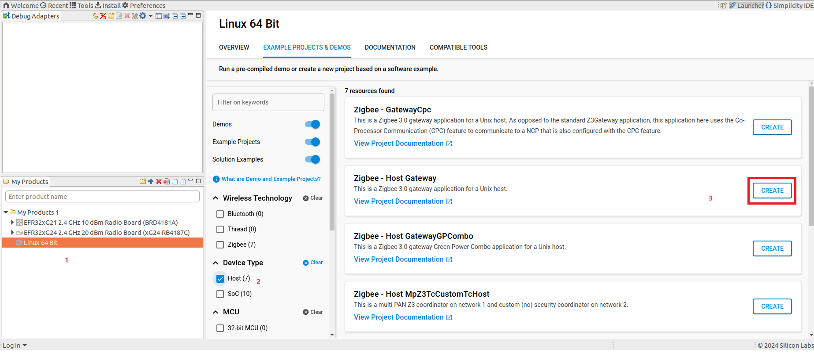
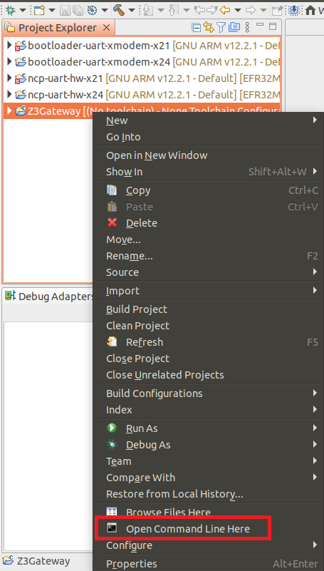
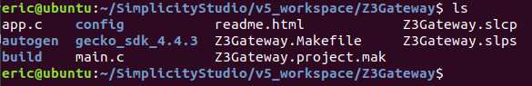
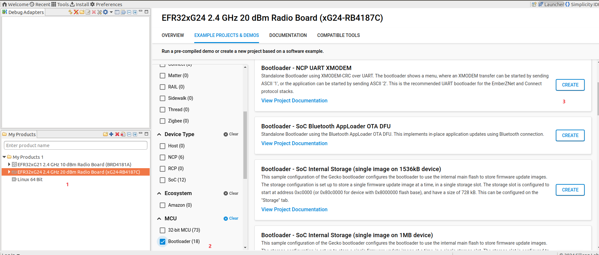

# 构建基于SiliconLab GSDK4.4.3的Z3Gateway
说明：芯科从GSDK 4.x and EmberZNet 7.x开始，Z3Gateway和在前版GSDK 3.2.3 and EmberZNet 6.10.3.0.构建方法有所差异，新版build方式如下：

## 生成Z3Gateway Project
请参见：SiliconLab GSDK 4.4.3 创建 Z3Gateway 工程。  
以下是基于Simplicity Studio Ubuntu版本操作，与Windows,Mac版本大同小异。  
先选Linux 64Bit,当然需要根据自己系统选。再转到EXAMPLE PROJECTS&DEMOS 栏，过滤只留Host example, 选好Zigbee - Host Gateway,点 [CREATE]生成.  
<div align="center">
  
</div>

## 构建 Z3Gateway
在Studio 左侧 Project Explorer中找到 Z3Gateway，右键点击，点[Open Command Line Here],可直接跳转到工程目录。
<div align="center">
  
</div>

文件目录结构如图。

<div align="center">
  
</div>

使用make去编译。  
```c
make -f Z3Gateway.Makefile
```
上面讲的是Z3Gateway NCP host端的应用，这个跑在电脑，平板，手机端。
要做成一个完整的Z3Gateway还需要 NCP target 与 bootloader 。  
bootloader

<div align="center">
  
</div>

NCP target
<div align="center">
  
</div>

这两个工程更多内容以后有时间再细讲，我们现在主要关注Z3Gateway NCP host。

## 编译结果  
```c
eric@ubuntu:~/SimplicityStudio/v5_workspace/Z3Gateway$ make -f Z3Gateway.Makefile 
# No pre-build defined
Building gecko_sdk_4.4.3/platform/common/src/sl_assert.c
Building gecko_sdk_4.4.3/platform/common/src/sl_slist.c
Building gecko_sdk_4.4.3/platform/common/src/sl_string.c
Building gecko_sdk_4.4.3/platform/service/cli/src/sl_cli.c
Building gecko_sdk_4.4.3/platform/service/cli/src/sl_cli_arguments.c
Building gecko_sdk_4.4.3/platform/service/cli/src/sl_cli_command.c
Building gecko_sdk_4.4.3/platform/service/cli/src/sl_cli_input.c
Building gecko_sdk_4.4.3/platform/service/cli/src/sl_cli_io.c
Building gecko_sdk_4.4.3/platform/service/cli/src/sl_cli_threaded_host.c
Building gecko_sdk_4.4.3/platform/service/cli/src/sl_cli_tokenize.c
Building gecko_sdk_4.4.3/platform/service/iostream/src/sl_iostream.c
Building gecko_sdk_4.4.3/platform/service/iostream/src/sl_iostream_stdio.c
Building gecko_sdk_4.4.3/platform/service/legacy_common_ash/src/ash-common.c
Building gecko_sdk_4.4.3/platform/service/legacy_hal/src/crc.c
Building gecko_sdk_4.4.3/platform/service/legacy_hal/src/ember-printf-convert.c
Building gecko_sdk_4.4.3/platform/service/legacy_hal/src/micro_host.c
Building gecko_sdk_4.4.3/platform/service/legacy_hal/src/random.c
Building gecko_sdk_4.4.3/platform/service/legacy_hal/src/system-timer.c
Building gecko_sdk_4.4.3/platform/service/legacy_host/src/token.c
Building gecko_sdk_4.4.3/platform/service/system/src/sl_system_init.c
Building gecko_sdk_4.4.3/platform/service/system/src/sl_system_process_action.c
Building gecko_sdk_4.4.3/platform/service/token_manager/src/sl_token_def.c
Building gecko_sdk_4.4.3/protocol/zigbee/app/ezsp-host/ash/ash-host-ui.c
Building gecko_sdk_4.4.3/protocol/zigbee/app/ezsp-host/ash/ash-host.c
Building gecko_sdk_4.4.3/protocol/zigbee/app/ezsp-host/ezsp-host-io.c
Building gecko_sdk_4.4.3/protocol/zigbee/app/ezsp-host/ezsp-host-queues.c
Building gecko_sdk_4.4.3/protocol/zigbee/app/ezsp-host/ezsp-host-ui.c
Building gecko_sdk_4.4.3/protocol/zigbee/app/framework/cli/core-cli.c
Building gecko_sdk_4.4.3/protocol/zigbee/app/framework/cli/network-cli.c
Building gecko_sdk_4.4.3/protocol/zigbee/app/framework/cli/option-cli.c
Building gecko_sdk_4.4.3/protocol/zigbee/app/framework/cli/security-cli.c
Building gecko_sdk_4.4.3/protocol/zigbee/app/framework/cli/zcl-cli.c
Building gecko_sdk_4.4.3/protocol/zigbee/app/framework/cli/zdo-cli.c
Building gecko_sdk_4.4.3/protocol/zigbee/app/framework/common/zigbee_app_framework_common.c
Building gecko_sdk_4.4.3/protocol/zigbee/app/framework/common/zigbee_app_framework_host_cb.c
Building gecko_sdk_4.4.3/protocol/zigbee/app/framework/plugin-host/ezsp/ezsp-cb.c
Building gecko_sdk_4.4.3/protocol/zigbee/app/framework/plugin-host/file-descriptor-dispatch/file-descriptor-dispatch-cb.c
Building gecko_sdk_4.4.3/protocol/zigbee/app/framework/plugin-host/file-descriptor-dispatch/file-descriptor-dispatch.c
Building gecko_sdk_4.4.3/protocol/zigbee/app/framework/plugin-host/gateway/gateway-cb.c
Building gecko_sdk_4.4.3/protocol/zigbee/app/framework/plugin-host/gateway/gateway-support-cli.c
Building gecko_sdk_4.4.3/protocol/zigbee/app/framework/plugin-host/gateway/gateway-support.c
Building gecko_sdk_4.4.3/protocol/zigbee/app/framework/plugin-host/ncp-configuration/ncp-configuration.c
Building gecko_sdk_4.4.3/protocol/zigbee/app/framework/plugin/address-table/address-table-cli.c
Building gecko_sdk_4.4.3/protocol/zigbee/app/framework/plugin/address-table/address-table.c
Building gecko_sdk_4.4.3/protocol/zigbee/app/framework/plugin/basic/basic-cb.c
Building gecko_sdk_4.4.3/protocol/zigbee/app/framework/plugin/basic/basic.c
Building gecko_sdk_4.4.3/protocol/zigbee/app/framework/plugin/color-control-server/color-control-server-cb.c
Building gecko_sdk_4.4.3/protocol/zigbee/app/framework/plugin/color-control-server/color-control-server.c
Building gecko_sdk_4.4.3/protocol/zigbee/app/framework/plugin/concentrator/concentrator-support-cli.c
Building gecko_sdk_4.4.3/protocol/zigbee/app/framework/plugin/concentrator/concentrator-support.c
Building gecko_sdk_4.4.3/protocol/zigbee/app/framework/plugin/counters/counters-cb.c
Building gecko_sdk_4.4.3/protocol/zigbee/app/framework/plugin/counters/counters-cli.c
Building gecko_sdk_4.4.3/protocol/zigbee/app/framework/plugin/counters/counters-host.c
Building gecko_sdk_4.4.3/protocol/zigbee/app/framework/plugin/counters/counters-ota-host.c
Building gecko_sdk_4.4.3/protocol/zigbee/app/framework/plugin/debug-print/sl_zigbee_debug_print.c
Building gecko_sdk_4.4.3/protocol/zigbee/app/framework/plugin/ezmode-commissioning/ez-mode-cli.c
Building gecko_sdk_4.4.3/protocol/zigbee/app/framework/plugin/ezmode-commissioning/ez-mode.c
Building gecko_sdk_4.4.3/protocol/zigbee/app/framework/plugin/ezmode-commissioning/ezmode-commissioning-cb.c
Building gecko_sdk_4.4.3/protocol/zigbee/app/framework/plugin/green-power-client/green-power-client.c
Building gecko_sdk_4.4.3/protocol/zigbee/app/framework/plugin/green-power-common/green-power-common.c
Building gecko_sdk_4.4.3/protocol/zigbee/app/framework/plugin/ias-zone-client/ias-zone-client-cli.c
Building gecko_sdk_4.4.3/protocol/zigbee/app/framework/plugin/ias-zone-client/ias-zone-client.c
Building gecko_sdk_4.4.3/protocol/zigbee/app/framework/plugin/identify-feedback/identify-feedback.c
Building gecko_sdk_4.4.3/protocol/zigbee/app/framework/plugin/identify/identify-cb.c
Building gecko_sdk_4.4.3/protocol/zigbee/app/framework/plugin/identify/identify-cli.c
Building gecko_sdk_4.4.3/protocol/zigbee/app/framework/plugin/identify/identify.c
Building gecko_sdk_4.4.3/protocol/zigbee/app/framework/plugin/level-control/level-control-cb.c
Building gecko_sdk_4.4.3/protocol/zigbee/app/framework/plugin/level-control/level-control.c
Building gecko_sdk_4.4.3/protocol/zigbee/app/framework/plugin/manufacturing-library-cli/manufacturing-library-cli-host.c
Building gecko_sdk_4.4.3/protocol/zigbee/app/framework/plugin/network-creator-security/network-creator-security-cli.c
Building gecko_sdk_4.4.3/protocol/zigbee/app/framework/plugin/network-creator-security/network-creator-security.c
Building gecko_sdk_4.4.3/protocol/zigbee/app/framework/plugin/network-creator/network-creator-cb.c
Building gecko_sdk_4.4.3/protocol/zigbee/app/framework/plugin/network-creator/network-creator-cli.c
Building gecko_sdk_4.4.3/protocol/zigbee/app/framework/plugin/network-creator/network-creator.c
Building gecko_sdk_4.4.3/protocol/zigbee/app/framework/plugin/network-steering/network-steering-cb.c
Building gecko_sdk_4.4.3/protocol/zigbee/app/framework/plugin/network-steering/network-steering-cli.c
Building gecko_sdk_4.4.3/protocol/zigbee/app/framework/plugin/network-steering/network-steering-host.c
Building gecko_sdk_4.4.3/protocol/zigbee/app/framework/plugin/network-steering/network-steering-v2.c
Building gecko_sdk_4.4.3/protocol/zigbee/app/framework/plugin/network-steering/network-steering.c
Building gecko_sdk_4.4.3/protocol/zigbee/app/framework/plugin/on-off/on-off-cb.c
Building gecko_sdk_4.4.3/protocol/zigbee/app/framework/plugin/on-off/on-off.c
Building gecko_sdk_4.4.3/protocol/zigbee/app/framework/plugin/ota-common/ota-common.c
Building gecko_sdk_4.4.3/protocol/zigbee/app/framework/plugin/ota-server-policy/ota-server-policy-cb.c
Building gecko_sdk_4.4.3/protocol/zigbee/app/framework/plugin/ota-server-policy/ota-server-policy.c
Building gecko_sdk_4.4.3/protocol/zigbee/app/framework/plugin/ota-server/ota-server-cb.c
Building gecko_sdk_4.4.3/protocol/zigbee/app/framework/plugin/ota-server/ota-server-cli.c
Building gecko_sdk_4.4.3/protocol/zigbee/app/framework/plugin/ota-server/ota-server-dynamic-block-period.c
Building gecko_sdk_4.4.3/protocol/zigbee/app/framework/plugin/ota-server/ota-server-page-request.c
Building gecko_sdk_4.4.3/protocol/zigbee/app/framework/plugin/ota-server/ota-server.c
Building gecko_sdk_4.4.3/protocol/zigbee/app/framework/plugin/ota-storage-common/ota-storage-common-cli.c
Building gecko_sdk_4.4.3/protocol/zigbee/app/framework/plugin/ota-storage-common/ota-storage-common.c
Building gecko_sdk_4.4.3/protocol/zigbee/app/framework/plugin/ota-storage-posix-filesystem/ota-storage-linux.c
Building gecko_sdk_4.4.3/protocol/zigbee/app/framework/plugin/poll-control-client/poll-control-client-cli.c
Building gecko_sdk_4.4.3/protocol/zigbee/app/framework/plugin/poll-control-client/poll-control-client.c
Building gecko_sdk_4.4.3/protocol/zigbee/app/framework/plugin/reporting/reporting-cb.c
Building gecko_sdk_4.4.3/protocol/zigbee/app/framework/plugin/reporting/reporting-cli.c
Building gecko_sdk_4.4.3/protocol/zigbee/app/framework/plugin/reporting/reporting-default-configuration.c
Building gecko_sdk_4.4.3/protocol/zigbee/app/framework/plugin/reporting/reporting.c
Building gecko_sdk_4.4.3/protocol/zigbee/app/framework/plugin/scan-dispatch/scan-dispatch.c
Building gecko_sdk_4.4.3/protocol/zigbee/app/framework/plugin/simple-metering-client/simple-metering-client-cb.c
Building gecko_sdk_4.4.3/protocol/zigbee/app/framework/plugin/simple-metering-client/simple-metering-client-cli.c
Building gecko_sdk_4.4.3/protocol/zigbee/app/framework/plugin/simple-metering-client/simple-metering-client.c
Building gecko_sdk_4.4.3/protocol/zigbee/app/framework/plugin/stack-diagnostics/stack-diagnostics.c
Building gecko_sdk_4.4.3/protocol/zigbee/app/framework/plugin/test-harness/read-write-attributes.c
Building gecko_sdk_4.4.3/protocol/zigbee/app/framework/plugin/test-harness/test-harness-host.c
Building gecko_sdk_4.4.3/protocol/zigbee/app/framework/plugin/test-harness/test-harness.c
Building gecko_sdk_4.4.3/protocol/zigbee/app/framework/plugin/time-server/time-server.c
Building gecko_sdk_4.4.3/protocol/zigbee/app/framework/plugin/trust-center-nwk-key-update-broadcast/trust-center-nwk-key-update-broadcast.c
Building gecko_sdk_4.4.3/protocol/zigbee/app/framework/plugin/trust-center-nwk-key-update-periodic/trust-center-nwk-key-update-periodic.c
Building gecko_sdk_4.4.3/protocol/zigbee/app/framework/plugin/trust-center-nwk-key-update-unicast/trust-center-nwk-key-update-unicast.c
Building gecko_sdk_4.4.3/protocol/zigbee/app/framework/plugin/update-tc-link-key/update-tc-link-key-cb.c
Building gecko_sdk_4.4.3/protocol/zigbee/app/framework/plugin/update-tc-link-key/update-tc-link-key-cli.c
Building gecko_sdk_4.4.3/protocol/zigbee/app/framework/plugin/update-tc-link-key/update-tc-link-key.c
Building gecko_sdk_4.4.3/protocol/zigbee/app/framework/plugin/zcl-framework-core/zcl-framework-core-cb.c
Building gecko_sdk_4.4.3/protocol/zigbee/app/framework/plugin/zcl_cli/zigbee-zcl-cli.c
Building gecko_sdk_4.4.3/protocol/zigbee/app/framework/plugin/zcl_cli/zigbee-zcl-custom-cluster-cli.c
Building gecko_sdk_4.4.3/protocol/zigbee/app/framework/plugin/zcl_cli/zigbee-zcl-global-cli.c
Building gecko_sdk_4.4.3/protocol/zigbee/app/framework/security/af-node.c
Building gecko_sdk_4.4.3/protocol/zigbee/app/framework/security/af-security-common.c
Building gecko_sdk_4.4.3/protocol/zigbee/app/framework/security/af-trust-center.c
Building gecko_sdk_4.4.3/protocol/zigbee/app/framework/security/crypto-state.c
Building gecko_sdk_4.4.3/protocol/zigbee/app/framework/service-function/sl_service_function.c
Building gecko_sdk_4.4.3/protocol/zigbee/app/framework/signature-decode/sl_signature_decode.c
Building gecko_sdk_4.4.3/protocol/zigbee/app/framework/util/af-common.c
Building gecko_sdk_4.4.3/protocol/zigbee/app/framework/util/af-event.c
Building gecko_sdk_4.4.3/protocol/zigbee/app/framework/util/af-host.c
Building gecko_sdk_4.4.3/protocol/zigbee/app/framework/util/attribute-size.c
Building gecko_sdk_4.4.3/protocol/zigbee/app/framework/util/attribute-storage.c
Building gecko_sdk_4.4.3/protocol/zigbee/app/framework/util/attribute-table.c
Building gecko_sdk_4.4.3/protocol/zigbee/app/framework/util/client-api.c
Building gecko_sdk_4.4.3/protocol/zigbee/app/framework/util/global-callback.c
Building gecko_sdk_4.4.3/protocol/zigbee/app/framework/util/global-other-callback.c
Building gecko_sdk_4.4.3/protocol/zigbee/app/framework/util/message.c
Building gecko_sdk_4.4.3/protocol/zigbee/app/framework/util/multi-network.c
Building gecko_sdk_4.4.3/protocol/zigbee/app/framework/util/print-formatter.c
Building gecko_sdk_4.4.3/protocol/zigbee/app/framework/util/print.c
Building gecko_sdk_4.4.3/protocol/zigbee/app/framework/util/process-cluster-message.c
Building gecko_sdk_4.4.3/protocol/zigbee/app/framework/util/process-global-message.c
Building gecko_sdk_4.4.3/protocol/zigbee/app/framework/util/service-discovery-common.c
Building gecko_sdk_4.4.3/protocol/zigbee/app/framework/util/service-discovery-host.c
Building gecko_sdk_4.4.3/protocol/zigbee/app/framework/util/time-util.c
Building gecko_sdk_4.4.3/protocol/zigbee/app/framework/util/util.c
Building gecko_sdk_4.4.3/protocol/zigbee/app/framework/util/zcl-util.c
Building gecko_sdk_4.4.3/protocol/zigbee/app/util/common/library.c
Building gecko_sdk_4.4.3/protocol/zigbee/app/util/ezsp/ezsp-callbacks.c
Building gecko_sdk_4.4.3/protocol/zigbee/app/util/ezsp/ezsp-enum-decode.c
Building gecko_sdk_4.4.3/protocol/zigbee/app/util/ezsp/ezsp-frame-utilities.c
Building gecko_sdk_4.4.3/protocol/zigbee/app/util/ezsp/ezsp.c
Building gecko_sdk_4.4.3/protocol/zigbee/app/util/ezsp/serial-interface-uart.c
Building gecko_sdk_4.4.3/protocol/zigbee/app/util/security/security-address-cache.c
Building gecko_sdk_4.4.3/protocol/zigbee/app/util/serial/linux-serial.c
Building gecko_sdk_4.4.3/protocol/zigbee/app/util/serial/sl_zigbee_command_interpreter.c
Building gecko_sdk_4.4.3/protocol/zigbee/app/util/zigbee-framework/zigbee-device-common.c
Building gecko_sdk_4.4.3/protocol/zigbee/app/util/zigbee-framework/zigbee-device-host.c
Building gecko_sdk_4.4.3/protocol/zigbee/stack/config/ember-configuration-host-access.c
Building gecko_sdk_4.4.3/protocol/zigbee/stack/gp/gp-util.c
Building gecko_sdk_4.4.3/protocol/zigbee/stack/security/zigbee-security-manager-host.c
Building gecko_sdk_4.4.3/util/silicon_labs/silabs_core/event_queue/event-queue.c
Building gecko_sdk_4.4.3/util/silicon_labs/silabs_core/memory_manager/sl_malloc.c
Building gecko_sdk_4.4.3/util/third_party/printf/printf.c
Building gecko_sdk_4.4.3/util/third_party/printf/src/iostream_printf.c
Building app.c
Building autogen/sl_cli_command_table.c
Building autogen/sl_cli_instances.c
Building autogen/sl_cluster_service_gen.c
Building autogen/sl_event_handler.c
Building autogen/sl_iostream_handles.c
Building autogen/sli_cli_hooks.c
Building autogen/zap-cli.c
Building autogen/zap-cluster-command-parser.c
Building autogen/zap-event.c
Building autogen/zigbee_common_callback_dispatcher.c
Building autogen/zigbee_host_callback_dispatcher.c
Building autogen/zigbee_stack_callback_dispatcher.c
Building autogen/zigbee_zcl_callback_dispatcher.c
Building main.c
Linking build/debug/Z3Gateway
Done.
# No post-build defined
eric@ubuntu:~/SimplicityStudio/v5_workspace/Z3Gateway$ 

```
## 运行
```c
eric@ubuntu:~/SimplicityStudio/v5_workspace/Z3Gateway/build/debug$ sudo ./Z3Gateway_v1 -n 0 -p /dev/ttyACM0
[sudo] password for eric:
Reset info: 11 (SOFTWARE)
ezsp ver 0x0D stack type 0x02 stack ver. [7.4.3 GA build 0]
Ezsp Config: set address table size to 0x0002:Success: set
Ezsp Config: set TC addr cache to 0x0002:Success: set
Ezsp Config: set MAC indirect TX timeout to 0x1E00:Success: set
Ezsp Config: set max hops to 0x001E:Success: set
Ezsp Config: set tx power mode to 0x8000:Success: set
Ezsp Config: set supported networks to 0x0001:Success: set
Ezsp Config: set stack profile to 0x0002:Success: set
Ezsp Config: set security level to 0x0005:Success: set
Ezsp Value : set end device keep alive support mode to 0x00000003:Success: set
Ezsp Policy: set binding modify to "allow for valid endpoints & clusters only":Success: set
Ezsp Policy: set message content in msgSent to "return":Success: set
Ezsp Value : set maximum incoming transfer size to 0x00000052:Success: set
Ezsp Value : set maximum outgoing transfer size to 0x00000052:Success: set
Ezsp Value : set default timeout for transient device table to 0x00002710:Success: set
Ezsp Config: set binding table size to 0x0002:Success: set
Ezsp Config: set key table size to 0x0004:Success: set
Ezsp Config: set max end device children to 0x0006:Success: set
Ezsp Config: set aps unicast message count to 0x000A:Success: set
Ezsp Config: set broadcast table size to 0x000F:Success: set
Ezsp Config: set neighbor table size to 0x0010:Success: set
Ezsp Config: set end device poll timeout to 0x0008:Success: set
Ezsp Config: set zll group addresses to 0x0000:Success: set
Ezsp Config: set zll rssi threshold to 0xFFD8:Success: set
Ezsp Config: set transient key timeout to 0x012C:Success: set
Ezsp Config: set retry size to 0x0010:Success: set
Ezsp Endpoint 1 added, profile 0x0104, in clusters: 8, out clusters 17
Ezsp Endpoint 242 added, profile 0xA1E0, in clusters: 0, out clusters 1
Starting identifying on endpoint 0x01, identify time is 0 sec
Stopping identifying on endpoint 0x01
No endpoints identifying; stopping identification feedback.
Found 0 files

Z3Gateway>
```
## 运行平台
以上工程是基于 ubuntu 编译并运行上的，在运行上Arm平台，需要做交叉编译。
如果是要跑在Rasberry Pi上，可以在Pi上直接装 ubuntu, 把工程copy到Pi,
装相应工具，如make, gcc等(如下),就可以编译出可以在Pi上跑的Z3Gateway。
```c
$ sudo apt update 
$ sudo apt install
$ sudo apt-get install git gcc g++ pkg-config libssl-dev libdbus-1-dev libglib2.0-dev libavahi-client-dev ninja-build python3-venv python3-dev python3-pip unzip libgirepository1.0-dev libcairo2-dev libreadline-dev
```
若要在Android平台上跑，可以参考 [Z3gateway-Android-Base](Z3gateway-Android-Base.md)。