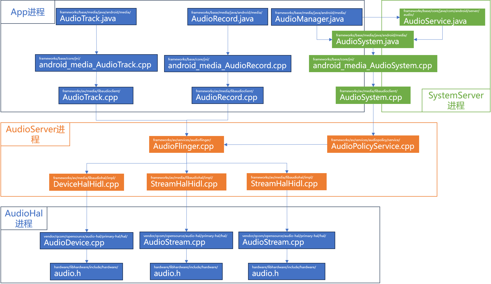
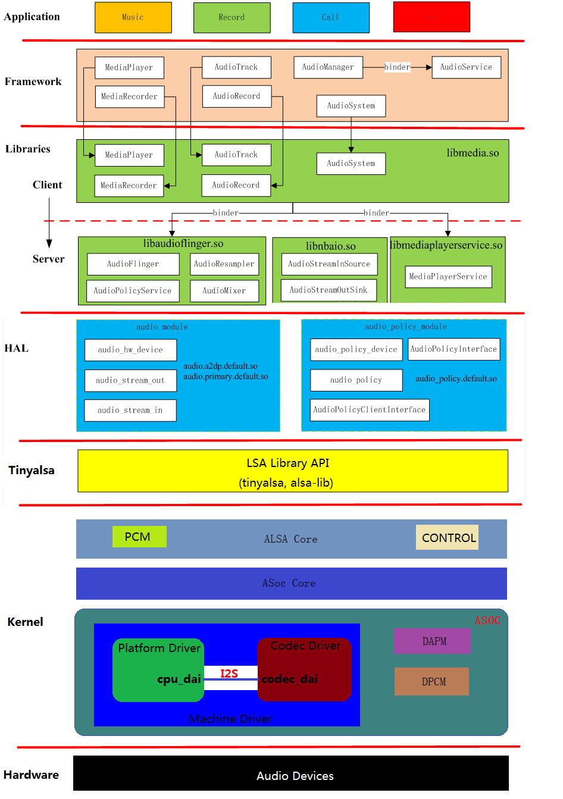
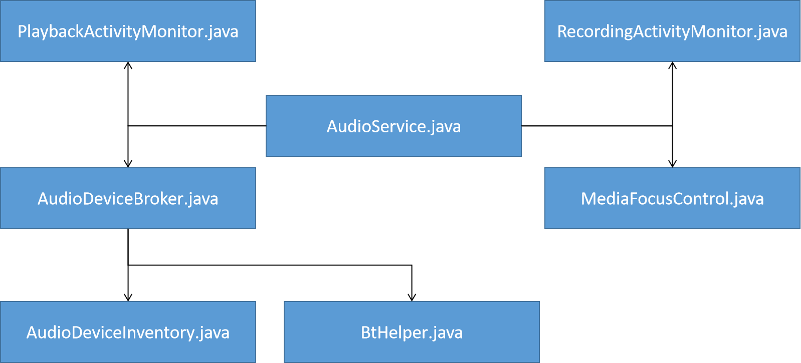

# Start
音频子系统在Android中是一个较为复杂的子系统。  
- 包含应用API层，框架层，Native层和HAL层  
- 使用Java、C++、C语言进行编写  
- 运行在Linux用户空间的4个进程中
  - APP应用进程(API层的代码)
  - SystemServer进程(框架层的代码)
  - AudioServer进程(Native层的代码)
  - AudioHAL进程(HAL层的代码)  

Android音频子系统的核心
- AudioFlinger(AudioServer进程)
- AudioPolicyService(AudioServer进程)
- AudioService(SystemServer进程)

AudioHAL模块是由各个SoC厂商自行根据芯片特点实现的，每种平台的代码都不一样，  
AOSP中只定义了标准接口，并没有具体的实现代码。

以下是音频子系统的整体架构图：

  

  

# 1. 应用API层
应用API层的源码位置：/frameworks/base/media/java/android/media/

这部分代码是运行在调用其代码的APP进程中的，图中用浅蓝色标注的模块。  
其中主要的接口模块有三个：

- AudioTrack.java，为APP提供播放音频数据的接口。
- AudioRecord.java，为APP提供录制音频数据的接口。
- AudioManager.java，为APP提供管理音频路由、音量控制、音频焦点获取的接口。
  
从上面的架构图中可以看出，AudioTrack.java和AudioRecord.java会分别调用其对应的JNI文件：android_media_AudioTrack.cpp、android_media_AudioRecord.cpp(它们位于/frameworks/base/core/jni/目录中)。  
而这两个JNI层的代码又会调用Native的客户端代码AudioTrack.cpp和AudioRecord.cpp(它们位于/frameworks/av/media/libaudioclient/目录中)。  
可以看出音频播放和录制数据的应用接口代码的真正实现是在libaudioclient中的。

AudioManger.java 是 AudioService.java 的客户端代理类，  
它里面的大多数函数都是通过Binder方式远程调用AudioService.java来实现的。  
有一小部分简单的函数也会直接调用AudioSystem.java来实现。  
而大多数情况下 AudioSystem.java 都是被 AudioService.java 调用使用的。

在上面的架构图中，把 AudioSystem.java 放在了 APP进程 和 SystemServer进程 这两个进程框线之间，意思是这个 java文件 会分别运行在两个不同的进程中。  
Java的特性是同一个java文件在不同的进程中会有不同对象和数据，不过 AudioSystem.java是一个全部通过静态方法实现的代码文件，只有静态数据，比如注册的一些Callback函数。  
所以，APP进程中注册的Callback对象和SystemServer进程中注册的Callback对象并不是同一个。  
AudioSystem.java文件也位于/frameworks/base/media/java/android/media/目录中，但是它是一个hide class，所以普通的APP程序是无法直接调用它的接口的，当然Java反射除外。  
AudioSystem.java和AudioTrack.java类似，它也会通过JNI调用android_media_AudioSystem.cpp文件，然后JNI文件又会调用libaudioclient的AudioSystem.cpp文件。所以AudioSystem.cpp才是真正实现代码逻辑的地方。

/frameworks/av/media/libaudioclient/这个目录中的源码会被编译打包成libaudioclient.so,包含三个重要客户端接口类AudioTrack.cpp、AudioRecord.cpp和AudioSystem.cpp。  
所以，如果我们写一个native APP，完全可以直接加载libaudioclient这个so库，调用它们提供的接口API。  
前面我们提到AudioManager.java会直接调用AudioSystem.java的部分函数，而AudioManager.java是运行在APP进程中的，AudioSystem.java最终又会调用libaudioclient.so的AudioSystem.cpp，  
可以推断APP进程在初始化时，已经加载过了libaudioclient.so库。这个时候是可以直接使用C++代码调用AudioTrack.cpp和AudioRecord.cpp中的接口函数。

AudioSystem.cpp也是一个由静态函数实现的类。作用是和AudioFilnger、AudioPolicyService通信，通过Binder方式调用这两个模块提供的接口函数。同时，提供了直接获取这两个模块的Binder代理接口类的方法：get_audio_flinger()、get_audio_policy_service()。

查看AudioPolicyService模块中的源码可以看到，AudioPolicyService 也是通过 AudioSystem.cpp 的get_audio_flinger()接口函数，来获取到AudioFlinger的Binder代理类，然后和AudioFilnger模块进行通信的。  
虽然AudioPolicyService模块和AudioFlinger这两个模块都是运行在同一进程AudioServer中。Binder的机制是跨进程调用时，被调用的Server端函数会运行在Server端的15个Binder线程中的一个，而同一进程内调用时，被调用的Server端函数就直接运行在客户端调用方运行的线程中。所以，AudioPolicyService所调用的任何AudioFlinger函数，都不是运行在AudioServer进程的15个Binder线程中的。  
顺便说一下，基于这个发现，可以知道AudioServer进程中已经加载了libaudioclient.so库，因为它使用了AudioSystem.cpp文件。  
所以，在AudioServer进程中的模块代码是可以直接使用AudioTrack.cpp和AudioRecord.cpp文件的。  
正是基于这个发现，我之前在解决一个手机通过蓝牙连接到宝马车机播放声音延迟很大的问题时，就想到了在AudioFlinger模块中直接通过 AudioTrack.cpp和AudioRecord.cpp创建一个超声播放回路，用于监测车内的声音播放延迟大小，实践证明是可行的。

通过上面的分析可以发现，Android音频子系统提供了两套API接口给客户端使用，
- Java代码实现的，位于/frameworks/base/media/java/android/media/目录中
- C++代码实现的，位于/frameworks/av/media/libaudioclient/目录中
  
应用API层除了提供核心的AudioTrack.java、AudioRecord.java和AudioManager.java接口之外，还提供了AudioPatch.java和AudioMix.java这两类接口，用于客户端定制音频路由策略。  
但是它们两都是hide class，所以普通应用不能使用。目前主要是CarAudioService在使用，用于车机场景。

# 2. Java框架层
Java框架层的源码位置：/frameworks/base/services/core/java/com/android/server/audio/  
运行在SystemServer进程中的，整体架构图中用绿色标注的模块。

AudioService.java 是音频设备路由管理、音量控制、焦点控制的具体实现模块,包含4个子模块。  
具体模块架构图如下：

  

基本上从文件名称上可以看出这几个模块的用途：
- AudioDeviceBroker.java, 用于管理音频设备路由策略。它包含两个子模块
  - AudioDeviceInventory.java
  - BtHelper用于和蓝牙Java层模块交互(源码位于/packages/modules/Bluetooth/目录)，监听蓝牙设备的连接状态和codec配置变更信息等。
- MediaFocusControl.java, 音频焦点控制模块。
- PlaybackActivityMonitor.java, 音频播放事件监听模块。
- RecordingActivityMonitor.java, 音频录制事件监听模块。

在/frameworks/base/services/core/java/com/android/server/audio/这个目录中，我并没有看到音量控制相关的类，因为它是由AudioService.java自己实现的。还有一个类，虽然不在这个目录中，但需要在这里提一下：

/frameworks/base/services/core/java/com/android/server/WiredAccessoryManager.java

它是监听有线耳机设备插拔状态的入口。

我之前看到这里的代码，曾产生一个疑问，既然AudioService是用于管理音频设备路由策略的，那还要AudioPolicyService干嘛？或者说直接在AudioPolicyService里面实现不就行了，还要AudioService干嘛？我的理解是AudioService是运行在SystemServer进程的，它可以直接和ActivityManagerService等其它Android核心服务交互，可以知道客户端是哪个package name在播放、在设置设备路由等。辅助AudioPolicyService更好的管理。所以，我认为基于Android系统结合当地用户应用场景来进行音频模块定制化时，应该优先考虑修改AudioService模块，因为它更接近用户场景，AudioService模块实现不了的，再考虑修改AudioPolicyService模块。

# 3. Native核心层
音频Native核心层分为两大模块：
- AudioFlinger
- AudioPolicyService

它们都是注册在ServiceManager中的Binder服务。运行在AudioServer进程中，整体架构图中橙色部分。

## 3.1. AudioFlinger模块
AudioFlinger模块的源码位置：/frameworks/av/services/audioflinger/​

AudioFlinger主要分为三个递进关系的子模块：
- AudioHwDevice
- PlaybackThread/RecordThread
- PlaybackTrack/RecordTrack

当然我没有提到音效相关的类，是因为我认为不介绍音效相关类并不影响整体架构的梳理和理解，后续讲到播放时再来介绍也没关系。

这里的AudioHwDevice并不是指喇叭、听筒、耳机这种真实的物理设备，  
而是指不同的Audio HAL module，比如primary module、a2dp module等，  
也可以理解成是音频框架层定义的一种虚拟设备。  
它和Audio HAL层的DeviceHal是对应的关系。

PlaybackThread/RecordThread是由AudioFlinger启动的负责音频数据传输的线程。  
播放和录制的核心流程都在这里面实现。  
它和Audio HAL层的StreamHal是对应的关系。

PlaybackTrack/RecordTrack对应的是API层的AudioTrack/RecordTrack,它相当于是服务端。

我还想提一个模块是PatchPanel.cpp，它是用于管理音频设备切换的类。使用AudioPatch类来表示stream和device的连接关系。之所以在这里提及一下，是因为这个文件中包含了一些AudioFlinger类的实现函数，大家在查看AudioFlinger.h申明的函数具体实现时，如果在AudioFlinger.cpp中找不到，就可以在PatchPanel.cpp找一下，主要是和音频设备切换相关的，比如createAudioPatch()函数。

以下是AudioFlinger核心子模块的类图：

        从类图中可以看出，应用层libaudioclient中的AudioTrack.cpp有一个成员变量mAudioTrack（BpAudioTrack），它是IAudioTrack.aidl接口的代理端，通过Binder方式与BnAudioTrack进行交互。BpAudioTrack和BnAudioTrack都是Android基于IAudioTrack.aidl文件编译时自动生成的，所以找不到源码。IAudioTrack.aidl服务端的实现就是继承了BnAudioTrack的AudioFlinger.TrackHandle这个内部类。所以，AudioTrack.cpp实际上就是和它在进行通信交互。AudioTrack.cpp获取IAudioTrack代理端的方法是调用AudioFlinger的createTrack()函数。

        查看AudioFlinger.TrackHandle的源码会发现，在AudioFlinger内部，TrackHandle只是一个代理，负责与客户端交互，真正的实现逻辑是在AudioFlinger.PlaybackThread.Track这个内部类中。

        AudioFlinger模块的源码文件个数不多，但是一个文件中定义了好几个内部类，以下是各种内部类所在的源码文件位置，方法大家查找阅读：

所有Track相关的源码都定义在TrackBase.h、PlaybackTacks.h、RecordTracks.h这三个头文件中，统一在Tracks.cpp文件中实现。但是TrackHandle类和RecordHandle类是定义在AudioFlinger.h头文件中，实现却是在Tracks.cpp文件中。
所有Thread相关的源码都定义在Threads.h文件中，实现是在Threads.cpp文件中。比如PlaybackThread和RecordThread类。
AudioStreamIn这个类因为比较简单，它的定义和实现都是在AudioFlinger.h头文件中。
        DeviceHalInterface、StreamOutHalInterface和StreamInHalInterface这三个接口类是AudioHAL定义的HAL客户端接口类，源码位于/frameworks/av/media/libaudiohal/目录中，在HAL层架构分析时我会进一步讲。

        由于Thread和Track这两种类的继承关系较多，所以我画了两个类图来说明它们的结构，如下：        

        从这个类图中可以看出，所有的播放和录制Thread类都是继承的ThreadBase，而ThreadBase又继承了Android标准的循环线程类Thread，所以它们都是可以单独循环运行的普通线程。以下是各种Thread的作用介绍：

MixerThread：包含将上层多个track数据进行混音操作的播放线程。当AudioPolicySerivce请求openOutput时设置了这些flag，AudioFlinger就会创建此种线程：AUDIO_OUTPUT_FLAG_PRIMARY、AUDIO_OUTPUT_FLAG_FAST、AUDIO_OUTPUT_FLAG_DEEP_BUFFER。它也是AudioFlinger使用频次最多、默认创建的Thread类型。
DirectOutputThread:不经过混音等上层音效处理的直传播放线程。当设置了AUDIO_OUTPUT_FLAG_DIRECT flag时，会被创建使用。
OffloadThread：要求通过底层DSP硬件进行解码的播放线程。当设置了AUDIO_OUTPUT_FLAG_COMPRESS_OFFLOAD flag时，会被创建使用。
DuplicatingThread：多路输出播放线程，比如手机连上蓝牙耳机后来电时，声音会从喇叭和耳机同时输出。
SpatializerThread：Android13新增加的空间音频播放线程。当设置了AUDIO_OUTPUT_FLAG_SPATIALIZER flag时，会被创建使用。
        所有的Thread类都是AudioFlinger的内部类，但是如果我们查看Threads.h源文件，并没有看到这些类是定义在class AudioFlinger中的？原因是在AudioFlinger.h文件中，定义的AudioFlinger class包含了这句代码：#include "Threads.h"。Track类的定义也是采用相同的方法，以下是Track的类图，从这个类图中可以看到，所有的Track都是Thread的内部类。

## 3.2. AudioPolicyService模块
AudioPolicyService模块的源码位置：/frameworks/av/services/audiopolicy/

AudioPolicyService模块的源码目录结构比较多，源文件也比较多。但是我认为核心的就3个子模块:AudioPolicyService、AudioPolicyManager和Engine。Engine负责存储设备路由策略和音量大小配置。AudioPolicyManager负责设备路由和音量控制的具体实现。AudioPolicyService负责对外提供Binder接口和其它模块进行交互。它们三者的调用可以从以下类图中看出：

  

简化一下，就可以看出这三者的调用关系是：

AudioPolicyService<-->AudioPolicyManager<-->Engine

        当然，在AudioPolicyService模块中，也会存在device、stream、track的概念，只是它们的命名方式不一样。这也是我认为整个Android音频子系统代码实现不好的地方，我猜可能是各个模块由不同的人编写的原因吧。比如说streamOutput，AudioFlinger里面叫PlaybackThread，AudioPolicyService里面又叫AudioOutputDescriptor，还有一个叫IOProfile，IOProfile对象保存封装的是config配置文件中针对stream流的配置，而在配置文件中，又定义成叫mixPort，而mix这个名称，让我一开始想到的是AudioFlinger里面的AudioMixer(用于执行多个track混音的模块)。device也是，AudioFlinger里面叫AudioHwDevice，到了AudioPolicyService里面又叫HwModule。在刚开始看这些代码时，真的是能把人绕晕。下面我就来介绍一下AudioPolicyService模块里面的核心数据结构。

        AudioPolicyService模块的四个核心数据类：HwModule、AudioIODescriptorInterface、DeviceDescriptor、ClientDescriptor。

- HwModule：它代表的是HAL层的虚拟设备Device，与AudioFlinger中的AudioHwDevice对应。在audio_policy_configuration.xml配置文件中对应的是<module>节点。
- AudioIODescriptorInterface：它包含两个子类，AudioOutputDescriptor和AudioInputDescriptor。代表的是音频输入输出流，对应的是AudioFlinger中的Thread，以及HAL层的Stream。同时它还有一个成员变量IOProfile对象，IOProfile对应的是audio_policy_configuration.xml配置文件中的<mixPort>节点。
- DeviceDescriptor：它代表的是真实的物理设备，比如喇叭、听筒、Mic等。对应的是- audio_policy_configuration.xml配置文件中<devicePort>节点。
- ClientDescriptor：它包含两个子类，TrackClientDescriptor和RecordClientDescriptor。分别对应的是上层的Track和Record对象。
        下图是以音频播放场景举例，来说明这四种数据类型在各个层级中的定义，颜色相同的代表同一种数据类型。以及它们四者之间的包含关系。

        从这个图中可以看出，四者之间的关系是：Module包含多个OutputStream，OutputStream作为中间连接器，包含上层的多个track，也包含底层的多个device。其中AudioPolicyService模块的关系定义是最标准的，也最能说明它们四者之间的关系。

        同时可以看出，Track是只在上层和框架层存在的概念。到了HAL层就没有Track这个概念了。HAL层只有outputStream和真实物理设备Device的概念。

        下面分别说明一下这四个数据结构在各个层级中的定义名称：

Module：只存在于框架层和HAL层的概念。代表的是一个HAL模块，也可以理解成是一个虚拟设备。它在AudioPolicyService中的定义是HwModule。在AudioFlinger中的定义是AudioHwDevice。在HAL向上接口层的定义是IDevice.aidl。在HAL向下接口层的定义是audio_hw_device。
OutputStream：代表的是一个音频输出流。用于连接上层的track和底层真实的device设备。它在AudioPolicyService中的定义是AudioOutputDescriptor、OutputProfile。在AudioFlinger中的定义是PlaybackThread、AudioStreamOut。在HAL向上接口层的定义是IStreamOut.aidl。在HAL向下接口层的定义是audio_stream_out。
Track：代表的是应用层的一个播放对象，一个应用进程中可以创建多个Track。它在应用层的定义是AudioTrack.java。在AudioPolicyService中的定义是TrackClientDescriptor。在AudioFlinger中的定义是AudioFlinger.TrackHandle、AudioFlinger.PlaybackThread.Track。
Device：代表的是一个真实的物理设备。它在应用层的定义是AudioDeviceInfo.java。在AudioPolicyService中的定义是DeviceDescriptor。在AudioFlinger中的定义是AudioDeviceTypeAddr。在HAL层的定义是audio_devices_t。
        如果我们在/system/media/audio/include/system/audio-hal-enums.h源文件中看一下audio_devices_t的定义，就会发现它只是一个定义多种常量的枚举。并没有包含物理设备的配置信息：比如支持的samplingRates、format等。原因是Android音频子系统中还定义了一个叫AudioPort的概念。它代表的是一个音频流中的节点，可以是真实物理设备、也可以是outputstream、还可以是session。AudioPort有两种角色，一种是sink，比如说代表喇叭设备时。一种是source，比如说代表PlaybackThread时，或者代表mic设备时。

        AudioPort是横跨整个音频子系统的数据类型，它在应用层、框架层、HAL层中都有使用。它的定义是在/system/media/audio/include/system/audio.h源文件中，定义了两个结构体：audio_port和audio_port_config。各个层级也会基于此定义自己的数据类型，比如Native层的AudioPort和AudioPortConfig类，它们位于/frameworks/av/media/libaudiofoundation/include/media/AudioPort.h源文件中，供C++世界的代码使用，比如AudioPolicyService模块。在Java世界中的定义是：AudioPort.java和AudioPortConfig.java，位于/frameworks/base/media/java/android/media/目录中。

        下面我会画一个AudioPolicyService模块中的DeviceDescriptor和OutputProfile的继承关系类图，从而更直观看出AudioPort的定义。

        这张类图中，可以直观的看到DeviceDescriptor和OutputProfile都是继承了AudioPort类的。其中PolicyAudioPort类和PolicyAudioPortConfig类是AudioPoicyService模块自己扩展定义的AudioPort。位于/frameworks/av/services/audiopolicy/common/managerdefinitions/include/PolicyAudioPort.h源文件中。

        最后，介绍一下AudioPolicyService模块的源码目录结构：

/frameworks/av/services/audiopolicy/根目录下，只有一个源文件：AudioPolicyInterface.h,它定义了AudioPolicyService和AudioPolicyManager需要遵循的接口。
./service/目录：定义了AudioPolicyService模块的代码实现。
./managerdefault/目录：定义了AudioPolicyManager模块的代码实现。这个目录中的代码会被编译打包到libaudiopolicymanagerdefault.so库中。厂商也可以根据自己需要完全重写。
./enginedefault/目录：定义了engine模块的代码实现。这个目录会被编译打包到libaudiopolicyenginedefault.so库中。
./engineconfigurable/目录，定义了engine模块的另外一种实现，目前没有使用，而是用的./enginedefault/目录中的源码。
./engine/目录：定义了engine模块的基础代码实现，EngineBase类就在其中定义。
./config/目录：定义了audio_policy_configuration.xml文件的参考模版。
./common/目录：定义了AudioPolicyManager模块所使用的一些数据结构，比如HwModule、DeviceDescriptor、AudioOutputDescriptor等。会被编译打包到libaudiopolicycomponents.so库中。
# 4. HAL层
AudioHAL层可以分为三大部分：
- HIDL代理端的实现。
  - 源码位于：/frameworks/av/media/libaudiohal/目录。
  - 它供AudioFlinger来调用，运行在调用方AudioServer进程中。
  - 通过Binder方式与HIDL服务端通信。
- HIDL服务端的实现。
  - 源码位于：/hardware/interfaces/audio/目录。
  - 包含了音频HIDL接口文件的定义和服务端的实现代码。
- 提供给SoC厂商的实现接口定义。
  - 由SoC厂商根据自己芯片的特点进行实现。
  - AOSP不提供实现源码。
  - 接口定义的源码位于：/hardware/libhardware/include/hardware/audio.h

        以上是HIDL代理端libaudiohal的代码实现类图。从类图中可以看出，由DevicesFactoryHalHidl负责创建Device对象，再由DeviceHalHidl来创建Stream对象。

device的真正实现是在DeviceHalHidl.cpp文件中。stream的真正实现是在StreamHalHidl.cpp文件中。

       HIDL服务端的启动代码是在/hardware/interfaces/audio/common/all-versions/default/service/目录中，它是Audio HAL进程的启动总入口。有对应的rc文件。

        HIDL服务端的实现代码是在/hardware/interfaces/audio/core/all-versions/default/目录中，包含了DevicesFactory、Device和Stream的实现。正如前面所说，它们其实也是一个代理，只是调用audio.h中定义的接口。真正的实现还是由SoC厂商完成的。
