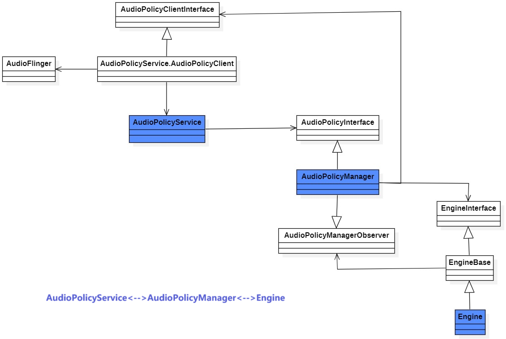

# Start
本文介绍 AudioFlinger、AudioPolicyService和AudioService这三个模块的初始化过程。
分析代码的执行流程，一般画时序图比较合适，但跟进一个复杂模块的函数调用流程时还是使用伪代码的方式来说明调用流程会比较好。

AudioPolicyService和 AudioFlinger 都是运行在 AudioServer 进程中的模块，
入口都是在/frameworks/av/media/audioserver/main_audioserver.cpp文件中的main()函数中，
由init进程通过解析audioserver.rc文件启动。
main()函数创建 AudioPolicyService 和 AudioFlinger 对象，并将它们两个作为 Binder 服务，添加进 ServiceManager 中。
```c
    AudioFlinger::instantiate();
    AudioPolicyService::instantiate();
```
由于 AudioPolicyService 和 AudioFlinger 都继承了 RefBase 类，所以它们的初始化函数有两个：构造函数 和 onFirstRef()函数。


# 1. AudioPolicyService初始化
AudioPolicyService 构造函数没做什么，其初始化入口主要看 onFirstRef() 函数。

## 1.1 AudioPolicyService::onFirstRef()函数

总体来说onFirstRef()函数主要做了三件事：
- 创建两个AudioCommandThread，名称为"ApmAudio"和"ApmOutput"。这两个是循环运行的独立线程。
    - ApmAudio 线程主要用来通知 AudioFlinger 设置路由、进行音量配置。
    - ApmOutput 线程主要用来通知上层注册的监听者有数据状态更新。
- 调用createAudioPolicyManager()函数，创建并初始化AudioPolicyManager模块。
- 调用AudioSystem.cpp的audioPolicyReady()函数，通知AudioFlinger自己已经初始化完成了。

调用流程如下：
```c
/frameworks/av/services/audiopolicy/service/AudioPolicyService.cpp
/frameworks/av/services/audiopolicy/managerdefault/AudioPolicyManager.cpp
/frameworks/av/media/libaudioclient/AudioSystem.cpp

AudioPolicyService.cpp->onFirstRef()
    |-->new AudioCommandThread("ApmAudio")
    |-->new AudioCommandThread("ApmOutput")
    |-->AudioPolicyService.cpp->loadAudioPolicyManager()
                    //加载"libaudiopolicymanagercustom.so"，默认没有这个库
    |-->AudioPolicyService.cpp->createAudioPolicyManager()
                    //创建并初始化AudioPolicyManager对象
    |-->AudioPolicyManager.cpp->canBeSpatializedInt()   
                    //判断当前系统中是否支持空间音频。
                    //只有存在AUDIO_OUTPUT_FLAG_SPATIALIZER的流才代表支持。
                    //如果存在，就创建Spatializer对象。
                    //同时，空间音频功能目前只支持AUDIO_USAGE_MEDIA和AUDIO_USAGE_GAME这两个场景。
    |-->AudioSystem.cpp->audioPolicyReady()
        |-->AudioFlinger.h->audioPolicyReady()
                    //通知AudioFlinger，自己已经初始化完成
```        
## 1.2 AudioCommandThread线程
AudioCommandThread 是 AudioPolicyService 定义的内部类，继承了Android标准的循环线程类Thread.h。
所以，当它的run()函数被调用后，线程就会循环一直调用 threadLoop()函数。
再来看一下AudioCommandThread类的初始化函数 AudioCommandThread::onFirstRef()函数。
在这个函数中它调用了父类Thread.h的run()函数，所以当 AudioCommandThread 对象被创建时，就会启动此线程。

在线程运行函数 AudioCommandThread::threadLoop()中，
它会一直遍历自己的消息队列 Vector < sp<AudioCommand> > mAudioCommands，
当消息队列中没有待处理的消息时，它就会调用 Condition类的 wait()函数，让自己这个线程睡眠。
而外部在向线程的消息队列中插入数据时,又会调用 Condition类的 signal()函数，将当前线程唤醒。

AudioFlinger 中的 PlaybackThread 线程，也是采用这种方法实现：当有播放track时，唤醒线程。没有播放时，线程睡眠，降低CPU占用率，减少功耗。
```c
/**
*向 AudioCommandThread 的消息队列中添加新消息
**/

status_t AudioPolicyService::AudioCommandThread::sendCommand(sp<AudioCommand>& command, int delayMs){
    //...
     insertCommand_l(command, delayMs);//插入新的待处理消息
     mWaitWorkCV.signal();//唤醒当前线程
    //...
}

/**
*AudioCommandThread线程循环运行函数
*/
bool AudioPolicyService::AudioCommandThread::threadLoop(){
    //...
    if (waitTime == -1) {
        mWaitWorkCV.wait(mLock);//让当前线程睡眠
    } else {
        mWaitWorkCV.waitRelative(mLock, waitTime);//让当前线程睡眠指定的时间
    }
    //...
}
```
## 1.3 AudioPolicyManager 初始化
在 AudioPolicyService.cpp::createAudioPolicyManager()函数中，做两件事：new AudioPolicyManager对象，然后调用它的initialize()函数。
```c
  static AudioPolicyInterface* createAudioPolicyManager(AudioPolicyClientInterface *clientInterface)
  {
      AudioPolicyManager *apm = new AudioPolicyManager(clientInterface);
      status_t status = apm->initialize();
      if (status != NO_ERROR) {
          delete apm;
          apm = nullptr;
      }
      return apm;
  }
  
```
### 1.3.1 解析 audio_policy_configuration.xml 配置文件
我们先来看 AudioPolicyManager的构造函数，它会调用loadConfig()函数，
该函数会通过Serializer.cpp工具来解析 audio_policy_configuration.xml 配置文件，
然后将解析到的配置信息保存到 AudioPolicyManager 类的 AudioPolicyConfig 对象中。
代码调用流程如下：
```c
/frameworks/av/services/audiopolicy/service/AudioPolicyService.cpp
/frameworks/av/services/audiopolicy/managerdefault/AudioPolicyManager.cpp
/frameworks/av/services/audiopolicy/common/managerdefinitions/src/Serializer.cpp
/frameworks/av/services/audiopolicy/config/audio_policy_configuration.xml

AudioPolicyService.cpp->createAudioPolicyManager()
    |-->AudioPolicyManager.cpp->AudioPolicyManager()
        |-->AudioPolicyManager.cpp->loadConfig()
            |-->AudioPolicyManager.cpp->deserializeAudioPolicyXmlConfig()
                |-->Serializer.cpp->deserializeAudioPolicyFile()
```                
audio_policy_configuration.xml 配置文件中定义的各种节点，与 AudioPolicyManager 中的数据结构类型之间的映射关系如下：

- < module > 节点对应的是 HwModule 类(/frameworks/av/services/audiopolicy/common/managerdefinitions/include/HwModule.h)。
- < mixPort > 节点对应的是 IOProfile 类，输出流对应的是OutputProfile子类。输入流对应的是InputProfile子类。
  (/frameworks/av/services/audiopolicy/common/managerdefinitions/include/IOProfile.h)
- < devicePort > 节点对应的是 DeviceDescriptor 类
  (/frameworks/av/services/audiopolicy/common/managerdefinitions/include/DeviceDescriptor.h)。
- < profile > 节点对应的是 AudioProfile 类，这个类定义在 libaudiofoundation 目录中。
  (/frameworks/base/media/java/android/media/AudioProfile.java)
  用于描述mixPort和devicePort的配置信息。比如支持什么样的采样率、channel个数、format格式。
- < route > 节点对应的是 AudioRoute 类
  (/frameworks/av/services/audiopolicy/common/managerdefinitions/include/AudioRoute.h)。
  描述的是OutputProfile和DeviceDescriptor的连接关系。
- < defaultOutputDevice > 节点用于表述默认的输出物理设备，手机一般配置的是扬声器。
  它保存在 AudioPolicyConfig 对象的 mDefaultOutputDevice 成员变量中。
- < attachedDevices > 节点代表的是系统一开机就可以使用的输入输出硬件，比如扬声器、内置Mic。
  保存在 AudioPolicyConfig 对象的 mOutputDevices 成员变量和 mInputDevices 成员变量中。
  而这两个变量指针引用的是 AudioPolicyManager 对象的 mOutputDevicesAll 和 mInputDevicesAll 变量，所以也保存在这两个变量中。

从上面的数据结构映射关系，结合下图对AudioPolicyService模块的分析，
<div align="center">
  
</div>
可以看出， audio_policy_configuration.xml 文件的作用就是配置当前平台支持哪些硬件设备，默认已加载了哪些硬件设备，
并定义平台支持哪些 OutStream 和 InputStream，以及这些IOStream能够与哪些硬件设备进行连接。

### 1.3.2 解析 audio_policy_engine_configuration.xml 配置文件
AudioPolicyManager::initialize() 函数是 AudioPolicyManager 初始化的核心，它会创建并初始化 Engine 对象，Engine 的父类 EngineBase 在其构造函数中会解析audio_policy_engine_configuration.xml 配置文件，然后根据从配置文件中获取到的信息，通知 AudioFlinger 加载 HwModule、创建 PlaybackThread 。 
以下是代码调用流程：
```c
/frameworks/av/services/audiopolicy/managerdefault/AudioPolicyManager.cpp
/frameworks/av/services/audiopolicy/enginedefault/config/example/phone/audio_policy_engine_configuration.xml
/frameworks/av/services/audiopolicy/enginedefault/src/Engine.cpp
/frameworks/av/services/audiopolicy/engine/common/src/EngineBase.cpp

AudioPolicyManager.cpp->initialize()
    |-->Engine.cpp->Engine()
        |-->EngineBase.cpp->loadAudioPolicyEngineConfig()   
                            //解析audio_policy_engine_configuration.xml配置文件，
                            //将解析的音量配置保存到 mVolumeGroups 对象中，
                            //解析的上层场景配置保存到 mProductStrategies 对象中。
    |-->Engine.cpp->updateDeviceSelectionCache()//更新每个strategy对应的devices，
                            //保存到 mDevicesForStrategies Map 集合中。
                            //由于此时AudioPolicyManager的mAvailableOutputDevices 
                            //集合在 onNewAudioModulesAvailableInt() 函数中才会初始化，
                            //所以此时调用此函数是无法初始化每个 strategy 对应的devices。
    |-->AudioPolicyManager.cpp->onNewAudioModulesAvailableInt() 
                            //通知 AudioFlinger 打开 HwModule ，并创建 PlaybackThread 。
                            //然后向mHwModules列表中添加通过AudioFlinger成功打开的HwModule对象。
    |-->AudioPolicyManager.cpp->updateDevicesAndOutputs()//更新每个strategy对应的devices
        |-->Engine.cpp->updateDeviceSelectionCache()
```        
在EngineBase.cpp->loadAudioPolicyEngineConfig()函数中，会解析 audio_policy_engine_configuration.xml 配置文件。
包含三个配置文件：
audio_policy_engine_product_strategies.xml、
audio_policy_engine_stream_volumes.xml、
audio_policy_engine_default_stream_volumes.xml。

这些文件的作用是配置不同播放场景下应该选择的设备路由策略，每种场景对应的音量等级，以及该场景下对应的输出设备的音量曲线。

当解析完这些配置文件后，会把其中的数据保存到 EngineBase 类的两个成员变量中： mProductStrategies 集合和 mVolumeGroups 集合。

下面介绍一下这些配置文件中涉及到的 AudioAttributes、StreamType、ProductStrategy、VolumeGroup、deviceCategory、VolumeCurve这些数据结构的作用，以及它们之间的关联关系。

- AudioAttributes ：描述的是一个音频使用场景。
    比如音乐播放场景可以用 CONTENT_TYPE_MUSIC 加上 USAGE_MEDIA 来表示；  
    通话场景可以用 CONTENT_TYPE_SPEECH 加上 USAGE_VOICE_COMMUNICATION 来表示。 
    它对应在Java的定义是在frameworks/base/media/java/android/media/AudioAttributes.java文件中。
    在C/C++的定义是在system/media/audio/include/system/audio.h头文件中的 audio_attributes_t 结构体。
    ```c
    /* Audio attributes */
    #define AUDIO_ATTRIBUTES_TAGS_MAX_SIZE 256
    typedef struct {
        audio_content_type_t content_type;
        audio_usage_t        usage;
        audio_source_t       source;
        audio_flags_mask_t   flags;
        char                 tags[AUDIO_ATTRIBUTES_TAGS_MAX_SIZE]; /* UTF8 */
    } __attribute__((packed)) audio_attributes_t; // sent through Binder;
    
    ```
    在 audio_policy_engine_product_strategies.xml 配置文件中对应的是 < Attributes > 节点。  
- StreamType：Android早期用于表示音频使用场景的变量。  
    目前在应用API层已经改成用 AudioAttributes 来替代，一种 StreamType 可以包含多个不同的AudioAttributes。  

    在AudioPolicyManager 实现的音频策略中，还是会基于StreamType来定义不同的音量类型。  
    StreamType 这里的stream和音频框架层/HAL层定义的 StreamOut/StreamIn 中的 stream 并不是一一对应的关系。  
    StreamType 描述的是场景，比如 AUDIO_STREAM_VOICE_CALL 和 AUDIO_STREAM_MUSIC。  
    而 StreamIO 描述的是系统中的音频输入输出流，比如 AUDIO_OUTPUT_FLAG_PRIMARY、AUDIO_OUTPUT_FLAG_DIRECT。  
    StreamType 在Java的定义是在 /frameworks/base/media/java/android/media/AudioManager.java 文件中。  
    在C/C++的定义是在system/media/audio/include/system/audio-hal-enums.h头文件中的audio_stream_type_t枚举。  
    在audio_policy_engine_product_strategies.xml 配置文件中对应的是< AttributesGroup >节点的"streamType"标签。  
- ProductStrategy：代表的是硬件设备选择策略。比如在当前策略下，应该选择使用扬声器播放还是耳机播放。  
    一个 ProductStrategy 可以包含多种不同的 StreamType。  
    它在Java的定义是frameworks/base/media/java/android/media/audiopolicy/AudioProductStrategy.java,这个类是一个hide class，所以普通的3rd party APP是无法使用的。  
    在C++中的定义是在frameworks/av/services/audiopolicy/engine/common/include/ProductStrategy.h文件中。  

    在audio_policy_engine_product_strategies.xml配置文件中对应的是< ProductStrategy >节点。  
- VolumeGroup：代表的是一种 StreamType 对应的音量类型。VolumeGroup中定义了这种音量类型的最小音量等级、最大音量等级、以及在不同硬件设备下应该采用的音量曲线。  
    它在Java中的定义是在frameworks/base/media/java/android/media/audiopolicy/AudioVolumeGroup.java,也是一个hide class。  
    在C++中的定义是在frameworks/av/services/audiopolicy/engine/common/include/VolumeGroup.h。  
    在audio_policy_engine_product_strategies.xml配置文件中对应的是< AttributesGroup >节点的"volumeGroup"标签，
    详细的定义是在 audio_policy_engine_stream_volumes.xml 文件中的< volumeGroup >节点中。
- deviceCategory：代表的一类硬件设备类型。每类不同的设备类型在不同的 StreamType 场景下，会使用不同的音量曲线。
    一个deviceCategory会对应多种真实的硬件设备，
    比如DEVICE_CATEGORY_HEADSET(耳机类型)就会包含 AUDIO_DEVICE_OUT_WIRED_HEADSET(有线耳机)和AUDIO_DEVICE_OUT_BLUETOOTH_A2DP(蓝牙耳机)。
    deviceCategory只在C++框架层定义和使用，它的定义是在 /frameworks/av/services/audiopolicy/common/include/Volume.h 文件中的 device_category 枚举。

    在audio_policy_engine_stream_volumes.xml 配置文件中对应的是< volume >节点的"deviceCategory"标签。 
    VolumeCurve：代表的一个音量曲线，供每类不同的硬件设备类型使用。如< point >33,-2800< /point >，表示的是音量在33%时，使用-28dB的增益。
- VolumeCurve也只在C++框架层定义和使用，它的定义是在/frameworks/av/services/audiopolicy/engine/common/include/VolumeCurve.h文件中。  
    在audio_policy_engine_stream_volumes.xml配置文件中用< volume >节点来包含多个< point >定义。  
    也可以在audio_policy_engine_default_stream_volumes.xml文件中定义< reference >节点，然后让< volume >节点来引用。
    这样，不同的硬件设备使用相同的音量曲线时，就可以直接引用，不用重复定义了。  
下图表示的是AudioAttributes、StreamType、ProductStrategy、VolumeGroup、deviceCategory、VolumeCurve之间的关联关系：

<div align="center">
  
</div>

从图中可以看出：  

- 一个ProductStrategy包含多种StreamType。  
- 一个StreamType包含多种AudioAttributes。  
- 一个StreamType对应一个VolumeGroup。  
- 一个VolumeGroup包含多种deviceCategory。  
- 一个deviceCategory对应一个VolumeCurve。    
即：同一个硬件播放设备，在不同的StreamType场景下，会使用不同的音量曲线。

## 1.3.3 AudioPolicyManager::onNewAudioModulesAvailableInt()函数
当解析完配置文件后，AudioPolicyManager.cpp的 initialize() 函数就会调用 onNewAudioModulesAvailableInt() 函数。  
此函数会根据解析到的配置信息，通知 AudioFlinger加载 AudioModule，打开 PlaybackThread。  
下面以播放场景(OutputProfile)举例列出其代码调用流程，录制场景(InputProfile)的逻辑类似。  
```c
/frameworks/av/services/audioflinger/AudioFlinger.cpp
/frameworks/av/services/audiopolicy/managerdefault/AudioPolicyManager.cpp
/frameworks/av/services/audiopolicy/service/AudioPolicyClientImpl.cpp
/frameworks/av/services/audiopolicy/common/managerdefinitions/src/AudioOutputDescriptor.cpp
/frameworks/av/services/audiopolicy/engine/common/src/EngineBase.cpp
/frameworks/av/services/audiopolicy/engine/common/src/LastRemovableMediaDevices.cpp
/frameworks/av/services/audioflinger/PatchPanel.cpp

AudioPolicyManager.cpp->onNewAudioModulesAvailableInt()
    |-->AudioPolicyClientImpl.cpp->AudioPolicyService::AudioPolicyClient::loadHwModule()
        |-->AudioFlinger.cpp->loadHwModule()//通知AudioFlinger加载AudioModule
    |-->AudioOutputDescriptor.cpp->SwAudioOutputDescriptor::open()
        |-->AudioPolicyClientImpl.cpp->AudioPolicyService::AudioPolicyClient::openOutput()
            |-->AudioFlinger.cpp->openOutput()
                                //通知AudioFlinger，创建PlaybackThread，并打开StreamOut。
    |-->AudioPolicyManager.cpp->setEngineDeviceConnectionState()
                                //遍历当前IOProfile对应的所有可用的devices，然后逐个进行设置
        |-->EngineBase.cpp->setDeviceConnectionState()
            |-->LastRemovableMediaDevices.cpp->setRemovableMediaDevices()   
                                //向mMediaDevices列表的头部添加此device，
                                //这个列表中保存的是可使用的有线外设和无线蓝牙外设，
                                //内置的设备如speaker不会被保存。
    |-->AudioPolicyManager.cpp->addOutput()
                                //在成员变量mOutputs集合中保存SwAudioOutputDescriptor对象
        |-->AudioPolicyManager.cpp->applyStreamVolumes()
                                //设置当前outputStream在不同StreamType场景下应该使用的音量大小
    |-->AudioPolicyManager.cpp->setOutputDevices()  
                                //设置当前OutputStream支持的播放设备类型。
                                //将其保存到SwAudioOutputDescriptor的mDevices集合中。
        |-->AudioPolicyManager.cpp->installPatch()  
                                //通过AudioFlinger创建一个AudioPatch，
                                //source是当前的OutputStream，sink目前支持的播放设备。
            |-->AudioPolicyClientImpl.cpp->AudioPolicyService::AudioPolicyClient::createAudioPatch()
                |-->PatchPanel.cpp->AudioFlinger::createAudioPatch()
```                
针对 onNewAudioModulesAvailableInt() 函数的实现逻辑，以下几点需要说明一下：

- AudioPolicyManager::mHwModulesAll 集合中保存的是从配置文件中解析出来的所有 HwModule 对象，
    而 AudioPolicyManager::mHwModules 集合中只保存通过 AudioFlinger 打开成功的 HwModule 对象。
- 初始化后，到底通知 AudioFlinger 创建了多少 PlaybackThread？
    是不是在配置文件中申明的< mixPort >，都会被创建PlaybackThread？答案是否定的。
    只有当前的 OutputSream 关联的 devices 中，存在可用的 device 时，才会创建。
    只要在 audio_policy_configuration.xml 中申明的< attachedDevices >，就代表的是可用 device。
    而像有线耳机、无线蓝牙设备这些，刚开机时并不是可用的 Device。
    要等到 AudioService 监听到它们连接上时，才会通知 AudioPolicyManager 可用。
    所有可用的播放设备都会保存在 AudioPolicyManager::mAvailableOutputDevices 集合中。
- EngineBase::mLastRemovableMediaDevices 集合中只保存的是播放类型的并且可插拔的设备。比如有线耳机或无线蓝牙耳机。
    而不会保存内置的设备，比如扬声器和听筒。
    当有外设连接上可用时，上层 AudioService 会通知 AudioPolicyManager 将它们保存到这个集合中。
- 创建AudioPatch对象的作用是，通知 AudioFlinger 让 AudioHAL 去设置播放设备。
    AudioPatch对象描述的是输入和输出的连接关系，包含两个成员变量：source 和 sink，它们都是 AudioPort类型的。
    还有 Device 和 OutputSream 都是 AudioPort类型的子类。
- onNewAudioModulesAvailableInt()函数中并没有使用 ProductStrategy 来判断应该使用哪种播放设备，
    而是看当前的OutputSream支持的可用设备中，是否包含配置文件中配置的< defaultOutputDevice >，
    如果包含，就直接使用它作为播放设备，如果不包含，就从自己关联上的可用播放设备列表中，选择第一个作为播放设备。

## 1.3.4 AudioPolicyManager::updateDevicesAndOutputs()函数
updateDevicesAndOutputs()函数的代码调用流程如下：

```c
/frameworks/av/services/audiopolicy/managerdefault/AudioPolicyManager.cpp
/frameworks/av/services/audiopolicy/enginedefault/src/Engine.cpp
/frameworks/av/services/audiopolicy/engine/common/src/EngineBase.cpp
AudioPolicyManager.cpp->updateDevicesAndOutputs()
    |-->Engine.cpp->updateDeviceSelectionCache()
                //遍历所有的ProductStrategy，找到它们目前应该选择的Device。
                //然后保存到Engine::mDevicesForStrategies集合中。
        |-->Engine.cpp->getDevicesForProductStrategy()
            |-->Engine.cpp->remapStrategyFromContext()  
                //调整设备选择策略。比如当处于通话或VoIP状态时，
                //STRATEGY_MEDIA和STRATEGY_SONIFICATION都改为使用STRATEGY_PHONE对应的播放设备。
                //也就是说通话时音乐播放的设备会改为与通话设备相同，比如听筒。
            
            |-->Engine.cpp->filterOutputDevicesForStrategy()
                //过滤掉一些可用的Device。比如通话场景下去掉A2DP设备。
            |-->Engine.cpp->getPreferredAvailableDevicesForProductStrategy()
                //查找上层AudioService设置的PreferredAvailableDevices。
                |-->EngineBase.cpp->getDevicesForRoleAndStrategy()  
                //从EngineBase::ProductStrategyDevicesRoleMap
                //集合中找到该strategy对应的所有devices，
                //这个集合里的数据由AudioService设置。
            |-->Engine.cpp->getDevicesForStrategyInt()
                //只有当AudioService无设置此ProductStrategy对应的PreferredDevices时才会调用它。


```

其中比较关键的是 Engine::getDevicesForProductStrategy() 函数。它定义了根据不同的场景如何选择合适播放设备的策略。
整体的策略是： 
- 先看框架层 AudioService 有没有设置当前 ProductStrategy 对应的 PreferredDevices。如果设置了，就直接使用。
    这些 PreferredDevices 保存在 EngineBase::ProductStrategyDevicesRoleMap 集合中。
- 如果上层没有设置 PreferredDevices，就通过 Engine::getDevicesForStrategyInt() 函数来进行播放设备的策略选择。
- 如果 Engine::getDevicesForStrategyInt() 函数也找不到合适的Device，就直接使用 defaultOutputDevice。
  
可以看出，上层 AudioService 设置下来的 PreferredDevices，优先级会高于 Engine 模块自己的策略。 
Engine::getDevicesForStrategyInt() 函数中实现的主要策略如下：

- 通话场景下(STRATEGY_PHONE)：如果助听器 (AUDIO_DEVICE_OUT_HEARING_AID) 可用,  就使用它。
    助听器设备不可用，而可插拔的外设(比如有线耳机或无线蓝牙耳机)可用，就用可插拔的外设。
    外设也不可用，就用听筒(AUDIO_DEVICE_OUT_EARPIECE)。

- 媒体播放场景下(STRATEGY_MEDIA)：可插拔的外设可用，就用可插拔的外设。
    如果外设不可用，就用扬声器播放。当有线耳机和蓝牙耳机都连接上时，谁最后连接的就用谁。
    判断优先使用有线耳机还是蓝牙耳机的这部分代码是通过判断 AUDIO_POLICY_FORCE_FOR_MEDIA 是否设置了 AUDIO_POLICY_FORCE_NO_BT_A2DP，设置了就优先使用有线耳机。
    上层AudioService会通过setForceUse()接口设置 AUDIO_POLICY_FORCE_FOR_MEDIA 的value。
    AudioService在监听到有线耳机连接上时，会设置为 AUDIO_POLICY_FORCE_NO_BT_A2DP，而监听到有蓝牙设备连接上时，又会设置为AUDIO_POLICY_FORCE_NONE。
    所以，最终的逻辑是谁最后连接上的就用谁播放。

- 铃声/闹钟播放场景下(STRATEGY_SONIFICATION)：扬声器一定会出声，有外设连接上时，外设和扬声器都同时出声。其它的策略基本复用的是媒体播放场景的。
    因为case STRATEGY_SONIFICATION:的代码执行到分支最后时并没有break，所以可以复用媒体播放场景的策略。

以上就是AudioPolicyService的整个初始化流程，可以看出，AudioPolicyService 模块的核心逻辑全部是在 AudioPolicyManager 子模块中实现的。

总结：AudioPolicyService 在初始化时，干的事就是通过解析配置文件，制定设备路由策略、加载音量曲线，
然后根据配置文件中的信息通知AudioFlinger加载HwModule、创建Thread来打开IOStream。

# 2. AudioFlinger初始化
AudioFlinger的初始化是比较简单，主要是创建 DevicesFactoryHalInterface 和 EffectsFactoryHalInterface 对象，用于获取AudioHAL层的接口。
上面 AudioPolicyService 初始化时，可以看到 AudioPolicyService 有通知 AudioFlinger 创建 HwModule 和 PlaybackThread , 对应的两个函数入口分别是AudioFlinger::loadHwModule()函数、AudioFlinger::openOutput()函数。

## 2.1 AudioFlinger::loadHwModule()函数
loadHwModule()函数会根据 AudioPolicyManager 传递过来的name字符串，通知 AudioHAL加载对应名称的so库， 
在HAL层，每个so库代表的就是不同的 HwModule，也就是 libaudiohal 中描述的DeviceHalHidl对象。 
然后会将DeviceHalHidl 对象保存到 AudioHwDevice 中， 
最后将AudioHwDevice对象保存 AudioFlinger::mAudioHwDevs集合中，供后续的业务逻辑代码查找使用。 

代码调用流程如下：
```c
/frameworks/av/services/audioflinger/AudioFlinger.cpp
/frameworks/av/media/libaudiohal/impl/DevicesFactoryHalHidl.cpp
/hardware/interfaces/audio/core/all-versions/default/DevicesFactory.cpp
/hardware/libhardware/hardware.c
/hardware/libhardware/include/hardware/audio.h

AudioFlinger.cpp->loadHwModule()
                        //AudioPolicyManager初始化时,会在onNewAudioModulesAvailableInt()函数中调用此接口
	|-->AudioFlinger.cpp->loadHwModule_l()
		|-->DevicesFactoryHalHidl.cpp->openDevice()
                        //通知AudioHAL层打开虚拟device。AudioHAL会根据传入的name字符串，加载对应的so库。
			|-->DevicesFactory.cpp->openDevice()
                        //通过Binder跨进程调用，接下来的代码都运行在AudioHAL进程中
				|-->DevicesFactory.cpp->loadAudioInterface()
                        //AUDIO_HARDWARE_MODULE_ID在
                        ///hardware/libhardware/include/hardware/audio.h中定义，value为"audio"。
					|-->hardware.c->hw_get_module_by_class()
                        //拼接对应so库的名称。so库的代码实现由SoC厂商提供。
						|-->hardware.c->load()
                        //通过dlopen()加载so库。在so库中找到名称为HAL_MODULE_INFO_SYM的hw_module结构体。
					|-->audio.h->audio_hw_device_open()
                        //调用加载的so库中，定义的audio_module.common.methods.open()函数。
```                    
其中，DevicesFactory.cpp源文件位于 hardware/interfaces/audio/core/all-versions/default/ 目录中。
hardware.c 源文件位于 hardware/libhardware/目录中。
audio.h 源文件位于 hardware/libhardware/include/hardware/目录中。
AUDIO_HARDWARE_MODULE_ID 在 /hardware/libhardware/include/hardware/audio.h文件中定义，value为"audio"。

## 2.2 AudioFlinger::openOutput()函数
openOutput() 函数会通过 AudioHwDevice 对象通知 AudioHAL 打开 OutStream，对应的是 libaudiohal 中的 StreamOutHalHidl，
这个对象会被保存到 AudioStreamOut 中供 AudioFlinger 使用。
最后，会根据不同的flag类型创建不同的PlaybackThread子类，并把它们统一保存到AudioFlinger::mPlaybackThreads集合中。

代码调用流程如下：
```c
/frameworks/av/services/audioflinger/AudioFlinger.cpp
/frameworks/av/services/audioflinger/AudioHwDevice.cpp

AudioFlinger.cpp->openOutput()
        //AudioPolicyManager初始化时,会在onNewAudioModulesAvailableInt()函数中调用此接口
	|-->AudioFlinger.cpp->openOutput_l()
        //根据不同的flag创建不同的PlaybackThread对象。
		|-->AudioHwDevice.cpp->openOutputStream()
        //通知AudioHAL打开StreamOut，然后创建一个对应的AudioStreamOut对象。
```
在 PlaybackThread 的 onFirstRef() 函数中，会调用父类 Thread.h 的run()函数。  
所以，当 PlaybackThread 的对象被创建时，它就会被为作为循环线程启动。  
然后此线程就会循环调用 PlaybackThread::threadLoop() 函数。  
所以，可以把 threadLoop() 函数看做是 PlaybackThread 的入口函数，  
也是 PlaybackThread 的核心，主要的播放流程都在这里面实现的。  

# 3. AudioService初始化
AudioService 运行在 SystemServer 进程中，由 /frameworks/base/services/java/com/android/server/SystemServer.java 负责创建，   
然后将其作为 Binder 服务添加到 ServiceManager 中，供 AudioManager 调用。   
它的初始化函数入口有两个：构造函数、systemReady()函数。  
AudioService 的初始化工作内容，除了创建各个子模块比如 AudioDeviceBroker、PlaybackActivityMonitor等，  
创建自己的循环消息处理线程以外，最主要的工作就是进行音量初始化。  

AudioService 会从系统属性中读取每个 StreamType 配置的最大音量等级，从 SettingProvider 数据库中读取已保存的当前正在使用的音量等级，
然后通知 AudioPolicyService 去设置每个 StreamType 对应的最大音量等级，以及设置该 StreamType 包含的每类 Device 所对应使用的音量等级。  

在详细分析整个初始化流程之前，先介绍下AudioService.VolumeStreamState和AudioService.VolumeGroupState这两个内部类。
它们是音量控制逻辑的核心地方。

<div align="center">
  
</div>

从上面这个类图中可以看出，这两个 AudioService 内部类的成员变量和对外提供的接口函数都很相似，有些函数连名称都是一样的，这就导致我们在走读跟踪代码时，容易看错，比如错把VolumeGroupState的applyAllVolumes()函数当成了VolumeStreamState的。大家在看代码时也要注意一下。 
一个简单的办法是看这个函数实现中用的哪把线程锁，比如VolumeStreamState.applyAllVolumes()肯定用的是VolumeStreamState.class，VolumeGroupState.applyAllVolumes()肯定用的是VolumeGroupState.class。这样从名称上就可以直接区别了。

那么这两个内部类有什么不同呢？VolumeStreamState代表的是一个StreamType所对应的音量等级。包括最小音量等级mIndexMin、最大音量等级mIndexMax、每种Device对应正在使用的音量等级mIndexMap，mIndexMap的key是Device类型，比如DEVICE_OUT_SPEAKER。也就是说VolumeStreamState类是基于StreamType来进行音量控制。需要注意的是mIndexMin、mIndexMax、mIndexMap这三个成员变量中保存的音量等级大小都会X10，放大十倍。因为音量等级是int型的，放大十倍来保存数值的目的是为了精确计算，更平滑的控制音量大小。VolumeStreamState最后在通知AudioPolicyService进行音量等级设置时，会加上5再除以10，类似四舍五入。而三个比较重要的数组AudioService.MIN_STREAM_VOLUME[]、AudioService.MAX_STREAM_VOLUME[]、AudioSystem.DEFAULT_STREAM_VOLUME[]中保存的数值是没有经过放大的，大家在修改代码时需要注意。VolumeGroupState中保存的音量等级数值也没有经过10倍放大。

VolumeGroupState代表的是一个VolumeGroup所对应的音量等级。因为在AudioPolicyService的配置中，一个VolumeGroup可以被多个不同的StreamType复用，也就是1:n的关系。所以理论上VolumeGroupState列表会比VolumeStreamState列表的个数少一些。但是实际配置文件中，StreamType和VolumeGroup是1：1的关系，所以两者其实都是基于StreamType在设置音量。区别只是VolumeGroupState提供了根据AudioAttributes进行音量设置的接口。主要是通过AudioManager的setVolumeIndexForAttributes()函数、getVolumeIndexForAttributes()函数。我全局搜索了这两个函数，发现并没有地方调用它们。所以，VolumeGroupState类在实际运行时，并没有被真正用到。

以下是音量初始化的代码流程：
```c
/frameworks/base/services/core/java/com/android/server/audio/AudioService.java
/frameworks/base/media/java/android/media/audiopolicy/AudioProductStrategy.java
/frameworks/av/media/libaudioclient/AudioSystem.cpp

AudioService.java->AudioService()
    |-->AudioProductStrategy.java->getAudioProductStrategies()
    |-->AudioProductStrategy.java->initializeAudioProductStrategies()
        |-->AudioSystem.cpp->listAudioProductStrategies()
                    //调用AudioPolicyService的listAudioProductStrategies函数，
                    //获取ProductStrategies数据。
                    //从而读取各个StreamType对应的最小和最大音量等级
                    //从系统属性中获取每种StreamType配置的最大音量等级和开机默认音量等级，
                    //分别保存到MAX_STREAM_VOLUME[]数组和DEFAULT_STREAM_VOLUME[]数组中。
    |-->AudioService.java->createAudioSystemThread()
                    //创建并启动名为AudioService的循环消息处理线程
    |-->AudioService.java->updateStreamVolumeAlias()
                    //根据平台不同，选择Stream别名的定义策略。
                    //TV用STREAM_VOLUME_ALIAS_TELEVISION
                    //手机用STREAM_VOLUME_ALIAS_VOICE
    |-->AudioService.java->onInitStreamsAndVolumes()
                    //内部线程在处理MSG_INIT_STREAMS_VOLUMES消息时调用
        |-->AudioService.java->createStreamStates()
                    //根据StreamType的数量创建对应的VolumeStreamState对象，
                    //保存到mStreamStates数组中。
            |-->new VolumeStreamState()
                |-->AudioSystem.cpp->initStreamVolume()
                    //通知AudioPolicyService设置最大和最小音量等级
                |-->VolumeStreamState.readSettings()
                    //从SettingProvider中读取当前StreamType对应的各个device的默认音量等级，
                    //如SettingProvider中没有配置就使用AudioSystem.DEFAULT_STREAM_VOLUME[]数组中的配置
            |-->AudioService.java->checkAllFixedVolumeDevices()
                    //使用固定音量的Device，将其音量设置为最大。
            |-->AudioService.java->checkAllAliasStreamVolumes()
                 |-->VolumeStreamState.setAllIndexes()
                    //拷贝当前StreamType对应别名的音量
                 |-->VolumeStreamState.applyAllVolumes()
                    //设置当前streamType所有对应device的音量等级到AudioPolicyService中
                    |-->VolumeStreamState.setStreamVolumeIndex()
                        |-->AudioSystem.cpp->setStreamVolumeIndexAS(mStreamType, index, device)
            
        |-->AudioService.java->initVolumeGroupStates()//初始化VolumeGroupState对象
```
最后，介绍 StreamVolumeAlias。  
它的作用让一种 StreamType 可以复用另外一种 StreamType 的音量等级数据。通过一个数组来表示复用的关联关系。    
以下是手机采用的 StreamType 复用的例子，可以看出，STREAM_NOTIFICATION 和 STREAM_SYSTEM 都是复用的 STREAM_RING 的音量等级数据。
```c
/frameworks/base/services/core/java/com/android/server/audio/AudioService.java

      /* mStreamVolumeAlias[] indicates for each stream if it uses the volume settings
       * of another stream: This avoids multiplying the volume settings for hidden
       * stream types that follow other stream behavior for volume settings
       * NOTE: do not create loops in aliases!
       * Some streams alias to different streams according to device category (phone or tablet) or
       * use case (in call vs off call...). See updateStreamVolumeAlias() for more details.
       *  mStreamVolumeAlias contains STREAM_VOLUME_ALIAS_VOICE aliases for a voice capable device
       *  (phone), STREAM_VOLUME_ALIAS_TELEVISION for a television or set-top box and
       *  STREAM_VOLUME_ALIAS_DEFAULT for other devices (e.g. tablets).*/
      private final int[] STREAM_VOLUME_ALIAS_VOICE = new int[] {
          AudioSystem.STREAM_VOICE_CALL,      // STREAM_VOICE_CALL
          AudioSystem.STREAM_RING,            // STREAM_SYSTEM
          AudioSystem.STREAM_RING,            // STREAM_RING
          AudioSystem.STREAM_MUSIC,           // STREAM_MUSIC
          AudioSystem.STREAM_ALARM,           // STREAM_ALARM
          AudioSystem.STREAM_RING,            // STREAM_NOTIFICATION
          AudioSystem.STREAM_BLUETOOTH_SCO,   // STREAM_BLUETOOTH_SCO
          AudioSystem.STREAM_RING,            // STREAM_SYSTEM_ENFORCED
          AudioSystem.STREAM_RING,            // STREAM_DTMF
          AudioSystem.STREAM_MUSIC,           // STREAM_TTS
          AudioSystem.STREAM_MUSIC,           // STREAM_ACCESSIBILITY
          AudioSystem.STREAM_MUSIC            // STREAM_ASSISTANT
      };
```