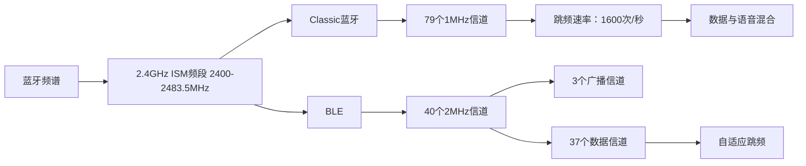
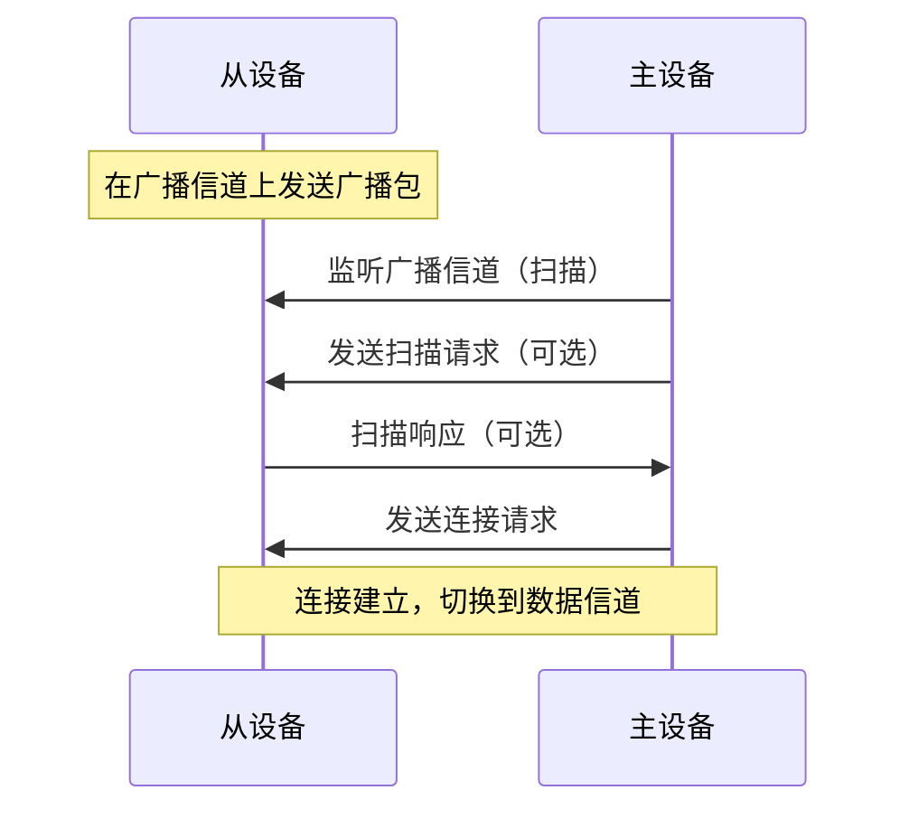
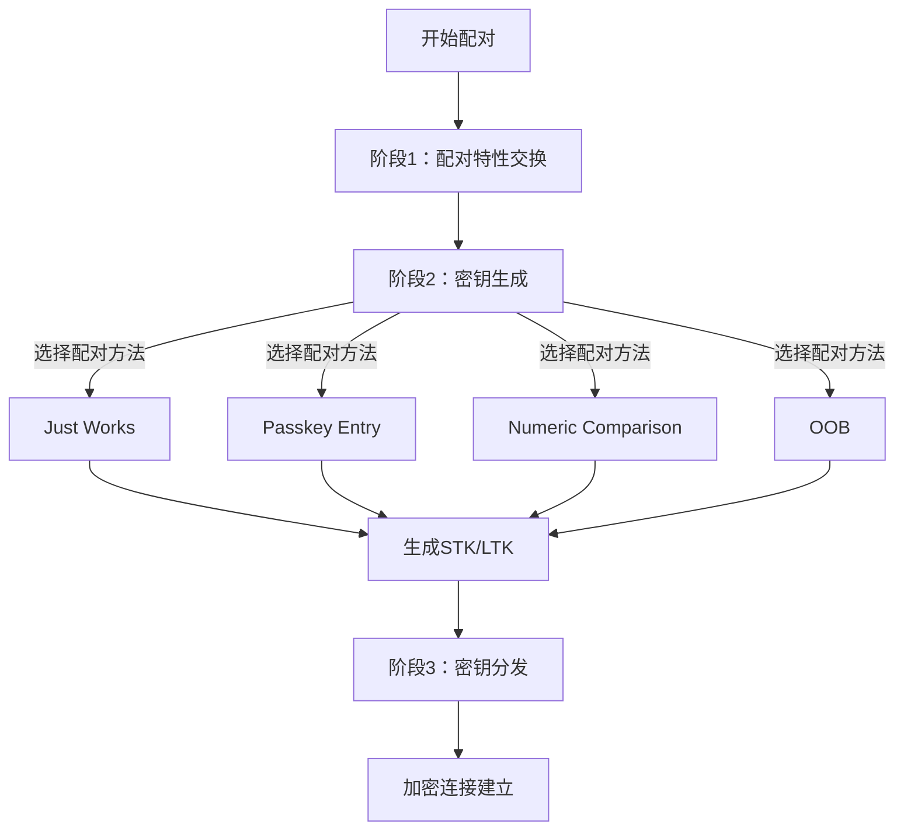

# BLE蓝牙规范培训
## 目录
1. BLE与Classic蓝牙的区别
2. BLE连接建立过程
3. BLE安全机制：配对与加密
---
## 1. BLE与Classic蓝牙的区别
### 核心差异对比
特性	Classic蓝牙	BLE (低功耗蓝牙)
|   特性       | ClassicBT 经典蓝牙 | BLE (Bluetooth Low Energy/低功耗蓝牙) |
|    ----         |     -----    |     -----    |
|设计目标	|持续数据流传输	|间歇性短数据突发|
|功耗	|高功耗 (10-50mA)	|超低功耗 (0.01-0.5mA)|
|峰值数据速率	|2-3 Mbps	|1-2 Mbps (5.x达2Mbps)|
|连接时间	|100ms-数秒	|3-5ms|
|拓扑结构	|点对点/微微网	|点对点/广播/网状网络|
|应用场景	|音频传输/文件共享	|传感器/穿戴设备/IoT|
|协议栈复杂度	|复杂	|简化
|信道数量	|79个信道	|40个信道|
|信道带宽	|1MHz	|2MHz|
|广播机制	|无专用广播信道	|3个专用广播信道|

## 2. BLE连接建立过程
BLE连接建立过程分为两个主要阶段：广播和扫描、连接建立。
### 步骤详解
1. **广播和扫描**：
   - 从设备（Peripheral）在三个广播信道上发送广播包（Advertising Packets）。
   - 主设备（Central）在相同的广播信道上进行扫描，当收到广播包时，可以发送扫描请求（Scan Request）以获取更多信息（从设备会回复Scan Response）。
2. **连接请求**：
   - 主设备若希望连接，则发送连接请求（Connect Request）包，该包包含了连接参数（如连接间隔、从设备延迟、超时时间等）。
   - 从设备收到连接请求后，即进入连接状态。
3. **连接建立**：
   - 主设备和从设备切换到数据信道，并按照约定的连接参数进行通信。
### 连接参数
- **连接间隔（Connection Interval）**：两次连接事件之间的时间间隔，范围为7.5ms到4s。
- **从设备延迟（Slave Latency）**：允许从设备跳过连接事件的次数，以降低功耗。
- **监督超时（Supervision Timeout）**：连接超时时间，必须大于(1+Slave Latency)*Connection Interval。
### 图示
我们可以使用mermaid的序列图来表示连接建立过程：

> 注意：在实际培训中，可以使用更详细的图示，包括广播信道和数据信道的切换。
---
## 3. 安全机制：配对与加密
BLE的安全机制主要通过配对（Pairing）过程实现，配对成功后建立加密连接。
### 配对过程
BLE配对分为三个阶段：
1. **配对特性交换**：交换双方支持的安全特性（如IO能力、认证需求）。
2. **密钥生成**：根据选择的配对方法生成短期密钥（STK）或长期密钥（LTK）。
3. **密钥分发**：交换用于加密和身份验证的密钥（如LTK、IRK、CSRK等）。
### 配对方法
根据设备的输入输出能力，BLE提供了多种配对方法：
- **Just Works**：无需用户交互，安全性较低（防窃听但不防中间人攻击）。
- **Passkey Entry**：用户输入6位数字，安全性较高。
- **Numeric Comparison**（仅Secure Connections）：双方显示6位数字，用户确认是否相同。
- **Out of Band (OOB)**：通过其他安全通道（如NFC）交换信息。
### 加密连接
配对成功后，使用生成的LTK（Long Term Key）进行链路加密。后续连接可以使用存储的LTK直接加密（称为绑定）。
### 安全连接（Secure Connections）
从BLE 4.2开始，引入了基于椭圆曲线加密（ECC）的安全连接（Secure Connections），提供更强的安全性。
### 图示
使用mermaid流程图表示配对过程：

> 说明：在阶段2中，根据设备的能力和用户交互选择合适的配对方法，然后生成密钥。阶段3分发密钥后，链路即可加密。
---
## 总结
- BLE与Classic蓝牙在设计目标、功耗、信道等方面有显著区别。
- BLE连接建立包括广播、扫描和连接请求，建立后使用数据信道通信。
- BLE安全机制通过配对过程实现，支持多种配对方法，并最终建立加密连接。