# 系统基本框图

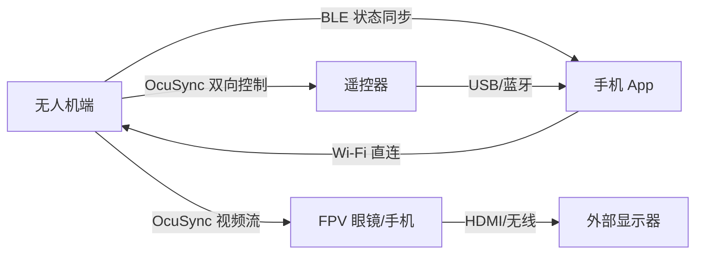
```mermaid
graph LR
A[无人机端] -->|OcuSync 双向控制| B[遥控器]
A -->|OcuSync 视频流| C[FPV 眼镜/手机]
A -->|BLE 状态同步| D[手机 App]
B -->|USB/蓝牙| D
C -->|HDMI/无线| E[外部显示器]
D -->|Wi-Fi 直连| A
```
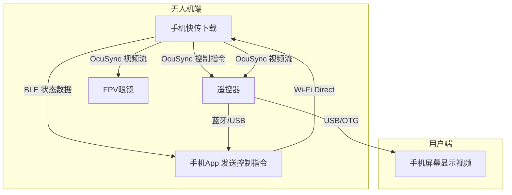
```mermaid
graph TB
  subgraph 无人机端
    A[飞控系统] -->|OcuSync 控制指令| B[遥控器]
    A -->|OcuSync 视频流| C[FPV眼镜]
    A -->|OcuSync 视频流| B
    A -->|BLE 状态数据| D[手机App]
  end
subgraph 用户端
    B[遥控器] -->|USB/OTG| E[手机屏幕显示视频]
    B -->|蓝牙/USB| D[手机App 发送控制指令]
    D -->|Wi-Fi Direct| A[手机快传下载]
  end
```

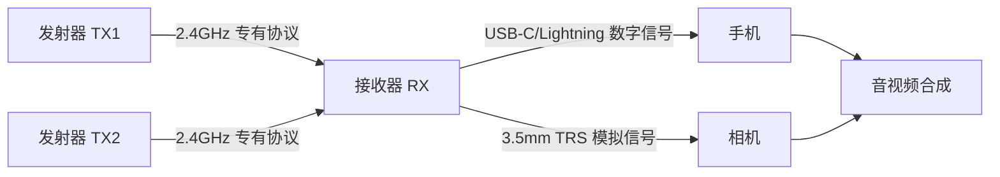
```mermaid
graph LR
A[发射器 TX1] -->|2.4GHz 专有协议| B[接收器 RX]
A2[发射器 TX2] -->|2.4GHz 专有协议| B
B -->|USB-C/Lightning 数字信号| C[手机]
B -->|3.5mm TRS 模拟信号| D[相机]
C & D --> E[音视频合成]
```

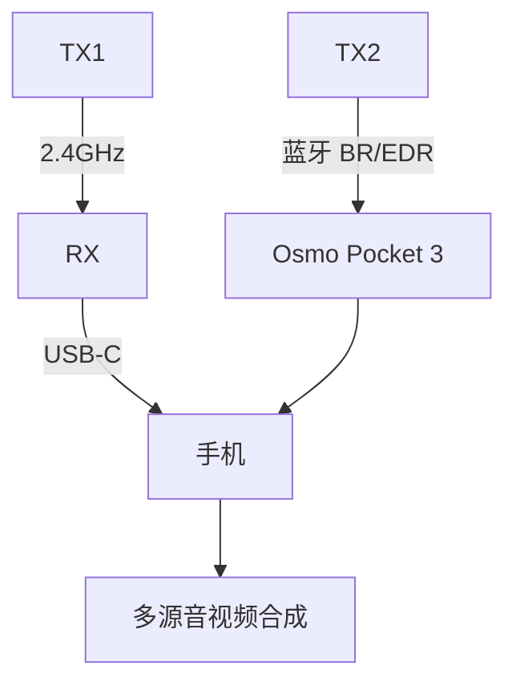
```mermaid
graph TB
A[TX1] -->|2.4GHz| B[RX]
A2[TX2] -->|蓝牙 BR/EDR| C[Osmo Pocket 3]
B -->|USB-C| D[手机]
C --> D
D --> E[多源音视频合成]
```

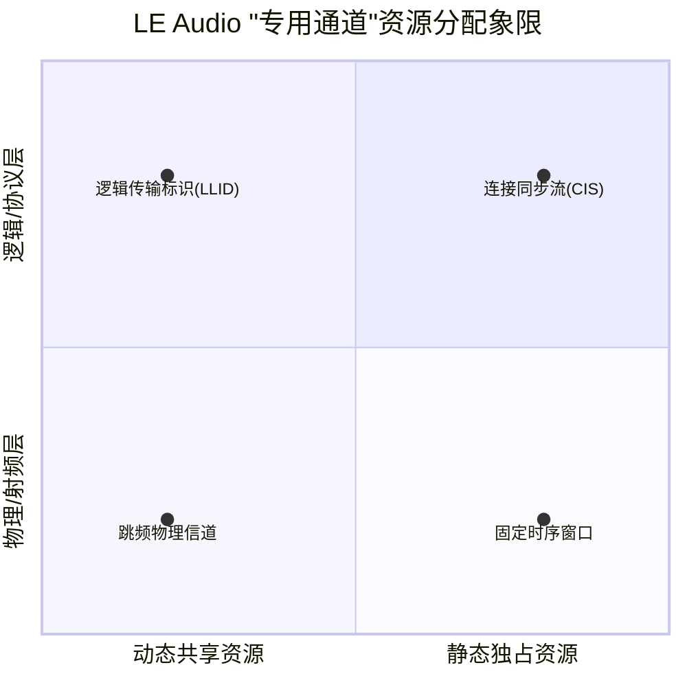
```mermaid
quadrantChart
    title LE Audio "专用通道"资源分配象限
    x-axis "动态共享资源" --> "静态独占资源"
    y-axis "物理/射频层" --> "逻辑/协议层"
    "跳频物理信道": [0.2, 0.2]
    "固定时序窗口": [0.8, 0.2]
    "逻辑传输标识(LLID)": [0.2, 0.8]
    "连接同步流(CIS)": [0.8, 0.8]
```

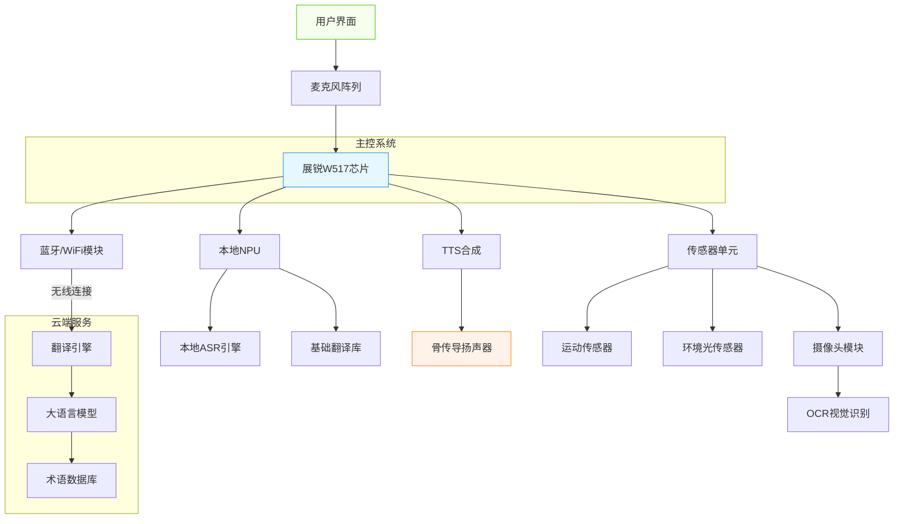
```mermaid
graph TD
    A[用户界面] --> B[麦克风阵列]
    B --> C{主控系统}
    C --> D[蓝牙/WiFi模块]
    C --> E[本地NPU]
    C --> F[传感器单元]
    
    subgraph 主控系统
        C[展锐W517芯片]
        style C fill:#e6f7ff,stroke:#1890ff
    end
    
    subgraph 云端服务
        G[翻译引擎]
        H[大语言模型]
        I[术语数据库]
    end
    
    D -->|无线连接| G
    G --> H
    H --> I
    
    E --> J[本地ASR引擎]
    E --> K[基础翻译库]
    
    C --> L[TTS合成]
    L --> M[骨传导扬声器]
    
    F --> N[运动传感器]
    F --> O[环境光传感器]
    F --> P[摄像头模块]
    
    P --> Q[OCR视觉识别]
    
    style A fill:#f6ffed,stroke:#52c41a
    style M fill:#fff2e8,stroke:#fa8c16
```    
# 模块功能详解
## 核心处理单元
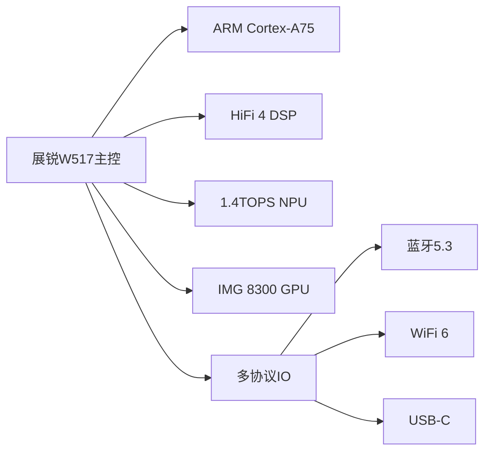
```mermaid
graph LR
    W517[展锐W517主控] --> ARM[ARM Cortex-A75]
    W517 --> DSP[HiFi 4 DSP]
    W517 --> NPU[1.4TOPS NPU]
    W517 --> GPU[IMG 8300 GPU]
    W517 --> IO[多协议IO]
    
    IO --> BT[蓝牙5.3]
    IO --> WIFI[WiFi 6]
    IO --> USB[USB-C]
```

## 翻译处理流程
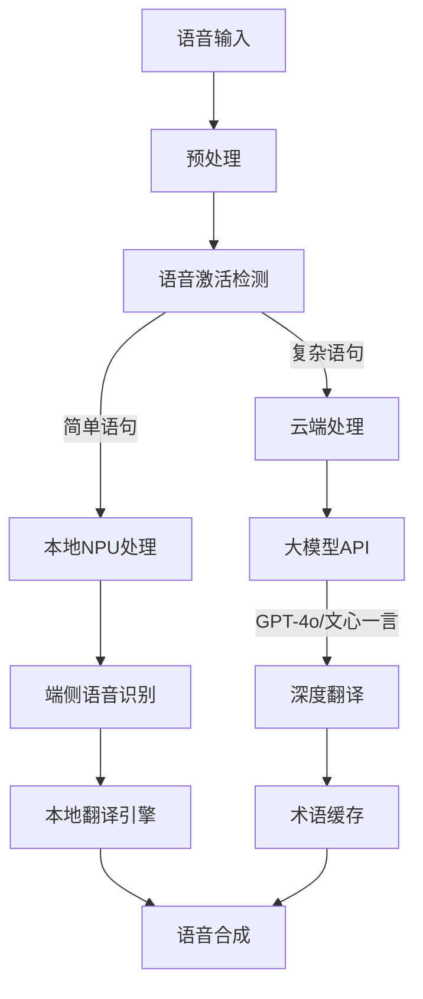
```mermaid
flowchart TB
    Input[语音输入] --> Pre[预处理]
    Pre --> VAD[语音激活检测]
    VAD -->|简单语句| Local[本地NPU处理]
    VAD -->|复杂语句| Cloud[云端处理]
    
    Local --> ASR[端侧语音识别]
    ASR --> Translate[本地翻译引擎]
    Translate --> TTS[语音合成]
    
    Cloud --> API[大模型API]
    API -->|GPT-4o/文心一言| Process[深度翻译]
    Process --> Cache[术语缓存]
    Cache --> TTS
```

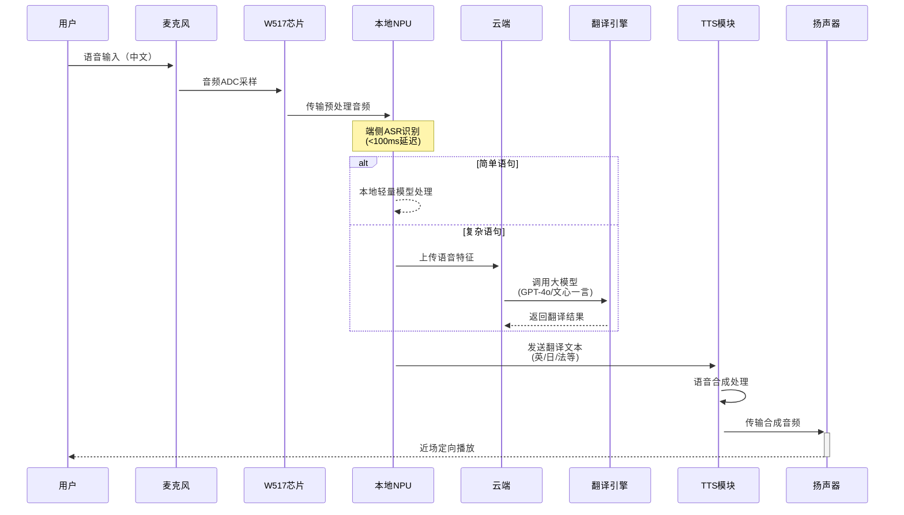
```mermaid
sequenceDiagram
    participant U as 用户
    participant M as 麦克风
    participant C as W517芯片
    participant NPU as 本地NPU
    participant Cloud as 云端
    participant TE as 翻译引擎
    participant TTS as TTS模块
    participant S as 扬声器
    
    U->>+M: 语音输入（中文）
    M->>+C: 音频ADC采样
    C->>+NPU: 传输预处理音频
    Note over NPU: 端侧ASR识别<br/>(<100ms延迟)
    
    alt 简单语句
        NPU-->>NPU: 本地轻量模型处理
    else 复杂语句
        NPU->>+Cloud: 上传语音特征
        Cloud->>+TE: 调用大模型<br/>(GPT-4o/文心一言)
        TE-->>Cloud: 返回翻译结果
    end
    
    NPU->>+TTS: 发送翻译文本<br/>(英/日/法等)
    TTS->>+TTS: 语音合成处理
    TTS->>+S: 传输合成音频
    S-->>-U: 近场定向播放
```
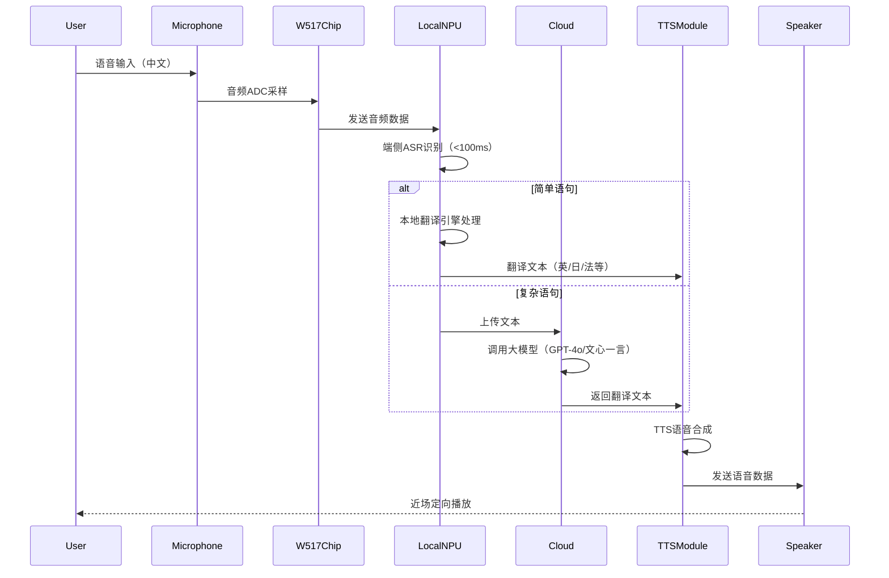
```mermaid
sequenceDiagram
    participant User
    participant Microphone
    participant W517Chip
    participant LocalNPU
    participant Cloud
    participant TTSModule
    participant Speaker
    User->>Microphone: 语音输入（中文）
    Microphone->>W517Chip: 音频ADC采样
    W517Chip->>LocalNPU: 发送音频数据
    LocalNPU->>LocalNPU: 端侧ASR识别（<100ms）
    alt 简单语句
        LocalNPU->>LocalNPU: 本地翻译引擎处理
        LocalNPU->>TTSModule: 翻译文本（英/日/法等）
    else 复杂语句
        LocalNPU->>Cloud: 上传文本
        Cloud->>Cloud: 调用大模型（GPT-4o/文心一言）
        Cloud->>TTSModule: 返回翻译文本
    end
    TTSModule->>TTSModule: TTS语音合成
    TTSModule->>Speaker: 发送语音数据
    Speaker-->>User: 近场定向播放
```

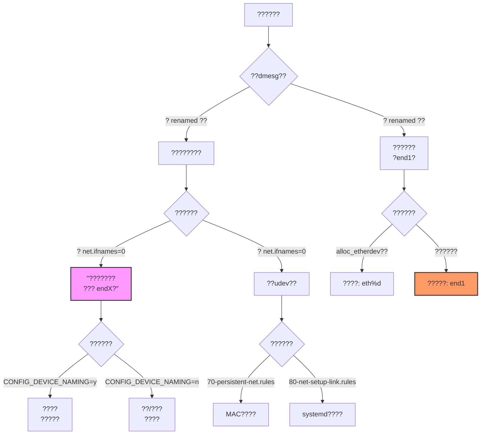
```mermaid
graph TD
    A[??????] --> B{??dmesg??}
    B -->|? renamed ??| C[????????]
    B -->|? renamed ??| D[??????<br>?end1?]
    
    C --> E{??????}
    E -->|? net.ifnames=0| F[#quot;???????<br>??? endX?#quot;]
    E -->|? net.ifnames=0| G[??udev??]
    
    F --> H{??????}
    H -->|CONFIG_DEVICE_NAMING=y| I[????<br>?????]
    H -->|CONFIG_DEVICE_NAMING=n| J[??/???<br>????]
    
    D --> K{??????}
    K -->|alloc_etherdev??| L[????: eth%d]
    K -->|??????| M[?????: end1]
    
    G --> N{??????}
    N -->|70-persistent-net.rules| O[MAC????]
    N -->|80-net-setup-link.rules| P[systemd????]
    
    style F fill:#f9f,stroke:#333,stroke-width:2px
    style M fill:#f96,stroke:#333,stroke-width:2px
    classDef highlight fill:#ff0,stroke:#f00,stroke-width:2px;
    class F,M highlight;
```
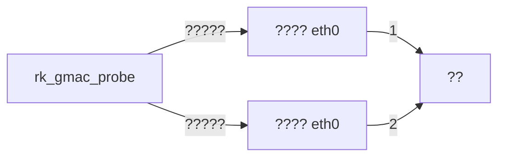
```mermaid
graph LR
    A[rk_gmac_probe] -->|?????| B[???? eth0]
    A[rk_gmac_probe] -->|?????| C[???? eth1]

    B[???? eth0] -->|1| D[??]
    C[???? eth0] -->|2| D[??]    
```
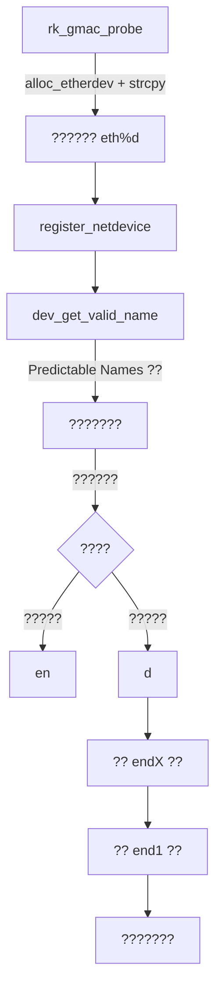
```mermaid
graph TD
    A[rk_gmac_probe] -->|alloc_etherdev + strcpy| B[?????? eth%d]
    B --> C[register_netdevice]
    C --> D[dev_get_valid_name]
    D -->|Predictable Names ??| E[???????]
    E -->|??????| F{????}
    F -->|?????| G[en]
    F -->|?????| H[d]
    H --> I[?? endX ??]
    I --> J[?? end1 ??]
    J --> K[???????]
```
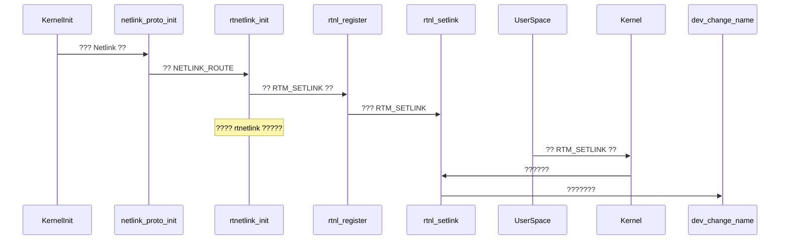
```mermaid
sequenceDiagram
    participant KernelInit
    participant netlink_proto_init
    participant rtnetlink_init
    participant rtnl_register
    participant rtnl_setlink
    
    KernelInit->>netlink_proto_init: ??? Netlink ??
    netlink_proto_init->>rtnetlink_init: ?? NETLINK_ROUTE
    rtnetlink_init->>rtnl_register: ?? RTM_SETLINK ??
    rtnl_register->>rtnl_setlink: ??? RTM_SETLINK
    
    Note over rtnetlink_init: ???? rtnetlink ?????
    
    UserSpace->>Kernel: ?? RTM_SETLINK ??
    Kernel->>rtnl_setlink: ??????
    rtnl_setlink->>dev_change_name: ???????
```
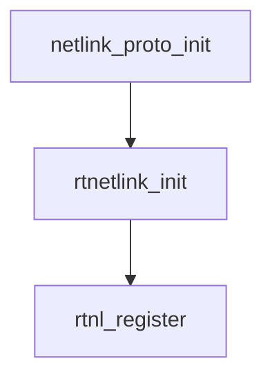
```mermaid
graph TD
    netlink_proto_init --> rtnetlink_init
    rtnetlink_init --> rtnl_register

```

```mermaid
graph TD
    A[??????] --> B{??dmesg??}
    B -->|? renamed ??| C[????????]
    B -->|? renamed ??| D[??????<br>?end1?]
    
    C --> E{??????}
    E -->|? net.ifnames=0| F[#quot;???????<br>??? endX?#quot;]
    E -->|? net.ifnames=0| G[??udev??]
    
    F --> H{??????}
    H -->|CONFIG_DEVICE_NAMING=y| I[????<br>?????]
    H -->|CONFIG_DEVICE_NAMING=n| J[??/???<br>????]
    
    D --> K{??????}
    K -->|alloc_etherdev??| L[????: eth%d]
    K -->|??????| M[?????: end1]
    
    G --> N{??????}
    N -->|70-persistent-net.rules| O[MAC????]
    N -->|80-net-setup-link.rules| P[systemd????]
    
    style F fill:#f9f,stroke:#333,stroke-width:2px
    style M fill:#f96,stroke:#333,stroke-width:2px
    classDef highlight fill:#ff0,stroke:#f00,stroke-width:2px;
    class F,M highlight;
```

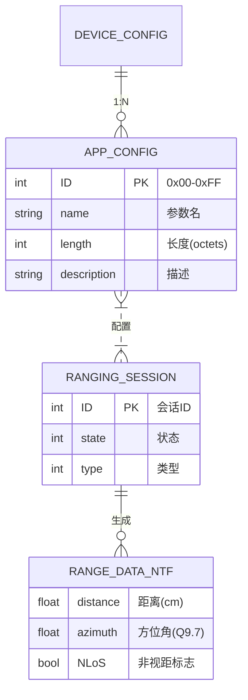
```mermaid
erDiagram
    DEVICE_CONFIG ||--o{ APP_CONFIG : "1:N"
    APP_CONFIG {
        int ID PK "0x00-0xFF"
        string name "参数名"
        int length "长度(octets)"
        string description "描述"
    }
    
    APP_CONFIG }|..|{ RANGING_SESSION : "配置"
    RANGING_SESSION {
        int ID PK "会话ID"
        int state "状态"
        int type "类型"
    }
    
    RANGING_SESSION ||--o{ RANGE_DATA_NTF : "生成"
    RANGE_DATA_NTF {
        float distance "距离(cm)"
        float azimuth "方位角(Q9.7)"
        bool NLoS "非视距标志"
    }
```