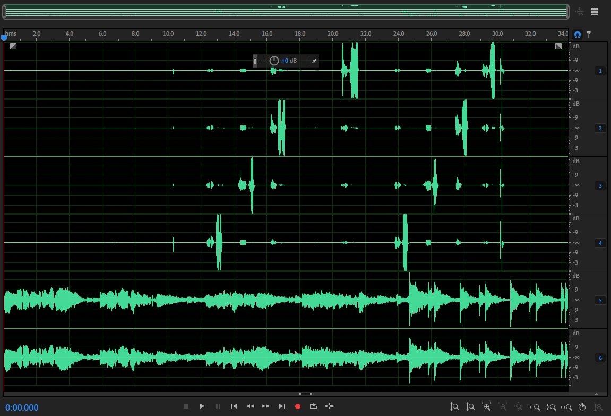

[memo.md](memo.md)  

[TASK_6788](http://10.5.103.101:9080/task-view-6788.html) 分享相关ADC的采集与验证
```c
I2C的验证
ES7210 设备地址（0x40）
dump寄存器数据
 rk3566_r:/ # i2cdump -y -f 3 0x40
     0  1  2  3  4  5  6  7  8  9  a  b  c  d  e  f    0123456789abcdef
00: 41 20 c1 04 01 00 04 20 10 20 10 01 00 09 0a 00    A ???.? ? ??.??.
10: 00 83 01 00 3c 3c ff 10 ff ff 00 bf bf bf bf ff    .??.<<????.?????
20: 0a 2a 0a 2a 11 ff ff 0a ff ff ff 2a ff ff ff 2a    ?*?*???????*???*
30: ff ff ff 2a ff ff ff 2a 00 00 80 ff 01 72 10 11    ???*???*..???r??
40: 43 71 71 10 10 10 10 26 06 26 06 0f 0f ff ff ff    Cqq????&?&??????
50: ff ff ff ff ff ff ff ff ff ff ff ff ff ff ff ff    ????????????????
60: ff ff ff ff ff ff ff ff ff ff ff ff ff ff ff ff    ????????????????
70: ff ff ff ff ff ff ff ff ff ff ff ff ff 72 10 11    ?????????????r??
80: 41 20 c1 04 01 00 04 20 10 20 10 01 00 09 0a 00    A ???.? ? ??.??.
90: 00 83 01 00 3c 3c ff 10 ff ff 00 bf bf bf bf ff    .??.<<????.?????
a0: 0a 2a 0a 2a 11 ff ff 0a ff ff ff 2a ff ff ff 2a    ?*?*???????*???*
b0: ff ff ff 2a ff ff ff 2a 00 00 80 ff 01 72 10 11    ???*???*..???r??
c0: 43 71 71 10 10 10 10 26 06 26 06 0f 0f ff ff ff    Cqq????&?&??????
d0: ff ff ff ff ff ff ff ff ff ff ff ff ff ff ff ff    ????????????????
e0: ff ff ff ff ff ff ff ff ff ff ff ff ff ff ff ff    ????????????????
f0: ff ff ff ff ff ff ff ff ff ff ff ff ff 72 10 11    ?????????????r??

设置单个寄存器 寄存器地址（0x00）寄存器要设置的值（0x42）
i2cset -f -y 3 0x40 0x00 0x42 b

读取单个寄存器  寄存器地址（0x00）
i2cget -f -y 3 0x40 0x00

如果要采集ES7243的相关内容，需要更改设备地址为0x10就可以了
```
```c
I2S的验证；
adb root
adb shell
cd sdcard
录制的文件名123_c6.wav
tinycap 123_c6.wav -D 1 -d 0 -c 6 -r 16000

然后可以测试时钟信号了

Ctrl +C 就可以停止录音

拉出录制的音频数据：
adb pull sdcard/123_c6_r16.wav C:\Users\SZ000041\Desktop\rk3566\1119 

用Adobe Audition 打开123_c6_r16.wav数据：
```

```c
艾为的初始化参数位置
vendor/firmware/aw87xxx_acf.bin

```
```c


```
```c


```
```c


```