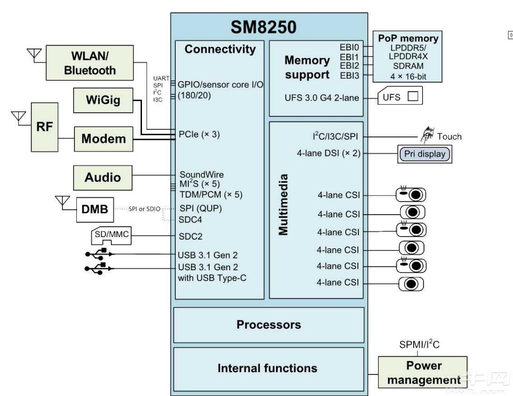

[sm8250-mainline](https://gitlab.com/sm8250-mainline/linux)  
[ArchlinuxARM-qcom](https://github.com/silime/ArchlinuxARM-qcom-aarch64)  

[MTK](https://ubuntu.com/download/mediatek-genio)  
[软件编译文档](https://docs.qualcomm.com/bundle/publicresource/topics/80-70018-254Y/build_landing_page.html)  

# 高通SM8250(骁龙865)处理器规格参数
SM8250(骁龙865)是带有外部4G / 5G调制解调器（SDX55M）的新一代Qualcomm @ Snapdragon高级处理器。  
它采用7纳米工艺设计，具有出色的性能和能效。 SM8250包括以下关键组件：  
-基于Arm Cortex技术的高通Kryo 585 CPU  
-Qualcomm Adreno 650 GPU提供最高的图形性能和能效  
-Qualcomm具有四边形六边形矢量扩展（HVX）处理器的Hexagon DSP，用于视觉处理和机器学习  
-Qualcomm Spectra 480图像处理引擎可提供最佳的摄影和摄像体验  
-Adreno 665 VPU用于高质量，超高清视频编码和解码  
-Adreno 995 DPU支持设备上和外部超高清显示  
-低功耗音频子系统与Qualcomm Aqstic M Audio Technologies WCD9380 / CD9385音频编解码器相结合，可实现低功耗语音处理和发烧友级音频播放  
-Qualcomm Sensing Hub提供上下文感知和始终在线的传感器支持  
-高通安全处理单元（SPU240），用于高级安全用例  
-高通神经处理单元（NPU230），用于高性能机器学习用例  
-外部802.11a×，2×2MIMO。 和蓝牙5.1  
-四通道级封装（PoP）高速LPDDR5 / LPDDR4X SDRAM  

  

