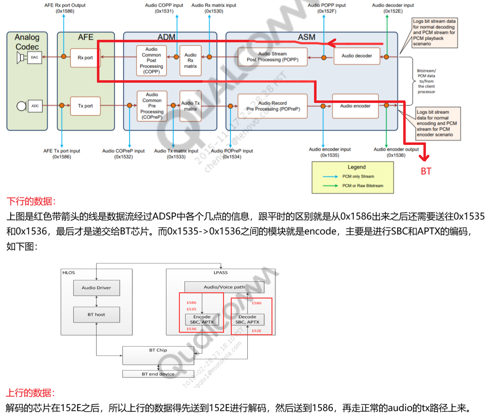

[memo.md](memo.md)  
[sm8550.md](sm8550.md)  

|   LS PCB Name       |  Pin |
|    ----      | ---- |
|HMT_BT_UART_RTS|GPIO_76|
|HMT_BT_UART_CTS|GPIO_77|
|HMT_BT_UART_TX|GPIO_78|
|HMT_BT_UART_RX|GPIO_79|
|HMT_WLAN_EN|GPIO_80|
|HMT_BT_EN|GPIO_81|
|HMT_SW_CTRL|GPIO_82|
|HMT_SW_CTRL_WL_CX|GPIO_83|
|WCN_0V95_EN|GPIO_186|
|WCN_1V9_EN|GPIO_187|
|WCN_1V8_EN|GPIO_196|
|HMT_BLE_UART_TX|GPIO_202|
|HMT_BLE_UART_RX|GPIO_203|

|   DK Name       |  Pin |
|    ----      | ---- |
|W5_UART_RTS_BT|GPIO_76|
|W5_UART_CTS_BT|GPIO_77|
|W5_UART_RX_BT|GPIO_78|
|W5_UART_TX_BT|GPIO_79|
|WBM_BT_RST|GPIO_81|

## QSSI
```c
/data/sm8550/qssi/LA.QSSI.13.0/LINUX/android/vendor/qcom/opensource/commonsys/system/bt/device/src/controller.cc
/data/sm8550/qssi/LA.QSSI.13.0/LINUX/android/vendor/qcom/opensource/commonsys/bluetooth_ext/packages_apps_bluetooth_ext/jni/com_android_bluetooth_btservice_vendor.cpp
```
```c
load_bt_configstore_lib()
Invoke load_bt_configstore_lib(), dlopen "libbtconfigstore.so"
Get qcom bluetooth feature，such as [soc name], [split a2dp support or not]
```

<div align="center">
  
</div>

## Vendor
```c
/data/sm8550/vendor/LA.VENDOR.13.2.6/LINUX/android/hardware/interfaces/bluetooth/1.0/default/vendor_interface.cc
/data/sm8550/vendor/LA.VENDOR.13.2.6/LINUX/android/platform_testing/build/tasks/tests/instrumentation_test_list.mk
/data/sm8550/vendor/LA.VENDOR.13.2.6/LINUX/android/vendor/qcom/proprietary/bluetooth/build/bt-vendor-proprietary-board.mk
/data/sm8550/vendor/LA.VENDOR.13.2.6/LINUX/android/vendor/qcom/proprietary/bluetooth/build/bt-vendor-proprietary-product.mk
/data/sm8550/vendor/LA.VENDOR.13.2.6/LINUX/android/vendor/qcom/proprietary/bt-devicetree/kalama-bt.dtsi
```
```c
/data/sm8550/vendor/LA.VENDOR.13.2.6/LINUX/android/vendor/qcom/opensource/wlan/platform/cnss2/power.c
```
### Hal layer config
```c
/data/sm8550/vendor/LA.VENDOR.13.2.6/LINUX/android/vendor/qcom/proprietary/bluetooth/build/bt-vendor-proprietary-board.mk
#ANT
BOARD_ANT_WIRELESS_DEVICE := "qualcomm-hidl"
ifneq ($(filter msm8937 msm8953 msm8909, $(TARGET_BOARD_PLATFORM)),)
BOARD_ANT_WIRELESS_DEVICE := "vfs-prerelease"
endif

#BT
BOARD_HAVE_BLUETOOTH := true
BOARD_HAVE_BLUETOOTH_QCOM := true
TARGET_USE_QTI_BT_CONFIGSTORE := true
TARGET_USE_QTI_BT_SAR := true
TARGET_USE_QTI_VND_FWK_DETECT := true
TARGET_USES_QTI_BTFTM := true

#FM
ifneq ($(TARGET_BOARD_TYPE), auto)
BOARD_HAVE_QCOM_FM := true
endif
```
## BT name
```c
/data/sm8550/qssi/LA.QSSI.13.0/LINUX/android/vendor/qcom/opensource/commonsys-intf/bluetooth/build/qva/config/bdroid_buildcfg.h
```

```c
./LA.VENDOR.13.2.6/LINUX/android/vendor/qcom/proprietary/common/config/device-vendor.mk
-WLAN += libwifi-hal-nxp
+WLAN += libwifi-hal-qcom
```
```c
BoardConfig.mk
```
```c
./LA.VENDOR.13.2.6/LINUX/android/vendor/qcom/proprietary/bt-devicetree
./LA.VENDOR.13.2.6/LINUX/android/vendor/qcom/opensource/bt-kernel
```
```c
./LA.VENDOR.13.2.6/LINUX/android/system/core/rootdir/init.rc
./LA.VENDOR.13.2.6/LINUX/android/device/qcom/common/rootdir/etc/init.qcom.rc
```
```c
/data/sm8550/vendor/LA.VENDOR.13.2.6/LINUX/android/device/qcom/kalama/init.target.rc
    copy /vendor/etc/wifi/wpa_supplicant.conf /data/vendor/wifi/wpa_supplicant.conf
    chown wifi wifi /data/vendor/wifi/wpa_supplicant.conf
/data/sm8550/vendor/LA.VENDOR.13.2.6/LINUX/android/device/qcom/wlan/kalama/BoardConfigWlan.mk
/data/sm8550/vendor/LA.VENDOR.13.2.6/LINUX/android/device/qcom/wlan/kalama/wlan.mk
```
```c
/s08g/sm8550/sm8550/VENDOR.13.2.6/device/qcom/kalama/kalama.mk
#BT mac read from nv 447,
PRODUCT_PROPERTY_OVERRIDES += persist.vendor.bluetooth.modem_nv_support=true
```
```c
/data/sm8550/vendor/LA.VENDOR.13.2.6/LINUX/android/build/make/target/product/cfi-common.mk
    hardware/nxp \
    hardware/nxp/libbt \
    hardware/nxp/wlan/wifi_hal \
```


```c
kalama:/ $ lsmod | grep bt
bt_fm_slim             45056  1
btpower                45056  1 bt_fm_slim
smcinvoke_dlkm        196608  62 cnss2,btpower
cnss_utils             32768  2 cnss2,btpower
slimbus                45056  2 bt_fm_slim,slim_qcom_ngd_ctrl
phy_qcom_ufs_qrbtc_sdm845    16384  0
phy_qcom_ufs           36864  9 phy_qcom_ufs_qmp_v4,phy_qcom_ufs_qmp_v4_khaje,phy_qcom_ufs_qmp_v4_lahaina,phy_qcom_ufs_qmp_v4_kona,phy_qcom_ufs_qmp_v4_waipio,ufs_qcom,phy_qcom_ufs_qrbtc_sdm845,phy_qcom_ufs_
qmp_v4_crow,phy_qcom_ufs_qmp_v4_kalama

kalama:/ # dmesg | grep bt
[    0.385703] SOM Version:1 DK Version:0 Subtype Version:0
[    0.385707] v0.16, id=603, ver=2.0, raw_id=594, raw_ver=2, hw_plat=11, hw_plat_ver=65536\x0a accessory_chip=0, hw_plat_subtype=0, pmic_model=65610, pmic_die_revision=131073 foundry_id=1 serial_number=157
9033752 num_pmics=8 chip_family=0x7f raw_device_family=0xa raw_device_number=0x3 nproduct_id=0x437 num_clusters=0x1 ncluster_array_offset=0xc0 num_subset_parts=0x11 nsubset_parts_array_offset=0xc4 nmodem_su
pported=0x0 feature_code=0x3 pcode=0x2 sku=QCS_KALAMAP-2-AC
[    4.434508] btpower: no symbol version for get_client_env_object
[    4.607302] of_get_named_gpiod_flags: parsed 'qcom,wlan-sw-ctrl-gpio' property of node '/soc/bt-qca-converged[0]' - status (0)
[    4.607318] bt_power_probe:WLAN_SW_CNTRL_GPIO value= 0
[    4.607740] bt_power_populate_dt_pinfo: bt_kiwi device node found
[    4.609076] of_get_named_gpiod_flags: parsed 'qcom,bt-reset-gpio' property of node '/soc/bt-qca-converged/bt_kiwi[0]' - status (0)
[    4.609097] of_get_named_gpiod_flags: parsed 'qcom,wl-reset-gpio' property of node '/soc/bt-qca-converged/bt_kiwi[0]' - status (0)
[    4.609114] of_get_named_gpiod_flags: parsed 'qcom,bt-sw-ctrl-gpio' property of node '/soc/bt-qca-converged/bt_kiwi[0]' - status (0)
[    4.609127] of_get_named_gpiod_flags: can't parse 'qcom,bt-debug-gpio' property of node '/soc/bt-qca-converged/bt_kiwi[0]'
[    4.609134] bt-debug-gpio not provided in devicetree
[    4.609138] of_get_named_gpiod_flags: can't parse 'qcom,xo-clk-gpio' property of node '/soc/bt-qca-converged/bt_kiwi[0]'
[    4.609146] bt_dt_parse_clk_info: clocks is not provided in device tree
[    4.617599] bt_power_populate_dt_pinfo: clock not provided in device tree
[    4.617605] bt_power_populate_dt_pinfo: temperature sensor is not provided in dts
[    4.631091] btpower_aop_mbox_init: vreg for iPA not configured
[    4.666114] of_get_named_gpiod_flags: parsed 'qcom,bt-en-gpio' property of node '/soc/qcom,cnss-qca-converged/chip_cfg@1[0]' - status (0)
[    4.854242] btfm_slim_probe: name = 217:221:1:0
[    4.854245] btfm_slim_probe: name = btfmslim_slave
[    4.854247] btfm_slim_probe: is_laddr_valid is true
[    4.860073] btfmslim-driver btfmslim_slave:
[   17.910497] Modules linked in: 8852be(E) moal(E) mlan(E) ipa_clientsm(OE) machine_dlkm(OE) rndisipam(OE) ipanetm(OE) swr_dmic_dlkm(OE) bt_fm_slim(OE) camera(OE) rmnet_shs(OE) rmnet_perf_tether(OE) rmnet_
offload(OE) rmnet_perf(OE) rmnet_wlan(OE) rmnet_aps(OE) lpass_cdc_wsa2_macro_dlkm(OE) lpass_cdc_rx_macro_dlkm(OE) msm_drm(OE) ipam(OE) msm_video(OE) lpass_cdc_va_macro_dlkm(OE) wcd939x_dlkm(OE) wcd937x_dlkm
(OE) msm_eva(OE) lpass_cdc_wsa_macro_dlkm(OE) wcd938x_dlkm(OE) cnss2(OE) mac80211(E) lpass_cdc_tx_macro_dlkm(OE) audio_pkt_dlkm(OE) rmnet_core(OE) qcrypto_msm_dlkm(OE) qcedev_mod_dlkm(OE) btpower(OE) swr_ct
rl_dlkm(OE) stm_st54se_gpio(OE) rmnet_sch(OE) msm_kgsl(OE) tz_log_dlkm(OE) sync_fence(OE) stub_dlkm(OE) msm_hw_fence(OE) hdcp_qseecom_dlkm(OE) gsim(OE) msm_mmrm(OE) pinctrl_lpi_dlkm(OE) radio_i2c_rtc6226_qc
a(OE) rmnet_ctl(OE) adsp_loader_dlkm(OE) wsa884x_dlkm(OE) audpkt_ion_dlkm(OE) cnss_plat_ipc_qmi_svc(OE) cnss_nl(OE) swr_haptics_dlkm(OE) qce50_dlkm(OE)
[   17.910671] qnoc_crow(E) qnoc_kalama(E) bwmon(E) ufshcd_crypto_qti(E) icc_rpmh(E) qcom_dcvs(E) mem_buf(E) crypto_qti_common(E) msm_qmp(E) phy_qcom_ufs_qrbtc_sdm845(E) camcc_kalama(E) dcvs_fp(E) phy_qcom_
ufs_qmp_v4_crow(E) icc_bcm_voter(E) sdhci_msm(E) mem_buf_msgq(E) qcom_tsens(E) arm_smmu(E) qcom_dma_heaps(E) videocc_kalama(E) tcsrcc_kalama(E) dispcc_kalama(E) qcom_cpu_vendor_hooks(E) dispcc_crow(E) clk_d
ummy(E) gcc_crow(E) gh_virt_wdt(E) rpmh_regulator(E) phy_qcom_ufs_qmp_v4_kalama(E) gcc_kalama(E) clk_rpmh(E) phy_qcom_ufs(E) qcom_aoss(E) bcl_pmic5(E) qcom_rpmh(E) clk_qcom(E) qcom_iommu_util(E) pmu_scmi(E)
 msm_rtb(E) pinctrl_kalama(E) mem_buf_dev(E) dcc_v2(E) qcom_logbuf_vh(E) thermal_minidump(E) qrtr(E) crypto_qti_hwkm(E) gunyah(E) pinctrl_crow(E) qcom_wdt_core(E) thermal_pause(E) qcom_dload_mode(E) memory_
dump_v2(E) pinctrl_msm(E) qcom_pdc(E) qcom_ipc_logging(E) sched_walt(E) nvme(E) qcom_pmu_lib(E) stub_regulator(E) secure_buffer(E) minidump(E) gdsc_regulator(E)
kalama:/ #

```
### BT audio playing
```c
kalama:/ # dmesg | grep bt
[   12.490347] Modules linked in: kiwi_v2(OE) ipa_clientsm(OE) rndisipam(OE) ipanetm(OE) msm_drm(OE) rmnet_perf(OE) machine_dlkm(OE) camera(OE) ipam(OE) coresight_tmc(E) msm_eva(OE) rmnet_shs(OE) rmnet_offl
oad(OE) rmnet_perf_tether(OE) msm_video(OE) rmnet_wlan(OE) rmnet_aps(OE) usb_f_gsi(E) qcedev_mod_dlkm(OE) qcrypto_msm_dlkm(OE) qdss_bridge(E) usb_f_qdss(E) bt_fm_slim(OE) rmnet_core(OE) msm_kgsl(OE) qrng_dl
km(OE) msm_hw_fence(OE) stm_st54se_gpio(OE) qce50_dlkm(OE) radio_i2c_rtc6226_qca(OE) sync_fence(OE) rmnet_sch(OE) aw882xx_dlkm(OE) msm_mmrm(OE) lpass_cdc_va_macro_dlkm(OE) lpass_cdc_tx_macro_dlkm(OE) rmnet_
ctl(OE) wcd938x_slave_dlkm(OE) swr_haptics_dlkm(OE) gsim(OE) swr_dmic_dlkm(OE) hdmi_dlkm(OE) msm_ext_display(OE) hdcp_qseecom_dlkm(OE) btpower(OE) cnss2(OE) wsa884x_dlkm(OE) wsa883x_dlkm(OE) stub_dlkm(OE) t
z_log_dlkm(OE) cnss_plat_ipc_qmi_svc(OE) mhi_dev_uci(E) cnss_prealloc(OE) cnss_utils(OE) wcd939x_dlkm(OE) lpass_cdc_rx_macro_dlkm(OE) wcd939x_slave_dlkm(OE)
[   12.490563] ufs_qcom(E) qnoc_kalama(E) bwmon(E) ufshcd_crypto_qti(E) qcom_dcvs(E) icc_rpmh(E) mem_buf(E) crypto_qti_common(E) msm_qmp(E) camcc_kalama(E) phy_qcom_ufs_qrbtc_sdm845(E) dcvs_fp(E) icc_bcm_vo
ter(E) phy_qcom_ufs_qmp_v4_crow(E) sdhci_msm(E) qcom_tsens(E) mem_buf_msgq(E) arm_smmu(E) videocc_kalama(E) qcom_dma_heaps(E) tcsrcc_kalama(E) dispcc_kalama(E) qcom_cpu_vendor_hooks(E) dispcc_crow(E) clk_du
mmy(E) gh_virt_wdt(E) phy_qcom_ufs_qmp_v4_kalama(E) gcc_crow(E) gcc_kalama(E) rpmh_regulator(E) clk_rpmh(E) phy_qcom_ufs(E) qcom_aoss(E) bcl_pmic5(E) qcom_rpmh(E) clk_qcom(E) mem_buf_dev(E) pmu_scmi(E) dcc_
v2(E) qcom_iommu_util(E) pinctrl_kalama(E) qcom_logbuf_vh(E) msm_rtb(E) thermal_minidump(E) qrtr(E) crypto_qti_hwkm(E) gunyah(E) pinctrl_crow(E) thermal_pause(E) qcom_dload_mode(E) qcom_wdt_core(E) memory_d
ump_v2(E) pinctrl_msm(E) qcom_pdc(E) qcom_ipc_logging(E) nvme(E) qcom_pmu_lib(E) secure_buffer(E) minidump(E) stub_regulator(E) gdsc_regulator(E) sched_walt(E)
[   12.639950] Modules linked in: kiwi_v2(OE) ipa_clientsm(OE) rndisipam(OE) ipanetm(OE) msm_drm(OE) rmnet_perf(OE) machine_dlkm(OE) camera(OE) ipam(OE) coresight_tmc(E) msm_eva(OE) rmnet_shs(OE) rmnet_offl
oad(OE) rmnet_perf_tether(OE) msm_video(OE) rmnet_wlan(OE) rmnet_aps(OE) usb_f_gsi(E) qcedev_mod_dlkm(OE) qcrypto_msm_dlkm(OE) qdss_bridge(E) usb_f_qdss(E) bt_fm_slim(OE) rmnet_core(OE) msm_kgsl(OE) qrng_dl
km(OE) msm_hw_fence(OE) stm_st54se_gpio(OE) qce50_dlkm(OE) radio_i2c_rtc6226_qca(OE) sync_fence(OE) rmnet_sch(OE) aw882xx_dlkm(OE) msm_mmrm(OE) lpass_cdc_va_macro_dlkm(OE) lpass_cdc_tx_macro_dlkm(OE) rmnet_
ctl(OE) wcd938x_slave_dlkm(OE) swr_haptics_dlkm(OE) gsim(OE) swr_dmic_dlkm(OE) hdmi_dlkm(OE) msm_ext_display(OE) hdcp_qseecom_dlkm(OE) btpower(OE) cnss2(OE) wsa884x_dlkm(OE) wsa883x_dlkm(OE) stub_dlkm(OE) t
z_log_dlkm(OE) cnss_plat_ipc_qmi_svc(OE) mhi_dev_uci(E) cnss_prealloc(OE) cnss_utils(OE) wcd939x_dlkm(OE) lpass_cdc_rx_macro_dlkm(OE) wcd939x_slave_dlkm(OE)
[   12.671588] core_hang_detect(E) altmode_glink(E) pmic_glink_debug(E) smp2p(E) microdump_collector(E) gpucc_crow(E) qcom_ramdump(E) heap_mem_ext_v01(E) smp2p_sleepstate(E) camcc_crow(E) msm_gpi(E) qcom_cp
uss_sleep_stats(E) pwm_qti_lpg(E) phy_qcom_ufs_qmp_v4_kona(E) pmic_glink(E) pinctrl_spmi_mpp(E) pdr_interface(E) qmi_helpers(E) phy_qcom_ufs_qmp_v4(E) phy_qcom_ufs_qmp_v4_lahaina(E) pci_msm_drv(E) rproc_qco
m_common(E) phy_qcom_ufs_qmp_v4_waipio(E) qcom_smd(E) qcom_glink_smem(E) qcom_glink(E) msm_show_resume_irq(E) msm_sysstats(E) zram zsmalloc qnoc_crow(E) ufs_qcom(E) qnoc_kalama(E) bwmon(E) ufshcd_crypto_qti
(E) qcom_dcvs(E) icc_rpmh(E) mem_buf(E) crypto_qti_common(E) msm_qmp(E) camcc_kalama(E) phy_qcom_ufs_qrbtc_sdm845(E) dcvs_fp(E) icc_bcm_voter(E) phy_qcom_ufs_qmp_v4_crow(E) sdhci_msm(E) qcom_tsens(E) mem_bu
f_msgq(E) arm_smmu(E) videocc_kalama(E) qcom_dma_heaps(E) tcsrcc_kalama(E) dispcc_kalama(E) qcom_cpu_vendor_hooks(E) dispcc_crow(E) clk_dummy(E) gh_virt_wdt(E)
[   12.693571] Modules linked in: kiwi_v2(OE) ipa_clientsm(OE) rndisipam(OE) ipanetm(OE) msm_drm(OE) rmnet_perf(OE) machine_dlkm(OE) camera(OE) ipam(OE) coresight_tmc(E) msm_eva(OE) rmnet_shs(OE) rmnet_offl
oad(OE) rmnet_perf_tether(OE) msm_video(OE) rmnet_wlan(OE) rmnet_aps(OE) usb_f_gsi(E) qcedev_mod_dlkm(OE) qcrypto_msm_dlkm(OE) qdss_bridge(E) usb_f_qdss(E) bt_fm_slim(OE) rmnet_core(OE) msm_kgsl(OE) qrng_dl
km(OE) msm_hw_fence(OE) stm_st54se_gpio(OE) qce50_dlkm(OE) radio_i2c_rtc6226_qca(OE) sync_fence(OE) rmnet_sch(OE) aw882xx_dlkm(OE) msm_mmrm(OE) lpass_cdc_va_macro_dlkm(OE) lpass_cdc_tx_macro_dlkm(OE) rmnet_
ctl(OE) wcd938x_slave_dlkm(OE) swr_haptics_dlkm(OE) gsim(OE) swr_dmic_dlkm(OE) hdmi_dlkm(OE) msm_ext_display(OE) hdcp_qseecom_dlkm(OE) btpower(OE) cnss2(OE) wsa884x_dlkm(OE) wsa883x_dlkm(OE) stub_dlkm(OE) t
z_log_dlkm(OE) cnss_plat_ipc_qmi_svc(OE) mhi_dev_uci(E) cnss_prealloc(OE) cnss_utils(OE) wcd939x_dlkm(OE) lpass_cdc_rx_macro_dlkm(OE) wcd939x_slave_dlkm(OE)
[   12.693717] ufs_qcom(E) qnoc_kalama(E) bwmon(E) ufshcd_crypto_qti(E) qcom_dcvs(E) icc_rpmh(E) mem_buf(E) crypto_qti_common(E) msm_qmp(E) camcc_kalama(E) phy_qcom_ufs_qrbtc_sdm845(E) dcvs_fp(E) icc_bcm_vo
ter(E) phy_qcom_ufs_qmp_v4_crow(E) sdhci_msm(E) qcom_tsens(E) mem_buf_msgq(E) arm_smmu(E) videocc_kalama(E) qcom_dma_heaps(E) tcsrcc_kalama(E) dispcc_kalama(E) qcom_cpu_vendor_hooks(E) dispcc_crow(E) clk_du
mmy(E) gh_virt_wdt(E) phy_qcom_ufs_qmp_v4_kalama(E) gcc_crow(E) gcc_kalama(E) rpmh_regulator(E) clk_rpmh(E) phy_qcom_ufs(E) qcom_aoss(E) bcl_pmic5(E) qcom_rpmh(E) clk_qcom(E) mem_buf_dev(E) pmu_scmi(E) dcc_
v2(E) qcom_iommu_util(E) pinctrl_kalama(E) qcom_logbuf_vh(E) msm_rtb(E) thermal_minidump(E) qrtr(E) crypto_qti_hwkm(E) gunyah(E) pinctrl_crow(E) thermal_pause(E) qcom_dload_mode(E) qcom_wdt_core(E) memory_d
ump_v2(E) pinctrl_msm(E) qcom_pdc(E) qcom_ipc_logging(E) nvme(E) qcom_pmu_lib(E) secure_buffer(E) minidump(E) stub_regulator(E) gdsc_regulator(E) sched_walt(E)
[   16.378532] Modules linked in: kiwi_v2(OE) ipa_clientsm(OE) rndisipam(OE) ipanetm(OE) msm_drm(OE) rmnet_perf(OE) machine_dlkm(OE) camera(OE) ipam(OE) coresight_tmc(E) msm_eva(OE) rmnet_shs(OE) rmnet_offl
oad(OE) rmnet_perf_tether(OE) msm_video(OE) rmnet_wlan(OE) rmnet_aps(OE) usb_f_gsi(E) qcedev_mod_dlkm(OE) qcrypto_msm_dlkm(OE) qdss_bridge(E) usb_f_qdss(E) bt_fm_slim(OE) rmnet_core(OE) msm_kgsl(OE) qrng_dl
km(OE) msm_hw_fence(OE) stm_st54se_gpio(OE) qce50_dlkm(OE) radio_i2c_rtc6226_qca(OE) sync_fence(OE) rmnet_sch(OE) aw882xx_dlkm(OE) msm_mmrm(OE) lpass_cdc_va_macro_dlkm(OE) lpass_cdc_tx_macro_dlkm(OE) rmnet_
ctl(OE) wcd938x_slave_dlkm(OE) swr_haptics_dlkm(OE) gsim(OE) swr_dmic_dlkm(OE) hdmi_dlkm(OE) msm_ext_display(OE) hdcp_qseecom_dlkm(OE) btpower(OE) cnss2(OE) wsa884x_dlkm(OE) wsa883x_dlkm(OE) stub_dlkm(OE) t
z_log_dlkm(OE) cnss_plat_ipc_qmi_svc(OE) mhi_dev_uci(E) cnss_prealloc(OE) cnss_utils(OE) wcd939x_dlkm(OE) lpass_cdc_rx_macro_dlkm(OE) wcd939x_slave_dlkm(OE)
[   16.378708] ufs_qcom(E) qnoc_kalama(E) bwmon(E) ufshcd_crypto_qti(E) qcom_dcvs(E) icc_rpmh(E) mem_buf(E) crypto_qti_common(E) msm_qmp(E) camcc_kalama(E) phy_qcom_ufs_qrbtc_sdm845(E) dcvs_fp(E) icc_bcm_vo
ter(E) phy_qcom_ufs_qmp_v4_crow(E) sdhci_msm(E) qcom_tsens(E) mem_buf_msgq(E) arm_smmu(E) videocc_kalama(E) qcom_dma_heaps(E) tcsrcc_kalama(E) dispcc_kalama(E) qcom_cpu_vendor_hooks(E) dispcc_crow(E) clk_du
mmy(E) gh_virt_wdt(E) phy_qcom_ufs_qmp_v4_kalama(E) gcc_crow(E) gcc_kalama(E) rpmh_regulator(E) clk_rpmh(E) phy_qcom_ufs(E) qcom_aoss(E) bcl_pmic5(E) qcom_rpmh(E) clk_qcom(E) mem_buf_dev(E) pmu_scmi(E) dcc_
v2(E) qcom_iommu_util(E) pinctrl_kalama(E) qcom_logbuf_vh(E) msm_rtb(E) thermal_minidump(E) qrtr(E) crypto_qti_hwkm(E) gunyah(E) pinctrl_crow(E) thermal_pause(E) qcom_dload_mode(E) qcom_wdt_core(E) memory_d
ump_v2(E) pinctrl_msm(E) qcom_pdc(E) qcom_ipc_logging(E) nvme(E) qcom_pmu_lib(E) secure_buffer(E) minidump(E) stub_regulator(E) gdsc_regulator(E) sched_walt(E)
[   16.394759] Modules linked in: kiwi_v2(OE) ipa_clientsm(OE) rndisipam(OE) ipanetm(OE) msm_drm(OE) rmnet_perf(OE) machine_dlkm(OE) camera(OE) ipam(OE) coresight_tmc(E) msm_eva(OE) rmnet_shs(OE) rmnet_offl
oad(OE) rmnet_perf_tether(OE) msm_video(OE) rmnet_wlan(OE) rmnet_aps(OE) usb_f_gsi(E) qcedev_mod_dlkm(OE) qcrypto_msm_dlkm(OE) qdss_bridge(E) usb_f_qdss(E) bt_fm_slim(OE) rmnet_core(OE) msm_kgsl(OE) qrng_dl
km(OE) msm_hw_fence(OE) stm_st54se_gpio(OE) qce50_dlkm(OE) radio_i2c_rtc6226_qca(OE) sync_fence(OE) rmnet_sch(OE) aw882xx_dlkm(OE) msm_mmrm(OE) lpass_cdc_va_macro_dlkm(OE) lpass_cdc_tx_macro_dlkm(OE) rmnet_
ctl(OE) wcd938x_slave_dlkm(OE) swr_haptics_dlkm(OE) gsim(OE) swr_dmic_dlkm(OE) hdmi_dlkm(OE) msm_ext_display(OE) hdcp_qseecom_dlkm(OE) btpower(OE) cnss2(OE) wsa884x_dlkm(OE) wsa883x_dlkm(OE) stub_dlkm(OE) t
z_log_dlkm(OE) cnss_plat_ipc_qmi_svc(OE) mhi_dev_uci(E) cnss_prealloc(OE) cnss_utils(OE) wcd939x_dlkm(OE) lpass_cdc_rx_macro_dlkm(OE) wcd939x_slave_dlkm(OE)
[   16.394878] ufs_qcom(E) qnoc_kalama(E) bwmon(E) ufshcd_crypto_qti(E) qcom_dcvs(E) icc_rpmh(E) mem_buf(E) crypto_qti_common(E) msm_qmp(E) camcc_kalama(E) phy_qcom_ufs_qrbtc_sdm845(E) dcvs_fp(E) icc_bcm_vo
ter(E) phy_qcom_ufs_qmp_v4_crow(E) sdhci_msm(E) qcom_tsens(E) mem_buf_msgq(E) arm_smmu(E) videocc_kalama(E) qcom_dma_heaps(E) tcsrcc_kalama(E) dispcc_kalama(E) qcom_cpu_vendor_hooks(E) dispcc_crow(E) clk_du
mmy(E) gh_virt_wdt(E) phy_qcom_ufs_qmp_v4_kalama(E) gcc_crow(E) gcc_kalama(E) rpmh_regulator(E) clk_rpmh(E) phy_qcom_ufs(E) qcom_aoss(E) bcl_pmic5(E) qcom_rpmh(E) clk_qcom(E) mem_buf_dev(E) pmu_scmi(E) dcc_
v2(E) qcom_iommu_util(E) pinctrl_kalama(E) qcom_logbuf_vh(E) msm_rtb(E) thermal_minidump(E) qrtr(E) crypto_qti_hwkm(E) gunyah(E) pinctrl_crow(E) thermal_pause(E) qcom_dload_mode(E) qcom_wdt_core(E) memory_d
ump_v2(E) pinctrl_msm(E) qcom_pdc(E) qcom_ipc_logging(E) nvme(E) qcom_pmu_lib(E) secure_buffer(E) minidump(E) stub_regulator(E) gdsc_regulator(E) sched_walt(E)
[   16.410866] Modules linked in: kiwi_v2(OE) ipa_clientsm(OE) rndisipam(OE) ipanetm(OE) msm_drm(OE) rmnet_perf(OE) machine_dlkm(OE) camera(OE) ipam(OE) coresight_tmc(E) msm_eva(OE) rmnet_shs(OE) rmnet_offl
oad(OE) rmnet_perf_tether(OE) msm_video(OE) rmnet_wlan(OE) rmnet_aps(OE) usb_f_gsi(E) qcedev_mod_dlkm(OE) qcrypto_msm_dlkm(OE) qdss_bridge(E) usb_f_qdss(E) bt_fm_slim(OE) rmnet_core(OE) msm_kgsl(OE) qrng_dl
km(OE) msm_hw_fence(OE) stm_st54se_gpio(OE) qce50_dlkm(OE) radio_i2c_rtc6226_qca(OE) sync_fence(OE) rmnet_sch(OE) aw882xx_dlkm(OE) msm_mmrm(OE) lpass_cdc_va_macro_dlkm(OE) lpass_cdc_tx_macro_dlkm(OE) rmnet_
ctl(OE) wcd938x_slave_dlkm(OE) swr_haptics_dlkm(OE) gsim(OE) swr_dmic_dlkm(OE) hdmi_dlkm(OE) msm_ext_display(OE) hdcp_qseecom_dlkm(OE) btpower(OE) cnss2(OE) wsa884x_dlkm(OE) wsa883x_dlkm(OE) stub_dlkm(OE) t
z_log_dlkm(OE) cnss_plat_ipc_qmi_svc(OE) mhi_dev_uci(E) cnss_prealloc(OE) cnss_utils(OE) wcd939x_dlkm(OE) lpass_cdc_rx_macro_dlkm(OE) wcd939x_slave_dlkm(OE)
[   16.410974] ufs_qcom(E) qnoc_kalama(E) bwmon(E) ufshcd_crypto_qti(E) qcom_dcvs(E) icc_rpmh(E) mem_buf(E) crypto_qti_common(E) msm_qmp(E) camcc_kalama(E) phy_qcom_ufs_qrbtc_sdm845(E) dcvs_fp(E) icc_bcm_vo
ter(E) phy_qcom_ufs_qmp_v4_crow(E) sdhci_msm(E) qcom_tsens(E) mem_buf_msgq(E) arm_smmu(E) videocc_kalama(E) qcom_dma_heaps(E) tcsrcc_kalama(E) dispcc_kalama(E) qcom_cpu_vendor_hooks(E) dispcc_crow(E) clk_du
mmy(E) gh_virt_wdt(E) phy_qcom_ufs_qmp_v4_kalama(E) gcc_crow(E) gcc_kalama(E) rpmh_regulator(E) clk_rpmh(E) phy_qcom_ufs(E) qcom_aoss(E) bcl_pmic5(E) qcom_rpmh(E) clk_qcom(E) mem_buf_dev(E) pmu_scmi(E) dcc_
v2(E) qcom_iommu_util(E) pinctrl_kalama(E) qcom_logbuf_vh(E) msm_rtb(E) thermal_minidump(E) qrtr(E) crypto_qti_hwkm(E) gunyah(E) pinctrl_crow(E) thermal_pause(E) qcom_dload_mode(E) qcom_wdt_core(E) memory_d
ump_v2(E) pinctrl_msm(E) qcom_pdc(E) qcom_ipc_logging(E) nvme(E) qcom_pmu_lib(E) secure_buffer(E) minidump(E) stub_regulator(E) gdsc_regulator(E) sched_walt(E)
[   20.800721] Modules linked in: kiwi_v2(OE) ipa_clientsm(OE) rndisipam(OE) ipanetm(OE) msm_drm(OE) rmnet_perf(OE) machine_dlkm(OE) camera(OE) ipam(OE) coresight_tmc(E) msm_eva(OE) rmnet_shs(OE) rmnet_offl
oad(OE) rmnet_perf_tether(OE) msm_video(OE) rmnet_wlan(OE) rmnet_aps(OE) usb_f_gsi(E) qcedev_mod_dlkm(OE) qcrypto_msm_dlkm(OE) qdss_bridge(E) usb_f_qdss(E) bt_fm_slim(OE) rmnet_core(OE) msm_kgsl(OE) qrng_dl
km(OE) msm_hw_fence(OE) stm_st54se_gpio(OE) qce50_dlkm(OE) radio_i2c_rtc6226_qca(OE) sync_fence(OE) rmnet_sch(OE) aw882xx_dlkm(OE) msm_mmrm(OE) lpass_cdc_va_macro_dlkm(OE) lpass_cdc_tx_macro_dlkm(OE) rmnet_
ctl(OE) wcd938x_slave_dlkm(OE) swr_haptics_dlkm(OE) gsim(OE) swr_dmic_dlkm(OE) hdmi_dlkm(OE) msm_ext_display(OE) hdcp_qseecom_dlkm(OE) btpower(OE) cnss2(OE) wsa884x_dlkm(OE) wsa883x_dlkm(OE) stub_dlkm(OE) t
z_log_dlkm(OE) cnss_plat_ipc_qmi_svc(OE) mhi_dev_uci(E) cnss_prealloc(OE) cnss_utils(OE) wcd939x_dlkm(OE) lpass_cdc_rx_macro_dlkm(OE) wcd939x_slave_dlkm(OE)
[   20.800898] ufs_qcom(E) qnoc_kalama(E) bwmon(E) ufshcd_crypto_qti(E) qcom_dcvs(E) icc_rpmh(E) mem_buf(E) crypto_qti_common(E) msm_qmp(E) camcc_kalama(E) phy_qcom_ufs_qrbtc_sdm845(E) dcvs_fp(E) icc_bcm_vo
ter(E) phy_qcom_ufs_qmp_v4_crow(E) sdhci_msm(E) qcom_tsens(E) mem_buf_msgq(E) arm_smmu(E) videocc_kalama(E) qcom_dma_heaps(E) tcsrcc_kalama(E) dispcc_kalama(E) qcom_cpu_vendor_hooks(E) dispcc_crow(E) clk_du
mmy(E) gh_virt_wdt(E) phy_qcom_ufs_qmp_v4_kalama(E) gcc_crow(E) gcc_kalama(E) rpmh_regulator(E) clk_rpmh(E) phy_qcom_ufs(E) qcom_aoss(E) bcl_pmic5(E) qcom_rpmh(E) clk_qcom(E) mem_buf_dev(E) pmu_scmi(E) dcc_
v2(E) qcom_iommu_util(E) pinctrl_kalama(E) qcom_logbuf_vh(E) msm_rtb(E) thermal_minidump(E) qrtr(E) crypto_qti_hwkm(E) gunyah(E) pinctrl_crow(E) thermal_pause(E) qcom_dload_mode(E) qcom_wdt_core(E) memory_d
ump_v2(E) pinctrl_msm(E) qcom_pdc(E) qcom_ipc_logging(E) nvme(E) qcom_pmu_lib(E) secure_buffer(E) minidump(E) stub_regulator(E) gdsc_regulator(E) sched_walt(E)
[   20.817005] Modules linked in: kiwi_v2(OE) ipa_clientsm(OE) rndisipam(OE) ipanetm(OE) msm_drm(OE) rmnet_perf(OE) machine_dlkm(OE) camera(OE) ipam(OE) coresight_tmc(E) msm_eva(OE) rmnet_shs(OE) rmnet_offl
oad(OE) rmnet_perf_tether(OE) msm_video(OE) rmnet_wlan(OE) rmnet_aps(OE) usb_f_gsi(E) qcedev_mod_dlkm(OE) qcrypto_msm_dlkm(OE) qdss_bridge(E) usb_f_qdss(E) bt_fm_slim(OE) rmnet_core(OE) msm_kgsl(OE) qrng_dl
km(OE) msm_hw_fence(OE) stm_st54se_gpio(OE) qce50_dlkm(OE) radio_i2c_rtc6226_qca(OE) sync_fence(OE) rmnet_sch(OE) aw882xx_dlkm(OE) msm_mmrm(OE) lpass_cdc_va_macro_dlkm(OE) lpass_cdc_tx_macro_dlkm(OE) rmnet_
ctl(OE) wcd938x_slave_dlkm(OE) swr_haptics_dlkm(OE) gsim(OE) swr_dmic_dlkm(OE) hdmi_dlkm(OE) msm_ext_display(OE) hdcp_qseecom_dlkm(OE) btpower(OE) cnss2(OE) wsa884x_dlkm(OE) wsa883x_dlkm(OE) stub_dlkm(OE) t
z_log_dlkm(OE) cnss_plat_ipc_qmi_svc(OE) mhi_dev_uci(E) cnss_prealloc(OE) cnss_utils(OE) wcd939x_dlkm(OE) lpass_cdc_rx_macro_dlkm(OE) wcd939x_slave_dlkm(OE)
[   20.817121] ufs_qcom(E) qnoc_kalama(E) bwmon(E) ufshcd_crypto_qti(E) qcom_dcvs(E) icc_rpmh(E) mem_buf(E) crypto_qti_common(E) msm_qmp(E) camcc_kalama(E) phy_qcom_ufs_qrbtc_sdm845(E) dcvs_fp(E) icc_bcm_vo
ter(E) phy_qcom_ufs_qmp_v4_crow(E) sdhci_msm(E) qcom_tsens(E) mem_buf_msgq(E) arm_smmu(E) videocc_kalama(E) qcom_dma_heaps(E) tcsrcc_kalama(E) dispcc_kalama(E) qcom_cpu_vendor_hooks(E) dispcc_crow(E) clk_du
mmy(E) gh_virt_wdt(E) phy_qcom_ufs_qmp_v4_kalama(E) gcc_crow(E) gcc_kalama(E) rpmh_regulator(E) clk_rpmh(E) phy_qcom_ufs(E) qcom_aoss(E) bcl_pmic5(E) qcom_rpmh(E) clk_qcom(E) mem_buf_dev(E) pmu_scmi(E) dcc_
v2(E) qcom_iommu_util(E) pinctrl_kalama(E) qcom_logbuf_vh(E) msm_rtb(E) thermal_minidump(E) qrtr(E) crypto_qti_hwkm(E) gunyah(E) pinctrl_crow(E) thermal_pause(E) qcom_dload_mode(E) qcom_wdt_core(E) memory_d
ump_v2(E) pinctrl_msm(E) qcom_pdc(E) qcom_ipc_logging(E) nvme(E) qcom_pmu_lib(E) secure_buffer(E) minidump(E) stub_regulator(E) gdsc_regulator(E) sched_walt(E)
[   20.833164] Modules linked in: kiwi_v2(OE) ipa_clientsm(OE) rndisipam(OE) ipanetm(OE) msm_drm(OE) rmnet_perf(OE) machine_dlkm(OE) camera(OE) ipam(OE) coresight_tmc(E) msm_eva(OE) rmnet_shs(OE) rmnet_offl
oad(OE) rmnet_perf_tether(OE) msm_video(OE) rmnet_wlan(OE) rmnet_aps(OE) usb_f_gsi(E) qcedev_mod_dlkm(OE) qcrypto_msm_dlkm(OE) qdss_bridge(E) usb_f_qdss(E) bt_fm_slim(OE) rmnet_core(OE) msm_kgsl(OE) qrng_dl
km(OE) msm_hw_fence(OE) stm_st54se_gpio(OE) qce50_dlkm(OE) radio_i2c_rtc6226_qca(OE) sync_fence(OE) rmnet_sch(OE) aw882xx_dlkm(OE) msm_mmrm(OE) lpass_cdc_va_macro_dlkm(OE) lpass_cdc_tx_macro_dlkm(OE) rmnet_
ctl(OE) wcd938x_slave_dlkm(OE) swr_haptics_dlkm(OE) gsim(OE) swr_dmic_dlkm(OE) hdmi_dlkm(OE) msm_ext_display(OE) hdcp_qseecom_dlkm(OE) btpower(OE) cnss2(OE) wsa884x_dlkm(OE) wsa883x_dlkm(OE) stub_dlkm(OE) t
z_log_dlkm(OE) cnss_plat_ipc_qmi_svc(OE) mhi_dev_uci(E) cnss_prealloc(OE) cnss_utils(OE) wcd939x_dlkm(OE) lpass_cdc_rx_macro_dlkm(OE) wcd939x_slave_dlkm(OE)
[   20.833274] ufs_qcom(E) qnoc_kalama(E) bwmon(E) ufshcd_crypto_qti(E) qcom_dcvs(E) icc_rpmh(E) mem_buf(E) crypto_qti_common(E) msm_qmp(E) camcc_kalama(E) phy_qcom_ufs_qrbtc_sdm845(E) dcvs_fp(E) icc_bcm_vo
ter(E) phy_qcom_ufs_qmp_v4_crow(E) sdhci_msm(E) qcom_tsens(E) mem_buf_msgq(E) arm_smmu(E) videocc_kalama(E) qcom_dma_heaps(E) tcsrcc_kalama(E) dispcc_kalama(E) qcom_cpu_vendor_hooks(E) dispcc_crow(E) clk_du
mmy(E) gh_virt_wdt(E) phy_qcom_ufs_qmp_v4_kalama(E) gcc_crow(E) gcc_kalama(E) rpmh_regulator(E) clk_rpmh(E) phy_qcom_ufs(E) qcom_aoss(E) bcl_pmic5(E) qcom_rpmh(E) clk_qcom(E) mem_buf_dev(E) pmu_scmi(E) dcc_
v2(E) qcom_iommu_util(E) pinctrl_kalama(E) qcom_logbuf_vh(E) msm_rtb(E) thermal_minidump(E) qrtr(E) crypto_qti_hwkm(E) gunyah(E) pinctrl_crow(E) thermal_pause(E) qcom_dload_mode(E) qcom_wdt_core(E) memory_d
ump_v2(E) pinctrl_msm(E) qcom_pdc(E) qcom_ipc_logging(E) nvme(E) qcom_pmu_lib(E) secure_buffer(E) minidump(E) stub_regulator(E) gdsc_regulator(E) sched_walt(E)
[   23.629303] bt_ioctl: BT_CMD_PWR_CTRL pwr_cntrl: 0
[   23.635381] bt_ioctl: BT chip state is already: 0 no change
[   23.642855] bt_ioctl: BT_CMD_PWR_CTRL pwr_cntrl: 1
[   23.649525] bt-reset-gpio(382) value(0)
[   23.703967] bt-reset-gpio(382) value(0)
[   23.703974] BTON:Turn Bt OFF bt-sw-ctrl-gpio(383) value(1)
[   23.864060] BTON:Turn Bt On bt-reset-gpio(382) value(1)
[   23.864083] BTON: Turn BT ON bt-sw-ctrl-gpio(383) value(1)
[   23.864092] bt_configure_gpios: bt_gpio= 382 on: 1
[   23.897490] bt_ioctl: unified Current SOC Version : 40170200
[   25.416414] bt_ioctl: BT_CMD_PWR_CTRL pwr_cntrl: 2
[   32.288044] btfm_slim_hw_init: PGD Enum Addr: mfr id:217 prod code:221 dev ind:01 ins:00
[   32.288057] btfm_slim_hw_init: chipset soc version:40170200
[   32.288061] btfm_slim_hw_init: chipset is Hamliton, overwriting EA
[   32.288064] btfm_slim_hw_init: PGD Enum Addr: manu id:217 prod code:220 dev idx:01 instance:00
[   32.288069] btfm_slim_hw_init: IFD Enum Addr: manu id:217 prod code:220 dev idx:00 instance:00
[   32.288073] btfm_slim_get_logical_addr:
[   32.296457] btfm_slim_get_logical_addr:
[   32.296781] btfm_slim_alloc_port: chipset soc version:40170200
[   32.297240] btfm_slim_slave_hw_init: read (1) reg 0x2
[   32.323288] btfm_slim_dai_prepare: dai->name: btfm_bt_sco_a2dp_slim_rx, dai->id: 2, dai->rate: 44100 direction: 0
[   32.323299] btfm_slim_write: Write to IFD
[   32.323448] btfm_slim_enable_ch: port: 16, ch: 157
[   32.323452] btfm_slim_enable_ch: chipset soc version:40170200
[   32.326982] btfm_slim_enable_ch: btfm_num_ports_open: 1
[   33.445389] btfm_slim_disable_ch: port:16
[   33.445398] btfm_slim_disable_ch: disconnecting the ports, removing the channel
[   33.451304] btfm_slim_write: Write to IFD
[   33.451427] btfm_slim_disable_ch: ch->dai.sconfig.chs is already NULL
[   33.460026] btfm_slim_disable_ch: btfm_num_ports_open: 0
[   33.460034] btfm_slim_disable_ch: SB reset needed after all ports disabled, sleeping
[   33.663971] btfm_slim_hw_deinit:
[  133.747815] btfm_slim_hw_init: PGD Enum Addr: mfr id:217 prod code:220 dev ind:01 ins:00
[  133.747828] btfm_slim_hw_init: chipset soc version:40170200
[  133.747835] btfm_slim_hw_init: chipset is Hamliton, overwriting EA
[  133.747841] btfm_slim_hw_init: PGD Enum Addr: manu id:217 prod code:220 dev idx:01 instance:00
[  133.747848] btfm_slim_hw_init: IFD Enum Addr: manu id:217 prod code:220 dev idx:00 instance:00
[  133.747856] btfm_slim_get_logical_addr:
[  133.801814] btfm_slim_get_logical_addr:
[  133.817462] btfm_slim_alloc_port: chipset soc version:40170200
[  133.818411] btfm_slim_slave_hw_init: read (1) reg 0x2
[  134.019097] btfm_slim_dai_prepare: dai->name: btfm_bt_sco_a2dp_slim_rx, dai->id: 2, dai->rate: 44100 direction: 0
[  134.019127] btfm_slim_write: Write to IFD
[  134.022398] btfm_slim_enable_ch: port: 16, ch: 157
[  134.022413] btfm_slim_enable_ch: chipset soc version:40170200
[  134.026334] btfm_slim_enable_ch: btfm_num_ports_open: 1
[  138.814409] btfm_slim_disable_ch: port:16
[  138.814423] btfm_slim_disable_ch: disconnecting the ports, removing the channel
[  138.822547] btfm_slim_write: Write to IFD
[  138.822751] btfm_slim_disable_ch: ch->dai.sconfig.chs is already NULL
[  138.830137] btfm_slim_disable_ch: btfm_num_ports_open: 0
[  138.830140] btfm_slim_disable_ch: SB reset needed after all ports disabled, sleeping
[  139.031971] btfm_slim_hw_deinit:
[  139.681775] btfm_slim_hw_init: PGD Enum Addr: mfr id:217 prod code:220 dev ind:01 ins:00
[  139.681791] btfm_slim_hw_init: chipset soc version:40170200
[  139.681798] btfm_slim_hw_init: chipset is Hamliton, overwriting EA
[  139.681804] btfm_slim_hw_init: PGD Enum Addr: manu id:217 prod code:220 dev idx:01 instance:00
[  139.681811] btfm_slim_hw_init: IFD Enum Addr: manu id:217 prod code:220 dev idx:00 instance:00
[  139.681819] btfm_slim_get_logical_addr:
[  139.734350] btfm_slim_get_logical_addr:
[  139.749863] btfm_slim_alloc_port: chipset soc version:40170200
[  139.750603] btfm_slim_slave_hw_init: read (1) reg 0x2
[  139.904265] btfm_slim_dai_prepare: dai->name: btfm_bt_sco_a2dp_slim_rx, dai->id: 2, dai->rate: 44100 direction: 0
[  139.904293] btfm_slim_write: Write to IFD
[  139.911111] btfm_slim_enable_ch: port: 16, ch: 157
[  139.911128] btfm_slim_enable_ch: chipset soc version:40170200
[  139.915599] btfm_slim_enable_ch: btfm_num_ports_open: 1
```

## BT adapter 
### BT off
```c
12-27 10:10:46.069  3378  3667 I bt_btif_core: btif_disable_bluetooth_evt entered
12-27 10:10:46.069  3378  3667 I bt_core_module: module_shut_down Shutting down module "hci_module"
12-27 10:10:46.069  3378  3667 I bt_hci  : hci_module_shut_down
12-27 10:10:46.069  3378  3667 I bt_hci  : hci_close
12-27 10:10:46.070  3378  3622 I bt_core_module: module_shut_down Shutdown of module "btif_config_module" completed
12-27 10:10:46.071  3378  3622 W bt_stack: [WARNING:stack_interface.cc(101)] btif_stack_state OnStackState 0x04
12-27 10:10:46.071  3378  3622 I bt_core_module: module_shut_down Shutting down module "btif_bap_config_module"
12-27 10:10:46.077  3378  3622 I bt_core_module: module_shut_down Shutdown of module "btif_bap_config_module" completed
12-27 10:10:46.077  3378  3622 I bt_core_module: module_shut_down Shutting down module "device_iot_config_module"
12-27 10:10:46.077  3378  3622 I bt_core_module: module_shut_down Shutdown of module "device_iot_config_module" completed
01-01 00:29:54.626  1201  1201 W bt_ioctl: BT_CMD_PWR_CTRL pwr_cntrl: 0
01-01 00:29:54.641  1200  1200 I btfm_slim_disable_ch: port:16
01-01 00:29:54.641  1200  1200 I btfm_slim_disable_ch: disconnecting the ports, removing the channel
01-01 00:29:54.649  1200  1200 I btfm_slim_write: Write to IFD
01-01 00:29:54.649  1200  1200 E btfm_slim_disable_ch: ch->dai.sconfig.chs is already NULL
01-01 00:29:54.657  1200  1200 I btfm_slim_disable_ch: btfm_num_ports_open: 0
01-01 00:29:54.657  1200  1200 I btfm_slim_disable_ch: SB reset needed after all ports disabled, sleeping
01-01 00:29:54.728  1201  1201 I BT-OFF  : bt-reset-gpio(382) value(0)
01-01 00:29:54.728  1201  1201 I BT-OFF  : bt-sw-ctrl-gpio(383) value(1)
01-01 00:29:54.728  1201  1201 I bt_configure_gpios: bt_gpio= 382 on: 0
12-27 10:10:46.248  3378  3829 W bt_osi_thread: run_thread: thread id 3829, thread name hci_thread exited
12-27 10:10:46.249  3378  3667 I bt_core_module: module_shut_down Shutdown of module "hci_module" completed
12-27 10:10:46.249  3378  3667 I bt_core_module: module_shut_down Shutting down module "btsnoop_module"
12-27 10:10:46.249  3378  3667 I bt_stack: [INFO:btsnoop.cc(896)] delete_btsnoop_files: Deleting snoop logs if they exist. filtered = 0
12-27 10:10:46.249  3378  3828 W bt_snoop_net: listen_fn_ exting from listen_fn_ thread
12-27 10:10:46.250  3378  3667 W bt_snoop_net: btsnoop_net_close stopped the btsnoop listen thread
12-27 10:10:46.250  3378  3667 I bt_core_module: module_shut_down Shutdown of module "btsnoop_module" completed
12-27 10:10:46.250  3378  3667 I bt_core_module: module_clean_up Cleaning up module "bte_logmsg_module"
12-27 10:10:46.250  3378  3667 I bt_core_module: module_clean_up Cleanup of module "bte_logmsg_module" completed
12-27 10:10:46.251  3378  4468 W bt_osi_thread: run_thread: thread id 4468, thread name bt_workqueue exited
12-27 10:10:46.251  3378  3667 I bt_btif_core: btif_disable_bluetooth_evt finished
12-27 10:10:46.252  3378  3622 I bt_core_module: module_shut_down Shutting down module "controller_module"
12-27 10:10:46.252  3378  3622 I bt_core_module: module_shut_down Shutdown of module "controller_module" completed
12-27 10:10:46.252  3378  3667 W bt_stack: [WARNING:stack_interface.cc(101)] btif_stack_state OnStackState 0x05
12-27 10:10:46.252  3378  3622 I bt_stack_manager: event_shut_down_stack finished
12-27 10:10:46.255  3378  3378 W bt_stack: [WARNING:bta_gattc_api.cc(68)] GATTC Module not enabled/already disabled
12-27 10:10:46.255  3378  3378 W bt_stack: [WARNING:bta_gatts_api.cc(56)] GATTS Module not enabled/already disabled
12-27 10:10:46.259  3378  3622 I bt_stack_manager: event_shut_down_stack stack is already brought down
12-27 10:10:46.300  3378  3622 I bt_stack_manager: event_clean_up_stack is cleaning up the stack
12-27 10:10:46.300  3378  3622 I bt_btif_core: btif_cleanup_bluetooth entered
12-27 10:10:46.301  3378  3622 I bt_btif_queue: btif_queue_release
12-27 10:10:46.301  3378  3622 I bt_btif_queue: btif_disconnect_queue_release
12-27 10:10:46.301  3378  3667 I bt_btif_core: run_message_loop finished
12-27 10:10:46.301  3378  3667 W bt_osi_thread: run_thread: thread id 3667, thread name bt_jni_workqueue exited
12-27 10:10:46.302  3378  3622 I bt_core_module: module_clean_up Cleaning up module "stack_config_module"
12-27 10:10:46.303  3378  3622 I bt_core_module: module_clean_up Cleanup of module "stack_config_module" completed
12-27 10:10:46.303  3378  3622 I bt_core_module: module_clean_up Cleaning up module "interop_module"
12-27 10:10:46.350  3378  3622 I bt_core_module: module_clean_up Cleanup of module "interop_module" completed
12-27 10:10:46.350  3378  3622 I bt_core_module: module_clean_up Cleaning up module "profile_config_module"
12-27 10:10:46.351  3378  3622 I bt_core_module: module_clean_up Cleanup of module "profile_config_module" completed
12-27 10:10:46.351  3378  3622 I bt_btif_core: btif_cleanup_bluetooth finished
12-27 10:10:46.351  3378  3622 I bt_stack_manager: event_clean_up_stack freeing the btm resource
12-27 10:10:46.351  3378  3622 I bt_core_module: module_clean_up Cleaning up module "btif_config_module"
12-27 10:10:46.352  3378  3622 W bt_btif : btif_config_file_update
12-27 10:10:46.353  3378  3622 W bt_btif : btif_config_file_update: entries: 5 paired_devices: 1, new_config_entries: 4
12-27 10:10:46.366  3378  3622 I bt_core_module: module_clean_up Cleanup of module "btif_config_module" completed
12-27 10:10:46.366  3378  3622 W bt_stack: [WARNING:stack_interface.cc(101)] btif_stack_state OnStackState 0x06
12-27 10:10:46.367  3378  3622 I bt_core_module: module_clean_up Cleaning up module "btif_bap_config_module"
12-27 10:10:46.374  1200  1200 I btaudio_offload_aidl: audio_stream_stop: session type: 2
12-27 10:10:46.374  1200  1200 D btaudio_offload_aidl: audio_stream_stop: stream in standby/suspended already
12-27 10:10:46.383  3378  3622 I bt_core_module: module_clean_up Cleanup of module "btif_bap_config_module" completed
12-27 10:10:46.383  3378  3622 I bt_core_module: module_clean_up Cleaning up module "device_iot_config_module"
12-27 10:10:46.383  3378  3622 I bt_core_module: module_clean_up Cleanup of module "device_iot_config_module" completed
12-27 10:10:46.383  3378  3622 I bt_core_module: module_clean_up Cleaning up module "bt_utils_module"
12-27 10:10:46.383  3378  3622 I bt_core_module: module_clean_up Cleanup of module "bt_utils_module" completed
12-27 10:10:46.383  3378  3622 I bt_core_module: module_clean_up Cleaning up module "osi_module"
12-27 10:10:46.384  3378  3633 D bt_osi_alarm: callback_dispatch Callback thread exited
12-27 10:10:46.384  3378  3633 W bt_osi_thread: run_thread: thread id 3633, thread name alarm_dispatcher exited
01-01 00:29:54.860  1200  1200 I btfm_slim_hw_deinit:
12-27 10:10:46.402  3378  3631 W bt_osi_thread: run_thread: thread id 3631, thread name alarm_default_ca exited
12-27 10:10:46.412  3378  3622 I bt_core_module: module_clean_up Cleanup of module "osi_module" completed
12-27 10:10:46.412  3378  3622 I bt_stack_manager: event_clean_up_stack finished
12-27 10:10:46.423  3378  3378 I bt_btif_vendor: cleanup
12-27 10:10:46.424  3378  3378 I bt_btif_vendor_socket: cleanup
12-27 10:10:46.614  1200  1200 I btaudio_offload_aidl: audio_stream_suspend: session type: 2
12-27 10:10:46.614  1200  1200 D btaudio_offload_aidl: audio_stream_suspend: state = AUDIO_STATE_STANDBY
12-27 10:10:46.614  1200  1200 W btaudio_offload_aidl: audio_stream_suspend: session is not ready

12-27 10:10:47.118  1200  1200 I btaudio_offload_aidl: audio_stream_close: session type: 2
12-27 10:10:47.119  1200  1200 I btaudio_offload_aidl: btapoffload_port_deinit session_type = 2, ctrl_key = 0
12-27 10:10:47.119  1200  1200 E btaudio_offload_aidl: audio_stream_close: failed to get ack from stack

```
### BT on
```c
12-27 10:10:45.564  2398  2419 D ActivityManager: sync unfroze 5195 com.qualcomm.qtil.btdsda
01-01 00:29:54.626  1201  1201 W bt_ioctl: BT_CMD_PWR_CTRL pwr_cntrl: 0
01-01 00:29:54.641  1200  1200 I btfm_slim_disable_ch: port:16
01-01 00:29:54.641  1200  1200 I btfm_slim_disable_ch: disconnecting the ports, removing the channel
01-01 00:29:54.649  1200  1200 I btfm_slim_write: Write to IFD
01-01 00:29:54.649  1200  1200 E btfm_slim_disable_ch: ch->dai.sconfig.chs is already NULL
01-01 00:29:54.657  1200  1200 I btfm_slim_disable_ch: btfm_num_ports_open: 0
01-01 00:29:54.657  1200  1200 I btfm_slim_disable_ch: SB reset needed after all ports disabled, sleeping
01-01 00:29:54.728  1201  1201 I BT-OFF  : bt-reset-gpio(382) value(0)
01-01 00:29:54.728  1201  1201 I BT-OFF  : bt-sw-ctrl-gpio(383) value(1)
01-01 00:29:54.728  1201  1201 I bt_configure_gpios: bt_gpio= 382 on: 0
01-01 00:29:54.860  1200  1200 I btfm_slim_hw_deinit:
12-27 10:18:43.749  2398  2468 I ActivityManager: Start proc 28447:com.android.bluetooth/1002 for service {com.android.bluetooth/com.android.bluetooth.btservice.AdapterService}
01-01 00:37:52.625 28506 28506 W bt_ioctl: BT_CMD_PWR_CTRL pwr_cntrl: 0
01-01 00:37:52.625 28506 28506 E bt_ioctl: BT chip state is already: 0 no change
01-01 00:37:52.631 28506 28506 W bt_ioctl: BT_CMD_PWR_CTRL pwr_cntrl: 1
01-01 00:37:52.633 28506 28506 I         : bt-reset-gpio(382) value(0)
01-01 00:37:52.688 28506 28506 I         : bt-reset-gpio(382) value(0)
01-01 00:37:52.688 28506 28506 I BTON    : Turn Bt OFF bt-sw-ctrl-gpio(383) value(1)
01-01 00:37:52.848 28506 28506 I BTON    : Turn Bt On bt-reset-gpio(382) value(1)
01-01 00:37:52.848 28506 28506 I BTON    : Turn BT ON bt-sw-ctrl-gpio(383) value(1)
01-01 00:37:52.848 28506 28506 I bt_configure_gpios: bt_gpio= 382 on: 1
01-01 00:37:52.859 28506 28506 W bt_ioctl: unified Current SOC Version : 40170200
01-01 00:37:54.517 28506 28506 W bt_ioctl: BT_CMD_PWR_CTRL pwr_cntrl: 2
01-01 00:37:58.094  1200  1200 I btfm_slim_hw_init: PGD Enum Addr: mfr id:217 prod code:220 dev ind:01 ins:00
01-01 00:37:58.094  1200  1200 I btfm_slim_hw_init: chipset soc version:40170200
01-01 00:37:58.094  1200  1200 I btfm_slim_hw_init: chipset is Hamliton, overwriting EA
01-01 00:37:58.094  1200  1200 I btfm_slim_hw_init: PGD Enum Addr: manu id:217 prod code:220 dev idx:01 instance:00
01-01 00:37:58.094  1200  1200 I btfm_slim_hw_init: IFD Enum Addr: manu id:217 prod code:220 dev idx:00 instance:00
01-01 00:37:58.094  1200  1200 I btfm_slim_get_logical_addr:
01-01 00:37:58.104  1200  1200 I btfm_slim_get_logical_addr:
01-01 00:37:58.104  1200  1200 I btfm_slim_alloc_port: chipset soc version:40170200
01-01 00:37:58.105  1200  1200 I btfm_slim_slave_hw_init: read (1) reg 0x2
01-01 00:37:58.127  1200  1200 I btfm_slim_dai_prepare: dai->name: btfm_bt_sco_a2dp_slim_rx, dai->id: 2, dai->rate: 44100 direction: 0
01-01 00:37:58.127  1200  1200 I btfm_slim_write: Write to IFD
01-01 00:37:58.127  1200  1200 I btfm_slim_enable_ch: port: 16, ch: 157
01-01 00:37:58.127  1200  1200 I btfm_slim_enable_ch: chipset soc version:40170200
01-01 00:37:58.130  1200  1200 I btfm_slim_enable_ch: btfm_num_ports_open: 1
12-27 10:19:01.878  2398  2467 I ActivityManager: Waited long enough for: ServiceRecord{9419f2e u0 com.qualcomm.qtil.btdsda/.BtDsDaService}
12-27 10:19:56.855  2398  2467 W ActivityManager: Stopping service due to app idle: u0a123 -1m9s986ms com.qualcomm.qtil.btdsda/.BtDsDaService

```