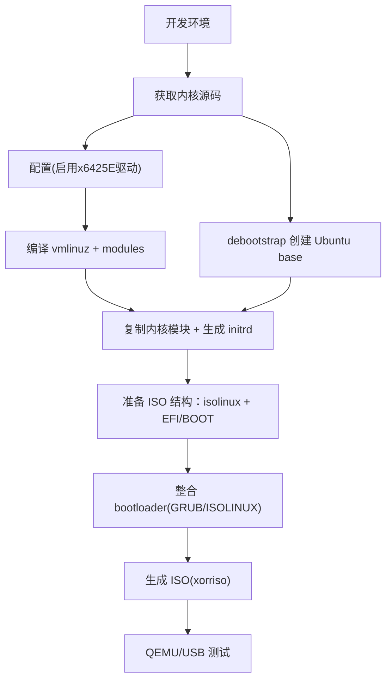

% My Awesome Presentation
% Your Name
% 2023-10-27

---

## Agenda

- The Problem
- Our Solution
- The Results

---

## Code Example

Here is some Python code:

```python
def hello_world():
    print("Hello from PowerPoint!")
```
## 3 ISO的制作
