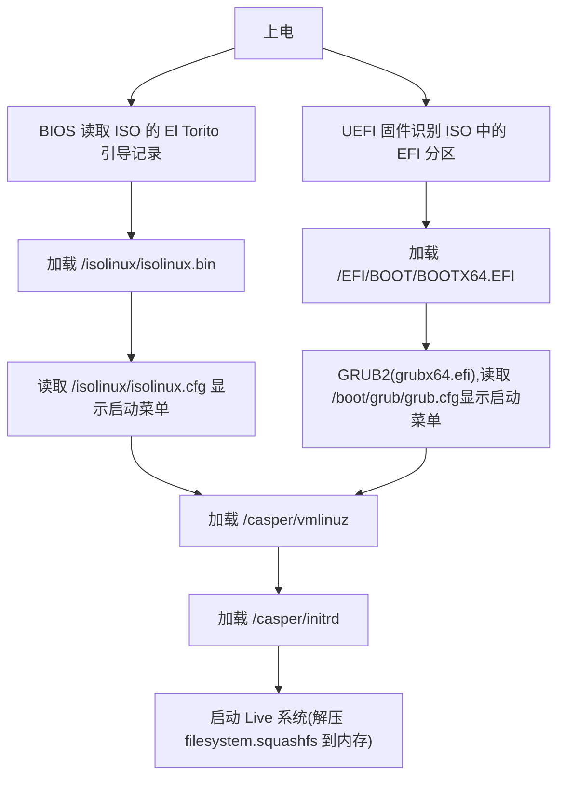
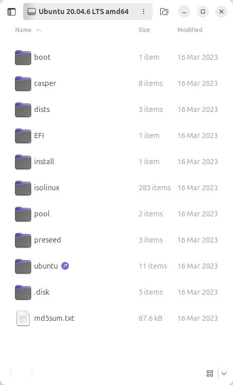
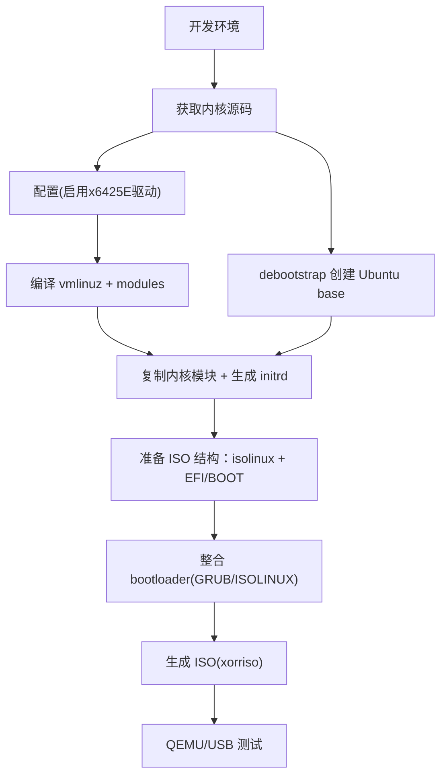
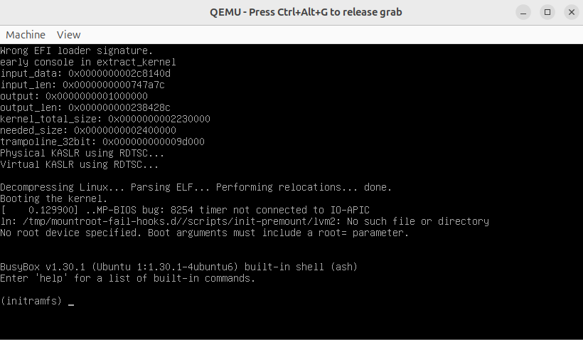
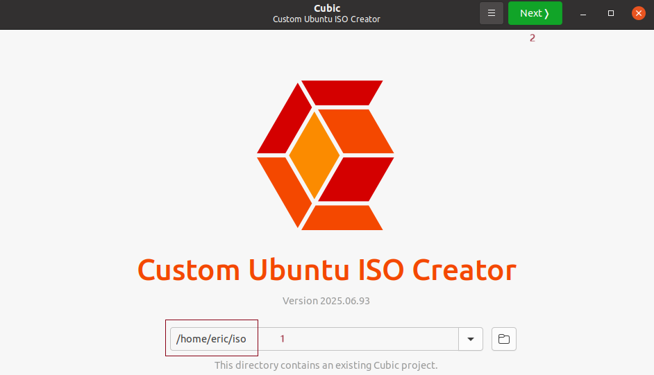
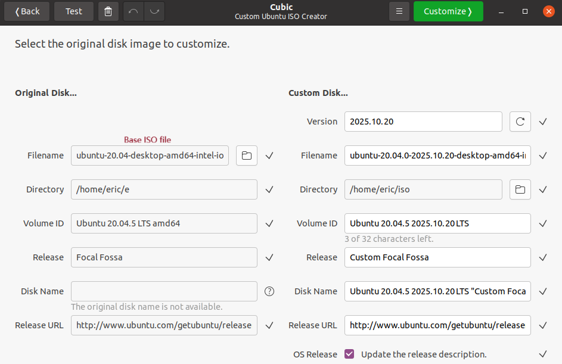
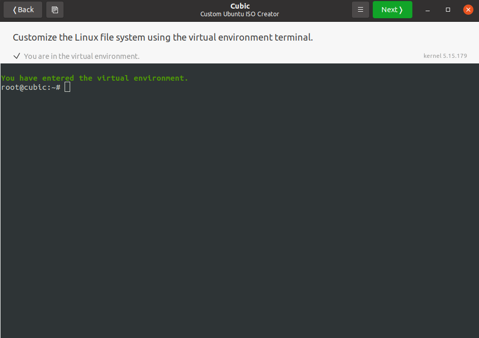
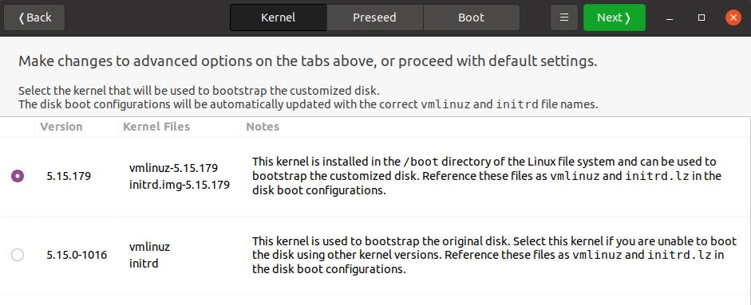

# 1 Linux/Ubuntu 启动流程


# 2 Ubuntu 20.04 ISO
Ubuntu 20.04(Focal)官方 ISO 是一个混合 ISO 镜像，  
既可作为光盘镜像使用，也可直接写入 USB 设备启动。   
其内部结构遵循 El Torito 启动规范，并包含多种启动方式(BIOS/UEFI)。  
<div align="left">
  
</div>

以下是对 ISO 文件系统结构的详细分析。 

## 2.1 基本信息
ISO 标准：ISO 9660 + Rock Ridge 扩展(支持 Unix 文件权限)  
启动方式：  
BIOS：通过 ISOLINUX(syslinux 衍生)  
UEFI：通过 EFI 引导加载器(grubx64.efi)  
混合 ISO：支持 dd 直接写入 USB 设备(包含 MBR 和 EFI 分区表)  
## 2.2 根目录结构(挂载 ISO 后)

```c
$ sudo mount -o loop ubuntu-20.04.6-desktop-amd64.iso /mnt
$ tree -L 2 /mnt  
```
典型输出如下(以 Ubuntu 20.04.6 desktop AMD64 为例)：
```c
/mnt
├── boot
│   └── grub
│       └── grub.cfg
├── casper
│   ├── filesystem.manifest
│   ├── filesystem.manifest-remove
│   ├── filesystem.squashfs
│   ├── initrd
│   └── vmlinuz
├── dists
├── EFI
│   └── BOOT
│       ├── BOOTX64.EFI
│       └── grubx64.efi
├── install
│   └── ...
├── isolinux
│   ├── boot.cat
│   ├── isolinux.bin
│   ├── isolinux.cfg
│   └── ldlinux.c32
├── md5sum.txt
├── pics
│   └── ...
├── pool
├── preseed
│   └── ubuntu-server.seed
└── README.diskdefines
```
通常一个Ubuntu ISO文件包含以下主要部分.
### 2.2.1 引导部分
ISO通常包含一个引导加载程序，用于启动计算机并开始安装过程。Ubuntu使用GRUB2作为引导加载程序。

### 2.2.2 文件系统
ISO使用一种或多种文件系统，如ISO 9660(可能带有Rock Ridge扩展)或UDF。  
此外，对于Hybrid ISO(混合ISO)，它还可以被直接写入USB设备并从中启动。  

### 2.2.3 ISO目录结构
解压ISO文件后，会看到一系列目录和文件。以下是一个典型的Ubuntu ISO目录结构：  
boot/ - 包含引导相关的文件，如GRUB配置和引导镜像。  
casper/ - 包含Ubuntu Live系统的文件系统镜像(通常是squashfs格式)以及内核和初始内存盘(initrd)文件。  
EFI/ - 包含用于UEFI启动的引导加载程序。  
dists/ - 包含Ubuntu发行版的软件包仓库信息，但通常Live ISO中这个目录可能不完整，因为主要系统在squashfs文件中。  
pool/ - 包含大量的.deb软件包，但Live ISO中可能不包含完整的pool，因为大部分软件已经在squashfs中。  
isolinux/ - 包含用于BIOS启动的ISOLINUX引导加载程序(在较新的Ubuntu中可能不再使用，而是使用GRUB)。  
md5sum.txt - 包含ISO内文件的MD5校验和。  
README.diskdefines - 描述磁盘定义的文件。  
.disk/ - 一个隐藏目录，包含一些磁盘信息，casper-uuid-generic 这个UUID影响启动能否成功。  
preseed/ 存放预定义的 preseed 配置文件模板。
### 2.2.4 squashfs文件
在casper目录下，有一个名为filesystem.squashfs的文件，它包含了完整的Live系统文件系统。当启动Live模式时，系统会将该文件加载到内存中运行。

### 2.2.5 引导配置
在boot/grub目录下有一个grub.cfg文件，它定义了引导菜单项，包括Live模式、安装模式等。

### 2.2.6 内核和initrd
在casper目录下，有vmlinuz(Linux内核)和initrd(初始内存盘)文件，用于启动系统。

### 2.2.7 UEFI和BIOS兼容性
现代Ubuntu ISO通常同时支持UEFI和传统BIOS启动。EFI/目录用于UEFI启动，而boot/grub或isolinux用于传统BIOS启动。

### 2.2.9 安装程序
Ubuntu使用casper来引导Live系统，然后使用 ubiquity 作为图形化安装程序。安装程序可以从Live环境中启动。

### 2.2.10 软件包仓库
虽然ISO中包含了一个基本的系统，但安装时可能需要从网络下载额外的软件包。不过，ISO本身也可以作为安装源(尤其是对于离线安装)。

### 2.2.11 校验和签名
ISO通常提供校验和文件(如MD5SUM、SHA256SUM)以及签名文件，用于验证ISO的完整性。

# 3 ISO的制作


## [自动生成脚本](files/x86/src/iso.md)  
## [开发环境/Dependencies](files/x86/src/dependencies.md)  
debootstrap 是一个用于引导安装基础 Debian 或 Ubuntu 系统的工具，能帮我们快速配置好一个可以使用的根文件系统。  
qemu-system-x86_64用于验证ISO是否可以正常运行运行。  
xorriso 是一个用于创建和操作 ISO 镜像的工具，它可以将目录结构和文件打包成一个 ISO 文件。
## [内核/Kernel](files/x86/src/kernel.md)  
## [初始文件系统/initramfs](files/x86/src/initramfs.md)  
## [根文件系统/rootfs](files/x86/src/rootfs.md)  
## [引导/GRUB](files/x86/src/grub.md)  
## [生成/Generate](files/x86/src/generate.md)  
生成的ISO文件，可以启动，直接进入Live模式。且是text模式(无桌面模式)。这个是由于GRUB没有配置好的原因。但引导菜单为空。  
<div align="left">
  
</div>

配置好GRUB后，引导菜单就会显示出来。
<div align="left">
  
</div> 

桌面的话，则需要在配置rootfs时，启用桌面环境。

```c
apt install -y ubuntu-desktop
```
<div align="left">
  
</div> 
停留在initramfs,这就意味着没有找到Live系统(filesystem.squashfs)或 initrd 没有配置好。

# 4 基于x86 Atom x6425E 的 ISO
适配x86 Atom x6425E 有其特殊性。Ubuntu官网有这个平台的[ISO镜像](https://cdimage.ubuntu.com/releases/focal/release/inteliotg/ubuntu-20.04-desktop-amd64+intel-iot.iso?_gl=1*z8he4z*_gcl_au*ODk4NTMzNjY3LjE3NjA2MDQzNDk.)。我们就用官方ISO,变更其内核就可以了，这时要生成新的ISO，可以用cubic这个工具。

## 4.1 开发环境准备
### 系统要求与依赖安装
```c
sudo apt update
sudo apt install build-essential libncurses-dev bison flex libssl-dev libelf-dev dpkg-dev debhelper
sudo apt build-dep linux-intel-iotg-5.15
``` 
### ISO制作依赖
```c
sudo apt update
sudo apt install software-properties-common
sudo add-apt-repository ppa:cubic-wizard/release
sudo apt update
sudo apt install cubic
which cubic
cubic --help
```
## 4.2 内核获取与编译
### 下载内核源码
```c
/etc/apt/sources.list
deb-src http://archive.ubuntu.com/ubuntu/ focal main restricted
deb-src http://archive.ubuntu.com/ubuntu/ focal-updates main restricted
```
```c
eric@ubuntu:~$ sudo apt-cache search linux-source
linux-source - Linux kernel source with Ubuntu patches
linux-source-5.4.0 - Linux kernel source for version 5.4.0 with Ubuntu patches
linux-gkeop-source-5.4.0 - Linux kernel source for version 5.4.0 with Ubuntu patches
linux-hwe-5.11-source-5.11.0 - Linux kernel source for version 5.11.0 with Ubuntu patches
linux-hwe-5.13-source-5.13.0 - Linux kernel source for version 5.13.0 with Ubuntu patches
linux-hwe-5.15-source-5.15.0 - Linux kernel source for version 5.15.0 with Ubuntu patches
linux-hwe-5.8-source-5.8.0 - Linux kernel source for version 5.8.0 with Ubuntu patches
linux-intel-5.13-source-5.13.0 - Linux kernel source for version 5.13.0 with Ubuntu patches
```
```c
eric@ubuntu:~$ apt source linux-intel-iotg-5.15
```
```c
eric@ubuntu:~/e$ tree -L 2
.
├── linux-intel-iotg-5.15-5.15.0
│   ├── arch
│   ├── block
│   ├── certs
│   ├── COPYING
│   ├── CREDITS
│   ├── crypto
│   ├── debian
│   ├── debian.intel-iotg
│   ├── debian.intel-iotg-5.15
│   ├── debian.master
│   ├── Documentation
│   ├── drivers
│   ├── fs
│   ├── include
│   ├── init
│   ├── io_uring
│   ├── ipc
│   ├── Kbuild
│   ├── Kconfig
│   ├── kernel
│   ├── lib
│   ├── LICENSES
│   ├── MAINTAINERS
│   ├── Makefile
│   ├── mm
│   ├── net
│   ├── README
│   ├── README.intel.chall_tgpio
│   ├── samples
│   ├── scripts
│   ├── security
│   ├── snapcraft.yaml
│   ├── sound
│   ├── tools
│   ├── ubuntu
│   ├── Ubuntu.md
│   ├── usr
│   └── virt
├── linux-intel-iotg-5.15_5.15.0-1079.85~20.04.1.diff.gz
├── linux-intel-iotg-5.15_5.15.0-1079.85~20.04.1.dsc
└── linux-intel-iotg-5.15_5.15.0.orig.tar.gz
```
### 配置内核
```c
cd linux-intel-iotg-5.15-5.15.0
cp /boot/config-$(uname -r) .config
sed -i 's/CONFIG_SYSTEM_TRUSTED_KEYS=.*/CONFIG_SYSTEM_TRUSTED_KEYS=""/' .config
sed -i 's/CONFIG_SYSTEM_REVOCATION_KEYS=.*/CONFIG_SYSTEM_REVOCATION_KEYS=""/' .config
chmod +x scripts/pahole-version.sh
chmod +x scripts/pahole-flags.sh
yes "" | make oldconfig
```
### 编译内核
```c
make -j$(nproc) deb-pkg
```
### 生成的deb
```c
sudo dpkg -i linux-image-5.15.179_5.15.179-1_amd64.deb
sudo dpkg -i linux-headers-5.15.179_5.15.179-1_amd64.deb
```
安装新内核，重启系统，新内核就会生效。
```c
eric@ubuntu:~/Desktop$ uname -a
Linux ubuntu 5.15.179 #1 SMP Thu Oct 16 22:35:22 PDT 2025 x86_64 x86_64 x86_64 GNU/Linux
```
## 4.3 用cubic制作新ISO

cubic是一个基于Ubuntu的ISO定制工具，它可以帮助我们定制ISO的内核、配置文件、软件包等。有一个图形化界面，我们可以用它来定制我们的ISO。

<div align="left">
  
</div>


选择我们定制的ISO文件存放的目录。
<div align="left">
  
</div>


选择原始的ISO文件。
<div align="left">
  
</div>


配置ISO的内核、配置文件、软件包等。

```c
root@cubic:~# sudo dpkg -i linux-image-5.15.179_5.15.179-1_amd64.deb
sudo: unable to resolve host cubic: Temporary failure in name resolution
(Reading database ... 211379 files and directories currently installed.)
Preparing to unpack linux-image-5.15.179_5.15.179-1_amd64.deb ...
Unpacking linux-image-5.15.179 (5.15.179-1) over (5.15.179-1) ...
Setting up linux-image-5.15.179 (5.15.179-1) ...
update-initramfs: Generating /boot/initrd.img-5.15.179
cryptsetup: ERROR: Couldn't resolve device /dev/sdb
cryptsetup: WARNING: Couldn't determine root device
```
This ERROR will cause initramfs update failed.
```c
update-initramfs -v -c -k 5.15.179
```

So it is need to enforce update initramfs.

```c
root@cubic:~# sudo dpkg -i linux-headers-5.15.179_5.15.179-1_amd64.deb
sudo: unable to resolve host cubic: Temporary failure in name resolution
(Reading database ... 211379 files and directories currently installed.)
Preparing to unpack linux-headers-5.15.179_5.15.179-1_amd64.deb ...
Unpacking linux-headers-5.15.179 (5.15.179-1) over (5.15.179-1) ...
Setting up linux-headers-5.15.179 (5.15.179-1) ...
root@cubic:~# 
```

Option for grub checking and set /etc/hosts
```c
echo "127.0.0.1 cubic" | sudo tee -a /etc/hosts
echo "::1 cubic" | sudo tee -a /etc/hosts
sudo update-grub
grep -i "menuentry" /boot/grub/grub.cfg
```
<div align="left">
  
</div>


选用新内核。
<div align="left">
  
</div>


点击[Generate]按钮，生成新的ISO文件。开机可查看是不是用我们定制的新内核。  
```c
eric@uiot:~$ uname -a
Linux uiot 5.15.179 #1 SMP Thu Oct 16 22:35:22 PDT 2025 x86_64 x86_64 x86_64 GNU/Linux
```