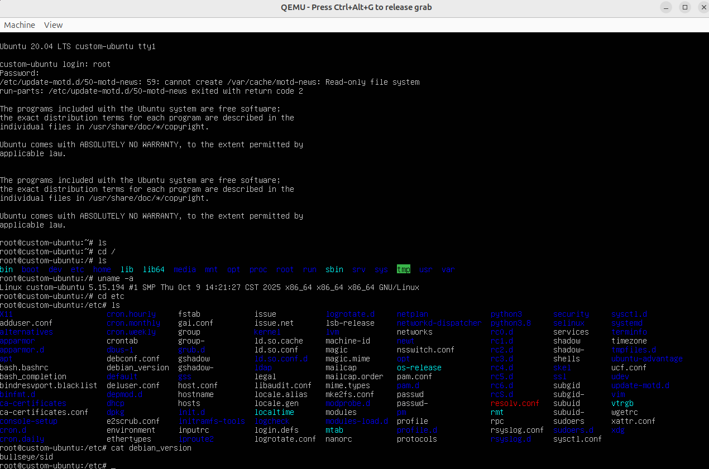
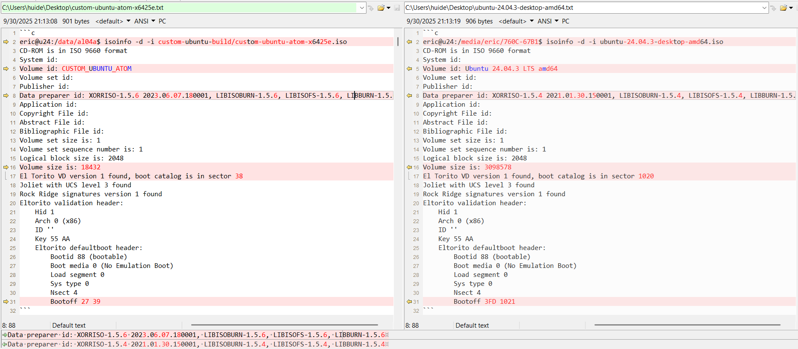
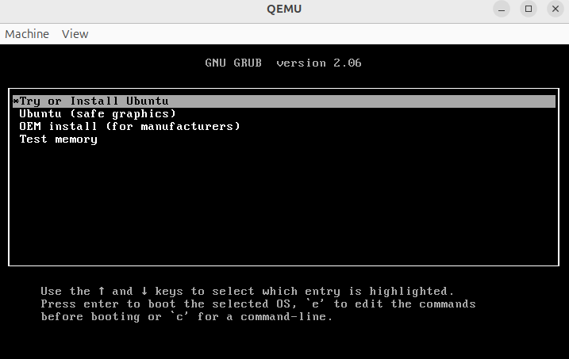

[sm8250-mainline](https://gitlab.com/sm8250-mainline/linux)  
[ArchlinuxARM-qcom](https://github.com/silime/ArchlinuxARM-qcom-aarch64)  

[MTK](https://ubuntu.com/download/mediatek-genio)  
[软件编译文档](https://docs.qualcomm.com/bundle/publicresource/topics/80-70018-254Y/build_landing_page.html)  

# 高通SM8250(骁龙865)处理器规格参数
SM8250(骁龙865)是带有外部4G / 5G调制解调器（SDX55M）的新一代Qualcomm @ Snapdragon高级处理器。  
它采用7纳米工艺设计，具有出色的性能和能效。 SM8250包括以下关键组件：  
-基于Arm Cortex技术的高通Kryo 585 CPU  
-Qualcomm Adreno 650 GPU提供最高的图形性能和能效  
-Qualcomm具有四边形六边形矢量扩展（HVX）处理器的Hexagon DSP，用于视觉处理和机器学习  
-Qualcomm Spectra 480图像处理引擎可提供最佳的摄影和摄像体验  
-Adreno 665 VPU用于高质量，超高清视频编码和解码  
-Adreno 995 DPU支持设备上和外部超高清显示  
-低功耗音频子系统与Qualcomm Aqstic M Audio Technologies WCD9380 / CD9385音频编解码器相结合，可实现低功耗语音处理和发烧友级音频播放  
-Qualcomm Sensing Hub提供上下文感知和始终在线的传感器支持  
-高通安全处理单元（SPU240），用于高级安全用例  
-高通神经处理单元（NPU230），用于高性能机器学习用例  
-外部802.11a×，2×2MIMO。 和蓝牙5.1  
-四通道级封装（PoP）高速LPDDR5 / LPDDR4X SDRAM  

<div align="center">
  
</div>

[Linux 内核的编译, 启动和制作ISO镜像](https://juejin.cn/post/7242312269887914041)  
[私有镜像制作指南](https://support.huaweicloud.com/intl/zh-cn/bpicg-bms/bms-bpicg.pdf)

# 基于x86 Atom x6425E制作Ubuntu 22.04 ISO完整指南
## 1. 开发环境准备
### 系统要求与依赖安装
```c
## 更新系统并安装必要工具

sudo apt update && sudo apt upgrade -y

# 安装编译和ISO制作工具
sudo apt install -y \
    git build-essential ncurses-dev xz-utils libssl-dev \
    bc flex bison libelf-dev rsync kmod cpio \
    squashfs-tools genisoimage syslinux-utils isolinux \
    u-boot-tools mtools dosfstools \
    qemu-kvm libvirt-daemon-system virt-manager \
    curl wget vim
```    
## 2. 内核获取与编译
### 下载内核源码
```c
## 创建工作目录
mkdir -p ~/custom-ubuntu-build
cd ~/custom-ubuntu-build

## 从Ubuntu官方仓库获取（推荐）

git clone --depth 1 -b jammy \
    git://git.launchpad.net/~ubuntu-kernel/ubuntu/+source/linux/+git/jammy \
    linux-kernel

cd linux-kernel
```
### 配置内核
```c
# 使用当前系统配置作为基础

cp /boot/config-$(uname -r) .config

# 更新配置以适应新内核版本

yes "" | make oldconfig

# 针对Atom x6425E进行配置
make menuconfig
```
在menuconfig中配置以下关键选项：

```c
# Processor type and features
Processor family → Intel Atom
Enable x86-64 CPU → y
MTRR (Memory Type Range Register) support → y

# Device Drivers
Character devices → /dev/cpu/*/msr → y
Character devices → /dev/cpu/*/msr → Enable writes → y
Network device support → Ethernet driver support → Intel devices → y
GPU → Intel 8xx/9xx/G3x/G4x/HD Graphics → y
Sound card support → HD-Audio → Intel HD Audio → y

# Power management
ACPI (Advanced Configuration and Power Interface) Support → y
CPU Frequency scaling → Intel P-state control → y
```
### 编译内核
```c
# 编译内核和模块
make -j$(nproc)

# 创建内核安装包
make -j$(nproc) deb-pkg

# 安装内核包（用于测试）
sudo dpkg -i ../linux-*.deb
```
## 3. Ubuntu Base系统准备
### 下载和准备根文件系统
```c
# 返回工作目录
cd ~/custom-ubuntu-build

# 下载Ubuntu 22.04 base
wget http://cdimage.ubuntu.com/ubuntu-base/releases/22.04/release/ubuntu-base-22.04-base-amd64.tar.gz

# 创建根文件系统目录
sudo mkdir rootfs
sudo tar -xzf ubuntu-base-22.04-base-amd64.tar.gz -C rootfs
```
### 配置基础系统
```c
# 准备chroot环境
sudo mount --bind /dev rootfs/dev
sudo mount --bind /proc rootfs/proc
sudo mount --bind /sys rootfs/sys
sudo mount --bind /run rootfs/run

# 复制DNS配置
sudo cp /etc/resolv.conf rootfs/etc/

# 创建chroot配置脚本
cat > chroot-setup.sh << 'EOF'
#!/bin/bash
# 更新包管理器
apt update
apt upgrade -y

# 安装基础系统
apt install -y systemd systemd-sysv sudo bash-completion \
    network-manager net-tools iputils-ping wget curl \
    nano vim less locales tzdata

# 安装硬件支持
apt install -y linux-firmware intel-microcode \
    firmware-sof-signed firmware-misc-nonfree

# 设置locale
echo "en_US.UTF-8 UTF-8" >> /etc/locale.gen
locale-gen
update-locale LANG=en_US.UTF-8

# 设置时区
ln -sf /usr/share/zoneinfo/UTC /etc/localtime

# 设置root密码
echo "root:ubuntu" | chpasswd

# 创建普通用户
useradd -m -s /bin/bash -G sudo ubuntu
echo "ubuntu:ubuntu" | chpasswd

# 配置网络
cat > /etc/systemd/network/80-dhcp.network << 'NETEOF'
[Match]
Name=en*

[Network]
DHCP=yes
NETEOF

systemctl enable systemd-networkd
systemctl enable systemd-resolved

# 创建fstab
cat > /etc/fstab << 'FSTABEOF'
# <file system> <mount point> <type> <options> <dump> <pass>
/dev/sda1 / ext4 defaults 0 1
FSTABEOF
EOF

# 执行chroot配置
sudo cp chroot-setup.sh rootfs/
sudo chmod +x rootfs/chroot-setup.sh
sudo chroot rootfs /bin/bash -c "/chroot-setup.sh"
sudo rm rootfs/chroot-setup.sh
```
## 4. 安装自定义内核
### 安装内核到根文件系统
```c
# 进入内核目录
cd ~/custom-ubuntu-build/linux-kernel

# 安装内核模块到根文件系统
sudo make modules_install INSTALL_MOD_PATH=../rootfs

# 复制内核镜像
sudo cp arch/x86/boot/bzImage ../rootfs/boot/vmlinuz-5.15.0-custom
sudo cp System.map ../rootfs/boot/System.map-5.15.0-custom
sudo cp .config ../rootfs/boot/config-5.15.0-custom
```
### 创建initramfs
```c
# 创建initramfs生成脚本
cat > rootfs/create-initramfs.sh << 'EOF'
#!/bin/bash
update-initramfs -c -k 5.15.0-custom
EOF

sudo chmod +x rootfs/create-initramfs.sh
sudo chroot rootfs /bin/bash -c "/create-initramfs.sh"
sudo rm rootfs/create-initramfs.sh
```
## 5. 配置引导加载程序
### 安装和配置GRUB
GRUB（GRand Unified Bootloader，大一统启动加载器），是一个引导加载程序。当前的GRUB 也被称作GRUB 2，而原始GRUB（GRUB Legacy）表示0.9x 版本。  
```c
# 在chroot中安装GRUB
cat > rootfs/install-grub.sh << 'EOF'
#!/bin/bash
apt install -y grub-pc grub-common

# 创建GRUB目录
mkdir -p /boot/grub

# 生成GRUB配置文件
cat > /boot/grub/grub.cfg << 'GRUBEOF'
set timeout=10
set default=0

menuentry "Custom Ubuntu for Atom x6425E" {
    linux /boot/vmlinuz-5.15.0-custom root=/dev/sda1 rw quiet splash console=tty0 console=ttyS0,115200n8
    initrd /boot/initrd.img-5.15.0-custom
}

menuentry "Custom Ubuntu (Recovery Mode)" {
    linux /boot/vmlinuz-5.15.0-custom root=/dev/sda1 rw single
    initrd /boot/initrd.img-5.15.0-custom
}
GRUBEOF
EOF

sudo chmod +x rootfs/install-grub.sh
sudo chroot rootfs /bin/bash -c "/install-grub.sh"
sudo rm rootfs/install-grub.sh
```
## 6. 制作ISO文件
### 创建ISO目录结构
```
cd ~/custom-ubuntu-build

# 创建ISO目录结构
mkdir -p iso/{boot/grub,casper,isolinux}

# 复制内核文件到ISO
sudo cp rootfs/boot/vmlinuz-5.15.0-custom iso/casper/vmlinuz
sudo cp rootfs/boot/initrd.img-5.15.0-custom iso/casper/initrd

# 创建压缩的文件系统
sudo mksquashfs rootfs iso/casper/filesystem.squashfs -comp xz -b 1M -noappend

# 创建磁盘映像文件（用于直接写入设备）
sudo dd if=/dev/zero of=disk.img bs=1M count=4096
sudo mkfs.ext4 -F disk.img
sudo mkdir -p mnt-disk
sudo mount disk.img mnt-disk
sudo cp -a rootfs/* mnt-disk/
sudo umount mnt-disk
```
### 创建ISO引导配置
```c
# 复制引导文件
sudo cp /usr/lib/ISOLINUX/isolinux.bin iso/isolinux/
sudo cp /usr/lib/syslinux/modules/bios/*.c32 iso/isolinux/

# 创建isolinux配置
cat > iso/isolinux/isolinux.cfg << 'EOF'
UI menu.c32
PROMPT 0
TIMEOUT 300

DEFAULT custom-ubuntu

LABEL custom-ubuntu
    MENU LABEL Custom Ubuntu for Atom x6425E
    KERNEL /casper/vmlinuz
    APPEND initrd=/casper/initrd root=/dev/sr0 rw quiet splash

LABEL custom-ubuntu-text
    MENU LABEL Custom Ubuntu (Text Mode)
    KERNEL /casper/vmlinuz
    APPEND initrd=/casper/initrd root=/dev/sr0 rw text

LABEL memtest
    MENU LABEL Memory Test
    KERNEL /isolinux/memtest
EOF

# 创建GRUB配置
cat > iso/boot/grub/grub.cfg << 'EOF'
set timeout=10
set default=0

menuentry "Custom Ubuntu for Atom x6425E" {
    linux /casper/vmlinuz root=/dev/sr0 rw quiet splash
    initrd /casper/initrd
}

menuentry "Custom Ubuntu (Safe Graphics)" {
    linux /casper/vmlinuz root=/dev/sr0 rw quiet splash nomodeset
    initrd /casper/initrd
}

menuentry "Memory Test" {
    linux16 /isolinux/memtest
}
EOF
```
### 生成ISO文件
```c
# 创建ISO元数据文件
cat > iso/README.diskdefines << 'EOF'
#define DISKNAME  Custom_Ubuntu_Atom_x6425E
#define TYPE  binary
#define TYPEbinary  1
#define ARCH  amd64
#define ARCHamd64  1
#define DISKNUM  1
#define DISKNUM1  1
#define TOTALNUM  0
#define TOTALNUM0  1
EOF

# 生成ISO文件
genisoimage -o custom-ubuntu-atom-x6425e.iso \
    -rational-rock \
    -volid "Custom Ubuntu Atom" \
    -cache-inodes \
    -joliet \
    -full-iso9660-filenames \
    -b isolinux/isolinux.bin \
    -c isolinux/boot.cat \
    -no-emul-boot \
    -boot-load-size 4 \
    -boot-info-table \
    -eltorito-alt-boot \
    -e boot/grub/efi.img \
    -no-emul-boot \
    iso/

# 使ISO支持UEFI和BIOS双重引导
isohybrid --uefi custom-ubuntu-atom-x6425e.iso

# 计算MD5校验和
md5sum custom-ubuntu-atom-x6425e.iso > custom-ubuntu-atom-x6425e.md5
```
## 7. 测试与验证
### 使用QEMU测试ISO
```c
# 测试ISO引导
qemu-system-x86_64 \
    -cdrom custom-ubuntu-atom-x6425e.iso \
    -m 2G \
    -smp 2 \
    -accel kvm

# 测试磁盘映像
qemu-system-x86_64 \
    -hda disk.img \
    -m 2G \
    -smp 2 \
    -accel kvm
```    
### 写入USB设备测试
```c
# 查找USB设备
lsblk

# 写入ISO到USB设备（替换sdX为你的设备）
sudo dd if=custom-ubuntu-atom-x6425e.iso of=/dev/sdX bs=4M status=progress && sync
```
## 8. 自动化构建脚本
[iso.sh](files/x86/iso.md)

<div align="center">
  
</div>

## 9. 故障排除
### 常见问题解决
内核编译错误
  确保安装了所有依赖包
  检查内核配置是否正确

chroot环境问题
  确保正确挂载了虚拟文件系统
  检查DNS配置

ISO引导失败
  验证引导文件是否正确复制
  检查isolinux配置语法

硬件驱动缺失
  在内核配置中启用所有必要的Atom x6425E驱动
  包含必要的firmware文件

## 10. 后续优化建议
性能优化
  针对Atom处理器优化内核参数
  启用合适的电源管理功能

安全加固
  配置防火墙规则
  启用安全启动支持

定制化
  预装应用程序
  自定义桌面环境
  配置系统服务

# 基于 Intel Atom x6425E 与 Ubuntu 22.04 的自定义 ISO 镜像构建指南

## 一、开发环境准备

### 1.1 主机系统要求
- 推荐使用 **Ubuntu 22.04 x86_64** 作为构建主机（避免跨架构问题）
- 至少 **20GB 空闲磁盘空间**
- 安装必要工具：

```bash
sudo apt update
sudo apt install -y git build-essential fakeroot kernel-package \
    libncurses-dev libssl-dev ccache bison flex libelf-dev bc \
    debootstrap squashfs-tools xorriso grub-pc-bin grub-efi-amd64-bin \
    mtools syslinux isolinux live-build
```

## 二、内核源码获取与编译（适配 x6425E）
### 2.1 确认 x6425E 的 CPU 架构
Intel Atom x6425E 是 Jasper Lake 架构，基于 Tremont 微架构
属于 x86_64，支持 64 位
建议使用 较新内核（≥5.15），Ubuntu 22.04 默认内核为 5.15，但可升级到 6.2+ 以获得更好支持
### 2.2 获取内核源码
方式一：使用 Ubuntu 官方内核源（推荐）
```c
apt source linux-image-generic
# 或指定版本（如 5.15.0-xx）
apt source linux-image-unsigned-5.15.0-xx-generic
```
方式二：从 kernel.org 获取主线内核
```c
cd /tmp
wget https://cdn.kernel.org/pub/linux/kernel/v6.x/linux-6.6.10.tar.xz
tar -xf linux-6.6.10.tar.xz
cd linux-6.6.10
```
建议：优先尝试 Ubuntu 22.04 的 HWE 内核（6.2 或 6.5），兼容性更好。 

### 2.3 配置内核（关键步骤）
获取参考配置
在运行 Ubuntu 22.04 + x6425E 的机器上执行：
```c
zcat /proc/config.gz > .config
```
或从 /boot/config-$(uname -r) 复制
或使用默认配置
```c
make x86_64_defconfig
```
手动启用关键驱动（针对 x6425E）
确保以下选项启用（make menuconfig）：
```c
- Processor type and features → Symmetric multi-processing support（SMP）
- Device Drivers →
-  I2C support → Intel SCH SMBus
-  SPI support → Intel SPI controller
-  GPIO Support → Intel GPIO drivers
-  Serial ATA and Parallel ATA drivers → AHCI SATA support
-  USB support → xHCI HCD (USB 3.0) support
-  Network device support → Intel(R) PRO/1000 PCI-Express Gigabit Ethernet
-  Graphics support → Intel 8xx/9xx/G3x/G4x/HD Graphics（启用 i915）
-  
```
### 2.4 编译内核
```c
export CONCURRENCY_LEVEL=$(nproc)
make -j$(nproc) bzImage modules
```
生成文件：

arch/x86/boot/bzImage → 内核镜像（重命名为 vmlinuz）
### 2.5 安装模块（用于 rootfs）
```c
mkdir -p /tmp/rootfs
make INSTALL_MOD_PATH=/tmp/rootfs modules_install
```
## 三、构建 Ubuntu Base 系统
### 3.1 使用 debootstrap 创建最小系统
```c
sudo debootstrap --arch amd64 jammy /tmp/ubuntu-root http://archive.ubuntu.com/ubuntu/
```
### 3.2 配置基础系统
```c
sudo chroot /tmp/ubuntu-root

# 设置 hostname
echo "mydevice" > /etc/hostname

# 设置 sources.list
cat > /etc/apt/sources.list <<EOF
deb http://archive.ubuntu.com/ubuntu jammy main restricted universe multiverse
deb http://security.ubuntu.com/ubuntu jammy-security main restricted universe multiverse
EOF

# 安装必要包
apt update
apt install -y linux-firmware systemd-sysv network-manager openssh-server \
    grub-common initramfs-tools udev

# 设置 root 密码
passwd root

exit
```
### 3.3 复制自定义内核模块
```c
sudo cp -r /tmp/rootfs/lib/modules/* /tmp/ubuntu-root/lib/modules/
```
### 3.4 生成 initrd（可选）
```
sudo chroot /tmp/ubuntu-root
update-initramfs -c -k $(ls /lib/modules/ | head -n1)
exit
```
## 四、Bootloader 说明与整合
### 4.1 Bootloader 与 BIOS/UEFI 的关系
Bootloader（如 GRUB）不属于 BIOS/UEFI，而是由固件加载的第一段软件
BIOS（Legacy）使用 MBR + ISOLINUX
UEFI 使用 ESP + BOOTx64.EFI
### 4.2 整合方式
如果同事提供的是 UEFI .efi 文件，放入 /EFI/BOOT/BOOTx64.EFI
否则，使用标准 GRUB 和 ISOLINUX 构建双启动 ISO
## 五、制作 ISO 镜像
### 5.1 准备 ISO 目录结构
```c
mkdir -p /tmp/iso/{boot,isolinux,EFI/BOOT}
```
### 5.2 复制内核和 initrd
```c
cp arch/x86/boot/bzImage /tmp/iso/boot/vmlinuz
cp /tmp/ubuntu-root/boot/initrd.img-* /tmp/iso/boot/initrd
```
### 5.3 配置 ISOLINUX（BIOS 启动）
```c
cp /usr/lib/ISOLINUX/isolinux.bin /tmp/iso/isolinux/
cp /usr/lib/syslinux/modules/bios/ldlinux.c32 /tmp/iso/isolinux/

cat > /tmp/iso/isolinux/isolinux.cfg <<EOF
DEFAULT linux
LABEL linux
  SAY Now booting the kernel from ISOLINUX...
  KERNEL /boot/vmlinuz
  APPEND initrd=/boot/initrd root=/dev/ram0 ramdisk_size=2000000
EOF
```
### 5.4 配置 GRUB（UEFI 启动）
```c
cat > /tmp/iso/EFI/BOOT/grub.cfg <<EOF
set timeout=5
menuentry "Ubuntu Custom" {
    linux /boot/vmlinuz root=/dev/ram0 ramdisk_size=2000000
    initrd /boot/initrd
}
EOF

cp /usr/lib/grub/x86_64-efi/grub.efi /tmp/iso/EFI/BOOT/BOOTx64.EFI
```
### 5.5 生成 ISO
```c
xorriso -as mkisofs \
  -o ubuntu-custom-x6425e.iso \
  -b isolinux/isolinux.bin \
  -c isolinux/boot.cat \
  -no-emul-boot \
  -boot-load-size 4 \
  -boot-info-table \
  -eltorito-alt-boot \
  -e EFI/BOOT/BOOTx64.EFI \
  -no-emul-boot \
  -isohybrid-mbr /usr/lib/ISOLINUX/isohdpfx.bin \
  -volid "Ubuntu-Custom" \
  /tmp/iso
```  
## 六、验证与调试
QEMU 测试 BIOS 启动：
```c
qemu-system-x86_64 -m 2G -cdrom ubuntu-custom-x6425e.iso -boot d
```
QEMU 测试 UEFI 启动：
```c
qemu-system-x86_64 -m 2G -bios /usr/share/OVMF/OVMF_CODE.fd -cdrom ubuntu-custom-x6425e.iso
```
写入 USB 测试：
```c
sudo dd if=ubuntu-custom-x6425e.iso of=/dev/sdX bs=4M status=progress
```
## 七、后续建议
若需完整安装功能，可集成 debian-installer 或 calamares
使用 live-build 实现自动化构建
启用 Secure Boot 时需对内核和 initrd 签名
总结流程图
```mermaid
[开发环境] 
   ↓
[获取内核源码] → [配置（启用x6425E驱动）] → [编译 vmlinuz + modules]
   ↓
[debootstrap 创建 Ubuntu base]
   ↓
[复制内核模块 + 生成 initrd]
   ↓
[准备 ISO 结构：isolinux + EFI/BOOT]
   ↓
[整合 bootloader（GRUB/ISOLINUX）]
   ↓
[生成 ISO（xorriso）]
   ↓
[QEMU/USB 测试]    
```


## ISO Info
```c
eric@u24:/data/al04a$ isoinfo -d -i custom-ubuntu-build/custom-ubuntu-atom-x6425e.iso 
CD-ROM is in ISO 9660 format
System id: 
Volume id: CUSTOM_UBUNTU_ATOM
Volume set id: 
Publisher id: 
Data preparer id: XORRISO-1.5.6 2023.06.07.180001, LIBISOBURN-1.5.6, LIBISOFS-1.5.6, LIBBURN-1.5.6
Application id: 
Copyright File id: 
Abstract File id: 
Bibliographic File id: 
Volume set size is: 1
Volume set sequence number is: 1
Logical block size is: 2048
Volume size is: 18432
El Torito VD version 1 found, boot catalog is in sector 38
Joliet with UCS level 3 found
Rock Ridge signatures version 1 found
Eltorito validation header:
    Hid 1
    Arch 0 (x86)
    ID ''
    Key 55 AA
    Eltorito defaultboot header:
        Bootid 88 (bootable)
        Boot media 0 (No Emulation Boot)
        Load segment 0
        Sys type 0
        Nsect 4
        Bootoff 27 39
```

```c
eric@u24:/media/eric/760C-67B1$ isoinfo -d -i ubuntu-24.04.3-desktop-amd64.iso
CD-ROM is in ISO 9660 format
System id: 
Volume id: Ubuntu 24.04.3 LTS amd64
Volume set id: 
Publisher id: 
Data preparer id: XORRISO-1.5.4 2021.01.30.150001, LIBISOBURN-1.5.4, LIBISOFS-1.5.4, LIBBURN-1.5.4
Application id: 
Copyright File id: 
Abstract File id: 
Bibliographic File id: 
Volume set size is: 1
Volume set sequence number is: 1
Logical block size is: 2048
Volume size is: 3098578
El Torito VD version 1 found, boot catalog is in sector 1020
Joliet with UCS level 3 found
Rock Ridge signatures version 1 found
Eltorito validation header:
    Hid 1
    Arch 0 (x86)
    ID ''
    Key 55 AA
    Eltorito defaultboot header:
        Bootid 88 (bootable)
        Boot media 0 (No Emulation Boot)
        Load segment 0
        Sys type 0
        Nsect 4
        Bootoff 3FD 1021
```
<div align="center">
  
</div>

# 8. 验证 ISO 镜像
```c
// 验证 ISO 镜像是否完整
isoinfo -d -i ubuntu-custom-x6425e.iso
```
## 8.1. 验证ISO文件结构
### 检查ISO内容
```c
file custom-ubuntu-atom-x6425e.iso
isoinfo -l -i custom-ubuntu-atom-x6425e.iso
```
### 检查文件系统完整性
```c
unsquashfs -l iso/casper/filesystem.squashfs
```
[unsquashfs](unsquashfs.md)

## 8.2. 使用QEMU测试ISO

### 测试ISO启动
```c
qemu-system-x86_64 -cdrom custom-ubuntu-atom-x6425e.iso -m 2048 -boot d
```
### 使用KVM加速测试
```c
qemu-system-x86_64 -cdrom custom-ubuntu-atom-x6425e.iso -m 2048 -boot d -enable-kvm
```


### Verify ISO file ubuntu-22.04.5-desktop-amd64.iso
```c
eric@u24:/data/al04a$ qemu-system-x86_64 -cdrom ./ubuntu-22.04.5-desktop-amd64.iso -m 2048 -boot order=d -net none -serial stdio
```

<div align="center">
  
</div>

```c
eric@u24:/data/al04a$ qemu-system-x86_64 -cdrom /data/al04a/ubuntu-22.04.5-desktop-amd64.iso -m 4096 -bios /usr/share/ovmf/OVMF.fd -vga std -cpu qemu64

eric@u24:/data/al04a$ qemu-system-x86_64 -cdrom /data/al04a/ubuntu-20.04.6-desktop-amd64.iso -m 4096 -bios /usr/share/ovmf/OVMF.fd -vga std -cpu qemu64
```


# 9 典型的 Linux 启动流程
## 9.1 开机 -> BIOS/UEFI -> GRUB
电脑通电，硬件初始化。  
BIOS/UEFI 找到并运行 GRUB。  
##  9.2 GRUB -> 内核 + initramfs
GRUB 从 /boot 分区读取 Linux 内核和 initramfs 镜像到内存。  
GRUB 将控制权交给内核，并告诉它 initramfs 在内存中的位置。  
##  9.3 内核 -> initramfs
内核解压并执行 initramfs 中的 /init 脚本。  
initramfs 准备好硬件环境（加载驱动、解锁加密、激活 LVM），找到真正的根文件系统。  
##  9.4 initramfs -> 真实根文件系统
initramfs 执行 pivot_root 或类似操作，进行“根切换”，从内存中的 initramfs 切换到硬盘上的真实根文件系统（例如 /dev/mapper/vg0-root）。  
启动真实根文件系统中的 systemd（PID 1）。  
##  9.5 系统故障时 -> chroot
如果上述任何一步失败（例如 GRUB 配置错误、内核损坏、initramfs 丢失），系统可能无法启动。  
此时，你需要用 Live USB 启动，然后使用 chroot 命令“钻入”到你的硬盘系统中，去重新安装 GRUB、更新 initramfs 或修复其他问题。  


# Ubuntu 20.04 官方 ISO 结构分析
Ubuntu 20.04（Focal Fossa）官方 ISO 是一个混合 ISO 镜像，既可作为光盘镜像使用，也可直接写入 USB 设备启动。其内部结构遵循 El Torito 启动规范，并包含多种启动方式（BIOS/UEFI）。  
以下是对 ISO 文件系统结构的详细分析。

## 1. 基本信息
ISO 标准：ISO 9660 + Rock Ridge 扩展（支持 Unix 文件权限）  
启动方式：  
BIOS：通过 ISOLINUX（syslinux 衍生）  
UEFI：通过 EFI 引导加载器（grubx64.efi）  
混合 ISO：支持 dd 直接写入 USB 设备（包含 MBR 和 EFI 分区表）  
## 2. 根目录结构（挂载 ISO 后）
通常一个Ubuntu ISO文件包含以下主要部分：

### 2.1. 引导部分
ISO通常包含一个引导加载程序，用于启动计算机并开始安装过程。Ubuntu使用GRUB2作为引导加载程序。

### 2.2. 文件系统
ISO使用一种或多种文件系统，如ISO 9660（可能带有Rock Ridge扩展）或UDF。此外，对于Hybrid ISO（混合ISO），它还可以被直接写入USB设备并从中启动。

### 2.3. ISO目录结构
解压ISO文件后，会看到一系列目录和文件。以下是一个典型的Ubuntu ISO目录结构：  
boot/ - 包含引导相关的文件，如GRUB配置和引导镜像。  
casper/ - 包含Ubuntu Live系统的文件系统镜像（通常是squashfs格式）以及内核和初始内存盘（initrd）文件。  
EFI/ - 包含用于UEFI启动的引导加载程序。  
dists/ - 包含Ubuntu发行版的软件包仓库信息，但通常Live ISO中这个目录可能不完整，因为主要系统在squashfs文件中。  
pool/ - 包含大量的.deb软件包，但Live ISO中可能不包含完整的pool，因为大部分软件已经在squashfs中。  
isolinux/ - 包含用于BIOS启动的ISOLINUX引导加载程序（在较新的Ubuntu中可能不再使用，而是使用GRUB）。  
md5sum.txt - 包含ISO内文件的MD5校验和。  
README.diskdefines - 描述磁盘定义的文件。  
.disk/ - 一个隐藏目录，包含一些磁盘信息，casper-uuid-generic  这个UUID影响启动能否成功。  
preseed/ 存放预定义的 preseed 配置文件模板。
### 2.4. squashfs文件
在casper目录下，有一个名为filesystem.squashfs的文件，它包含了完整的Live系统文件系统。当启动Live模式时，系统会将该文件加载到内存中运行。

### 2.5. 引导配置
在boot/grub目录下有一个grub.cfg文件，它定义了引导菜单项，包括Live模式、安装模式等。

### 2.6. 内核和initrd
在casper目录下，有vmlinuz（Linux内核）和initrd（初始内存盘）文件，用于启动系统。

### 2.7. UEFI和BIOS兼容性
现代Ubuntu ISO通常同时支持UEFI和传统BIOS启动。EFI/目录用于UEFI启动，而boot/grub或isolinux用于传统BIOS启动。

### 2.8. 安装程序
Ubuntu使用casper来引导Live系统，然后使用ubiquity作为图形化安装程序。安装程序可以从Live环境中启动。

### 2.9. 软件包仓库
虽然ISO中包含了一个基本的系统，但安装时可能需要从网络下载额外的软件包。不过，ISO本身也可以作为安装源（尤其是对于离线安装）。

### 2.10. 校验和签名
ISO通常提供校验和文件（如MD5SUM、SHA256SUM）以及签名文件，用于验证ISO的完整性。
```c
$ sudo mount -o loop ubuntu-20.04.6-live-server-amd64.iso /mnt
$ tree -L 2 /mnt  
```
典型输出如下（以 Ubuntu 20.04.6 Live Server AMD64 为例）：
```c
/mnt
├── boot
│   └── grub
│       └── grub.cfg
├── casper
│   ├── filesystem.manifest
│   ├── filesystem.manifest-remove
│   ├── filesystem.squashfs
│   ├── initrd
│   └── vmlinuz
├── dists
├── EFI
│   └── BOOT
│       ├── BOOTX64.EFI
│       └── grubx64.efi
├── install
│   └── ...
├── isolinux
│   ├── boot.cat
│   ├── isolinux.bin
│   ├── isolinux.cfg
│   └── ldlinux.c32
├── md5sum.txt
├── pics
│   └── ...
├── pool
├── preseed
│   └── ubuntu-server.seed
└── README.diskdefines
```
## 3. 关键目录与文件说明
/casper/
Live 系统核心目录，包含压缩的根文件系统和内核
&nbsp;&nbsp;
filesystem.squashfs
只读压缩的根文件系统（squashfs 格式）
&nbsp;&nbsp;
vmlinuz
Linux 内核镜像
&nbsp;&nbsp;
initrd
初始 RAM 磁盘（initramfs）
/isolinux/
BIOS 启动相关文件（基于 syslinux）
&nbsp;&nbsp;
isolinux.bin
ISOLINUX 引导加载器
&nbsp;&nbsp;
isolinux.cfg
BIOS 启动菜单配置
/EFI/BOOT/
UEFI 启动目录
&nbsp;&nbsp;
BOOTX64.EFI
UEFI 启动入口（通常指向 grubx64.efi）
&nbsp;&nbsp;
grubx64.efi
GRUB2 UEFI 引导加载器
/boot/grub/grub.cfg
GRUB 配置文件（用于 UEFI 和部分 BIOS 场景）
/md5sum.txt
所有文件的 MD5 校验和（用于安装介质完整性检查）
/preseed/
自动化安装配置（如
ubuntu-server.seed
）
/dists/
和
/pool/
APT 软件包仓库结构（用于安装时联网或离线安装）
README.diskdefines
包含发行版标识信息（如名称、版本、架构）

## 4. 启动机制
BIOS 启动流程
BIOS 读取 ISO 的 El Torito 引导记录
加载 /isolinux/isolinux.bin
读取 /isolinux/isolinux.cfg 显示启动菜单
加载 /casper/vmlinuz 和 /casper/initrd
启动 Live 系统（解压 filesystem.squashfs 到内存）
UEFI 启动流程(与boot/grub/efi.img强相关)
UEFI 固件识别 ISO 中的 EFI 分区（通过 El Torito UEFI Catalog）
加载 /EFI/BOOT/BOOTX64.EFI（标准 UEFI 回退路径）
实际执行 GRUB2（grubx64.efi）
GRUB 读取 /boot/grub/grub.cfg
启动内核与 initrd，进入 Live 系统
## 5. 混合 ISO 特性
Ubuntu 20.04 ISO 是 hybrid ISO，意味着：

可通过 dd 写入 USB：
sudo dd if=ubuntu-20.04.6-live-server-amd64.iso of=/dev/sdX bs=4M status=progress
写入后，USB 设备同时包含：
一个 ISO9660 文件系统（用于光盘兼容）
一个 FAT32 分区（包含 EFI 引导文件，用于 UEFI）
MBR 引导代码（用于传统 BIOS）
可通过 fdisk -l 查看写入后的 USB 设备分区结构。

##　6. 验证 ISO 完整性
官方提供 SHA256 校验：
sha256sum -c SHA256SUMS 2>&1 | grep 'OK'
或手动比对：
sha256sum ubuntu-20.04.6-live-server-amd64.iso
与 https://releases.ubuntu.com/20.04/SHA256SUMS 中对应行一致。

注意：桌面版（Desktop）与服务器版（Server）ISO 结构略有不同（如桌面版包含 live/ 目录而非 casper/，但在 Ubuntu 20.04 中统一使用 casper）。 

```c

```


# IOT ISO
```c
ubuntu-20.04-desktop-amd64-intel-iot.iso
eric@ubuntu:~/Desktop$ uname -a
Linux ubuntu 5.15.0-1016-intel-iotg #21~20.04.1-Ubuntu SMP Wed Sep 14 04:28:09 UTC 2022 x86_64 x86_64 x86_64 GNU/Linux

eric@ubuntu:~/iso$ echo $(lsb_release -cs)
focal

eric@ubuntu:~/iso$ cat /proc/version_signature
Ubuntu 5.15.0-1016.21~20.04.1-intel-iotg 5.15.53

eric@ubuntu:~/iso$ echo "$(cat /proc/version_signature)" | awk '{gsub(" ", "-", $0); print $1}'
Ubuntu-5.15.0-1016.21~20.04.1-intel-iotg-5.15.53

eric@ubuntu:~/iso$ git clone git://git.launchpad.net/~ubuntu-kernel/ubuntu/+source/linux/+git/$(lsb_release -cs)
eric@ubuntu:~/iso$ git clone git://git.launchpad.net/~ubuntu-kernel/ubuntu/+source/linux/+git/focal

```
# Source Code
```c
/etc/apt/sources.list
deb-src http://archive.ubuntu.com/ubuntu/ focal main restricted
deb-src http://archive.ubuntu.com/ubuntu/ focal-updates main restricted
```
```c
eric@ubuntu:~$ sudo apt update
eric@ubuntu:~$ sudo apt install dpkg-dev debhelper build-essential

eric@ubuntu:~$ sudo apt-cache search linux-source
linux-source - Linux kernel source with Ubuntu patches
linux-source-5.4.0 - Linux kernel source for version 5.4.0 with Ubuntu patches
linux-gkeop-source-5.4.0 - Linux kernel source for version 5.4.0 with Ubuntu patches
linux-hwe-5.11-source-5.11.0 - Linux kernel source for version 5.11.0 with Ubuntu patches
linux-hwe-5.13-source-5.13.0 - Linux kernel source for version 5.13.0 with Ubuntu patches
linux-hwe-5.15-source-5.15.0 - Linux kernel source for version 5.15.0 with Ubuntu patches
linux-hwe-5.8-source-5.8.0 - Linux kernel source for version 5.8.0 with Ubuntu patches
linux-intel-5.13-source-5.13.0 - Linux kernel source for version 5.13.0 with Ubuntu patches

eric@ubuntu:~$ apt source linux-intel-iotg-5.15
```
```c
eric@ubuntu:~/e$ tree -L 2
.
├── linux-intel-iotg-5.15-5.15.0
│   ├── arch
│   ├── block
│   ├── certs
│   ├── COPYING
│   ├── CREDITS
│   ├── crypto
│   ├── debian
│   ├── debian.intel-iotg
│   ├── debian.intel-iotg-5.15
│   ├── debian.master
│   ├── Documentation
│   ├── drivers
│   ├── fs
│   ├── include
│   ├── init
│   ├── io_uring
│   ├── ipc
│   ├── Kbuild
│   ├── Kconfig
│   ├── kernel
│   ├── lib
│   ├── LICENSES
│   ├── MAINTAINERS
│   ├── Makefile
│   ├── mm
│   ├── net
│   ├── README
│   ├── README.intel.chall_tgpio
│   ├── samples
│   ├── scripts
│   ├── security
│   ├── snapcraft.yaml
│   ├── sound
│   ├── tools
│   ├── ubuntu
│   ├── Ubuntu.md
│   ├── usr
│   └── virt
├── linux-intel-iotg-5.15_5.15.0-1079.85~20.04.1.diff.gz
├── linux-intel-iotg-5.15_5.15.0-1079.85~20.04.1.dsc
└── linux-intel-iotg-5.15_5.15.0.orig.tar.gz

29 directories, 13 files

```

# Build Source Code
## Dependencies
```c
sudo apt update
sudo apt install build-essential libncurses-dev bison flex libssl-dev libelf-dev
sudo apt build-dep linux-intel-iotg-5.15
```
## Build Configuration
```c
cd linux-intel-iotg-5.15-5.15.0
cp /boot/config-$(uname -r) .config
sed -i 's/CONFIG_SYSTEM_TRUSTED_KEYS=.*/CONFIG_SYSTEM_TRUSTED_KEYS=""/' .config
sed -i 's/CONFIG_SYSTEM_REVOCATION_KEYS=.*/CONFIG_SYSTEM_REVOCATION_KEYS=""/' .config
chmod +x scripts/pahole-version.sh
chmod +x scripts/pahole-flags.sh
yes "" | make oldconfig
```

# Install Kernel
```c
sudo dpkg -i linux-image-5.15.179_5.15.179-1_amd64.deb
sudo dpkg -i linux-headers-5.15.179_5.15.179-1_amd64.deb
```
```c
eric@ubuntu:~/Desktop$ uname -a
Linux ubuntu 5.15.179 #1 SMP Thu Oct 16 22:35:22 PDT 2025 x86_64 x86_64 x86_64 GNU/Linux

```

# ISO Image
```c
sudo apt update
sudo apt install software-properties-common
sudo add-apt-repository ppa:cubic-wizard/release
sudo apt update
sudo apt install cubic
which cubic
cubic --help
```

```c
root@cubic:~# sudo dpkg -i linux-image-5.15.179_5.15.179-1_amd64.deb
sudo: unable to resolve host cubic: Temporary failure in name resolution
(Reading database ... 211379 files and directories currently installed.)
Preparing to unpack linux-image-5.15.179_5.15.179-1_amd64.deb ...
Unpacking linux-image-5.15.179 (5.15.179-1) over (5.15.179-1) ...
Setting up linux-image-5.15.179 (5.15.179-1) ...
update-initramfs: Generating /boot/initrd.img-5.15.179
cryptsetup: ERROR: Couldn't resolve device /dev/sdb
cryptsetup: WARNING: Couldn't determine root device
```
This ERROR will cause initramfs update failed.
```c
update-initramfs -v -c -k 5.15.179
```
So it is need to enforce update initramfs.
```c
root@cubic:~# sudo dpkg -i linux-headers-5.15.179_5.15.179-1_amd64.deb
sudo: unable to resolve host cubic: Temporary failure in name resolution
(Reading database ... 211379 files and directories currently installed.)
Preparing to unpack linux-headers-5.15.179_5.15.179-1_amd64.deb ...
Unpacking linux-headers-5.15.179 (5.15.179-1) over (5.15.179-1) ...
Setting up linux-headers-5.15.179 (5.15.179-1) ...
root@cubic:~# 
```
Option for grub checking and set /etc/hosts
```c
echo "127.0.0.1 cubic" | sudo tee -a /etc/hosts
echo "::1 cubic" | sudo tee -a /etc/hosts
sudo update-grub
grep -i "menuentry" /boot/grub/grub.cfg
```
```c
eric@uiot:~$ uname -a
Linux uiot 5.15.179 #1 SMP Thu Oct 16 22:35:22 PDT 2025 x86_64 x86_64 x86_64 GNU/Linux
```